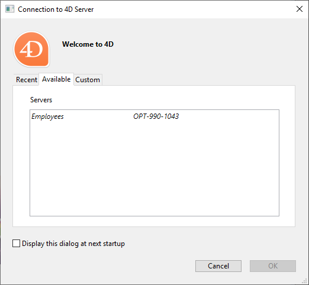

As aplicações 4D desktop podem ser utilizadas numa configuração Cliente/Servidor, quer como aplicações cliente/servidor fundidas, quer como projectos remotos.

- **merged client/server applications** are generated by the [Build Application manager](building.md#clientserver-page). São utilizados para implementações de aplicações.

- **remote projects** are [.4DProject](Project/architecture.md) files opened by 4D Server and accessed with 4D in remote mode. The server sends a .4dz version of the project ([compressed format](building.md#build-compiled-structure)) to the remote 4D, thus structure files are read-only. Esta configuração é normalmente utilizada para testar aplicações.

> Connecting to a remote project from the **same machine as 4D Server** allows modifying the project files. This [specific feature](#using-4d-and-4d-server-on-the-same-machine) allows to develop a client/server application in the same context as the deployment context.

## Abrir uma aplicação cliente/servidor fundida

A merged client/server application is customized and its starting is simplified:

- Para iniciar a parte do servidor, o usuário simplesmente clica duas vezes no aplicativo do servidor. The database does not need to be selected.
- Para iniciar a parte do cliente, o usuário simplesmente clica duas vezes no aplicativo cliente, que se conecta diretamente ao aplicativo do servidor.

These principles are detailed in the [Build Application](building.md#what-is-a-clientserver-application) page.

## Abrir um projecto remoto

A primeira vez que se liga a um projecto 4D Server através de um 4D remoto, normalmente utilizará o diálogo de ligação padrão. Thereafter, you will be able to connect directly using the **Open Recent Projects** menu or a 4DLink shortcut file.

Para conectar remotamente a um projeto 4D Server:

1. Faça uma das seguintes opções:
   - Select **Connect to 4D Server** in the Welcome Wizard dialog
   - Select **Open/Remote Project...** from the **File** menu or the **Open** toolbar button.

Aparece o diálogo de ligação do 4D Server. This dialog has three tabs: **Recent**, **Available**, and **Custom**.

If 4D Server is connected to the same subnetwork as the remote 4D, select **Available**. 4D Server includes a built-in broadcasting system that, by default, publishes the name of the 4D Server projects available over the network. A lista é classificada por ordem de aparecimento e atualizada dinamicamente.

To connect to a server from the list, double-click on its name or select it and click the **OK** button.

If the published project is not displayed in the **Available** list, select **Custom**. The Custom page allows you to connect to a published server on the network using its network address and assigning it a customized name.

- **Project name**: Defines the local name of the 4D Server project. This name will be used in the **Recent** page when referring to the project.
- **Network address**: The IP address of the machine where the 4D Server was launched.
  - If two servers are executed simultaneously on the same machine, the IP address must be followed by a colon and port number, for example: `192.168.92.104:19814`.
  - Por padrão, a porta de publicação de um 4D Server é 19813. Este número pode ser modificado nas definições do Projecto.

> The **Activate development mode** option opens the remote connection in a special read/write mode and requires to access the project folder from the remote 4D (compatibility option).

Once this page assigns a server, clicking the **OK** button will allow you to connect to the server.

Once a connection to the server has been established, the remote project will be listed on the **Recent** tab.

### Atualizar ficheiros de projeto no servidor

4D Server automatically creates and sends the remote machines a [.4dz version](building.md#build-compiled-structure) of the _.4DProject_ project file (not compressed) in interpreted mode.

- An updated .4dz version of the project is automatically produced when necessary, _i.e._ when the project has been modified and reloaded by 4D Server. O projecto é recarregado:
  - automatically, when the 4D Server application window comes to the front of the OS or when the 4D application on the same machine saves a modification (see below).
  - when the `RELOAD PROJECT` command is executed. Calling this command is necessary for example when you have pulled a new version of the project from the source control platform.

### Atualizar ficheiros de projeto em máquinas remotas

When an updated .4dz version of the project has been produced on 4D Server, connected remote 4D machines must log out and reconnect to 4D Server in order to benefit from the updated version.

## Utilização de 4D e 4D Server na mesma máquina

When 4D connects to a 4D Server on the same machine, the application behaves as 4D in single user mode and the design environment allows you to edit project files. This feature allows you to develop a client/server application in the same context as the deployment context.

> When 4D connects to a 4D Server on the same machine, the **development mode** is automatically activated, whatever the [opening option](#opening-a-remote-project) status.

Each time 4D performs a **Save all** action from the design environment (explicitly from **File** menu or implicitly by switching to application mode for example), 4D Server synchronously reloads project files. 4D waits for 4D Server to finish reloading the project files before it continues.

However, you need to pay attention to the following behavior differences compared to [standard project architecture](Project/architecture.md):

- the userPreferences.{username} folder used by 4D is not the same folder used by 4D Server in the project folder. Instead, it is a dedicated folder, named "userPreferences", stored in the project system folder (i.e., the same location as when opening a .4dz project).
- the folder used by 4D for derived data is not the folder named "DerivedData" in the project folder. Instead it is a dedicated folder named "DerivedDataRemote" located in the project system folder.
- o ficheiro catalog.4DCatalog não é editado por 4D, mas pelo 4D Server. As informações do catálogo são sincronizadas através de pedidos cliente/servidor
- o ficheiro directory.json não é editado por 4D, mas pelo 4D Server. As informações do diretório são sincronizadas através de pedidos cliente/servidor
- 4D utiliza os seus próprios componentes internos e plug-ins em vez dos do 4D Server.

> Não é recomendado instalar plug-ins ou componentes no nível da aplicação 4D, ou 4D Server.

## Sessões de usuário remoto

On the server, the [`Session`](../API/SessionClass.md#session) command returns a `session` object describing the current user session. This object is handled through the functions and properties of the [`Session` class](../API/SessionClass.md).

### Utilização

The `session` object allows you to get information about the remote user session. You can share data between all processes of the user session using the [`session.storage`](../API/SessionClass.md#storage) shared object.

For example, you can launch a user authentication and verification procedure when a client connects to the server, involving entering a code sent by e-mail or SMS into the application. You then add the user information to the session storage, enabling the server to identify the user. This way, the 4D server can access user information for all client processes, enabling customized code to be written according to the user's role.

### Disponibilidade

The remote user `session` object is available from:

- Project methods that have the [Execute on Server](../Project/code-overview.md#execute-on-server) attribute (they are executed in the "twinned" process of the client process),
- Triggers,
- `On Server Open Connection` and `On Server Shutdown Connection` database methods.

:::info

All stored procedures on the server share the same virtual user session. For more information, see [this page on doc.4d.com](https://doc.4d.com/4Dv20R5/4D/20-R5/4D-Server-and-the-4D-Language.300-6932726.en.html).

:::

### Ver também (post do blog)

[4D remote session object with Client/Server connection and Stored procedure](https://blog.4d.com/new-4D-remote-session-object-with-client-server-connection-and-stored-procedure).
