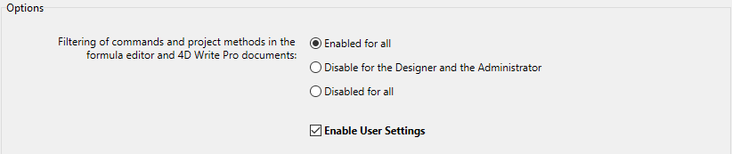

4D oferece dois modos de operação para as configurações dos projetos:

- **Standard** mode: all [settings](../settings/overview.md) are stored in the [_settings.4DSettings_ file at the project level](../Project/architecture.md#sources) and are applied in all cases. Este é o modo predefinido, adequado para a fase de desenvolvimento (todas as aplicações).

- **User settings** mode: part of the custom settings are stored in a _settings.4DSettings_ file [in the Settings folder](../Project/architecture.md#settings-user) (for all data files) or [in the Data folder](../Project/architecture.md#settings-user-data) (for this data file) and are used instead of the structure settings. Este modo é adequado para a fase de implantação de aplicações de ambiente de trabalho. You enable this mode using an option located on the [Security page](../settings/security.md) of the Settings.

Ao definir as definições do utilizador, pode manter as definições personalizadas entre actualizações das suas aplicações 4D, ou gerir diferentes definições para a mesma aplicação 4D implementada em vários sites diferentes. Permite igualmente utilizar a programação para gerir os arquivos de configuração através de XML.

4D pode gerar e usar dois tipos de propriedades usuário:

- **User Settings**: They are used instead of structure settings for any data file opened with the application.
- **User Settings for Data file**: They can be defined specifically for each data file used with your application, configuring for example the port ID or the server cache.

Com esta opção, pode facilmente implementar e atualizar várias cópias da mesma aplicação de ambiente de trabalho com vários arquivos de dados, cada um contendo definições diferentes.

Considere, por exemplo, a seguinte configuração, em que uma aplicação é duplicada e cada cópia utiliza uma definição de ID de porta diferente. Se esta definição do usuário estiver ligada ao arquivo de dados, será possível atualizar a aplicação sem ter de alterar manualmente o ID do porto:

## Ativar as definições do utilizador

To enable user settings, you need to check the **Settings** > **Security** > **Enable User Settings** option:

- **Definições de estrutura**
- **Propriedades usuário**
- **Propriedades usuário para o arquivo de dados**

You can access these dialog boxes using the **Design > Settings...** menu or the **Settings** button in the toolbar:

You can also access these dialog boxes using the [OPEN SETTINGS WINDOW](https://doc.4d.com/4dv19R/help/command/en/page903.html) command with the appropriate _settingsType_ selector.

A caixa de diálogo Configurações da estrutura é idêntica às Configurações standard e dá acesso a todas as suas propriedades (que podem ser substituídas por configurações do utilizador).

## Propriedades usuário e definições do usuário para o ficheiro de dados

The **User Settings** and **User Settings for Data File** dialog boxes contain a selection of relevant properties that can be defined for all data files or a single data file:

The following table lists the pages of settings found in the **User Settings** and **User Settings for Data File** dialog boxes and describes their main differences with respect to standard settings:

| **Página de definições de estrutura**                                                    | **Página das definições do usuário**         | **Página de Propriedades usuário para ficheiro de dados** |
| ---------------------------------------------------------------------------------------- | -------------------------------------------- | --------------------------------------------------------- |
| [General page](../settings/general.md)                                                   | N/a                                          | N/a                                                       |
| [Interface page](../settings/interface.md)                                               | Idêntico às propriedades padrão              | Idêntico às propriedades padrão                           |
| [Compiler page](../settings/compiler.md)                                                 | N/a                                          | N/a                                                       |
| [Database/Data storage page](../settings/database.md#data-storage)                       | N/a                                          | N/a                                                       |
| [Database/Memory page](../settings/database.md#memory)                                   | Idêntico às propriedades padrão              | Idêntico às propriedades padrão                           |
| [Backup/Scheduler page](../settings/backup.md#scheduler)                                 | N/a                                          | Idêntico às propriedades padrão                           |
| [Backup/Configuration page](../settings/backup.md#configuration)                         | N/a                                          | Idêntico às propriedades padrão                           |
| [Backup/Backup & Restore page](../settings/backup.md#backup-restore) | N/a                                          | Idêntico às propriedades padrão                           |
| [Client-server/Network options page](../settings/client-server.md#network-options)       | Idêntico às propriedades padrão              | Idêntico às propriedades padrão                           |
| [Client-server/IP configuration page](../settings/client-server.md#ip-configuration)     | Idêntico às propriedades padrão              | Idêntico às propriedades padrão                           |
| [Web/Configuration page](../settings/web.md#configuration)                               | Idêntico às propriedades padrão              | Idêntico às propriedades padrão                           |
| [Web/Options (I) page](../settings/web.md#options)                    | Idêntico às propriedades padrão              | Idêntico às propriedades padrão                           |
| [Web/Options (II) page](../settings/web.md#options-ii)                | Idêntico às propriedades padrão              | Idêntico às propriedades padrão                           |
| [Web/Log (type) page](../settings/web.md#log)                         | Idêntico às propriedades padrão              | Idêntico às propriedades padrão                           |
| [Web/Log (backup) page](../settings/web.md#log)                       | Idêntico às propriedades padrão              | Idêntico às propriedades padrão                           |
| [Web/Web Services page](../settings/web.md#web-services)                                 | Opção de prefixação do método não disponível | Opção de prefixação do método não disponível              |
| [SQL page](../settings/sql.md)                                                           | Idêntico às propriedades padrão              | Idêntico às propriedades padrão                           |
| [PHP page](../settings/php.md)                                                           | Idêntico às propriedades padrão              | Idêntico às propriedades padrão                           |
| [Security page](../settings/security.md)                                                 | N/a                                          | N/a                                                       |
| [Compatibility page](../settings/compatibility.md)                                       | N/a                                          | N/a                                                       |

When you edit settings in this dialog box, they are automatically stored in the corresponding _settings.4DSettings_ file (see below) or the _Backup.4DSettings_ file (check the [Backup settings](../Backup/settings.md) page for more information).

## `SET DATABASE PARAMETER` and user settings

Some of the user settings are also available through the [SET DATABASE PARAMETER](https://doc.4d.com/4dv19R/help/command/en/page642.html) command. User settings are parameters with the **Kept between two sessions** property set to **Yes**.

When the **User Settings** feature is enabled, user settings edited by the [SET DATABASE PARAMETER](https://doc.4d.com/4dv19R/help/command/en/page642.html) command are automatically saved in the user settings for the data file.

> `Table sequence number` is an exception; this setting value is always saved in the data file itself.

## Arquivos settings.4DSettings

When you [check the **Enable User Settings** option](#enabling-user-settings), user settings files are automatically created. A sua localização depende do tipo de definições do utilizador definidas.

### Propriedades usuário

O arquivo de definições do utilizador padrão é criado automaticamente e colocado numa pasta de definições na seguinte localização:

[`ProjectFolder/Settings/settings.4DSettings`](../Project/architecture.md#settings-user)

... where _ProjectFolder_ is the name of the folder containing the project structure file.

Nas aplicações fusionadas, o arquivo de definições do utilizador é colocado na seguinte localização:

- Nas versões de usuário único: ProjectFolder/Database/Settings/settings.4DSettings
- Em versões cliente/servidor: ProjectFolder/Server Database/Settings/settings.4DSettings

### Propriedades usuário para arquivo de dados

O arquivo de definições do usuário ligado ao arquivo de dados é automaticamente criado e colocado numa pasta de definições na seguinte localização:

[`Data/Settings/settings.4DSettings`](../Project/architecture.md#settings-user-data)

... where _Data_ is the name of the folder containing the current data file of the application.

> Quando o arquivo de dados estiver localizado ao mesmo nível que o arquivo da estrutura do projeto, os arquivos de definições do utilizador baseados na estrutura e nos dados partilham a mesma localização e o mesmo arquivo. The **User Settings for Data File...** menu command is not proposed.

:::note

Os arquivos de definições são arquivos XML; podem ser lidos e modificados utilizando comandos XML 4D integrados ou utilizando um editor XML. Isto significa que pode gerir as definições por programação, particularmente no contexto de aplicações compiladas e fundidas com 4D Volume Desktop. Quando modificar este arquivo por programação, as alterações só são consideradas na próxima vez que a base de dados for aberta.

:::

## Prioridade dos parâmetros

As definições podem ser guardadas em três níveis. Cada configuração definida num nível substitui a mesma configuração definida num nível anterior, caso exista:

| **Nível de prioridade**           | **Name**                                                                                                                  | **Location**                                                                                                                                                                                                        | **Comments**                                                                                                                                                                       |
| --------------------------------- | ------------------------------------------------------------------------------------------------------------------------- | ------------------------------------------------------------------------------------------------------------------------------------------------------------------------------------------------------------------- | ---------------------------------------------------------------------------------------------------------------------------------------------------------------------------------- |
| 3 (mais baixo) | Definições de estrutura (ou Definições quando a função "Definições do utilizador" não estiver ativada) | _**settings.4DSettings**_ file in the Sources folder (project databases) or in the Settings folder as the same level as the structure file (binary databases) | Localização única quando as definições do utilizador não estão ativadas. Aplicado a todos os exemplares da aplicação.                              |
| 2                                 | Propriedades usuário (todos os ficheiros de dados)                                                     | _**settings.4DSettings**_ file in the Settings folder at the same level as the Project folder                                                                                                       | Substitui as definições da estrutura. Armazenado no pacote da aplicação.                                                                           |
| 1 (mais alto)  | Propriedades usuário (ficheiro de dados atual)                                                         | _**settings.4DSettings**_ file in the Settings folder at the same level as the data file                                                                                                            | Substitui as propriedades de estrutura e as propriedades usuário. Aplicado apenas quando o arquivo de dados linkado for utilizado com a aplicação. |

Lembre que os arquivo de definições do utilizador contêm apenas um subconjunto de definições relevantes, enquanto o arquivo de estrutura contém todas as definições personalizadas, incluindo as definições principais.
