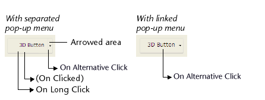

| Code | Pode ser chamado por                                                                                                                                                        | Definição                                                                                                                                                                         |
| ---- | --------------------------------------------------------------------------------------------------------------------------------------------------------------------------- | --------------------------------------------------------------------------------------------------------------------------------------------------------------------------------- |
| 38   | [Button](FormObjects/button_overview.md) - [Caixa de lista](FormObjects/listbox_overview.md) - [Coluna de caixa de lista](FormObjects/listbox_overview.md#list-box-columns) | <li>Botões: a área de "seta" de um botão é clicada em</li><li>Caixas de lista: Em uma coluna de um array de objeto, um botão ellipsis (atributo "alternateButton") é clicado</li> |

## Descrição

### Botões

Alguns estilos de botão podem ser [vinculados a um menu pop-up](FormObjects/properties_TextAndPicture.md#with-pop-up-menu) e exibir um triângulo. Clicar neste triângulo faz com que um pop-up de seleção apareça que fornece um conjunto de ações alternativas em relação à ação do botão primário.

4D permite gestionar este tipo de botones utilizando el evento `On Alternative Click`. Este evento é gerado quando o usuário clica no triângulo (assim que o botão do mouse é pressionado):

- Se o menu pop-up estiver **separado**, o evento só será gerado quando ocorrer um clique na parte do botão com a seta. Observe que a [ação padrão](https://doc.4d.com/4Dv19R7/4D/19-R7/Standard-actions.300-6013479.en.html) atribuída ao botão (se houver) não é executada neste caso.
- Se o menu pop-up estiver **vinculado**, o evento é gerado quando ocorre um clique em qualquer parte do botão. Observe que o evento [`No Long Click`](onLongClick.md) não pode ser gerado com este tipo de botão.

### List box

Esse evento é gerado nas colunas das [caixas de listagem do tipo matriz de objetos](FormObjects/listbox_overview.md#object-arrays-in-columns-4d-view-pro), quando o usuário clica em um botão de reticências do widget (atributo "alternateButton").

Veja a [descrição do atributo "alternateButton"](FormObjects/listbox_overview.md#alternatebutton).
