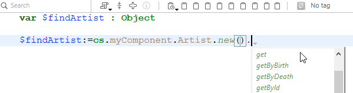

Un componente 4D es un conjunto de funciones, métodos y formularios 4D que representan una o varias funcionalidades que pueden ser [instaladas y utilizadas en aplicaciones 4D](Concepts/components.md). Por exemplo, você pode desenvolver um componente de e-mail 4D que gerencia todos os aspectos de envio, recebimento e armazenamento de e-mails em aplicativos 4D.

Você pode desenvolver componentes 4D para suas próprias necessidades e mantê-los privados. También puede [compartir sus componentes con la comunidad 4D](https://github.com/topics/4d-component).

## Definições

- **Base proyecto**: proyecto 4D utilizado para desarrollar el componente. O projeto matriz é um projeto standard sem atributos específicos. Um projeto matricial forma um componente único.
- **Proyecto local**: proyecto aplicación en la que se instala y utiliza un componente.
- **Component**: Matrix project that can be compiled or [built](Desktop/building.md#build-component), copied into the [`Components`](Project/architecture.md) folder of the host application and whose contents are used in the host application.

## Básicos

Criar e instalar componentes 4D é realizado diretamente a partir de 4D:

- To install a component, you simply need to copy the component files into the [`Components` folder of the project](Project/architecture.md). Pode usar pseudónimos ou atalhos.
- Um projeto pode ser tanto uma matriz quanto um host, em outras palavras, um projeto de matriz pode usar um ou mais componentes. No entanto, um componente não pode utilizar ele próprio "subcomponentes".
- Um componente pode chamar a maioria dos elementos 4D: classes, funções, métodos de projeto, formulários de projeto, barras de menu, listas de opções e assim por diante. Não pode chamar métodos de bancos de dados e triggers.
- Não é possível usar o datastore, as tabelas padrão ou os arquivos de dados nos componentes 4D. Entretanto um componente não pode criar ou usar tabelas, campos e arquivos de dados usando mecanismos de bancos de dados externos. São bancos 4D independentes com as que se trabalha utilizando comandos SQL.
- Um projecto anfitrião executado em modo interpretado pode utilizar componentes interpretados ou compilados. Um projecto anfitrião executado em modo compilado não pode utilizar componentes interpretados. Por isso não pode ser usado em um componente.

## Escopo dos comandos de linguagem

A excepción de los [comandos no utilizables](#comandos-inutilizables), un componente puede utilizar cualquier comando del lenguaje 4D.

When commands are called from a component, they are executed in the context of the component, except for the [`EXECUTE METHOD`](https://doc.4d.com/4dv20/help/command/en/page1007.html) or [`EXECUTE FORMULA`](https://doc.4d.com/4dv20/help/command/en/page63.html) command that use the context of the method specified by the command. Observe também que os comandos de leitura do tema "Usuários e grupos" podem ser usados a partir de um componente, mas lerão os usuários e grupos do projeto host (um componente não tem seus próprios usuários e grupos).

The [`SET DATABASE PARAMETER`](https://doc.4d.com/4dv20/help/command/en/page642.html) and [`Get database parameter`](https://doc.4d.com/4dv20/help/command/en/page643.html) commands are an exception: their scope is global to the application. Quando esses comandos forem chamados de um componente, são aplicados ao projecto de aplicação local.

Además, se han especificado medidas específicas para los comandos `Structure file` y `Get 4D folder` cuando se utilizan en el marco de los componentes.

The [`COMPONENT LIST`](https://doc.4d.com/4dv20/help/command/en/page1001.html) command can be used to obtain the list of components that are loaded by the host project.

### Comandos não utilizáveis

Os comandos abaixo não são compatíveis para seu uso dentro de um componente porque modificam o arquivo de estrutura - que está aberto em apenas leitura. Sua execução em um componente irá gerar erro -10511, "O comando CommandName não pode ser chamado a partir de um componente":

- `ON EVENT CALL`
- `Method called on event`
- `SET PICTURE TO LIBRARY`
- `REMOVE PICTURE FROM LIBRARY`
- `SAVE LIST`
- `ARRAY TO LIST`
- `EDIT FORM`
- `CREATE USER FORM`
- `DELETE USER FORM`
- `CHANGE PASSWORD`
- `EDIT ACCESS`
- `Set group properties`
- `Set user properties`
- `DELETE USER`
- `CHANGE LICENSES`
- `BLOB TO USERS`
- `SET PLUGIN ACCESS`

**Notas:**

- El comando `Current form table` devuelve `Nil` cuando se llama en el contexto de un formulario proyecto. Por isso não pode ser usado em um componente.
- SQL data definition language commands (`CREATE TABLE`, `DROP TABLE`, etc.) não pode ser usado no projeto do componente. Sin embargo, se soportan con bases de datos externas (ver el comando SQL `CREATE DATABASE`).

## Partilhar os métodos de projeto

Todos os métodos de projeto de um projeto de matriz são, por definição, incluídos no componente (o projeto é o componente), o que significa que eles podem ser chamados e executados dentro do componente.

Por outro lado, por padrão, esses métodos de projeto não estarão visíveis e não poderão ser chamados no projeto host. En el proyecto matriz, debe designar explícitamente los métodos que desea compartir con el proyecto local marcando la casilla **Compartido por los componentes y el proyecto local** en la caja de diálogo de las propiedades del método:


Os métodos do projeto compartilhado podem ser chamados no código do projeto host (mas não podem ser modificados no Editor de código do projeto host). Estos métodos son los **puntos de entrada** del componente.

Por outro lado, por motivos de segurança, por padrão, um componente não pode executar métodos de projeto pertencentes ao projeto host. Em alguns casos, talvez seja necessário permitir que um componente acesse os métodos de projeto do seu projeto host. Para ello, debe designar explícitamente qué métodos proyecto del proyecto local quiere hacer accesibles a los componentes (en las propiedades del método, marque la casilla **Compartido por componentes y proyecto local**).


Once the project methods of the host projects are available to the components, you can execute a host method from inside a component using the [`EXECUTE FORMULA`](https://doc.4d.com/4dv20/help/command/en/page63.html) or [`EXECUTE METHOD`](https://doc.4d.com/4dv20/help/command/en/page1007.html) command. Por exemplo:

```4d
// Método host
component_method("host_method_name")
```

```4d
// component_method
#DECLARE ($param : Text)
EXECUTE METHOD($param)
```

> Um banco de dados de host interpretado que contém componentes interpretados pode ser compilado ou verificado quanto à sintaxe se não chamar métodos do componente interpretado. Otherwise, a warning dialog box appears when you attempt to launch the compilation or a syntax check and it will not be possible to carry out the operation.\
> Keep in mind that an interpreted method can call a compiled method, but not the reverse, except via the use of the `EXECUTE METHOD` and `EXECUTE FORMULA` commands.

## Partilha de classes e funções

Por padrão, as classes e funções de componentes não podem ser chamadas a partir do 4D Code Editor do projeto host. Se quiser que as classes e funções do componente sejam expostas nos projetos host, você precisará declarar um namespace de componente. Além disso, você pode controlar como as classes e funções de componentes são sugeridas no Code Editor do host.

### Declaração do namespace

To allow classes and functions of your component to be exposed in the host projects, enter a value in the [**Component namespace in the class store** option in the General page](../settings/general.md#component-namespace-in-the-class-store) of the matrix project Settings. Por padrão, a área está vazia: as classes de componentes não estão disponíveis fora do contexto do componente.


> Un _namespace_ garantiza que no surja ningún conflicto cuando un proyecto local utilice diferentes componentes que tienen clases o funciones con nombres idénticos. Un namespace del componente debe ser compatible con [reglas de denominación de las propiedades](../Concepts/identifiers.md#object-properties).

When you enter a value, you declare that component classes and functions will be available in the [user class store (**cs**)](../Concepts/classes.md#cs) of the host project's code, through the `cs.<value>` namespace. Por ejemplo, si introduce "eGeometry" como namespace del componente, asumiendo que ha creado una clase `Rectangle` que contiene una función `getArea()`, una vez que su proyecto se instala como componente, el desarrollador del proyecto local puede escribir

```4d
//no projeto host
var $rect: cs.eGeometry.Rectangle
$rect:=cs.eGeometry.Rectangle.new(10;20)
$area:=$rect.getArea()
```

:::info

El namespace de un componente [compilado](#protection-of-components-compilation) se añadirá entre paréntesis después del nombre del componente en la [página Métodos Componente](../Concepts/components.md#using-components) de los proyectos locales:


:::

Obviamente, é recomendável usar um nome distinto para evitar qualquer conflito. Se uma classe de usuário com o mesmo nome de um componente já existir no projeto, a classe de usuário será levada em consideração e as classes de componentes serão ignoradas.

As classes ORDA de um componente não estão disponíveis no seu projeto host. Por exemplo, se houver uma classe de dados chamada Employees em seu componente, você não poderá usar uma classe "cs.Mycomponent.Employee" no projeto host.

### Classes ocultas

Assim como em qualquer projeto, você pode criar classes e funções ocultas no componente prefixando os nomes com um sublinhado ("_"). Cuando se define un [namespace de componente](#declaring-the-component-namespace), las clases y funciones ocultas del componente no aparecerán como sugerencias al utilizar completar el código.

No entanto, se souberes os seus nomes, podes utilizá-los. Por ejemplo, la siguiente sintaxis es válida incluso si la clase `_Rectangle` está oculta:

```4d
$rect:=cs.eGeometry._Rectangle.new(10;20)
```

> Las funciones no ocultas al interior de una clase oculta aparecen como sugerencias cuando se utiliza completar código con una clase que [hereda](../Concepts/classes.md#inheritance) de ella. Por ejemplo, si un componente tiene una clase `Teacher` que hereda una clase `_Person`, la finalización del código para `Teacher` sugiere funciones no ocultas de `_Person`.

## Completar o código dos componentes compilados

To make your component easier to use for developers, you can check the [**Generate syntax file for code completion when compiled** option in the General page](../settings/general.md#component-namespace-in-the-class-store) of the matrix project Settings.

A syntax file (JSON format) is then automatically created during the compilation phase, filled with the syntax of your component's classes, functions, and [exposed methods](#sharing-of-project-methods), and placed in the `\Resources\en.lproj` folder of the component project. 4D usa o conteúdo desse arquivo de sintaxe para gerar ajuda contextual no editor de código, como autocompletar código e sintaxe de função:




Si no ingresa un [namespace](#declaring-the-component-namespace), los recursos de las clases y de los métodos exposed no se generan incluso si la opción de archivo de sintaxis está marcada.

## Passar variáveis

As variáveis locais, de processo e interprocessos não são compartilhadas entre componentes e projetos de host. A única maneira de modificar variáveis de componentes do projeto host e vice-versa é usando ponteiros.

Exemplo usando um array:

```4d
//No projeto host:
     ARRAY INTEGER(MyArray;10)
     AMethod(->MyArray)

//No componente, o método projeto AMethod contém:
     APPEND TO ARRAY($1->;2)
```

Exemplos usando variáveis:

```4d
C_TEXT(myvariable)
component_method1(->myvariable)
```

```4d
C_POINTER($p)
$p:=component_method2(...)
```

Sem um ponteiro, um componente ainda pode acessar o valor de uma variável do banco de dados do host (mas não a própria variável) e vice-versa:

```4d
//No banco de dados host
C_TEXT($input_t)
$input_t:="DoSomething"
component_method($input_t)
// component_method gets "DoSome" in $1 (mas não na variável $input_t)
```

Quando você usa ponteiros para permitir que os componentes e o projeto host se comuniquem, é necessário levar em conta as seguintes especificidades:

- El comando `Get pointer` no devolverá un puntero a una variable del proyecto local si se llama desde un componente y viceversa.

- A arquitetura de componentes permite a coexistência, no mesmo projeto interpretado, de componentes interpretados e compilados (por outro lado, somente componentes compilados podem ser usados em um projeto compilado). Para utilizar apontadores neste caso, deve respeitar o seguinte princípio: o intérprete pode desconectar um ponteiro construído em modo compilado; no entanto, em modo compilado, não pode deconectar um ponteiro construído em modo interpretado.
  Vamos ilustrar esse princípio com o seguinte exemplo: dados dois componentes, C (compilados) e eu (interpretados), instalados no mesmo projeto host.

- Si el componente C define la variable `myCvar`, el componente I puede acceder al valor de esta variable utilizando el puntero `->myCvar`.

- Si el componente C define la variable `myIvar`, el componente C no puede acceder a esta variable utilizando el puntero `->myIvar`. Esta sintaxe causa um erro de execução.

- The comparison of pointers using the `RESOLVE POINTER` command is not recommended with components since the principle of partitioning variables allows the coexistence of variables having the same name but with radically different contents in a component and the host project (or another component). O tipo da variável pode mesmo ser diferente em ambos os contextos. Si los punteros `myptr1` y `myptr2` apuntan cada uno a una variable, la siguiente comparación producirá un resultado incorrecto:

```4d
     RESOLVE POINTER(myptr1;vVarName1;vtablenum1;vfieldnum1)
     RESOLVE POINTER(myptr2;vVarName2;vtablenum2;vfieldnum2)
     If(vVarName1=vVarName2)
      //Este teste retorna True mesmo se as variáveis forem diferentes
```

Neste caso é preciso usar a comparação de ponteiros:

```4d
     If(myptr1=myptr2) //Este teste retorna False
```

## Gestão de erros

Un [método de gestión de errores](Concepts/error-handling.md) instalado por el comando `ON ERR CALL` sólo se aplica a la aplicación en ejecución. En el caso de un error generado por un componente, no se llama al método de gestión de errores `ON ERR CALL` del proyecto local, y viceversa.

## Acesso às tabelas do projeto local

Apesar de os componentes não poderem usar tabelas, ponteiros podem permitir que projetos locais e componentes se comuniquem entre si. Por exemplo, aqui está um método que pode ser chamado a partir de um componente:

```4d
// llamar a un método componente
methCreateRec(->[PEOPLE];->[PEOPLE]Name;"Julie Andrews")
```

Dentro del componente, el código del método `methCreateRec`:

```4d
C_POINTER($1) //Puntero a una tabla del proyecto local
C_POINTER($2) //Puntero a un campo del proyecto local
C_TEXT($3) // Valor a insertar

$tablepointer:=$1
$fieldpointer:=$2
CREATE RECORD($tablepointer->)

$fieldpointer->:=$3
SAVE RECORD($tablepointer-
```

> No contexto de um componente, 4D assume que uma referência a um formulário de tabela é uma referência ao formulário de tabela do host (já que os componentes não podem ter tabelas).

## Uso de tabelas e campos

Um componente não pode usar as tabelas e os campos definidos na estrutura 4D do projeto de matriz. Mas pode criar e usar bancos de dados externos e então usar suas tabelas e campos de acordo com suas necessidades. Pode criar e gerenciar bancos de dados externos usando SQL. Mas pode criar e usar bancos de dados externos e então usar suas tabelas e campos de acordo com suas necessidades. Usar um banco externo significa designar temporariamente esse banco de dados como o banco atual, em outras palavras, o banco alvo para as pesquisas SQL executadas por 4D. Las bases externas se crean con el comando SQL `CREATE DATABASE`.

### Exemplo

O código abaixo está incluído em um componente e realiza três ações básicas com um banco externo:

- cria o banco externo se não existir ainda
- adiciona dados ao banco externo,
- lê dados do banco externo.

Cria o banco externo:

```4d
<>MyDatabase:=Get 4D folder+"\MyDB" // (Windows) stores the data in an authorized directory
 Begin SQL
        CREATE DATABASE IF NOT EXISTS DATAFILE :[<>MyDatabase];
        USE DATABASE DATAFILE :[<>MyDatabase];
        CREATE TABLE IF NOT EXISTS KEEPIT
        (
        ID INT32 PRIMARY KEY,
        kind VARCHAR,
        name VARCHAR,
        code TEXT,
        sort_order INT32
        );

        CREATE UNIQUE INDEX id_index ON KEEPIT (ID);

        USE DATABASE SQL_INTERNAL;

 End SQL
```

Escrita no banco de dados externa:

```4d
 $Ptr_1:=$2 // retrieves data from the host project through pointers
 $Ptr_2:=$3
 $Ptr_3:=$4
 $Ptr_4:=$5
 $Ptr_5:=$6
 Begin SQL

        USE DATABASE DATAFILE :[<>MyDatabase];

        INSERT INTO KEEPIT
        (ID, kind, name, code, sort_order)
        VALUES
        (:[$Ptr_1], :[$Ptr_2], :[$Ptr_3], :[$Ptr_4], :[$Ptr_5]);

        USE DATABASE SQL_INTERNAL;


 End SQL
```

Lendo de um banco externo:

```4d
 $Ptr_1:=$2 // accesses data of the host project through pointers
 $Ptr_2:=$3
 $Ptr_3:=$4
 $Ptr_4:=$5
 $Ptr_5:=$6

 Begin SQL

    USE DATABASE DATAFILE :[<>MyDatabase];

    SELECT ALL ID, kind, name, code, sort_order
    FROM KEEPIT
    INTO :$Ptr_1, :$Ptr_2, :$Ptr_3, :$Ptr_4, :$Ptr_5;

    USE DATABASE SQL_INTERNAL;

 End SQL
```

## Uso de formulários

- Só os "formulários projeto" (formulários que não estejam associados a nenhuma tabela específica) podem ser utilizados em um componente. Só os "formulários de projeto" (formulários que não estejam associados a nenhuma tabela específica) podem ser utilizados em um componente.
- Um componente pode chamar formulários tabela do projeto host. Note que nesse caso é necessário usar ponteiros ao invés de nomes de tabelas entre colchetes [] para especificar os formulários no código do componente.

> Si un componente utiliza el comando `ADD RECORD`, se mostrará el formulario de entrada actual del proyecto local, en el contexto del proyecto local. Por isso se o formulário incluir variáveis, o componente não terá acesso às mesmas.

- Puede [publicar formularios de componentes como subformularios](../FormEditor/properties_FormProperties.md#published-as-subform) en los proyectos locales. Pode publicar formulários componentes como subformulários no banco de dados local Isso significa que pode desenvolver componentes oferecendo objetos gráficos. Por exemplo, Widgets fornecidos por 4D são baseados no uso de subformulários em componentes.

> No contexto de um componente, qualquer formulário projeto referenciado deve pertencer a esse componente. Por ejemplo, dentro de un componente, hacer referencia a un formulario proyecto local utilizando `DIALOG` u `Open form window` arrojará un error.

## Uso de recursos

Os componentes podem usar recursos localizados na pasta Resources do componente.

Os mecanismos automáticos estão operacionais: os arquivos XLIFF encontrados na pasta Recursos de um componente serão carregados por este componente.

Em um projeto host contendo um ou mais componentes, cada componente, bem como os projetos de host tem sua própria "string de recursos." Os recursos são particionados entre os diferentes projetos: não é possível acessar os recursos do componente A do componente B ou do projeto de host.

## Execução de código de inicialização

Um componente pode executar o código 4D automaticamente ao abrir ou fechar o banco de dados do host, por exemplo, para carregar e/ou salvar as preferências ou os estados do usuário relacionados à operação do banco de dados do host.

La ejecución del código de inicialización o cierre se realiza mediante el método base `On Host Database Event`.

> Por razones de seguridad, debe autorizar explícitamente la ejecución del método base `On Host Database Event` en la base local para poder llamarlo. To do this, you must check the [**Execute "On Host Database Event" method of the components** option](../settings/security.md#options) in the Security page of the Settings.

## Proteção dos componentes: compilação

Por padrão, todo o código de um projeto de matriz instalado como um componente é potencialmente visível no projeto host. Em particular:

- Os métodos do projeto compartilhado são encontrados na página de métodos do Explorer e podem ser chamados nos métodos do projeto host. Seu conteúdo pode ser selecionado e copiado na área de vista prévia do Explorador. Também podem ser vistos no depurador. No entanto, eles não podem ser abertos ou modificados no editor de código.
- Os outros métodos de projeto do projeto matriz não aparecem no Explorer, mas também podem ser visualizados no depurador do projeto host.
- Las clases y funciones no ocultas pueden verse en el depurador [si se declara un namespace](#declaring-the-component-namespace).

Para proteger eficazmente el código de un componente, basta con [compilar y generar](Desktop/building.md#build-component) el proyecto utilizado como matriz y proporcionarlo en forma de archivo .4dz. Quando um projeto compilado usado como uma matriz é instalado como um componente:

- Os métodos, as classes e as funções do projeto compartilhado podem ser chamados nos métodos do projeto host e também ficam visíveis na página Métodos do Explorer. No entanto, seu conteúdo não aparecerá na área de visualização e no depurador.
- Os outros métodos projeto do projeto matriz nunca aparecerão.

## Partilha de componentes

Lo animamos a que apoye a la comunidad de desarrolladores 4D compartiendo sus componentes, preferiblemente en la plataforma [GitHub](https://github.com/topics/4d-component). Recomendamos que utilice el tema **`4d-component`** para ser referenciado correctamente.
