4D fornece um editor de formulários completo que permite modificar seu formulário até conseguir o efeito que deseja. Com o editor de formulários, é possível criar e eliminar objetos, manipulá-los diretamente e definir as propriedades de objetos e formulários.

## Interface

O editor de formulários apresenta cada formulário JSON na sua própria janela, que tem uma barra de ferramentas e de uma barra de objetos. É possível ter vários formulários abertos ao mesmo tempo.

### Opções de visualização

You can show or hide several interface elements on the current page of the form:

- **Formulario heredado**: objetos formulario heredados (si hay un [formulario heredado](forms.md#inherited-forms)).
- **Página 0**: objetos de [página 0](forms.md#form-pages). This option allows you to distinguish between the objects on the form’s current page and those on page 0.
- **Papel**: bordes de la página de impresión, que se muestran como líneas grises. Este elemento sólo puede aparecer por defecto en los formularios de tipo ["para impresión"](properties_FormProperties.md#form-type).
- **Reglas**: Reglas de la ventana del editor de formularios.
- **Marcadores**: las líneas de control de salida y los marcadores asociados que muestran los límites de las diferentes áreas del formulario. Este elemento sólo puede aparecer por defecto en los [formularios lista](properties_FormProperties.md#form-type).
- **Etiquetas de los marcadores**: etiquetas de los marcadores, disponibles sólo cuando se muestran las líneas de control de salida. Este elemento sólo puede aparecer por defecto en los [formularios lista](properties_FormProperties.md#form-type).
- **Límites**: límites del formulario. When this option is selected, the form is displayed in the Form editor as it appears in Application mode. This way you can adjust your form without having to switch to the Application mode in order to see the result.

> The [**Size Based on**](properties_FormSize.md#size-based-on), [**Hor margin**](properties_FormSize.md#hor-margin) and [**Vert margin**](properties_FormSize.md#vert-margin) settings of the form properties affect the form’s limits. When using these settings, the limits are based on the objects in the form. When you modify the size of an object that is located next to the form’s border, it is modified to reflect that change.

#### Visualização por defeito

When a form is opened in the editor, interface elements are displayed or hidden by default, depending on:

- las opciones de **Visualización por defecto del nuevo formulario** definidas en las Preferencias - las opciones no marcadas no pueden mostrarse por defecto.
- el [tipo de formulario](properties_FormProperties.md#form-type) actual:
  - Marcadores e rótulos de marcadores são sempre exibidos por padrão em formulários lista
  - O papel é apresentado por defeito nos formulários "para impressão".

#### Exibir/ocultar elementos

Puede mostrar u ocultar elementos en cualquier momento en la ventana actual del editor de formularios seleccionando **Mostrar** en el menú **Formulario** o en el menú contextual del editor de formularios:


### Regras

The rulers on the side and bottom help you position objects in the form. Pueden [mostrarse u ocultarse](#display-options).

Seleccione **Definición de regla...** en el menú **Formulario** para cambiar las unidades de medida de modo que el formulario muestre pulgadas, centímetros o píxeles.

### Barra de ferramentas

The toolbar of the Form editor offers a set of tools to manipulate and modify the form. Cada janela tem a sua própria barra de ferramentas.


A barra de ferramentas contém os seguintes elementos:

| Ícone                                            | Nome                                                 | Descrição                                                                                                                                                                                                                                                                                                                                                                                                                       |
| ------------------------------------------------ | ---------------------------------------------------- | ------------------------------------------------------------------------------------------------------------------------------------------------------------------------------------------------------------------------------------------------------------------------------------------------------------------------------------------------------------------------------------------------------------------------------- |
|          | Executar o formulário                                | Utilizado para testar a execução do formulário. When you click on this button, 4D opens a new window and displays the form in its context (list of records for a list form and current record page for a detail form). O formulário é executado no processo principal.                                                                                       |
|        | [Selection tool](#selecting-objects)                 | Allows selecting, moving and resizing form objects.<p>**Note**: When an object of the Text or Group Box type is selected, pressing the **Enter** key lets you switch to editing mode.</p>                                                                                                                                                                                       |
|           | [Entry order](#data-entry-order)                     | Switches to “Entry order” mode, where it is possible to view and change the current entry order of the form. Note that shields allow viewing the current entry order, while still working in the form.                                                                                                                                                                                          |
|           | [Moving](#moving-objects)                            | Switches to “Move” mode, where it is possible to reach any part of the form quickly by using drag and drop in the window. O cursor assume a forma de uma mão. Este modo de navegação é particularmente útil ao ampliar o formulário.                                                                                                                                            |
|             | [Zoom](#zoom)                                        | Permite modificar a percentagem de visualização do formulário (100% por padrão). You can switch to “Zoom” mode by clicking on the magnifying glass or by clicking directly on the desired bar. Esta função é descrita em pormenor na secção anterior.                                                                                                        |
|        | [Alignment](#aligning-objects)                       | This button is linked to a menu that allows changing the level of objects in the form. It is enabled (or not) depending on the objects selected.<p>Available only with CSS Preview None</p>                                                                                                                                                                                  |
|     | [Distribution](#distributing-objects)                | Este botão está ligado a um menu que permite agrupar e desagrupar seleções de objetos no formulário. It is enabled (or not) depending on the objects selected.<p>Available only with CSS Preview None</p>                                                                                                                                                                    |
| 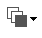           | [Level](#layering-objects)                           | This button is linked to a menu that allows aligning objects in the form. É ativada (ou não) em função dos objetos selecionados.                                                                                                                                                                                                                                             |
|            | [Group/Ungroup](#grouping-objects)                   | Este botão está ligado a um menu que permite agrupar e desagrupar seleções de objetos no formulário. É ativada (ou não) em função dos objetos selecionados.                                                                                                                                                                                                                  |
|    | [Display and page management](forms.html#form-pages) | Esta área permite passar de uma página de formulário para outra e adicionar páginas. Para navegar entre páginas de formulários, clique nos botões de seta, ou clique na área central e escolha a página a exibir a partir do menu que aparece. Se clicar no botão da seta para a direita enquanto é exibida a última página do formulário, 4D permite-lhe adicionar uma página. |
|   | [CSS Preview](#css-preview)                          | Este botão é utilizado para seleccionar o Modo CSS a utilizar.                                                                                                                                                                                                                                                                                                                                                  |
|            | [Managing views](#views)                             | Este botão apresenta ou oculta a paleta de vistas. Esta função é detalhada em Utilização de vistas de objeto.                                                                                                                                                                                                                                                                                   |
|         | [Displaying shields](#shields)                       | Each click on this button causes the successive display of each type of form shield. The button is also linked to a menu that allows directly selecting the type of shield to display.                                                                                                                                                                                                          |
|          | [Preconfigured object library](objectLibrary.html)   | This button displays the preconfigured object library that provides numerous objects with certain properties that have been predefined.                                                                                                                                                                                                                                                                         |
|  | [List Box Builder](#list-box-builder)                | Este botão cria list boxes entity selection.                                                                                                                                                                                                                                                                                                                                                                    |
|     | [Insert fields](#insert-fields)                      | This button inserts all fields (except object and blob type fields) of the form table in the form, along with their labels and with respect to interface standards.                                                                                                                                                                                                                          |

### Barra de objetos

The object bar contains all the active and inactive objects that can be used in 4D forms. Alguns objectos estão agrupados por temas. Cada tema inclui várias alternativas que pode escolher entre elas. Quando a barra de objectos tem o foco, é possível seleccionar os botões usando as teclas do teclado. The following table describes the object groups available and their associated shortcut key.

| Botão                                      | Agrupar                                                                                                                                                                                                                                                                                                                                                     | Chave |
| ------------------------------------------ | ----------------------------------------------------------------------------------------------------------------------------------------------------------------------------------------------------------------------------------------------------------------------------------------------------------------------------------------------------------- | :---: |
|       | [Text](FormObjects/text.md) / [Group Box](FormObjects/groupBox.md)                                                                                                                                                                                                                                                                                          |   T   |
|      | [Input](FormObjects/input_overview.md)                                                                                                                                                                                                                                                                                                                      |   F   |
|    | [Lista jerárquica](FormObjects/list_overview.md) / [List Box](FormObjects/listbox_overview.md)                                                                                                                                                                                                                                                              |   L   |
|      | [Combo Box](FormObjects/comboBox_overview.md) / [Lista desplegable](FormObjects/dropdownList_Overview.md) / [Menú emergente de imágenes](FormObjects/picturePopupMenu_overview.md)                                                                                                                                                                          |   P   |
|     | [Botón](FormObjects/button_overview.md) / [Botón imagen](FormObjects/pictureButton_overview.md) / [Rejilla de botones](FormObjects/buttonGrid_overview.md)                                                                                                                                                                                                  |   B   |
|      | [Radio Button](FormObjects/radio_overview.md)                                                                                                                                                                                                                                                                                                               |   R   |
|   | [Check Box](FormObjects/checkbox_overview.md)                                                                                                                                                                                                                                                                                                               |   C   |
|  | [Indicador de progreso](FormObjects/progressIndicator.md) / [Regla](FormObjects/ruler.md) / [Stepper](FormObjects/stepper.md) / [Spinner](FormObjects/spinner.md)                                                                                                                                                                                           |   I   |
|  | [Rectángulo](FormObjects/shapes_overview.md#rectangle) / [Línea](FormObjects/shapes_overview.md#line) / [Óvalo](FormObjects/shapes_overview.md#oval)                                                                                                                                                                                                        |   S   |
| 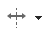  | [Splitter](FormObjects/splitters.md) / [Control de pestañas](FormObjects/tabControl.md)                                                                                                                                                                                                                                                                     |   D   |
|     | [Área de plug-in ](FormObjects/pluginArea_overview.md) / [Subformulario](FormObjects/subform_overview.md) / [Área Web](FormObjects/webArea_overview.md) / [4D Write Pro](FormObjects/writeProArea_overview.md) / [4D View Pro](FormObjects/viewProArea_overview |   X   |

To draw an object type, select the corresponding button and then trace the object in the form. Após criar um objeto, você pode modificar seu tipo utilizando a Lista de Propriedades. Mantenga presionada la tecla **Mayúsculas** mientras dibuja para restringir el objeto a una forma regular. Lines are constrained to horizontal, 45°, or vertical, rectangles are constrained to squares, and ovals are constrained to circles.

The current variant of the theme is the object that will be inserted in the form. Ao clicar no lado direito de um botão, você acessa o menu de variantes:


You can click twice on the button so that it remains selected even after you have traced an object in the form (continual selection). This function makes creating several successive objects of the same type easier. Para cancelar uma seleção contínua, clique noutro objeto ou ferramenta.

### Lista de propriedades

Both forms and form objects have properties that control access to the form, the appearance of the form, and the behavior of the form when it is used. Form properties include, for example, the form’s name, its menu bar, and its size. Object Properties include, for example, an object’s name, its dimensions, its background color, and its font.

You can display and modify form and object properties using the Property List. It displays either form or objects properties depending on what you select in the editor window.

Para mostrar/ocultar la lista de propiedades, seleccione **Lista de propiedades** en el menú **Formulario** o en el menú contextual del editor de formularios. You can also display it by double-clicking in an empty area of the form.

#### Atalhos

Pode utilizar os seguintes atalhos na Lista de Propriedades:

- **Tecla de flecha**s ↑ ↓: se utiliza para pasar de una celda a otra.
- **Teclas flechas** ← →: se utiliza para expandir/contraer los temas o entrar en el modo de edición.
- **PgUp** y **PgDn**: selecciona la primera o la última celda visible de la lista mostrada.
- **Inicio** y **Fin**: selecciona la primera o la última celda de la lista.
- **Ctrl+clic** (Windows) o **Comando+clic** (macOS) sobre un evento: utilizado para seleccionar/deseleccionar cada evento de la lista, según el estado inicial del evento sobre el que se ha hecho clic.
- **Ctrl+clic** (Windows) o **Comando+clic** (macOS) en la etiqueta de un tema: Permite contraer/expandir todos los temas de la lista.
- **Ctrl+clic** (Windows) o **Comando+clic** (macOS) sobre un valor de propiedad mostrado en **negrita**: restablece la propiedad a su valor por defecto.

## Manipulação de objetos formulário

### Adicionar objectos

É possível adicionar objetos a formulários de várias maneiras:

- Dibujando el objeto directamente en el formulario después de seleccionar su tipo en la barra de objetos (ver [Utilizando la barra de objetos](#using-the-object-bar))
- Arrastando e soltando o objeto da barra de objetos
- Mediante operaciones de arrastrar y soltar o copiar y pegar sobre un objeto seleccionado de la [librería de objetos](objectLibrary.md) preconfigurada,
- Ao arrastar e largar um objeto de outro formulário,
- By dragging and dropping an object from the Explorer (fields) or from other editors in the Design environment (lists, pictures, etc.)

Once the object is placed in the form, you can modify its characteristics using the Form editor.

É possível trabalhar com dois tipos de objetos nos formulários:

- **Objetos estáticos** (líneas, marcos, imágenes de fondo, etc.): estos objetos se utilizan generalmente para definir la apariencia del formulario y sus etiquetas, así como para la interfaz gráfica. Estão disponíveis na barra de objetos do editor de formulários. You can also set their graphic attributes (size, color, font, etc.) and their resizing properties using the Property List. Os objetos estáticos não têm variáveis associadas como os objetos ativos. No entanto, é possível inserir objetos dinâmicos em objetos estáticos.

- **Objetos activos**: estos objetos realizan tareas o funciones en la interfaz y pueden adoptar muchas formas: campos, botones, listas desplazables, etc. Cada objeto ativo é associado com um campo ou uma variável.

### Selecção de objectos

Before you can perform any operation on an object (such as changing a line width or font), you need to select the object that you want to modify.

Para seleccionar um objecto utilizando a barra de ferramentas:

1. Click the Arrow tool  in the toolbar.<p></p>

<p>Click the Arrow tool  in the toolbar. When you move the pointer into the form area, it becomes a standard arrow-shaped pointer.</p>.

2. Clique no objecto que deseja selecionar. Resizing handles identify the selected object.<p></p>

Para selecionar um objecto utilizando a Lista de Propriedades:

1. Escolher o nome do objecto na lista pendente da Lista de Objectos localizada no topo da Lista de Propriedades. Usando estes dois métodos, pode seleccionar um objecto que esteja escondido por outros objectos ou localizado fora da área visível da janela actual.
   Para deseleccionar un objeto, haga clic fuera del límite del objeto o **Mayúsculas+clic** en el objeto.

> \> > It is also possible to select objects by double-clicking them in the result window of ""Find in design" operation.

### Selecção de múltiplos objectos

Pode querer realizar a mesma operação em mais de um objecto de forma - por exemplo, para mover os objectos, alinhá-los, ou alterar a sua aparência. 4D permite-lhe selecionar vários objectos ao mesmo tempo. Há várias maneiras de seleccionar vários objectos:

- Seleccione **Seleccionar todo** en el menú Edición para seleccionar todos los objetos.
- Haga clic con el botón derecho en el objeto y elija el comando **Seleccionar objetos del mismo tipo** en el menú contextual.
- Mantenga presionada la tecla **Mayús** y haga clic en los objetos que desee seleccionar.
- Start at a location outside the group of objects you want to select and drag a marquee (sometimes called a selection rectangle) around the objects. When you release the mouse button, if any part of an object lies within or touches the boundaries of the selection rectangle, that object is selected.
- Mantenga presionada la tecla **Alt** (Windows) o la tecla **Opción** (macOS) y dibuje un rectángulo de selección. Os objetos que estiverem completamente no retângulo serão selecionados.

A figura abaixo mostra um marque sendo desenhado para selecionar dois objetos:


Para deseleccionar un objeto que forma parte de un grupo de objetos seleccionados, mantenga presionada la tecla **Mayús** y haga clic en el objeto. Os outros objetos permanecem selecionados. To deselect all the selected objects, click outside the boundaries of all the objects.

### Duplicação de objectos

Pode duplicar qualquer objecto na forma, incluindo objectos activos. Copies of active objects retain all the properties of the original, including name, type, standard action, display format, and object method.

You can duplicate an object directly using the Duplicate tool in the Tools palette or use the Duplicate Many dialog box to duplicate an object more than once. Also, using this dialog box, you can set the distance between two copies.

Para duplicar um ou mais objectos:

1. Seleccione os objectos que pretende agrupar.
2. Elija **Duplicar** en el menú **Edición**. 4D cria uma cópia de cada objecto selecionado e coloca a cópia em frente e ligeiramente para o lado do original.
3. Deslocar a cópia para a localização pretendida.
   If you choose the Duplicate menu item again, 4D creates another copy of each object and moves it the exact same distance and direction from the first copy. If you need to distribute copies of the object along a line, you should use the following procedure. Duplicate the original object, move the copy to another location in the form, and then duplicate the copy. The second copy is automatically placed in the same relation to the first copy as the first copy was in relation to the original object. As cópias subsequentes também são colocadas na mesma relação com seus originais. A figura abaixo mostra como funciona esse posicionamento relativo das cópias:


#### Duplicar muitos

La caja de diálogo "Duplicar muchos" aparece cuando se selecciona uno o más objetos y se elige el comando **Duplicar muchos...** del menú **Objeto**.


- Na área superior, introduza o número de colunas e linhas (linhas) de objectos que pretende obter. Por exemplo, se quiser três colunas e duas linhas de objectos, introduza 3 na área de Coluna(s) e 2 na área de Linha(s). Se quiser três novas cópias horizontais de um objecto, introduza 4 na área de Coluna(s) e deixe o valor por defeito, 1, na área de Linha(s).

- Para linhas e colunas, defina o offset que deseja deixar entre cada cópia. O valor deve ser expresso em pontos. It will be applied to each copy, or copies, in relation to the original object. For example, if you want to leave a vertical offset of 20 points between each object and the height of the source object is 50 points, enter 70 in the column’s “Offset” area.

- Si desea crear una matriz de variables, seleccione la opción **Numerar las variables** y seleccione la dirección en la que se van a numerar las variables, ya sea por línea(s) o por columna(s).
  Esta opção só está activa quando o objecto seleccionado é uma variável. Para más información sobre esta opción, consulte **Duplicar en una matriz** en el _Manual de diseño_.

### Mover objetos

You can move any graphic or active object in the form including fields and objects created with a template. Ao mover um objeto, existem as seguintes opções:

- Mova o objeto arrastando-o,
- Mova o objeto um píxel de cada vez utilizando as teclas de seta,
- Mova o objeto em etapas usando as teclas de seta (etapas de 20 píxeis por padrão),

Ao começar a arrastar o objeto selecionado, seus manipuladores desaparecem. 4D displays markers that show the location of the object’s boundaries in the rulers so that you can place the object exactly where you want it. Be careful not to drag a handle. Dragging a handle resizes the object. Puede presionar la tecla **Mayúsculas** para realizar el movimiento con una restricción.

Cuando la [rejilla magnética](#usando-la-rejilla-magnética) está activada, los objetos se mueven por etapas indicando ubicaciones perceptibles.

Para mover um objeto um píxel de cada vez:

- Select the object or objects and use the arrow keys on the keyboard to move the object. Each time you press an arrow key, the object moves one pixel in the direction of the arrow.

Para mover um objeto em passos:

- Selecciona el objeto u objetos que quiera mover y mantenga presionada la tecla **Mayúsculas** y utilice las teclas de dirección para mover el objeto por pasos. Por padrão, os passos são de 20 pixéis de cada vez. Pode alterar este valor na página Formulários das Preferências.

### Agrupamento de objectos

4D lets you group objects so that you can select, move, and modify the group as a single object. Objects that are grouped retain their position in relation to each other. You would typically group a field and its label, an invisible button and its icon, and so forth.

When you resize a group, all the objects in the group are resized proportionally (except text areas, which are resized in steps according to their font sizes.

Você pode desagrupar um grupo de objetos a qualquer momento e tratá-los novamente como objetos independentes.

Um objecto activo que tenha sido agrupado deve ser desarticulado antes de se poder aceder às suas propriedades ou método. Sin embargo, es posible seleccionar un objeto perteneciente a un grupo sin reagrupar el conjunto: para ello, **Ctrl+clic** (Windows) o **Comando+clic** (macOS) en el objeto (el grupo debe estar seleccionado previamente).

O agrupamento só afeta os objetos no editor de formulários. Quando o formulário é executado, todos os objetos agrupados agem como se não estivessem agrupados.

> La rejilla magnética también influye en el redimensionamiento manual de los objetos.

Para agrupar objectos:

1. Selecione o objecto agrupado que pretende desagrupar.
2. Elija **Agrupar** en el menú Objetos. OR
   Click the Group button  in the toolbar of the Form editor:<p></p>
   4D marks the boundary of the newly grouped objects with handles. No handles mark the boundary of any of the individual objects within the group. Now, when you modify the grouped object, you change all the objects that make up the group.

Para desagrupar objetos:

1. Seleccione o objecto ou objectos que pretende duplicar.
2. Choose **Ungroup** from the **Object** menu.<p>OR</p><p>Click the **Ungroup** button (variant of the **Group** button) in the toolbar of the Form editor.</p><p>If **Ungroup** is dimmed, this means that the selected object is already separated into its simplest form.</p>4D marks the boundaries of the individual objects with handles.

### Alinhamento de objetos

Pode-se alinhar objectos uns com os outros ou utilizar uma grelha invisível no formulário.

- When you align one object to another, you can align it to the top, bottom, side, or horizontal or vertical center of the other object. You can directly align a selection of objects using the alignment tools or apply more advanced alignment settings using the Alignment Assistant. The latter option allows you, for example, to set the object that will be used as the position reference and to preview the alignment in the form before applying it.
- When you use the invisible grid, each object can be aligned manually with others based on “noticeable” positions which are depicted with dotted lines that appear when the object being moved approaches other objects.

#### Usando as ferramentas de alinhamento instantâneo

As ferramentas de alinhamento na barra de ferramentas e no submenu Alinhar do menu Objecto permitem alinhar rapidamente os objectos seleccionados.


When 4D aligns objects, it leaves one selected object in place and aligns the remaining objects to that one. Este objecto é a "âncora." Utiliza o objecto que se encontra mais afastado na direção do alinhamento como âncora e alinha os outros objetos com esse objecto. Por exemplo, se quiser realizar um alinhamento correcto num conjunto de objectos, o objecto mais à direita será utilizado como âncora.
The figure below shows objects with no alignment, "aligned left", "aligned horizontally by centers", and "aligned right":


#### Usando o assistente de alinhamento

The Alignment Assistant allows you to perform any type of alignment and/or distribution of objects.


Para mostrar esta caja de diálogo, seleccione los objetos que desee alinear y, a continuación, elija el comando **Alineación** del submenú **Alinear** del menú **Objeto** o del menú contextual del editor.

- In the “Left/Right Alignment” and/or “Top/Bottom Alignment” areas, click the icon that corresponds to the alignment you want to perform.<p>The example area displays the results of your selection.</p>

- Para realizar una alineación que utilice el esquema de anclaje estándar, haga clic en **Ver** o **Aplicar**. In this case 4D uses the object that is the furthest in the alignment’s direction as the anchor and aligns the other objects to that object. Por exemplo, se quiser realizar um alinhamento correcto num conjunto de objectos, o objecto mais à direita será utilizado como âncora. OR:<p>To align objects to a specific object, select the **Align on** option and select the object to which you want the other objects to be aligned from the object list. In this case, the position of the reference object will not be altered.</p>

Puede previsualizar los resultados de la alineación haciendo clic en el botón **Previsualización**. Os objetos são então alinhados no editor de formulários, mas como a caixa de diálogo não desaparece, ainda é possível cancelar ou aplicar o alinhamento.

> Esta caixa de diálogo permite-lhe alinhar e distribuir objetos numa única operação. Para más información sobre cómo distribuir objetos, consulte [Repartir objetos](#distribuir-objetos).

#### Utilização da Rede Magnética

O editor de formulários fornece uma grelha magnética virtual que pode ajudá-lo a colocar e alinhar objetos num formulário. O alinhamento magnético dos objetos baseia-se na sua posição em relação uns aos outros. A grelha magnética só pode ser utilizada quando pelo menos dois objetos estão presentes no formulário.

Isso funciona da seguinte maneira: quando se move um objeto no formulário, 4D indica possíveis localizações para este objeto baseado em alinhamentos notáveis com outros objetos do formulário. É estabelecido um alinhamento perceptível cada vez que isso acontece:

- Horizontalmente, os bordos ou centros de dois objetos coincidem,
- Verticalmente, as arestas de dois objectos coincidem.

Quando isso acontece, 4D coloca o objeto no local e mostra uma linha vermelha indicando o alinhamento perceptível considerado:


No que diz respeito à distribuição dos objetos, 4D propõe uma distância baseada em normas de interface. Tal como no caso do alinhamento magnético, as linhas vermelhas indicam as diferenças visíveis quando estas são atingidas.


Esta operação aplica-se a todos os tipos de objetos dos formulários. La rejilla magnética puede activarse o desactivarse en cualquier momento utilizando el comando **Activar la rejilla magnética** del menú **Formulario** o del menú contextual del editor. También es posible definir la activación de esta función por defecto en la página **Preferencias** > **Formularios** (opción **Activar la alineación automática por defecto**). Puede activar o desactivar manualmente la rejilla magnética cuando se selecciona un objeto presionando la tecla **Ctrl** (Windows) o **Control** (macOS) .

> O magnetismo também leva à observação de etapas ao redimensionar objetos manualmente.

### Distribuição de objectos

You can distribute objects so that they are set out with an equal amount of space between them. To do this, you can distribute objects using either the Distribute tools in the Tools palette or the Alignment Assistant. Este último permite-lhe alinhar e distribuir objetos numa única operação.

> Puede cambiar el orden de entrada en tiempo de ejecución utilizando los comandos `FORM SET ENTRY ORDER` y `FORM GET ENTRY ORDER`.

Para distribuir objetos com igual espaçamento:

1. Selecione três ou mais objetos e clique na ferramenta Distribuir pretendida.

2. In the toolbar, click on the distribution tool that corresponds to the distribution you want to apply.<p></p> OR<p>Select a distribution menu command from the **Align** submenu in the **Object** menu or from the context menu of the editor.</p>4D distributes the objects accordingly. Objects are distributed using the distance to their centers and the largest distance between two consecutive objects is used as a reference.

Para distribuir objetos utilizando a caixa de diálogo Alinhar e distribuir:

1. Seleccione os objectos que pretende distribuir.

2. Seleccione el comando **Alineación** del submenú **Alinear** del menú **Objeto** o del menú contextual del editor. The following dialog box appears:

3. In the Left/Right Alignment and/or Top/Bottom Alignment areas, click the standard distribution icon: 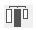 <p>(Standard horizontal distribution icon)</p>The example area displays the results of your selection.

4. To perform a distribution that uses the standard scheme, click **Preview** or _Apply_.<p>In this case 4D will perform a standard distribution, so that the objects are set out with an equal amount of space between them.</p>OR:<p>To execute a specific distribution, select the **Distribute** option (for example if you want to distribute the objects based on the distance to their right side). Esta opção funciona como um interruptor. If the Distribute check box is selected, the icons located below it perform a different function:</p>

- Horizontally, the icons correspond to the following distributions: evenly with respect to left sides, centers (hor.) and right sides of the selected objects.
- Vertically, the icons correspond to the following distributions: evenly with respect to top edges, centers (vert.) and bottom edges of the selected objects.

Puede previsualizar el resultado real de sus parámetros haciendo clic en el botón **Previsualización**: la operación se lleva a cabo en el editor de formularios, pero la caja de diálogo permanece en primer plano. Puede entoces **Cancelar** o **Aplicar** las modificaciones.

> Esta caixa de diálogo permite-lhe combinar o alinhamento e a distribuição de objetos. Para más información sobre la alineación, consulte [Alinear objetos](#aligning-objects).

### Gerenciar os planos dos objetos

You will sometimes have to rearrange objects that are obstructing your view of other objects in the form. For example, you may have a graphic that you want to appear behind the fields in a form. 4D ofrece cuatro elementos de menú, **Mover hacia atrás**, **Mover hacia delante**, **Subir un nivel** y **Bajar un nivel** que le permiten organizar los planos de los objetos en el formulario. These layers also determine the default entry order (see Modifying data entry order). A figura abaixo mostra objetos à frente e atrás de outros objetos:


Para mover um objeto para outro nível, selecione-o e escolha:

- Uno de los comandos **Mover hacia atrás**, **Mover hacia delante**, **Subir un nivel** y **Bajar un nivel** en el menú Objeto,
- Uno de los comandos del submenú **Plano>** del menú contextual del editor,
- One of the commands associated with the level management button of the toolbar.


> Cuando se superponen varios objetos, se puede utilizar el atajo **Ctrl+Mayús+clic** / **Comando+Mayús+clic** para seleccionar cada objeto sucesivamente bajando un plano con cada clic.

When ordering different levels, 4D always goes from the background to the foreground. As a result, the previous level moves the selection of objects one level towards the background. The next level moves the selection one level towards the foreground of the form.

### Ordem de introdução de dados

El orden de entrada de datos es el orden en el que se seleccionan los campos, subformularios y otros objetos activos al presionar la tecla **Tab** o la tecla **Retorno de carro** en un formulario de entrada. Es posible desplazarse por el formulario en sentido contrario (invertir el orden de entrada de datos) presionando las teclas **Mayúsc+Tab** o **Mayúsc+Retorno de carro** de retorno.

> Puede cambiar el orden de entrada en tiempo de ejecución utilizando los comandos `FORM SET ENTRY ORDER` y `FORM GET ENTRY ORDER`.

Every object that supports the focusable property is included in the data entry order by default.

Setting the entry order for a JSON form is done with the [`entryOrder`](properties_JSONref.md) property.

If you don’t specify a custom entry order, by default 4D uses the layering of the objects to determine the entry order in the direction “background towards foreground.” The standard entry order thus corresponds to the order in which the objects were created in the form.

Em alguns formulários, é necessária uma ordem de entrada de dados personalizada. Below, for example, additional fields related to the address have been added after the creation of the form. The resulting standard entry order thus becomes illogical and forces the user to enter the information in an awkward manner:


In cases such as this, a custom data entry order allows you to enter the information in a more logical order:

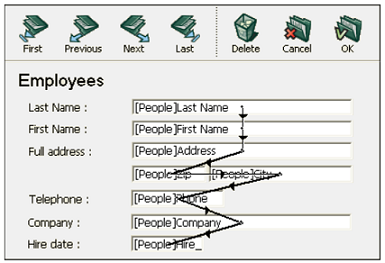

#### Visualização e alteração da ordem de introdução de dados

You can view the current entry order either using the “Entry order” shields, or by using the “Entry order” mode. No entanto, você só pode modificar a ordem de entrada usando o modo “Ordem de entrada”.

This paragraph describes viewing and modifying the entry order using the “Entry order” mode. Para más información sobre la visualización del orden de entrada utilizando marcas, consulte [Using shields](#using-shields).

Para ver ou alterar a ordem de entrada:

1. Choose **Entry Order** from the **Form** menu or click on the Entry Order button in the toolbar of the window:<p></p>

   Choose <strong x-id="1">Entry Order</strong> from the <strong x-id="1">Form</strong> menu or click on the Entry Order button in the toolbar of the window:The pointer turns into an entry order pointer and 4D draws a line in the form showing the order in which it selects objects during data entry. A visualização e alteração da ordem de introdução de dados são as únicas acções que pode realizar até clicar em qualquer ferramenta na paleta Ferramentas.

2. To change the data entry order, position the pointer on an object in the form and, while holding down the mouse button, drag the pointer to the object you want next in the data entry order.<p></p>4D will adjust the entry order accordingly.

3. Repita a etapa 2 tantas vezes quantas forem necessárias para definir a ordem de introdução de dados que desejar.

4. Cuando esté satisfecho con el orden de entrada de datos, haga clic en cualquier herramienta no seleccionada de la barra de herramientas o elija **Orden de entrada** en el menú **Formulario**. 4D regressa ao funcionamento normal do editor de formulários.

> Somente a ordem de entrada da página atual do formulário é exibida. If the form contains enterable objects on page 0 or coming from an inherited form, the default entry order is as follows: Objects from page 0 of the inherited form > Objects from page 1 of the inherited form > Objects from page 0 of the open form > Objects from the current page of the open form.

#### Utilização de um grupo de introdução de dados

While you are changing the data entry order, you can select a group of objects in a form so that the standard data entry order applies to the objects within the group. This allows you to easily set the data entry order on forms in which fields are separated into groups or columns.

Para criar um grupo de entrada de dados:

1. Seleccione **Orden de entrada** en el menú _Formulario_ o haga clic en el botón de la barra de herramientas.
2. Desenhe uma seleção ao redor dos objetos que você deseja agrupar para entrada de dados.

When you release the mouse button, the objects enclosed or touched by the rectangle follow the standard data entry order. A ordem de entrada de dados para os restantes objetos ajustam-se conforme necessário.

#### Excluir um objeto da ordem de entrada

Por defeito, todos os objetos que suportam a propriedade focusable são incluídos na ordem de entrada. Para excluir um objeto da ordem de entrada:

1. Selecionar o modo ordem de entrada e, em seguida

2. **Mayúsculas-clic** en el objeto

3. **haga clic derecho** en el objeto y seleccione la opción **Eliminar del orden de entrada** del menú contextual

## Pré-visualização CSS

The Form editor allows you to view your forms with or without applied CSS values.

Cuando se han definido [hojas de estilo](createStylesheet.md), los formularios (incluidos los formularios y subformularios heredados) se abren por defecto en el modo de vista previa CSS para su sistema operativo.

### Selecção do modo de pré-visualização do CSS

A barra de ferramentas do editor de formulários fornece um botão CSS para a visualização de objectos com estilo:

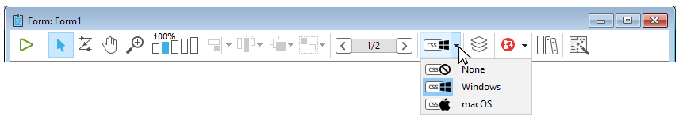

Seleccione um dos seguintes modos de pré-visualização a partir do menu:

| Ícone barra de ferramentas              | Modo de pré-visualização CSS | Descrição                                                                                                                                                         |
| --------------------------------------- | ---------------------------- | ----------------------------------------------------------------------------------------------------------------------------------------------------------------- |
| 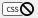  | Nenhum                       | No CSS values are applied in the form and no CSS values or icons displayed in the Property List.                                                  |
|  | Windows                      | Os valores CSS para a plataforma Windows são aplicados no formulário. Valores CSS e ícones apresentados na Lista de Propriedades. |
| 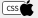 | macOS                        | Os valores CSS para a plataforma macOS são aplicados no formulário. Valores CSS e ícones apresentados na Lista de Propriedades.   |

> If a font size too large for an object is defined in a style sheet or JSON, the object will automatically be rendered to accommodate the font, however the size of the object will not be changed.

El modo de vista previa CSS refleja el orden de prioridad aplicado a las hojas de estilo frente a los atributos JSON, tal y como se define en la sección [JSON vs Hoja de estilo](stylesheets.html#json-vs-style-sheet).

Once a CSS preview mode is selected, objects are automatically displayed with the styles defined in a style sheet (if any).

> When copying or duplicating objects, only the CSS references (if any) and the JSON values are copied.

### Suporte CSS na lista de propriedades

In CSS Preview mode, if the value of an attribute has been defined in a style sheet, the attribute's name will appear with a CSS icon displayed next to it in the Property List. Por exemplo, os valores dos atributos definidos nesta folha de estilos:

```4d
.myButton {
font-family: comic sans;
font-size: 14;
stroke: #800080;
}
```

são apresentados com um ícone CSS na Lista de Propriedades:


Un valor de atributo definido en una hoja de estilo puede ser anulado en la descripción del formulario JSON (excepto si el CSS incluye la declaración `!important`, ver más abajo). En este caso, la lista de propiedades muestra el valor del formulario JSON en **negrita**. Puede restablecer el valor a su definición de hoja de estilo con los atajos **Ctrl + clic** (Windows) o **Comando + clic** (macOs).

> Si un atributo ha sido definido con la declaración `!important` para un grupo, un objeto dentro de un grupo, o cualquier objeto dentro de una selección de múltiples objetos, el valor de ese atributo está bloqueado y no puede ser cambiado en la Lista de Pr

#### Lista de propriedades Ícones CSS

| Ícone                                         | Descrição                                                                                                                                                          |
| --------------------------------------------- | ------------------------------------------------------------------------------------------------------------------------------------------------------------------ |
|       | Indica que um valor de atributo foi definido em uma folha de estilo                                                                                                |
|  | Indica que un valor de atributo ha sido definido en una hoja de estilo con la declaración `!important`                                                             |
|  | Displayed when an attribute value defined in a style sheet for at least one item in a group or a selection of multiple objects is different from the other objects |

## Criação de list box

Puede crear rápidamente nuevos list box de tipo selección de entidades con el **-Generador de list box**. The new list box can be used immediately or it can be edited via the Form Editor.

The List box builder lets you create and fill entity selection list boxes in a few simple operations.

### Usando o gerador de list box

1. Na barra de ferramentas do Editor de formulários, clique no ícone do construtor de List box:


O gerador do list box é exibido:


2. Seleccione una tabla de la lista desplegable **Tabla**:

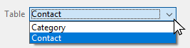

3. Seleccione los campos del list box en el área **Campos**:

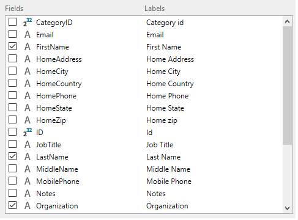

Por padrão, todos os campos são selecionados. Puede seleccionar o deseleccionar los campos individualmente o utilizar **Ctrl+clic** (Windows) o **Cmd+clic** (macOS) para seleccionarlos o deseleccionarlos todos a la vez.

Você pode alterar a ordem dos campos arrastando-os e soltando-os.

4. The expression to fill the list box's rows from the entity selection is prefilled:


Esta expressão pode ser alterada se necessário.

5. Al hacer clic en el botón **Copiar** se copiará la expresión para cargar todos los registros en la memoria:


6. Haga clic en el botón **Crear un widget** para crear el list box.


O list box final:


## Inserir campos

El botón **Insertar campos** inserta en el formulario todos los campos (excepto los de tipo objeto y blob) de la tabla del formulario, junto con sus etiquetas y respetando las normas de la interfaz. Esse assistente é um atalho para projetar formulários básicos de entrada ou formulários lista.

El botón **Insertar campos** sólo está disponible con formularios tabla.

O desenho do formulário resultante depende do formulário:

- **Formulario detallado**: al hacer clic en el botón **Insertar campos** se genera un formulario con un diseño de página:


- **Formulario listado**: al hacer clic en el botón **Insertar campos** se genera un diseño de formulario listado con campos organizados en una sola línea y marcadores de área:


## Escudos

The 4D Form Editor uses shields to make viewing object properties easier. Pode encontrá-los na barra de ferramentas do formulário:


El principio de esta función es el siguiente: cada escudo está asociado a una propiedad (por ejemplo, **Vistas**, que significa que el objeto "está en la vista actual"). When you activate a shield, 4D displays a small icon (shield) in the upper left of each object of the form where the property is applied.


### Usando escudos

Para activar una marca, haga clic en el icono _Marca_ de la barra de herramientas hasta seleccionar la marca deseada. You can also click on the right side of the button and select the type of shield to display directly in the associated menu:

Si no quiere mostrar marcas, seleccione **Sin marcas** en el menú de selección.

> You can set which shields to display by default on the Forms Page of the application Preferences.

### Descrição do badge

Segue-se uma descrição de cada tipo de escudo:

| Ícone                                           | Nome                            | É exibido ...                                                                                                                                              |
| ----------------------------------------------- | ------------------------------- | ---------------------------------------------------------------------------------------------------------------------------------------------------------------------------------------------------------- |
|    | Método objecto                  | Para objectos com um método objeto associado                                                                                                                                                               |
|  | Acção padrão                    | Para objectos com uma acção padrão associada                                                                                                                                                               |
|        | Redimensionamento               | Para objectos com pelo menos uma propriedade de redimensionamento, indica a combinação de propriedades actuais                                                                                             |
|      | Ordem de entrada                | Para objectos enterráveis, indica o número da ordem de entrada                                                                                                                                             |
|      | Vista actual                    | Para todos os objectos na vista actual                                                                                                                                                                     |
|       | [Style Sheet](stylesheets.html) | Para objectos com um ou mais valores de atributo anulados por uma folha de estilo.                                                                                                         |
|          | Filtro                          | Para objectos enterráveis com um filtro de entrada associado                                                                                                                                               |
|         | Dica de Ajuda                   | Para objetos com uma mensagem de ajuda associada                                                                                                                                                           |
|       | Localizado                      | Para objetos cuja etiqueta possui uma referência (etiqueta começando com “:”). A referência pode ser do tipo recurso (STR#) ou XLIFF |
|       | Sem Escudos                     | Nenhum escudo aparece                                                                                                                                                                                      |

## Vistas

The 4D Form Editor enables you to build complex forms by distributing form objects among separate views that can then be hidden or shown as needed.

For example, you can distribute objects according to type (fields, variables, static objects, etc.). Any type of form object, including subforms and plug-in areas, can be included in views.

Não há limite para o número de vistas por formulário. Pode criar tantas vistas diferentes quantas as necessárias. Além disso, cada vista pode ser apresentada, ocultada e/ou bloqueada.

A gestão das vistas é efetuada através da paleta de vistas.


### Aceder à paleta de vistas

Existem três formas de aceder à paleta de vistas:

- **Barra de herramientas**: haga clic en el icono Vistas de la barra de herramientas del Editor de formularios. (This icon appears gray when at least one object belongs to a view other than the default view.)

|                 Vista por defeito apenas                |                 Com vistas adicionais                 |
| :-----------------------------------------------------: | :---------------------------------------------------: |
|  |  |

- **Menú contextual** (formulario u objeto): haga clic derecho en cualquier lugar del editor de formularios o de un objeto, y seleccione **Vista actual**


La vista actual se indica con una marca de verificación (por ejemplo, "Dirección de trabajo" en la imagen superior)

- **Menú Formulario**: haga clic en el menú **Formulario** y seleccione **Mostrar la lista**


### Antes de começar

Aqui estão algumas coisas importantes que você deve saber antes de começar a trabalhar com vistas:

- **Contexto de uso**: las vistas son una herramienta puramente gráfica que sólo se puede utilizar en el Editor de formularios; no se puede acceder a las vistas por programación ni en el modo Aplicación.

- **Vistas y páginas**: Los objetos de una misma vista pueden pertenecer a diferentes páginas del formulario; sólo se pueden mostrar los objetos de la página actual (y de la página 0 si es visible), independientemente de la configuración de las vistas.

- **Vistas y niveles**: las vistas son independientes de los niveles de los objetos; no existe una jerarquía de visualización entre las diferentes vistas.

- **Vistas y grupos**: sólo se pueden agrupar los objetos que pertenecen a la vista actual.

- **Vistas actuales y por defecto**: la vista por defecto es la primera vista de un formulario y no se puede eliminar; la vista actual es la que se está editando y el nombre se muestra en negrita.

### Gestão da vistas

#### Criar vistas

Qualquer objecto criado num formulário é colocado na primeira vista ("Vista 1") do formulário. La primera vista es **siempre** la vista por defecto, indicada por (por defecto) después del nombre. El nombre de la vista puede cambiarse (ver [Renombrar vistas](#renaming-views)), sin embargo sigue siendo la vista por defecto.


Existem duas formas de adicionar vistas adicionais:

- Haga clic en el botón **Añadir una nueva vista** en la parte inferior de la paleta Vista:


- Haga clic con el botón derecho en una vista existente y seleccione **Insertar vista**:

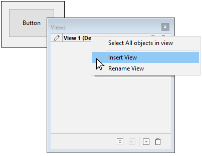

Não há limite para o número de vistas.

#### Renomear vistas

By default views are named as "View" + the view number, however you can change these names to improve readability and better suit your needs.

Para mudar o nome de uma vista, pode utilizar:

- Double-click directly on the view name (the selected view in this case). O nome torna-se então editável:


- Clique com o botão direito do rato no nome da vista. O nome torna-se então editável:


#### Reordenação de visualizações

You can change the display order of views by dragging/dropping them within the View palette.

Note-se que a vista padrão não é alterada:


#### Eliminar vistas

Para mudar o nome de uma vista, pode utilizar:

- Haga clic en el botón **Eliminar la vista seleccionada** en la parte inferior de la paleta Vista:


- Haga clic derecho en el nombre de la vista y seleccione **Eliminar la vista**:


> Se uma vista for apagada, quaisquer objectos nela contidos são automaticamente movidos para a vista por defeito.

### Usando vistas

Uma vez criadas as vistas, pode utilizar a paleta Vista para:

- Adicionar objecto às vistas,
- Mover objectos de uma vista para outra,
- Selecionar todos os objetos da mesma vista com um único clique,
- Mostrar ou ocultar objectos para cada vista,
- Bloquear os objectos de uma vista.

#### Adicionar objectos a vistas

Um objeto só pode pertencer a uma única vista.

Para crear un objeto en otra vista, basta con seleccionar la vista en la paleta de vistas (antes de crear el objeto) haciendo clic en su nombre (se muestra un icono de edición para la [Vista actual](#before-you-begin) y el nombre aparece en negrita):


#### Mover objectos entre vistas

It's also possible to move one or more objects from one view to another. No formulário, selecionar o(s) objeto(s) cuja vista se pretende alterar. The view list indicates, using a symbol, the view to which the selection belongs:

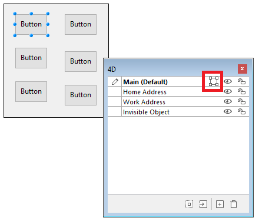

> A seleção pode conter vários objetos pertencentes a diferentes visualizações.

Simplemente seleccione la vista de destino, haga clic derecho y seleccione **Mover a**:


OU

Seleccione la vista de destino de la selección y haga clic en el botón **Mover a** de la parte inferior de la paleta de vistas:


A seleção é então colocada na nova vista:


Você também pode mover um objeto para outra visualização por meio do menu de contexto do objeto. Haga clic derecho en el objeto, seleccione **Mover a la vista** y seleccione una vista en la lista de vistas disponibles:


> La [vista actual](#antes-del-comienzo) se muestra en negrita.

#### Seleccionar todos os objectos de uma vista

You can select all objects belong to the same view in the current page of the form. This function is useful for applying global changes to a set of objects.

Para ello, haga clic derecho en la vista en la que desea seleccionar todos los objetos, haga clic en **Seleccionar todo**:


Também pode utilizar o botão na parte inferior da paleta de vistas:


#### Mostrar ou esconder objectos de uma vista

You can show or hide objects belonging to a view at any time in the form's current page. Essa função pode ser usada, por exemplo, para focar em determinados objetos ao modificar o formulário.

Por defecto, se muestran todas las vistas, como indica el icono _Mostrar/Ocultar_:


Para ocultar una vista, haga clic en el icono _Mostrar/Ocultar_. Em seguida, é escurecida e os objetos da vista correspondente deixam de ser mostrados no formulário:


> La [vista actual](#antes-del-comienzo) no se puede ocultar.

Para mostrar una vista que está oculta, simplemente selecciónela o haga clic en el icono _Mostrar/Ocultar_ de esa vista.

#### Bloqueio de objetos de uma vista

É possível bloquear os objectos de uma vista. Isto impede que sejam selecionados, alterados ou eliminados do formulário. Una vez bloqueado, un objeto no puede seleccionarse mediante un clic, un rectángulo o el comando **Seleccionar objetos similares** del menú contextual. Esta função é útil para evitar erros de tratamento.

Por defecto, todas las vistas están desbloqueadas, como lo indica el icono _Bloquear/Desbloquear_ que aparece junto a cada vista:


Para bloquear los objetos de una vista, haga clic en el icono _Bloquear/Desbloquear_. O cadeado está fechado, o que significa que a vista está agora bloqueada:


> La [vista actual](#antes-del-comienzo) no se puede bloquear.

Para desbloquear una vista que está bloqueada, basta con seleccionarla o hacer clic en el icono _Bloquear/Desbloquear_ de esa vista.

## Zoom

Pode fazer zoom no formulário atual. Switch to “Zoom” mode by clicking on the magnifying glass icon or clicking directly on the desired percentage bar (50%, 100%, 200%, 400% and 800%):


- Quando se clica na lupa, o cursor transforma-se numa lupa. Pode então clicar no formulário para aumentar a visualização ou manter premida a tecla Shift e clicar para reduzir a percentagem de visualização.
- When you click on a percentage bar, the display is immediately modified.

No modo Zoom, todas as funções do editor de formulários permanecem disponíveis(\*).

(\*) For technical reasons, it is not possible to select list box elements (headers, columns, footers) when the Form editor is in Zoom mode.
