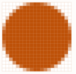

4D inclui suporte específico para imagens utilizadas nos seus formulários.

## Formatos Nativos Compatíveis

4D integra a gestão nativa dos formatos de imagem. Isso significa que imagens serão mostradas e armazenadas em seu formato original, sem qualquer interpretação em 4D. The specific features of the different formats (shading, transparent areas, etc.) will be retained when they are copied and pasted, and will be displayed without alteration. This native support is valid for all pictures stored in 4D forms: [static pictures](FormObjects/staticPicture.md) pasted in Design mode, pictures pasted into [inputs objects](FormObjects/input_overview.md) at runtime, etc.

Os formatos de imagem mais comuns são compatíveis com ambas as plataformas: .jpeg, .gif, .png, .tiff, .bmp, etc. Em macOS, o formato pdf também está disponível para codificar e decodificar.

> A lista completa dos formatos suportados varia de acordo com o sistema operativo e os codecs personalizados que são instalados nas máquinas. To find out which codecs are available, you must use the `PICTURE CODEC LIST` command (see also the [picture data type](Concepts/dt_picture.md) description).

### Formato de imagem não disponível

Um ícone específico é exibido para imagens salvas em um formato que não esteja disponível no mecanismo. A extensão do formato faltante é mostrado na parte inferior do ícone:

O ícone é usado automaticamente onde a imagem precisar ser exibida:

O ícone indica que a imagem não pode ser exibida ou manipulada localmente - mas pode ser salva sem alteração para que possa ser exibida em outros dispositivos. Por exemplo esse é o caso para imagens PDF em Windows ou para imagens no formato PICT.

## Imagens em alta resolução

4D admite imagens de alta resolução tanto em plataformas MacOS como Windows. As imagens de alta resolução podem ser definidas quer por factor de escala quer por dpi.

### Factor de escala

As telas de alta resolução têm uma densidade de pixels maior do que as telas padrão tradicionais. For pictures to render correctly on high resolution displays, the number of pixels in the picture must be multiplied by the _scale factor_ (_i.e._, two times larger, three times larger, etc.).

When using high resolution pictures, you can specify the scale factor by adding "@nx" in the picture's name (where _n_ designates the scale factor). In the table below, you can see that the scale factor is indicated in the names of the high resolution pictures, _circle@2x.png_ and _circle@3x.png_.

| Tipo de exibição     | Fator de Escala                                                         | Exemplo                                                                                                                                                                                         |
| -------------------- | ----------------------------------------------------------------------- | ----------------------------------------------------------------------------------------------------------------------------------------------------------------------------------------------- |
| Resolução ‘standard’ | Densidade de pixel 1:1.                 | **1x**  _circle.png_                                                                                                          |
| Alta resolução       | A densidade de pixels aumentou por um factor de 2 ou 3. | <table><th>2x</th><th>3x</th><tr><td>*circle@2x.png*</td><td> *circle@3x.png*</td></tr></table> |

As imagens de alta resolução com a convenção @nx podem ser utilizadas nos seguintes objectos:

- [Static pictures](FormObjects/staticPicture.md)
- [Buttons](FormObjects/button_overview.md)/[radio](FormObjects/radio_overview.md)/[check boxes](FormObjects/checkbox_overview.md)
- [Picture buttons](FormObjects/pictureButton_overview.md)/[Picture pop-ups](FormObjects/picturePopupMenu_overview.md)
- [Tab controls](FormObjects/tabControl.md)
- [List box headers](FormObjects/listbox_overview.md#list-box-headers)
- [Menu icons](Menus/properties.md#item-icon)

4D dá automaticamente prioridade às imagens com a resolução mais alta. Por exemplo, ao usar duas telas (uma de alta resolução e outra padrão) e mover um formulário de uma tela para outra, 4D renderiza automaticamente a resolução mais alta possível da imagem. Even if a command or property specifies _circle.png_, _circle@3x.png_ will be used (if it exists).

> Note que a priorização da resolução ocorre apenas para a apresentação de imagens no ecrã, não havendo priorização automática durante a impressão.

### DPI (macOS and Windows)

While 4D automatically prioritizes the highest resolution,  there are, however, some behavioral differences depending on screen and image dpi\*(\*)\*, and picture format:

| Operação                                                                                                                                                    | Comportamento                                                                                                                                                                                                                                                                                                                                                                                                                                                                                                                                                                                                                                                                    |
| ----------------------------------------------------------------------------------------------------------------------------------------------------------- | -------------------------------------------------------------------------------------------------------------------------------------------------------------------------------------------------------------------------------------------------------------------------------------------------------------------------------------------------------------------------------------------------------------------------------------------------------------------------------------------------------------------------------------------------------------------------------------------------------------------------------------------------------------------------------- |
| Soltar o pegar                                                                                                                                              | If the picture has:<ul><li>**72dpi or 96dpi** - The picture is "[Center](FormObjects/properties_Picture.md#center--truncated-non-centered)" formatted and the object containing the picture has the same number of pixels.</li><li>**Other dpi** - The picture is "[Scaled to fit](FormObjects/properties_Picture.md#scaled-to-fit)" formatted and the object containing the picture is equal to (picture's number of pixels \* screen dpi) / (picture's dpi)</li> <li>**No dpi** - The picture is "[Scaled to fit](FormObjects/properties_Picture.md#scaled-to-fit)" formatted.</li></ul> |
| [Automatic Size](https://doc.4d.com/4Dv19/4D/19/Setting-object-display-properties.300-5416671.en.html#148057) (Form Editor context menu) | If the picture's display format  is:<ul><li>**[Scaled](FormObjects/properties_Picture.md#scaled-to-fit)** - The object containing the picture is resized according to (picture's number of pixels \* screen dpi) / (picture's dpi) </li> <li>**Not scaled** - The object containing the picture has the same number of pixels as the picture.</li></ul>                                                                                                                                                                                                                                                    |

_(\*) Typically,  macOS = 72dpi, Windows = 96dpi_

## Imagens em modo escuro (apenas macOS)

You can define specific pictures and icons to be used instead of standard pictures when [forms use the dark scheme](properties_FormProperties.md#color-scheme).

Uma imagem em modo escuro é definida da seguinte forma:

- dark mode picture has the same name as the standard (light scheme) version with the suffix "`_dark`"
- a imagem do modo escuro é guardada ao lado da versão padrão.

At runtime, 4D will automatically load the light or dark image according to the [current form color scheme](https://doc.4d.com/4dv19/help/command/en/1761.html).

## Coordenadas do mouse numa imagem

4D lets you retrieve the local coordinates of the mouse in an [input object](FormObjects/input_overview.md) associated with a [picture expression](FormObjects/properties_Object.md#expression-type), in case of a click or a hovering, even if a scroll or zoom has been applied to the picture. Esse mecanismo, similar ao de um mapa de imagens, pode ser utilizado, por exemplo, para manejar barras de botões deslocáveis ou a interface de um software de cartografia.

The coordinates are returned in the _MouseX_ and _MouseY_ [System Variables](https://doc.4d.com/4Dv18/4D/18/System-Variables.300-4505547.en.html). As coordenadas são expressas em píxeis em relação ao canto superior esquerdo da imagem (0,0). If the mouse is outside of the picture coordinates system, -1 is returned in _MouseX_ and _MouseY_.

You can get the value of these variables as part of the [`On Clicked`](Events/onClicked.md), [`On Double Clicked`](Events/onDoubleClicked.md), [`On Mouse up`](Events/onMouseUp.md), [`On Mouse Enter`](Events/onMouseEnter.md), or [`On Mouse Move`](Events/onMouseMove.md) form events.
