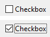
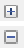
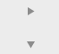

Uma caixa de seleção é um tipo de botão usado para introduzir ou exibir dados binários (verdadeiro-falso). Basically, it is either checked or unchecked, but a [third state](#three-states-check-box) can be defined.


Check boxes are controlled by methods or [standard actions](#using-a-standard-action). O método associado com ela é executado quando selecionar a caixa de seleção. Como todos os botões, uma variável da caixa de seleção é estabelecida em 0 quando o formulário é aberto pela primeira vez.

Uma caixa de seleção mostra o teto do lado de um pequeno quadrado. This text is set in the [Title](properties_Object.md#title) property of the check box. You can enter a title in the form of an XLIFF reference in this area (see [Appendix B: XLIFF architecture](https://doc.4d.com/4Dv17R5/4D/17-R5/Appendix-B-XLIFF-architecture.300-4163748.en.html)).

## Utilizar caixas de seleção

A check box can be associated to a [variable or expression](properties_Object.md#variable-or-expression) of type integer or boolean.

- **integer:** if the box is checked, the variable has the value 1. Quando não for marcado, tem o valor 0. Se a caixa de seleção estiver no terceiro estado (ver abaixo), tem o valor 2.
- **boolean:** if the box is checked, the variable has the value `True`. When not checked, it has the value `False`.

Uma parte ou todas as caixas de seleção de um formulário podem estar marcadas ou desmarcadas. As caixas de seleção múltiplas permitem ao usuário selecionar várias opções.

### Caixas de seleção de três estados

Check box objects with [Regular](checkbox_overview.md#regular) and [Flat](checkbox_overview.md#flat) [button style](properties_TextAndPicture.md#button-style) accept a third state. Este terceiro estado é um estado intermediário, que geralmente se usa para fins de visualização. Por exemplo, permite indicar que uma propriedade é presentada em uma seleção de objetos,


To enable this third state, you must select the [Three-States](properties_Display.md#three-states) property.

This property is only available for regular and flat check boxes associated with numeric [variables or expressions](properties_Object.md#variable-or-expression) — check boxes for Boolean expressions cannot use the [Three-States](properties_Display.md#three-states) property (a Boolean expression cannot be in an intermediary state).

A variável associada à caixa de seleção devolve o valor 2 quando a caixa estiver no terceiro estado.

> In entry mode, the Three-States check boxes display each state sequentially, in the following order: unchecked / checked / intermediary / unchecked, etc. The intermediary state is generally not very useful in entry mode; in the code, simply force the value of the variable to 0 when it takes the value of 2 in order to pass directly from the checked state to the unchecked state. No modo de entrada, as caixas de seleção dos três estados mostram cada estado de forma sequencial na ordem abaixo: sem marcar/marcado/intermediário/sem marcar, etc. O estado intermediário não é geralmente muito útil no modo entrada; no código, simplesmente force o valor da variável para 0 quando tomar o valor de 2 para passar diretamente de um estado marcado para o estado desmarcado.

## Usar uma ação padrão

You can assign a [standard action](properties_Action.md#standard-action) to a check box to handle attributes of text areas. For example, if you assign the `fontBold` standard action, at runtime the check box will manage the "bold" attribute of the selected text in the current area.

Só as ações que podem representar um estado verdadeiro/falso (ações "marcáveis") são compatíveis com esse objeto:

| Ações suportadas                    | Condições de uso (se houver) |
| ----------------------------------- | ----------------------------------------------- |
| avoidPageBreakInsideEnabled         | Apenas áreas 4D Write Pro                       |
| fontItalic                          |                                                 |
| fontBold                            |                                                 |
| fontLinethrough                     |                                                 |
| fontSubscript                       | Apenas áreas 4D Write Pro                       |
| fontSuperscript                     | Apenas áreas 4D Write Pro                       |
| fontUnderline                       |                                                 |
| font/showDialog                     | Só em Mac                                       |
| htmlWYSIWIGEnabled                  | Apenas áreas 4D Write Pro                       |
| section/differentFirstPage          | Apenas áreas 4D Write Pro                       |
| section/differentLeftRightPages     | Apenas áreas 4D Write Pro                       |
| spell/autoCorrectionEnabled         |                                                 |
| spell/autoDashSubstitutionsEnabled  | Só em Mac                                       |
| spell/autoLanguageEnabled           | Só em Mac                                       |
| spell/autoQuoteSubstitutionsEnabled | Só em Mac                                       |
| spell/autoSubstitutionsEnabled      |                                                 |
| spell/enabled                       |                                                 |
| spell/grammarEnabled                | Só em Mac                                       |
| spell/showDialog                    | Só em Mac                                       |
| spell/visibleSubstitutions          |                                                 |
| visibleBackground                   | Apenas áreas 4D Write Pro                       |
| visibleFooters                      | Apenas áreas 4D Write Pro                       |
| visibleHeaders                      | Apenas áreas 4D Write Pro                       |
| visibleHiddenChars                  | Apenas áreas 4D Write Pro                       |
| visibleHorizontalRuler              | Apenas áreas 4D Write Pro                       |
| visiblePageFrames                   | Apenas áreas 4D Write Pro                       |
| visibleReferences                   |                                                 |
| widowAndOrphanControlEnabled        | Apenas áreas 4D Write Pro                       |

For detailed information on these actions, please refer to the [Standard actions](properties_Action.md#standard-action) section.

## Estilos de botão caixas de seleção

Check boxes use [button styles](properties_TextAndPicture.md#button-style) to control a check box's general appearance as well as its available properties. É possível aplicar diferentes estilos pré-definidos para caixas de seleção. Um grande número de variações podem ser obtidas combinando essas propriedades/comportamentos.

With the exception of the [available properties](#supported-properties), many check box objects are _structurally_ identical. A diferença é no processamento das variáveis associadas.

4D oferece caixas de seleção nos estilos predefinidos abaixo:

### Clássico

The Regular check box button style is a standard system check box (_i.e._, a rectangle with a descriptive title):



#### JSON Exemplo

```
	"myCheckBox": {
		"type": "checkbox",	
		"style":"regular",
		"text": "Cancel",	
		"action": "Cancel", 	
		"left": 60,			
		"top": 160,		
		"width": 100,			
		"height": 20		
		"dataSourceTypeHint":"boolean"
		}
```

### Plano

O estilo de caixa de seleção Plano tem uma aparência minimalista. A natureza gráfica do estilo Flat é especialmente útil para os formulários que vão ser impressos.


#### JSON Exemplo

```
	"myCheckBox": {
			"type": "checkbox",	
			"style":"flat",
			"text": "Cancel",	
			"action": "cancel", 
			"left": 60,		
 			"top": 160,	
 			"width": 100,			
			"height": 20			
			}
```

### Botão barra de ferramentas

O estilo de botão barra de ferramentas está pensado principalmente para sua integração em uma barra de ferramentas.

O estilo Barra de ferramentas tem um fundo transparente com um título. It is usually associated with a [4-state picture](properties_TextAndPicture.md#number-of-states).

Exemplo com estados selecionado/ não selecionado/ ressaltado:


#### JSON Exemplo

```
	"myCheckBox": {
                "type": "checkbox",
                "style":"toolbar",	
                "text": "Checkbox",
				"icon": "/RESOURCES/File.png", 
				"iconFrames": 4 
                "left": 60,	
                "top": 160,	
                "width": 100,					
                "height": 20					
                }
```

### Bevel

The Bevel check box button style combines the appearance of the [Regular](#regular) button style (_i.e._, a rectangle with a descriptive title) with the [Toolbar Button](#toolbar-button) button style's behavior.

O estilo Bevel tem um fundo cinza claro com um título. It is usually associated with a [4-state picture](properties_TextAndPicture.md#number-of-states).

Exemplo com estados selecionado/ não selecionado/ ressaltado:


#### JSON Exemplo

```
	"myCheckBox": {
                "type": "checkbox",	
                "style":"bevel",
                "text": "Checkbox",	 
 				"icon": "/RESOURCES/File.png", 
				"iconFrames": 4 
              	"left": 60,	
                "top": 160,	
                "width": 100,				
                "height": 20				
                }
```

### Bevel arredondado

The Rounded Bevel check box button style is nearly identical to the [Bevel](#bevel) button style except, depending on the OS, the corners of the button may be rounded. As with the Bevel button style, the Rounded Bevel button style combines the appearance of the [Regular](#regular) button style with the [Toolbar Button](#toolbar-button) button style's behavior.

O estilo Bevel arredondado tem um fundo cinza claro com um título. It is usually associated with a [4-state picture](properties_TextAndPicture.md#number-of-states).

Exemplo em macOS:


> On Windows, the Rounded Bevel button style is identical to the [Bevel](#bevel) button style.

#### JSON Exemplo

```4d
	"myCheckBox": {
                "type": "checkbox",	
                "style":"roundedBevel",	 
                "text": "Checkbox",	
 				"icon": "/RESOURCES/File.png", 
				"iconFrames": 4 
                "left": 60,	
                "top": 160,	
                "width": 100,			
                "height": 20			
                }
```

### OS X Gradient

The OS X Gradient check box button style is nearly identical to the [Bevel](#bevel) button style. As with the Bevel button style, the OS X Gradient button style combines the appearance of the [Regular](#regular) button style with the [Toolbar Button](#toolbar-button) button style's behavior.

O estilo Gradient OS X tem um fundo cinza claro com um título e se mostra como um botão de sistema de dois tons em macOS. It is usually associated with a [4-state picture](properties_TextAndPicture.md#number-of-states).


> On Windows, this check box button style is identical to the [Bevel](#bevel) button style.

#### JSON Exemplo

```
	"myCheckBox": {
			"type": "checkbox",	
			"style":"gradientBevel", 
			"text": "Checkbox",	
			"icon": "/RESOURCES/File.png",
			"iconFrames": 4
			"left": 60,		
			"top": 160,		
			"width": 100,				
			"height": 20				
           }
```

### OS X Texturizado

The OS X Textured button style is similar to the [Bevel](#bevel) button style but with a smaller size (maximum size is the size of a standard macOS system button). As with the Bevel button style, the OS X Textured button style combines the appearance of the [Regular](#regular) button style with the [Toolbar Button](#toolbar-button) button style's behavior.

Como padrão, o estilo OS X Textured aparece como:

- _Windows_ - a standard system button with a light blue background with a title in the center.


- _macOS_ - a standard system button. Sua altura está predefinida: não é possível ampliar ou reduzir.


#### JSON Exemplo

```
	"myCheckBox": {
			"type": "checkbox",	
			"style":"texturedBevel", 
			"text": "Checkbox",	
			"left": 60,	
			"top": 160,	
			"width": 100,					
			"height": 20					
			}
```

### Office XP

The Office XP button style combines the appearance of the [Regular](#regular) button style with the [Toolbar Button](#toolbar-button) button style's behavior.

As cores (ressaltado e fundo) de um botão com o estilo Office XP são baseadas nos sistemas de cores. A aparência do botão pode ser diferente quando o cursor passar por cima dele, dependendo do SO:

- _Windows_ - its background only appears when the mouse rolls over it. Exemplo com estados selecionado/ não selecionado/ ressaltado:


- _macOS_ - its background is always displayed. Exemplos com estados desmarcado/ marcado:


#### JSON Exemplo

```
	"myCheckBox": {
                "type": "checkbox",	
                "style":"office",
                "text": "Checkbox",	 
                "action": "fontBold",
 				"icon": "/RESOURCES/File.png", 
				"iconFrames": 4 	
               "left": 60,	
                "top": 160,		
                "width": 100,			
                "height": 20			
                }
```

### Contrair/expandir

Este estilo de caixa de seleção pode ser usado para adicionar um ícone padrão de contrair/expandir. Estes ícones são utilizados nativamente em listas hierárquicas.

- _Windows_ - the icon looks like a [+] or a [-]



- _macOS_ - it looks like a triangle pointing right or down.



:::info

The Collapse/Expand style is named "disclosure" in the [button style JSON Grammar](properties_TextAndPicture.md#button-style).

:::

#### JSON Exemplo

```
	"myCheckBox": {
                "type": "checkbox",	
                "style":"disclosure",
				"method": "m_collapse",
				"left": 60,	
                "top": 160,	
                "width": 100,			
                "height": 20			
                }
```

### Botão disclosure

Em macOS e Windows, uma caixa de seleção com o estilo de botão "Divulgação" aparece como um botão de informação padrão, normalmente utilizado para mostrar/ocultar informação adicional. Quando usar um botão radio, o símbolo botão aponta para baixo com o valor 0 e para cima com o valor 1.

- _Windows_

  

- _macOS_

  

:::info

The Disclosure style is named "roundedDisclosure" in the [button style JSON Grammar](properties_TextAndPicture.md#button-style).

:::

#### JSON Exemplo

```
	"myCheckBox": {
                "type": "checkbox",		
                "style":"roundedDisclosure",	
				"method": "m_disclose",
                "left": 60,		
                "top": 160,	
                "width": 100,			
                "height": 20			
                }
```

### Personalizado

O estilo de botão Personalizado aceita uma imagem de fundo personalizada e permite gerir propriedades específicas:

- [Background pathname](properties_TextAndPicture.md#backgroundPathname)
- [Icon Offset](properties_TextAndPicture.md#icon-offset)
- [Horizontal Margin](properties_TextAndPicture.md#horizontalMargin) and [Vertical Margin](properties_TextAndPicture.md#verticalMargin)

It is usually associated with a [4-state picture](properties_TextAndPicture.md#number-of-states), that can be used in conjunction with a [4-state](properties_TextAndPicture.md#number-of-states) [background picture](properties_TextAndPicture.md#backgroundPathname).

#### JSON Exemplo

```
	"myCheckbox": {
		"type": "checkbox",
		"style":"custom",
		"text": "OK", 
		"icon": "/RESOURCES/smiley.jpg", 
		"iconFrame": 4, 
		"customBackgroundPicture": "/RESOURCES/paper.jpg", 
		"iconOffset": 5, //custom icon offset when clicked
		"left": 60,	
		"top": 160,	
		"width": 100,		
		"height": 20,
		"customBorderX": 20,
		"customBorderY": 5
		}
```

## Propriedades compatíveis

Todas as caixas de seleção partilhar o mesmo conjunto de propriedades básicas:

[Bold](properties_Text.md#bold) - [Bottom](properties_CoordinatesAndSizing.md#bottom) - [Button Style](properties_TextAndPicture.md#button-style) - [Class](properties_Object.md#css-class) - [Enterable](properties_Entry.md#enterable) - [Expression Type](properties_Object.md#expression-type) - [Focusable](properties_Entry.md#focusable) - [Font](properties_Text.md#font) - [Font Color](properties_Text.md#font-color) - [Font Size](properties_Text.md#font-size) - [Height](properties_CoordinatesAndSizing.md#height) - [Help Tip](properties_Help.md#help-tip) - [Horizontal Alignment](properties_Text.md#horizontal-alignment)(1) - [Horizontal Sizing](properties_ResizingOptions.md#horizontal-sizing) - [Image hugs title](properties_TextAndPicture.md#image-hugs-title)(2) - [Italic](properties_Text.md#italic) - [Left](properties_CoordinatesAndSizing.md#left) - [Number of States](properties_TextAndPicture.md#number-of-states)(2) - [Object Name](properties_Object.md#object-name) - [Picture pathname](properties_TextAndPicture.md#picture-pathname)(2) - [Right](properties_CoordinatesAndSizing.md#right) - [Save value](properties_Object.md#save-value) - [Shortcut](properties_Entry.md#shortcut) - [Standard action](properties_Action.md#standard-action) - [Title](properties_Object.md#title) - [Title/Picture Position](properties_TextAndPicture.md#title-picture-position)(2) - [Top](properties_CoordinatesAndSizing.md#top) - [Type](properties_Object.md#type) - [Underline](properties_Text.md#underline) - [Variable or Expression](properties_Object.md#variable-or-expression) - [Vertical Sizing](properties_ResizingOptions.md#vertical-sizing) - [Visibility](properties_Display.md#visibility) - [Width](properties_CoordinatesAndSizing.md#width)

> (1) Not supported by the [Regular](#regular) and [Flat](#flat) styles.<br/>
> (2) Not supported by the [Regular](#regular), [Flat](#flat), [Disclosure](#disclosure) and [Collapse/Expand](#collapseexpand) styles.

Additional specific properties are available, depending on the [button style](#button-styles):

- Custom: [Background pathname](properties_TextAndPicture.md#backgroundPathname) - [Horizontal Margin](properties_TextAndPicture.md#horizontalMargin) - [Icon Offset](properties_TextAndPicture.md#icon-offset) - [Vertical Margin](properties_TextAndPicture.md#verticalMargin)
- Flat, Regular: [Three-States](properties_Display.md#three-states)
