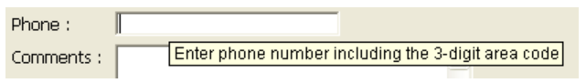

## Dica de Ajuda

This property allows associating help messages with active objects in your forms. Podem ser apresentados em tempo de execução:

> - The display delay and maximum duration of help tips can be controlled using the `Tips delay` and `Tips duration` selectors of the **[SET DATABASE PARAMETER](https://doc.4d.com/4Dv17R5/4D/17-R5/SET-DATABASE-PARAMETER.301-4128139.en.html)** command.
> - Help tips can be globally disabled or enabled for the application using the Tips enabled selector of the [**SET DATABASE PARAMETER**](https://doc.4d.com/4Dv17R5/4D/17-R5/SET-DATABASE-PARAMETER.301-4128139.en.html) command.

Você também pode:

- designate an existing help tip, previously specified in the [Help tips](https://doc.4d.com/4Dv17R5/4D/17-R5/Help-tips.200-4163423.en.html) editor of 4D.
- ou introduzir a mensagem de ajuda diretamente como uma cadeia de caracteres. Isto permite-lhe tirar partido da arquitetura XLIFF. You can enter an XLIFF reference here in order to display a message in the application language (for more information about XLIFF, refer to [Appendix B: XLIFF architecture](https://doc.4d.com/4Dv17R5/4D/17-R5/Appendix-B-XLIFF-architecture.300-4163748.en.html). You can also use 4D references ([see Using references in static text](https://doc.4d.com/4Dv17R5/4D/17-R5/Using-references-in-static-text.300-4163725.en.html)).

> \> > In macOS, displaying help tips is not supported in pop-up type windows.

#### Gramática JSON

|   Nome  | Tipo de dados | Valores possíveis                             |
| :-----: | :-----------: | --------------------------------------------- |
| tooltip |      text     | informações adicionais para ajudar um usuário |

#### Objectos suportados

[Button](button_overview.md) - [Button Grid](buttonGrid_overview.md) - [Check Box](checkbox_overview.md)  - [Drop-down List](dropdownList_Overview.md) - [Combo Box](comboBox_overview.md#overview) - [Hierarchical List](list_overview.md#overview) - [List Box Header](listbox_overview.md#list-box-headers) - [List Box Footer](listbox_overview.md#list-box-footers) - [Picture Button](pictureButton_overview.md) - [Picture Pop-up menu](picturePopupMenu_overview.md) - [Radio Button](radio_overview.md)

#### Outras funcionalidades de ajuda

You can also associate help messages with form objects in two other ways:

- ao nível da estrutura da base de dados (apenas campos). Neste caso, a dica de ajuda do campo é apresentada em todos os formulários em que aparece. For more information, refer to “Help Tips” in [Field properties](https://doc.4d.com/4Dv17R5/4D/17-R5/Field-properties.300-4163580.en.html).
- using the **[OBJECT SET HELP TIP](https://doc.4d.com/4Dv17R5/4D/17-R5/OBJECT-SET-HELP-TIP.301-4128221.en.html)** command, for the current process.

When different tips are associated with the same object in several locations, the following priority order is applied:

1. nível de estrutura (prioridade mais baixa)
2. nível do editor de formulários
3. **[OBJECT SET HELP TIP](https://doc.4d.com/4Dv17R5/4D/17-R5/OBJECT-SET-HELP-TIP.301-4128221.en.html)** command (highest priority)

#### Veja também

[Placeholder](properties_Entry.md#placeholder)
