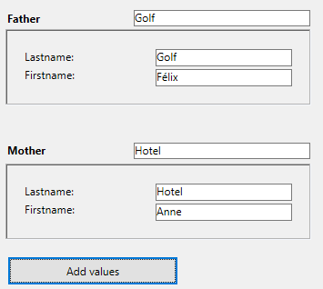

Um subformulário é um formulário incluído noutro formulário.

## Terminologia

Para definir claramente os conceitos implementados com subformulários, aqui estão algumas definições para certos termos utilizados:

- **Subform**: a form intended for inclusion in another form, itself called the parent form.
- **Parent form**: a form containing one or more subform(s).
- **Subform container**: an object included in the parent form, displaying an instance of the subform.
- **Subform instance**: the representation of a subform in a parent form. Esse conceito é importante porque é possível exibir várias instâncias do mesmo subformulário em um formulário pai.
- **List form**: instance of subform displayed as a list.
- **Detail form**: page-type input form associated with a list-type subform that can be accessed by double-clicking in the list.

## Sub formulários lista

Um subformulário lista permite que você insira, visualize e modifique dados em outras tabelas. Normalmente, os subformulários de lista são usados em bancos de dados nos quais você estabeleceu relações Um para Muitos. Um subformulário de lista em um formulário em uma tabela One relacionada permite visualizar, inserir e modificar dados em uma tabela Many relacionada. Você pode ter vários subformulários provenientes de tabelas diferentes no mesmo formulário. No entanto, não é possível colocar dois subformulários que pertençam à mesma tabela na mesma página de um formulário.

Por exemplo, um banco de dados do gerenciador de contatos pode usar um subformulário de lista para exibir todos os números de telefone de um determinado contato. Embora os números de telefone apareçam na tela Contatos, as informações são, na verdade, armazenadas em uma tabela relacionada. Usando uma relação de um para muitos, esse design de banco de dados facilita o armazenamento de um número ilimitado de números de telefone por contato. Com as relações automáticas, você pode apoiar a entrada de dados diretamente na tabela Many relacionada sem programação.

Embora os subformulários de lista geralmente estejam associados a muitas tabelas, uma instância de subformulário pode exibir os registros de qualquer outra tabela do banco de dados.

Também é possível permitir que o usuário introduza dados no formulário Lista.
Dependendo da configuração do subformulário, o usuário pode exibir o formulário detalhado clicando duas vezes em um subregistro ou usando os comandos para adicionar e editar subregistros.

> 4D offers three standard actions to meet the basic needs for managing subrecords: `Edit Subrecord`, `Delete Subrecord`, and `Add Subrecord`. Quando o formulário incluir várias instâncias de subformulários, a ação será aplicada ao subformulário que tiver o foco.

## Subformulários em página

Os subformulários de página podem exibir os dados do subregistro atual ou qualquer tipo de valor pertinente, dependendo do contexto (variáveis, figuras etc.). Uma das principais vantagens do uso de subformulários de página é que eles podem incluir funcionalidades avançadas e interagir diretamente com o formulário pai (widgets). Os subformulários de página também têm suas próprias propriedades e eventos específicos; você pode gerenciá-los inteiramente por meio de programação.

The page subform uses the input form indicated by the [Detail Form](properties_Subform.md#detail-form) property. Ao contrário de um subformulário de lista, o formulário usado pode vir da mesma tabela que o formulário pai. Também é possível usar um formulário de projeto. Quando executado, um subformulário de página tem as mesmas características de exibição padrão de um formulário de entrada.

> Os widgets 4D são objetos compostos predefinidos com base em subformulários de página. They are described in detail in a separate manual, [4D Widgets](https://doc.4d.com/4Dv19/4D/19/4D-Widgets.100-5462909.en.html).

### Utilizar a variável ou expressão ligada

You can bind [a variable or an expression](properties_Object.md#variable-or-expression) to a subform container object. Isso é muito útil para sincronizar valores do formulário principal e de seus subformulários.

By default, 4D creates a variable or expression of [object type](properties_Object.md#expression-type) for a subform container, which allows you to share values in the context of the subform using the `Form` command ([see below](#using-the-subform-bound-object)). However, you can use a variable or expression of any scalar type (time, integer, etc.) especially if you only need to share a single value:

- Define a bound variable or expression of a scalar type and call the `OBJECT Get subform container value` and `OBJECT SET SUBFORM CONTAINER VALUE` commands to exchange values when [On Bound Variable Change](../Events/onBoundVariableChange.md) or [On Data Change](../Events/onDataChange.md) form events occur. Esta solução é recomendada para sincronizar um único valor.
- Define a bound variable or expression of the **object** type and use the `Form` command to access its properties from the subform. Esta solução é recomendada para sincronizar vários valores.

### Sincronização do formulário principal e do subformulário (valor único)

A vinculação da mesma variável ou expressão ao contêiner do subformulário e a outros objetos do formulário pai permite vincular os contextos do formulário pai e do subformulário para dar os toques finais em interfaces sofisticadas. Imagine a subform that contains a clock displaying a static time, inserted into a parent form containing an [input area](input_overview.md):


In the parent form, both objects (input area and subform container) **have the same value as _Variable or Expression_**. It can be a variable (e.g. `parisTime`), or an expression (e.g. `Form.parisTime`).

:::info

To display a static time, you must use the appropriate [data type](properties_DataSource.md#data-type-expression-type) for the [variable or expression](properties_Object.md#variable-or-expression):

- If you use a variable (e.g. `parisTime`), it must be of the `text` or `time` type.
- If you use an expression (e.g. `Form.myValue`), it must contain a `text` value.

O valor do texto deve ter o formato "hh:mm:ss".

:::

In the subform, the clock object is managed through the `Form.clockValue` property.

#### Atualização do conteúdo de um subformulário

Caso 1: O valor da variável da forma pai ou expressão é modificado e essa modificação deve ser passado para um subformulário.

`parisTime` or `Form.parisTime` changes to "12:15:00" in the parent form, either because the user entered it, or because it was updated dynamically (via the `String(Current time)` statement for example). This triggers the [On Bound Variable Change](../Events/onBoundVariableChange.md) event in the subform's Form method.

O seguinte código é executado:

```4d
// Subform form method
If (Form event code=On Bound Variable Change) //bound variable or expression was modified in the parent form
	Form.clockValue:=OBJECT Get subform container value //synchonize the local value
End if
```

It updates the value of `Form.clockValue` in the subform:


The [On Bound Variable Change](../Events/onBoundVariableChange.md) form event is generated:

- assim que um valor for atribuído à variável/expressão do formulário pai, mesmo que o mesmo valor seja reatribuído
- se o subformulário pertence à página formulário atual ou à página 0.

Note that, as in the above example, it is preferable to use the `OBJECT Get subform container value` command which returns the value of the expression in the subform container rather than the expression itself because it is possible to insert several subforms in the same parent form (for example, a window displaying different time zones contains several clocks).

Modificar a variável ou expressão vinculada aciona eventos de formulário que permitem sincronizar os valores do formulário pai e do subformulário:

- Use the [On Bound Variable Change](../Events/onBoundVariableChange.md) form event to indicate to the subform (form method of subform) that the variable or expression was modified in the parent form.
- Use the [On Data Change](../Events/onDataChange.md) form event to indicate to the subform container that the variable or expression value was modified in the subform.

#### Atualização do conteúdo de um formulário pai

Caso 2: o conteúdo do subformulário é modificado e esta modificação deve ser transmitida ao formulário principal.

Inside the subform, the button changes the value of the `Form.clockValue` expression of type Text attached to the clock object. This triggers the [On Data Change](../Events/onDataChange.md) form event inside the clock object (this event must be selected for the object), which updates the `Form.parisTime` value in the main form.

O seguinte código é executado:

```4d
// subform clock object method
If (Form event code=On Data Change) //whatever the way the value is changed
	OBJECT SET SUBFORM CONTAINER VALUE(Form.clockValue) //Push the value to the container
End if
```


Everytime the value of `Form.clockValue` changes in the subform, `parisTime` or `Form.parisTime` in the subform container is also updated.

> Se o valor da variável ou expressão é definido em vários locais, o 4D usa o valor que foi carregado por último. Ele aplica a seguinte ordem de carregamento: 1 - Métodos de objeto do subformulário, 2 - Método de formulário do subformulário, 3 - Métodos de objeto do formulário pai, 4 - Método de formulário do formulário pai

### Sincronização formulário principal e do subformulário (valores múltiplos)

By default, 4D binds a variable or expression of [object type](properties_Object.md#expression-type) to each subform. O conteúdo desse objeto pode ser lido e/ou modificado a partir do formulário pai e do subformulário, o que permite compartilhar vários valores em um contexto local.

When bound a the subform container, this object is returned by the `Form` command directly in the subform. Como os objetos são sempre passados por referência, se o usuário modificar o valor de uma propriedade no subformulário, ele será automaticamente salvo no próprio objeto e, portanto, estará disponível para o formulário pai. Por outro lado, se uma propriedade do objeto for modificada pelo usuário no formulário pai ou por programação, ela será automaticamente atualizada no subformulário. Não é necessária qualquer gestão de eventos.

For example, in a subform, inputs are bound to the `Form` object properties (of the subform form):


No formulário pai, o subformulário é apresentado duas vezes. Each subform container is bound to an expression which is a property of the `Form` object (of the parent form):


The button only creates `mother` and `father` properties in the parent's `Form` object:

```4d
//Método de objeto do botão Adicionar valores
Form.mother:=New object("lastname"; "Hotel"; "firstname"; "Anne")
Form.father:=New object("lastname"; "Golf"; "firstname"; "Félix")
```

Quando você executa o formulário e clica no botão, você vê que todos os valores são exibidos corretamente:



Se você modificar um valor tanto no formulário principal quanto no subformulário, ele será automaticamente atualizado no outro formulário porque o mesmo objeto é utilizado:


### Utilização de ponteiros (compatibilidade)

In versions prior to 4D v19 R5, synchronization between parent forms and subforms was handled through **pointers**. Por exemplo, para atualizar um objeto subformulário, você pode chamar o seguinte código:

```4d
// Subform form method
If (Form event code=On Bound Variable Change) 
	ptr:=OBJECT Get pointer(Object subform container) 
	clockValue:=ptr-> 
End if
```

**This principle is still supported for compatibility but is now deprecated since it does not allow binding expressions to subforms.** It should no longer be used in your developments. In any cases, we recommend to use the [`Form` command](#synchronizing-parent-form-and-subform-multiple-values) or the [`OBJECT Get subform container value` and `OBJECT SET SUBFORM CONTAINER VALUE` commands](#synchronizing-parent-form-and-subform-single-value) to synchronize form and subform values.

### Programação entre formulários avançada

A comunicação entre o formulário pai e as instâncias do subformulário pode exigir mais do que a troca de valores por meio da variável vinculada. Na verdade, você pode querer atualizar as variáveis nos subformulários de acordo com as ações realizadas no formulário principal e vice-versa. Se usarmos o exemplo anterior do subformulário do tipo "relógio dinâmico", podemos querer definir um ou mais horários de alarme para cada relógio.

4D implementou os seguintes mecanismos para atender a essas necessidades:

- Calling of a container object from the subform using the `CALL SUBFORM CONTAINER` command
- Execution of a method in the context of the subform via the `EXECUTE METHOD IN SUBFORM` command

> The `GOTO OBJECT` command looks for the destination object in the parent form even if it is executed from a subform.

#### Comando CALL SUBFORM CONTAINER

The `CALL SUBFORM CONTAINER` command lets a subform instance send an [event](../Events/overview.md) to the subform container object, which can then process it in the context of the parent form. O evento é recebido no método do objeto contentor. Ele pode estar na origem de qualquer evento detectado pelo subformulário (clique, arrastar e soltar etc.).

O código do evento não tem restrições (por exemplo, 20000 ou -100). You can use a code that corresponds to an existing event (for example, 3 for `On Validate`), or use a custom code. No primeiro caso, você só pode usar eventos que você verificou na Lista de Propriedades para sub-formulários. No segundo caso, o código não deve corresponder a nenhum evento de formulário existente. Recomenda-se usar um valor negativo para ter certeza de que esse código não será usado por 4D em versões futuras.

For more information, refer to the description of the `CALL SUBFORM CONTAINER` command.

#### Comando EXECUTE METHOD IN SUBFORM

The `EXECUTE METHOD IN SUBFORM` command lets a form or one of its objects request the execution of a method in the context of the subform instance, which gives it access to the subform variables, objects, etc. Este método também pode receber parâmetros.

Este mecanismo é ilustrado no diagrama seguinte:


For more information, refer to the description of the `EXECUTE METHOD IN SUBFORM` command.

## Propriedades compatíveis

[Border Line Style](properties_BackgroundAndBorder.md#border-line-style) - [Bottom](properties_CoordinatesAndSizing.md#bottom) - [Class](properties_Object.md#css-class) - [Detail Form](properties_Subform.md#detail-form) - [Double click on empty row](properties_Subform.md#double-click-on-empty-row) - [Double click on row](properties_Subform.md#double-click-on-row) - [Enterable in list](properties_Subform.md#enterable-in-list) - [Expression Type](properties_Object.md#expression-type) - [Focusable](properties_Entry.md#focusable) - [Height](properties_CoordinatesAndSizing.md#height) -
[Hide focus rectangle](properties_Appearance.md#hide-focus-rectangle) -
[Horizontal Scroll Bar](properties_Appearance.md#horizontal-scroll-bar) - [Horizontal Sizing](properties_ResizingOptions.md#horizontal-sizing) - [Left](properties_CoordinatesAndSizing.md#left) - [List Form](properties_Subform.md#list-form) - [Method](properties_Action.md#method) - [Object Name](properties_Object.md#object-name) - [Print Frame](properties_Print.md#print-frame) - [Right](properties_CoordinatesAndSizing.md#right) - [Selection mode](properties_Subform.md#selection-mode) - [Source](properties_Subform.md#source) - [Top](properties_CoordinatesAndSizing.md#top) - [Type](properties_Object.md#type) - [Variable or Expression](properties_Object.md#variable-or-expression) - [Vertical Scroll Bar](properties_Appearance.md#vertical-scroll-bar) - [Vertical Sizing](properties_ResizingOptions.md#vertical-sizing) - [Visibility](properties_Display.md#visibility) - [Width](properties_CoordinatesAndSizing.md#width)
