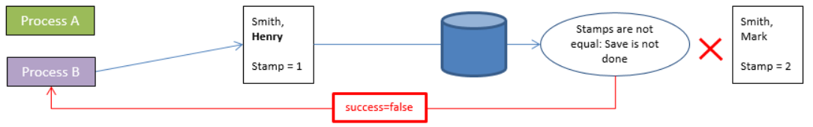

In ORDA, you access data through [entities](dsMapping.md#entity) and [entity selections](dsMapping.md#entity-selection). Estes objectos permitem-lhe criar, atualizar, consultar ou ordenar os dados do datastore.

## Criar uma entidade

Existem duas maneiras de criar uma nova entidade numa dataclass:

- Since entities are references to database records, you can create entities by creating records using the 4D language and then reference them with ORDA functions such as [`entity.next()`](../API/EntityClass.md#next) or [`entitySelection.first()`](../API/EntitySelectionClass.md#first).
- You can also create an entity using the [`dataClass.new()`](../API/DataClassClass.md#new) function.

Tenha em atenção que a entidade só é criada na memória. If you want to add it to the datastore, you must call the [`entity.save()`](../API/EntityClass.md#save) function.

Os atributos da entidade estão diretamente disponíveis como propriedades do objeto entidade. For more information, please refer to [Using entity attributes](#using-entity-attributes).

Por exemplo, se quisermos criar uma nova entidade na classe de dados "Employee" no repositório de dados atual com "John" e "Dupont" atribuídos aos atributos firstname e name:

```4d
var $myEntity : cs. EmployeeEntity
$myEntity:=ds. Employee.new() //Create a new object of the entity type
$myEntity.name:="Dupont" //assign 'Dupont' to the 'name' attribute
$myEntity.firstname:="John" //assign 'John' to the 'firstname' attribute
$myEntity.save() //save the entity
```

> Uma entidade é definida apenas no processo em que foi criada. Não é possível, por exemplo, armazenar uma referência a uma entidade em uma variável interprocessos e usá-la em outro processo.

## Entidades e referências

Uma entidade contém uma referência a um registo 4D. Entidades diferentes podem fazer referência ao mesmo registo 4D. Além disso, como uma entidade pode ser armazenada em uma variável de objeto 4D, diferentes variáveis podem conter uma referência à mesma entidade.

Se executar o seguinte código:

```4d
 var $e1; $e2 : cs. EmployeeEntity
 $e1:=ds. Employee.get(1) //access the employee with ID 1
 $e2:=$e1
 $e1.name:="Hammer"
  //both variables $e1 and $e2 share the reference to the same entity
  //$e2.name contains "Hammer"
```

Este facto é ilustrado pelo gráfico seguinte:


Agora, se executar:

```4d
 var $e1; $e2 : cs. EmployeeEntity
 $e1:=ds. Employee.get(1)
 $e2:=ds. Employee.get(1)
 $e1.name:="Hammer"
  //variable $e1 contains a reference to an entity
  //variable $e2 contains another reference to another entity
  //$e2.name contains "smith"
```

Este facto é ilustrado pelo gráfico seguinte:


Note-se, no entanto, que as entidades se referem ao mesmo registo. In all cases, if you call the `entity.save( )` method, the record will be updated (except in case of conflict, see [Entity locking](#entity-locking)).

In fact, `$e1` and `$e2` are not the entity itself, but a reference to the entity. Isso significa que você pode passá-los diretamente para qualquer função ou método, e ele funcionará como um ponteiro, e mais rápido do que um ponteiro 4D. Por exemplo:

```4d
 For each($entity;$selection)
    do_Capitalize($entity)
 End for each
```

E o método é:

```4d
 $entity:=$1
 $name:=$entity.lastname
 If(Not($name=Null))
    $name:=Uppercase(Substring($name;1;1))+Lowercase(Substring($name;2))
 End if
 $entity.lastname:=$name
```

You can handle entities like any other object in 4D and pass their references directly as [parameters](Concepts/parameters.md).

:::info

Com as entidades, não há o conceito de "registro atual" como na linguagem 4D. Pode utilizar tantas entidades quantas as necessárias, em simultâneo. There is also no automatic lock on an entity (see [Entity locking](#entity-locking)). When an entity is loaded, it uses the [lazy loading](glossary.md#lazy-loading) mechanism, which means that only the needed information is loaded. No entanto, no cliente/servidor, a entidade pode ser carregada automaticamente de forma direta, se necessário.

:::

## Utilização de atributos de entidades

Os atributos de entidade armazenam dados e mapeiam os campos correspondentes na tabela correspondente.

- attributes of the **storage** kind can be set or get as simple properties of the entity object,
- attributes of the **relatedEntity** kind will return an entity,
- attributes of the **relatedEntities** kind will return an entity selection,
- attributes of the **computed** and **alias** kind can return any type of data, depending on how they are configured.

:::info

For more information on the attribute kind, please refer to the [Storage and Relation attributes](dsMapping.md#storage-and-relation-attributes) paragraph.

:::

Por exemplo, para obter e definir um valor de atributo de armazenamento do tipo string:

```4d
 $entity:=ds.Employee.get(1) //obter atributo de funcionário com ID 1
 $name:=$entity.lastname //obter o nome do funcionário, por exemplo, "Smith"
 $entity.lastname:="Jones" //definir o nome do funcionário
 $entity.save() //salvar as modificações
```

> Database Blob fields ([scalar blobs](Concepts/dt_blob.md) are automatically converted to and from blob object attributes ([`4D.Blob`](Concepts/dt_blob.md)) when handled through ORDA. Ao salvar um atributo blob objeto, tenha em mente isso, Ao contrário do tamanho do objeto blob limitado apenas pela memória disponível, o tamanho do campo Blob é limitado a 2GB.

O acesso a um atributo relacionado depende do tipo de atributo. Por exemplo, com a seguinte estrutura:


É possível aceder aos dados através do(s) objeto(s) relacionado(s):

```4d
 $entity:=ds. Project.all().first().theClient //get the Company entity associated to the project
 $EntitySel:=ds. Company.all().first().companyProjects //get the selection of projects for the company
```

Note that both _theClient_ and _companyProjects_ in the above example are primary relation attributes and represent a direct relationship between the two dataclasses. No entanto, os atributos de relação também podem ser criados com base em caminhos através de relações em vários níveis, incluindo referências circulares. Por exemplo, considere a seguinte estrutura:


Cada trabalhador pode ser um gestor e pode ter um gestor. Para obter o gerente do gerente de um funcionário, você pode simplesmente escrever:

```4d
 $myEmp:=ds. Employee.get(50)
 $manLev2:=$myEmp.manager.manager.lastname
```

### Atribuição de arquivos a atributos imagem ou blob

Você pode armazenar imagens em atributos de imagem; da mesma forma, você pode armazenar qualquer dado binário em atributos de blob.

ORDA lets you assign either the data itself, i.e. an image or a blob object, or a **reference to a file** containing the data to the attribute. Somente o caminho do arquivo é salvo na entidade.

Graças a esse recurso, você pode reutilizar a mesma imagem em várias entidades sem duplicá-la, organizar os arquivos da maneira que desejar ou usá-los fora do 4D. Além disso, você pode controlar o tamanho do arquivo de dados.

A referência do arquivo pode ser:

- um objeto 4D.File
- um caminho no formato POSIX

Exemplo:

```4d
Function createCompany($name : Text; $logo : 4D.File)

	var $company : cs.CompanyEntity
	$company:=ds.Company.new()

	$company.name:=$name
		//assignment using a file object
	$company.logo:=$logo
		//assignment using a path
	$company.datablob:="/RESOURCES/"+$name+"/data.bin"
	$company.save()
```

Independentemente de como o atributo é atribuído (dados em si ou referência a um arquivo), o acesso de leitura ao atributo é transparente do ponto de vista do usuário.

O arquivo não precisa existir no disco no momento da atribuição (nenhum erro é retornado nesse caso). Se o arquivo referenciado não for encontrado quando o atributo for lido, será retornado um valor nulo.

:::tip

4D carrega imagens e dados em um cache local. Se o arquivo referenciado for modificado após ter sido carregado, você deverá reatribuir o arquivo para que a modificação seja levada em conta no aplicativo.

:::

:::note

A atribuição de referência de arquivo só é suportada no modo local (4D Server ou 4D single-user). Será gerado um erro se a atribuição for feita remotamente ou por meio de uma solicitação REST.

:::

### Atribuição de valores a atributos de relação

Na arquitetura ORDA, os atributos de relação contêm diretamente dados relacionados a entidades:

- An N->1 type relation attribute (**relatedEntity** kind) contains an entity
- A 1->N type relation attribute (**relatedEntities** kind) contains an entity selection

Vejamos a seguinte estrutura (simplificada):


Neste exemplo, uma entidade na classe de dados "Employee" contém um objeto do tipo Entity no atributo "employer" (ou um valor nulo). Uma entidade na classe de dados "Company" contém um objeto do tipo EntitySelection no atributo "staff" (ou um valor nulo).

> Na ORDA, a propriedade Automática ou Manual das relações não tem efeito.

Para atribuir um valor diretamente ao atributo "employer", você deve passar uma entidade existente da classe de dados "Company". Por exemplo:

```4d
 $emp:=ds.Employee.new() // crie um funcionário
 $emp.lastname:="Smith" // atribua um valor a um atributo
 $emp. mployer:=ds.Company.query("nome =:1";"4D")[0]  //atribuir uma entidade da empresa
 $emp.save()
```

Você também pode obter diretamente a entidade relacionada através de sua chave primária (Número ou texto). Por exemplo:

```4d
 $emp:=ds.Employee.new()
 $emp.lastname:="Wesson"
 $emp.employer:=ds.Company.get(2)
  //obtém a entidade Company com o valor de chave primária 2
  //atribui ao funcionário
 $emp.save()
```

Isso é particularmente útil quando você está importando grandes quantidades de dados de um banco de dados relacional. Este tipo de importação geralmente contém uma coluna "ID", que faz referência a uma chave primária que você pode atribuir diretamente a um atributo de relação.

Você pode atribuir ou modificar o valor de um "1" atributo da entidade relacionada a partir do dataclass "N" diretamente através do atributo relacionado. Por exemplo, se você deseja modificar o atributo de nome de uma entidade relacionada da Empresa de uma entidade funcional, você pode escrever:

```code4d
 $emp:=ds.Employee.get(2) // load the Employee entity with primary key 2
 $emp.employer.name:="4D, Inc." //modify the name attribute of the related Company
 $emp.employer.save() //save the related attribute
  //the related entity is updated
```

## Criar uma selecção de entidade

You can create an object of type [entity selection](dsMapping.md#entity-selection) as follows:

- Querying the entities [in a dataclass](API/DataClassClass.md#query) or in an [existing entity selection](API/EntitySelectionClass.md#query);
- Using the [`.all()`](API/DataClassClass.md#all) dataclass function to select all the entities in a dataclass;
- Using the [`Create entity selection`](../API/EntitySelectionClass.md#create-entity-selection) command or the [`.newSelection()`](API/DataClassClass.md#newselection) dataclass function to create a blank entity selection;
- Using the [`.copy()`](API/EntitySelectionClass.md#copy) function to duplicate an existing entity selection;
- Using one of the various functions from the [Entity selection class](API/EntitySelectionClass.md) that returns a new entity selection, such as [`.or()`](API/EntitySelectionClass.md#or);
- Utilizando um atributo de relação do tipo "entidades relacionadas" (ver abaixo).

Você pode criar e usar simultaneamente tantas seleções de entidades diferentes quanto desejar para uma classe de dados. Lembre-se de que uma seleção de entidade contém apenas referências a entidades. Seleções diferentes de entidades podem conter referências para as mesmas entidades.

:::note

You can filter which entities must be included in entity selections for a dataclass depending on any business rules, thanks to the [restricted entity selection](#restricting-entity-selections) feature.

:::

### Entity selections partilháveis ou alteráveis

An entity selection can be **shareable** (readable by multiple processes, but not alterable after creation) or **alterable** (supports the [`.add()`](API/EntitySelectionClass.md#add) function, but only usable by the current process).

#### Propriedades

A **shareable** entity selection has the following characteristics:

- ele pode ser armazenado em um objeto compartilhado ou em uma coleção compartilhada e pode ser passado como parâmetro entre vários processos ou trabalhadores;
- it can be stored in several shared objects or collections, or in a shared object or collection which already belongs to a group (it does not have a _locking identifier_);
- não permite a adição de novas entidades. A tentativa de adicionar uma entidade a uma seleção de entidade compartilhável acionará um erro (1637 - Esta seleção de entidade não pode ser alterada). To add an entity to a shareable entity selection, you must first transform it into a non-shareable entity selection using the [`.copy()`](API/EntitySelectionClass.md#copy) function, before calling [`.add()`](API/EntitySelectionClass.md#add).

> Most entity selection functions (such as [`.slice()`](API/EntitySelectionClass.md#slice), [`.and()`](API/EntitySelectionClass.md#and)...) support shareable entity selections since they do not need to alter the original entity selection (they return a new one).

An **alterable** entity selection has the following characteristics:

- não pode ser compartilhado entre processos, nem armazenado em um objeto ou coleção compartilhada. A tentativa de armazenar uma seleção de entidade não compartilhável em um objeto ou coleção compartilhada acionará um erro (-10721 - Tipo de valor não suportado em um objeto compartilhado ou coleção compartilhada);
- it accepts the addition of new entities, i.e. it is supports the [`.add()`](API/EntitySelectionClass.md#add) function.

#### Como é que são definidos?

The **shareable** or **alterable** nature of an entity selection is defined when the entity selection is created (it cannot be modified afterwards). You can know the nature of an entity selection using the [.isAlterable()](API/EntitySelectionClass.md#isalterable) function or the `OB Is shared` command.

A new entity selection is **shareable** in the following cases:

- the new entity selection results from an ORDA class function applied to a dataClass: [dataClass.all()](API/DataClassClass.md#all), [dataClass.fromCollection()](API/DataClassClass.md#fromcollection), [dataClass.query()](API/DataClassClass.md#query),
- the new entity selection is based upon a relation [entity._attributeName_](API/EntityClass.md#attributename) (e.g. "company.employees") when _attributeName_ is a one-to-many related attribute but the entity does not belong to an entity selection.
- the new entity selection is explicitely copied as shareable with [entitySelection.copy()](API/EntitySelectionClass.md#copy) or `OB Copy` (i.e. with the `ck shared` option).

Exemplo:

```4d
var $myComp : cs.CompanyEntity
var $employees : cs.EmployeeSelection
$myComp:=ds.Company.get(2) //$myComp does not belong to an entity selection
$employees:=$myComp.employees //$employees is shareable
```

A new entity selection is **alterable** in the following cases:

- the new entity selection created blank using the [dataClass.newSelection()](API/DataClassClass.md#newselection) function or `Create entity selection` command,
- the new entity selection is explicitely copied as alterable with [entitySelection.copy()](API/EntitySelectionClass.md#copy) or `OB Copy` (i.e. without the `ck shared` option).

Exemplo:

```4d
var $toModify : cs.CompanySelection
$toModify:=ds.Company.all().copy() //$toModify is alterable
```

A new entity selection **inherits** from the original entity selection nature in the following cases:

- the new entity selection results from one of the various ORDA class functions applied to an existing entity selection ([.query()](API/EntitySelectionClass.md#query), [.slice()](API/EntitySelectionClass.md#slice), etc.) .
- a nova entity selection é baseada numa relação:
  - [entity._attributeName_](API/EntityClass.md#attributename) (e.g. "company.employees") when _attributeName_ is a one-to-many related attribute and the entity belongs to an entity selection (same nature as [.getSelection()](API/EntityClass.md#getselection) entity selection),
  - [entitySelection._attributeName_](API/EntitySelectionClass.md#attributename) (e.g. "employees.employer") when _attributeName_ is a related attribute (same nature as the entity selection),
  - [.extract()](API/EntitySelectionClass.md#extract) when the resulting collection contains entity selections (same nature as the entity selection).

Exemplos:

```4d
var $highSal; $lowSal : cs.EmployeeSelection
var $comp; $comp2 : cs.Company

$highSal:=ds.Employee.query("salary >= :1"; 1000000)   

	//$highSal is shareable because of the query on dataClass
$comp:=$highSal.employer //$comp is shareable because $highSal is shareable

$lowSal:=ds.Employee.query("salary <= :1"; 10000).copy()
	//$lowSal is alterable because of the copy()
$comp2:=$lowSal.employer //$comp2 is alterable because $lowSal is alterable
```

:::note Entity selections returned from the server

In client/server architecture, entity selections returned from the server are always shareable on the client, even if [`copy()`](API/EntitySelectionClass.md#copy) was called on the server. To make such an entity selection alterable on the client, you need to execute [`copy()`](API/EntitySelectionClass.md#copy) on the client side. Exemplo:

```4d
	//a function is always executed on the server
exposed Function getSome() : cs.MembersSelection
    return This.query("ID >= :1"; 15).orderBy("ID ASC")

	//in a method, executes on the remote side
var $result : cs.MembersSelection
var $alterable : Boolean
$result:=ds.Members.getSome() //$result is shareable
$alterable:=$result.isAlterable() //False

$result:=ds.Members.getSome().copy() // $result is now alterable
$alterable:=$result.isAlterable() // True
```

:::

#### Partilhar uma seleção de entidade entre processos (exemplo)

You work with two entity selections that you want to pass to a worker process so that it can send mails to appropriate persons:

```4d

var $paid; $unpaid : cs.InvoicesSelection
//We get entity selections for paid and unpaid invoices
$paid:=ds.Invoices.query("status=:1"; "Paid")
$unpaid:=ds.Invoices.query("status=:1"; "Unpaid")

//We pass entity selection references as parameters to the worker
CALL WORKER("mailing"; "sendMails"; $paid; $unpaid)

```

The `sendMails` method:

```4d

 #DECLARE ($paid : cs.InvoicesSelection; $unpaid : cs.InvoicesSelection)
 var $invoice : cs.InvoicesEntity

 var $server; $transporter; $email; $status : Object

  //Prepare emails
 $server:=New object()
 $server.host:="exchange.company.com"
 $server.user:="myName@company.com"
 $server.password:="my!!password"
 $transporter:=SMTP New transporter($server)
 $email:=New object()
 $email.from:="myName@company.com"

  //Loops on entity selections
 For each($invoice;$paid)
    $email.to:=$invoice.customer.address // email address of the customer
    $email.subject:="Payment OK for invoice # "+String($invoice.number)

    $status:=$transporter.send($email)
 End for each

 For each($invoice;$unpaid)
    $email.to:=$invoice.customer.address // email address of the customer
    $email.subject:="Please pay invoice # "+String($invoice.number)
    $status:=$transporter.send($email)
 End for each
```

### Selecções de entidades e atributos de armazenamento

All storage attributes (text, number, boolean, date) are available as properties of entity selections as well as entities. When used in conjunction with an entity selection, a scalar attribute returns a collection of scalar values. Por exemplo:

```4d
var $locals : cs.PersonSelection
var $localEmails : Collection
$locals:=ds.Person.query("city = :1";"San Jose") //entity selection of people
$localEmails:=$locals.emailAddress //collection of email addresses (strings)
```

This code returns in _$localEmails_ a collection of email addresses as strings.

### Selecções de entidades e atributos de relações

In addition to the variety of ways you can query, you can also use relation attributes as properties of entity selections to return new entity selections. Por exemplo, considere a seguinte estrutura:


```4d
var $myParts : cs.PartSelection
var $myInvoices : cs.InvoiceSelection
$myParts:=ds.Part.query("ID < 100") //Return parts with ID less than 100
$myInvoices:=$myParts.invoiceItems.invoice
  //All invoices with at least one line item related to a part in $myParts
```

The last line will return in _$myInvoices_ an entity selection of all invoices that have at least one invoice item related to a part in the entity selection myParts. Quando se utiliza um atributo de relação como propriedade de uma seleção de entidades, o resultado é sempre outra seleção de entidades, mesmo que só se devolva uma entidade. Quando se utiliza um atributo de relação como propriedade de uma seleção de entidades, o resultado é sempre outra seleção de entidades, mesmo que só se devolva uma entidade.

## Restricting entity selections

In ORDA, you can create filters to restrict access to entities of any of your dataclasses. Once implemented, a filter is automatically applied whenever the entities of the dataclass are accessed either by **ORDA class functions** such as [`all()`](../API/DataClassClass.md#all) or [`query()`](../API/EntitySelectionClass.md#query), or by the [**REST API**](../category/api-dataclass) (which involves the [Data Explorer](../Admin/dataExplorer.md) and [remote datastores](remoteDatastores.md)).

A filter creates a restricted view of the data, built upon any business rules such as current session user. For example, in an application used by salespersons to make deals with their customers, you can restrict the read customers to those managed by the authenticated salesperson.

:::info

Filters apply to **entities**. If you want restrict access to a **dataclass** itself or to one or more of its **attributes**, you might consider using [session privileges](privileges.md) which are more appropriate in this case.

:::

### Como definir um filtro restrito

You create a filter for a dataclass by defining an `event restrict` function in the [**dataclass class**](dsMapping.md#dataclass-class) of the dataclass. The filter is then automatically enabled.

### `Function event restrict`

#### Sintaxe

```4d
Function event restrict() -> $result : cs.*DataClassName*Selection
// code
```

This function is called whenever an entity selection or an entity of the dataclass is requested. The filter is run once, when the entity selection is created.

The filter must return an entity selection of the dataclass. It can be an entity selection built upon a query, stored in the [`Storage`], etc.

:::note

For performance reasons, we recommend to use **indexed attributes** in the definition of the filter.

:::

The function must return a valid entity selection of the dataclass. No filter is applied (all entities corresponding of the initial request are returned) if:

- the function returns **null**,
- the function returns **undefined**,
- the function does not return a valid entity selection.

#### Exemplo

When accessed from a web or REST request, we want the Customers dataclass to only expose customers belonging to the identified sales person. During the authentication phase, the sales person is stored in the `Session` object. Other types of requests are also handled.

```4d
Class extends DataClass


Function event restrict() : cs.CustomersSelection


    	//We work in a web or REST context
    If (Session#Null)

        Case of
                // Only return the customers of the authenticated sales person stored in the session
            : (Session.storage.salesInfo#Null)
                return This.query("sales.internalId = :1"; Session.storage.salesInfo.internalId)

                //Data explorer - No filter is applied
            : (Session.hasPrivilege("WebAdmin"))
                return Null
            Else
                //No customers can be read
                return This.newSelection()

        End case

    Else // We work in client server
        return This.query("sales.userName = :1"; Current user)
    End if
```

### Filter activation details

Filters apply to all ORDA or REST requests executed in your 4D projects (standalone and client/server architectures). A filter is activated as soon as the project is opened, i.e. it can be triggered in the `On Startup` database method.

:::info

Filters do not apply to legacy selections of records handled through the 4D interface or the 4D language (for example when calling `ALL RECORDS`).

:::

| Funções                                                                                                  | Comentário                                                                                                                                                                                                                                                                                                            |
| -------------------------------------------------------------------------------------------------------- | --------------------------------------------------------------------------------------------------------------------------------------------------------------------------------------------------------------------------------------------------------------------------------------------------------------------- |
| [dataclass.get()](../API/DataClassClass.md#get)                       | If the entity does not match the filter, `null` is returned                                                                                                                                                                                                                                                           |
| [entity.reload()](../API/EntityClass.md#reload)                       | Only in client/server and remote datastores                                                                                                                                                                                                                                                                           |
| [dataclass.all()](../API/DataClassClass.md#all)                       |                                                                                                                                                                                                                                                                                                                       |
| [dataclass.fromCollection()](../API/DataClassClass.md#fromcollection) | <li>In case of update, only entities matching the filter can be updated. If the collection refers to entities not matching the filter, they are created as new entities (if no duplicate PK error)</li><li>In case of creation, entities not matching the filter are created but will not be read after creation</li> |
| [entitySelection.and()](../API/EntitySelectionClass.md#and)           | Only entities matching the filter are returned                                                                                                                                                                                                                                                                        |
| [entitySelection.or()](../API/EntitySelectionClass.md#or)             | Only entities matching the filter are returned                                                                                                                                                                                                                                                                        |
| [entitySelection.minus()](../API/EntitySelectionClass.md#minus)       | Only entities matching the filter are returned                                                                                                                                                                                                                                                                        |
| [dataclass.query()](../API/DataClassClass.md#query)                   |                                                                                                                                                                                                                                                                                                                       |
| [entitySelection.query()](../API/EntitySelectionClass.md#query)       |                                                                                                                                                                                                                                                                                                                       |
| [entitySelection.attributeName](../API/EntitySelectionClass.md#attributename)            | Filter applied if _attributeName_ is a related entity or related entities of a filtered dataclass (including alias or computed attribute)                                                                                                                                                          |
| [entity.attributeName](../API/EntityClass.md#attributename)                              | Filter applied if _attributeName_ corresponds to related entities of a filtered dataclass (including alias or computed attribute)                                                                                                                                                                  |
| [Create entity selection](../API/EntitySelectionClass.md#create-entity-selection)                        |                                                                                                                                                                                                                                                                                                                       |

Other ORDA functions accessing data do not directly trigger the filter, but they nevertheless benefit from it. For example, the [`entity.next()`](../API/EntityClass.md#next) function will return the next entity in the already-filtered entity selection. On the other hand, if the entity selection is not filtered, [`entity.next()`](../API/EntityClass.md#next) will work on non-filtered entities.

:::note

If there is an error in the filter at runtime, it is thrown as if the error came from the ORDA function itself.

:::

## Bloqueio de entidades

You often need to manage possible conflicts that might arise when several users or processes load and attempt to modify the same entities at the same time. Record locking is a methodology used in relational databases to avoid inconsistent updates to data. The concept is to either lock a record upon read so that no other process can update it, or alternatively, to check when saving a record to verify that some other process hasn’t modified it since it was read. The former is referred to as **pessimistic record locking** and it ensures that a modified record can be written at the expense of locking records to other users. The latter is referred to as **optimistic record locking** and it trades the guarantee of write privileges to the record for the flexibility of deciding write privileges only if the record needs to be updated. In pessimistic record locking, the record is locked even if there is no need to update it. In optimistic record locking, the validity of a record’s modification is decided at update time.

ORDA fornece-lhe dois modos de bloqueio de entidades:

- um modo automático "otimista", adequado à maioria das aplicações,
- um modo "pessimista" que permite bloquear as entidades antes do seu acesso.

### Bloqueio optimista automático

This automatic mechanism is based on the concept of "optimistic locking" which is particularly suited to the issues of web applications. Este conceito é caracterizado pelos seguintes princípios de funcionamento:

- All entities can always be loaded in read-write; there is no _a priori_ "locking" of entities.
- Cada entidade tem um carimbo de bloqueio interno incrementado sempre que é guardado.
- When a user or process tries to save an entity using the `entity.save( )` method, 4D compares the stamp value of the entity to be saved with that of the entity found in the data (in the case of a modification):
  - When the values match, the entity is saved and the internal stamp value is incremented.

  - When the values do not match, it means that another user has modified this entity in the meantime. A gravação não é efetuada e é devolvido um erro.

O diagrama seguinte ilustra o bloqueio otimista:

1. Two processes load the same entity.<br/><br/>

2. O primeiro processo modifica a entidade e valida a alteração. The `entity.save( )` method is called. The 4D engine automatically compares the internal stamp value of the modified entity with that of the entity stored in the data. Since they match, the entity is saved and its stamp value is incremented.<br/><br/>

3. O segundo processo também modifica a entidade carregada e valida as suas alterações. The `entity.save( )` method is called. Since the stamp value of the modified entity does not match the one of the entity stored in the data, the save is not performed and an error is returned.<br/><br/>

Isto também pode ser ilustrado pelo seguinte código:

```4d
 $person1:=ds.Person.get(1) //Reference to entity
 $person2:=ds.Person.get(1) //Other reference to same entity
 $person1.name:="Bill"
 $result:=$person1.save() //$result.success=true, change saved
 $person2.name:="William"
 $result:=$person2.save() //$result.success=false, change not saved
```

Neste exemplo, atribuímos a $person1 uma referência à entidade pessoa com uma chave de 1. De seguida, atribuímos outra referência da mesma entidade à variável $person2. Utilizando $person1, alteramos o primeiro nome da pessoa e guardamos a entidade. When we attempt to do the same thing with $person2, 4D checks to make sure the entity on disk is the same as when the reference in $person1 was first assigned. Since it isn't the same, it returns false in the success property and doesn’t save the second modification.

When this situation occurs, you can, for example, reload the entity from the disk using the `entity.reload()` method so that you can try to make the modification again. The `entity.save()` method also proposes an "automerge" option to save the entity in case processes modified attributes that were not the same.

> Record stamps are not used in **transactions** because only a single copy of a record exists in this context. Whatever the number of entities that reference a record, the same copy is modified thus `entity.save()` operations will never generate stamp errors.

### Bloqueio pessimista

É possível bloquear e desbloquear entidades a pedido quando se acede aos dados. When an entity is getting locked by a process, it is loaded in read/write in this process but it is locked for all other processes. The entity can only be loaded in read-only mode in these processes; its values cannot be edited or saved.

This feature is based upon two functions of the `Entity` class:

- [`entity.lock()`](../API/EntityClass.md#lock)
- [`entity.unlock()`](../API/EntityClass.md#unlock)

Para mais informações, consulte as descrições destas funções.

> Pessimistic locks can also be handled through the [REST API](../REST/$lock.md).

### Utilização simultânea de bloqueios clássicos 4D e bloqueios pessimistas ORDA

Using both classic and ORDA commands to lock records is based upon the following principles:

- A lock set with a classic 4D command on a record prevents ORDA to lock the entity matching the record.
- A lock set with ORDA on an entity prevents classic 4D commands to lock the record matching the entity.

Estes princípios são apresentados no diagrama seguinte:


**Transaction locks** also apply to both classic and ORDA commands. In a multiprocess or a multi-user application, a lock set within a transaction on a record by a classic command will result in preventing any other processes to lock entities related to this record (or conversely), until the transaction is validated or canceled.

- Example with a lock set by a classic command:<br/><br/>
- Example with a lock set by an ORDA function:<br/><br/>
