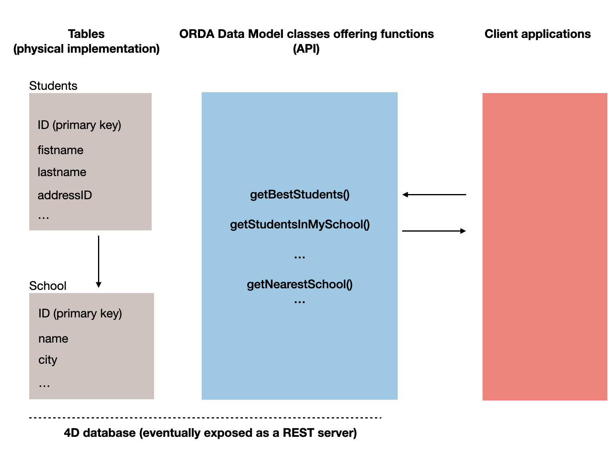
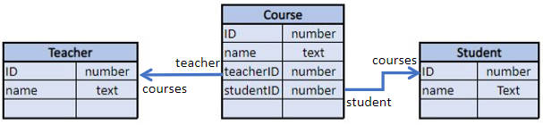
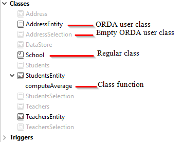

O ORDA permite-lhe criar funções de classe de alto nível acima do modelo de dados. Isto permite-lhe escrever código orientado para o negócio e "publicá-lo" tal como uma API. Datastore, classes de dados, seleções de entidades e entidades estão todos disponíveis como objetos de classe que podem conter funções.

For example, you could create a `getNextWithHigherSalary()` function in the `EmployeeEntity` class to return employees with a salary higher than the selected one. Seria tão simples como chamar:

```4d
$nextHigh:=ds. Employee.get(1).getNextWithHigherSalary()
```

Os desenvolvedores podem não só utilizar estas funções em datastores locais, mas também em arquiteturas cliente/servidor e remotas:

```4d
 //$cityManager é a referência de um datastore remoto
Form.comp.city:=$cityManager.City.getCityName(Form.comp.zipcode)
```

Graças a esta caraterística, toda a lógica comercial da sua aplicação 4D pode ser armazenada como uma camada independente para que possa ser facilmente mantida e reutilizada com um alto nível de segurança:

- É possível "esconder" a complexidade global da estrutura física subjacente e expor apenas funções compreensíveis e prontas a utilizar.

- Se a estrutura física evoluir, pode simplesmente adaptar o código da função e as aplicações cliente continuarão a chamá-las de forma transparente.

- By default, all of your data model class functions (including [computed attribute functions](#computed-attributes-1)) and [alias attributes](#alias-attributes-1) are **not exposed** to remote applications and cannot be called from REST requests. You must explicitly declare each public function and alias with the [`exposed`](#exposed-vs-non-exposed-functions) keyword.



In addition, 4D [automatically pre-creates](#creating-classes) the classes for each available data model object.

## Arquitetura

ORDA provides **generic classes** exposed through the **`4D`** [class store](Concepts/classes.md#class-stores), as well as **user classes** (extending generic classes) exposed in the **`cs`** [class store](Concepts/classes.md#class-stores):


All ORDA data model classes are exposed as properties of the **`cs`** class store. Estão disponíveis as seguintes classes ORDA:

| Class                                       | Nome do exemplo                       | Instanciado por                                                                                                                                                                                                                                                                                                                                                                                                                                                                                                                                                                                                                                                                                                                                                                                                                                                        |
| ------------------------------------------- | ------------------------------------- | ---------------------------------------------------------------------------------------------------------------------------------------------------------------------------------------------------------------------------------------------------------------------------------------------------------------------------------------------------------------------------------------------------------------------------------------------------------------------------------------------------------------------------------------------------------------------------------------------------------------------------------------------------------------------------------------------------------------------------------------------------------------------------------------------------------------------------------------------------------------------- |
| cs. DataStore               | cs. DataStore         | [`ds`](API/DataStoreClass.md#ds) command                                                                                                                                                                                                                                                                                                                                                                                                                                                                                                                                                                                                                                                                                                                                                                                                                               |
| cs._DataClassName_          | cs. Employee          | [`dataStore.DataClassName`](API/DataStoreClass.md#dataclassname), `dataStore["DataClassName"]`                                                                                                                                                                                                                                                                                                                                                                                                                                                                                                                                                                                                                                                                                                                                                                         |
| cs._DataClassName_Entity    | cs. EmployeeEntity    | [`dataClass.get()`](API/DataClassClass.md#get), [`dataClass.new()`](API/DataClassClass.md#new), [`entitySelection.first()`](API/EntitySelectionClass.md#first), [`entitySelection.last()`](API/EntitySelectionClass.md#last), [`entity.previous()`](API/EntityClass.md#previous), [`entity.next()`](API/EntityClass.md#next), [`entity.first()`](API/EntityClass.md#first), [`entity.last()`](API/EntityClass.md#last), [`entity.clone()`](API/EntityClass.md#clone)                                                                                                                                                                                                                                                                                                                                                                                                   |
| cs._DataClassName_Selection | cs. EmployeeSelection | [`dataClass.query()`](API/DataClassClass.md#query), [`entitySelection.query()`](API/EntitySelectionClass.md#query), [`dataClass.all()`](API/DataClassClass.md#all), [`dataClass.fromCollection()`](API/DataClassClass.md#fromcollection), [`dataClass.newSelection()`](API/DataClassClass.md#newselection), [`entitySelection.drop()`](API/EntitySelectionClass.md#drop), [`entity.getSelection()`](API/EntityClass.md#getselection), [`entitySelection.and()`](API/EntitySelectionClass.md#and), [`entitySelection.minus()`](API/EntitySelectionClass.md#minus), [`entitySelection.or()`](API/EntitySelectionClass.md#or), [`entitySelection.orderBy()`](API/EntitySelectionClass.md#or), [`entitySelection.orderByFormula()`](API/EntitySelectionClass.md#orderbyformula), [`entitySelection.slice()`](API/EntitySelectionClass.md#slice), `Create entity selection` |

> ORDA user classes are stored as regular class files (.4dm) in the Classes subfolder of the project [(see below)](#class-files).

Além disso, as instâncias de objetos das classes de usuárioes do modelo de dados ORDA beneficiam das propriedades e funções dos seus pais:

- a Datastore class object can call functions from the [ORDA Datastore generic class](API/DataStoreClass.md).
- a Dataclass class object can call functions from the [ORDA Dataclass generic class](API/DataClassClass.md).
- an Entity selection class object can call functions from the [ORDA Entity selection generic class](API/EntitySelectionClass.md).
- an Entity class object can call functions from the [ORDA Entity generic class](API/EntityClass.md).

## Descrição da classe

<details><summary>História</summary>

| Release | Mudanças                                                                                                                                          |
| ------- | ------------------------------------------------------------------------------------------------------------------------------------------------- |
| 19 R4   | Atributos alias na Entity Class                                                                                                                   |
| 19 R3   | Atributos calculados en la Entity Class                                                                                                           |
| 18 R5   | As funções de classe do modelo de dados não são expostas ao REST por defeito. New `exposed` and `local` keywords. |

</details>

### Classe DataStore

A 4D database exposes its own DataStore class in the `cs` class store.

- **Extends**: 4D.DataStoreImplementation
- **Class name**: cs.DataStore

You can create functions in the DataStore class that will be available through the `ds` object.

#### Exemplo

```4d
// cs. DataStore class Class extends DataStoreImplementation Function getDesc
  $0:="Database exposing employees and their companies"
```

Esta função pode então ser chamada:

```4d
$desc:=ds.getDesc() //"Database exposing..."
```

### Classe DataClass

Each table exposed with ORDA offers a DataClass class in the `cs` class store.

- **Extends**: 4D.DataClass
- **Class name**: cs._DataClassName_ (where _DataClassName_ is the table name)
- **Example name**: cs.Employee

#### Exemplo

```4D
// cs.Company class


Class extends DataClass

// Returns companies whose revenue is over the average
// Returns an entity selection related to the Company DataClass

Function GetBestOnes()
	$sel:=This.query("revenues >= :1";This.all().average("revenues"));
	$0:=$sel
```

Em seguida, pode obter uma seleção de entidades das "melhores" empresas através da execução:

```4d
	var $best : cs.CompanySelection
	$best:=ds.Company.GetBestOnes()
```

:::info

[Computed attributes](#computed-attributes) are defined in the [Entity Class](#entity-class).

:::

#### Exemplo com um datastore remoto

The following _City_ catalog is exposed in a remote datastore (partial view):


The `City Class` provides an API:

```4d
// cs.City class

Class extends DataClass

Function getCityName()
	var $1; $zipcode : Integer
	var $zip : 4D.Entity
	var $0 : Text

	$zipcode:=$1
	$zip:=ds.ZipCode.get($zipcode)
	$0:="" 

	If ($zip#Null)
		$0:=$zip.city.name
	End if
```

A aplicação cliente abre uma sessão no datastore remoto:

```4d
$cityManager:=Open datastore(New object("hostname";"127.0.0.1:8111");"CityManager")
```

Em seguida, uma aplicação cliente pode utilizar a API para obter a cidade correspondente a um código postal (por exemplo) a partir de um formulário:

```4d
Form.comp.city:=$cityManager.City.getCityName(Form.comp.zipcode)

```

### Classe EntitySelection

Each table exposed with ORDA offers an EntitySelection class in the `cs` class store.

- **Extends**: 4D.EntitySelection
- **Class name**: _DataClassName_Selection (where _DataClassName_ is the table name)
- **Example name**: cs.EmployeeSelection

#### Exemplo

```4d
// cs.EmployeeSelection class


Class extends EntitySelection

//Extract the employees with a salary greater than the average from this entity selection 

Function withSalaryGreaterThanAverage() : cs.EmployeeSelection
	return This.query("salary > :1";This.average("salary")).orderBy("salary")

```

Em seguida, é possível obter empregados com um salário superior à média em qualquer seleção de entidade através da execução:

```4d
$moreThanAvg:=ds. Company.all().employees.withSalaryGreaterThanAverage()
```

:::info

[Restricted entity selection filters](entities.md#restricting-entity-selections) are defined in the [Dataclass Class](#dataclass-class).

:::

### Entity Class

Each table exposed with ORDA offers an Entity class in the `cs` class store.

- **Extends**: 4D.Entity
- **Class name**: _DataClassName_Entity (where _DataClassName_ is the table name)
- **Example name**: cs.CityEntity

#### Atributos calculados

Entity classes allow you to define **computed attributes** using specific keywords:

- `Function get` _attributeName_
- `Function set` _attributeName_
- `Function query` _attributeName_
- `Function orderBy` _attributeName_

For information, please refer to the [Computed attributes](#computed-attributes-1) section.

#### Atributos de Alias

Entity classes allow you to define **alias attributes**, usually over related attributes, using the `Alias` keyword:

`Alias` _attributeName_ _targetPath_

For information, please refer to the [Alias attributes](#alias-attributes-1) section.

#### Exemplo

```4d
// cs.CityEntity class

Class extends Entity

Function getPopulation() : Integer
    return This.zips.sum("population")


Function isBigCity(): Boolean
// The getPopulation() function is usable inside the class
	return This.getPopulation()>50000
```

Em seguida, pode chamar este código:

```4d
var $cityManager; $city : Object

$cityManager:=Open datastore(New object("hostname";"127.0.0.1:8111");"CityManager")
$city:=$cityManager.City.getCity("Caguas")

If ($city.isBigCity())
	ALERT($city.name + " is a big city")
End if
```

### Regras específicas

Ao criar ou editar classes de modelo de dados, é necessário preste atenção às seguintes regras:

- Since they are used to define automatic DataClass class names in the **cs** [class store](Concepts/classes.md#class-stores), 4D tables must be named in order to avoid any conflict in the **cs** namespace. Em particular:
  - Do not give the same name to a 4D table and to a [user class name](Concepts/classes.md#class-names). Se isso acontecer, o construtor da classe de utilizador torna-se inutilizável (o compilador emite um aviso).
  - Não use um nome reservado para uma tabela 4D (por exemplo, "DataClass").

- When defining a class, make sure the [`Class extends`](Concepts/classes.md#class-extends-classnameclass) statement exactly matches the parent class name (remember that they're case sensitive). For example, `Class extends EntitySelection` for an entity selection class.

- You cannot instantiate a data model class object with the `new()` keyword (an error is returned). You must use a regular method as listed in the [`Instantiated by` column of the ORDA class table](#architecture).

- You cannot override a native ORDA class function from the **`4D`** [class store](Concepts/classes.md#class-stores) with a data model user class function.

### Execução preventiva

Quando compiladas, as funções da classe do modelo de dados são executadas:

- in **preemptive or cooperative processes** (depending on the calling process) in single-user applications,
- in **preemptive processes** in client/server applications (except if the [`local`](#local-functions) keyword is used, in which case it depends on the calling process like in single-user).

Se o seu projeto foi concebido para ser executado em cliente/servidor, certifique-se de que o código da função da classe do modelo de dados é thread-safe. Se o código thread-unsafe for chamado, será lançado um erro em tempo de execução (nenhum erro será lançado em tempo de compilação, uma vez que a execução cooperativa é suportada em aplicações de utilizador único).

## Atributos calculados

### Visão Geral

Um atributo computado é um atributo de classe de dados com um tipo de dados que oculta um cálculo. [Standard 4D classes](Concepts/classes.md) implement the concept of computed properties with `get` (_getter_) and `set` (_setter_) [accessor functions](Concepts/classes.md#function-get-and-function-set). ORDA dataclass attributes benefit from this feature and extend it with two additional functions: `query` and `orderBy`.

At the very minimum, a computed attribute requires a `get` function that describes how its value will be calculated. When a _getter_ function is supplied for an attribute, 4D does not create the underlying storage space in the datastore but instead substitutes the function's code each time the attribute is accessed. Se o atributo não for acessado, o código nunca é executado.

A computed attribute can also implement a `set` function, which executes whenever a value is assigned to the attribute. The _setter_ function describes what to do with the assigned value, usually redirecting it to one or more storage attributes or in some cases other entities.

Just like storage attributes, computed attributes may be included in **queries**. Como padrão, quando um atributo calculado for utilizado numa consulta ORDA, o atributo é calculado uma vez por entidade examinada. Em alguns casos, isto é suficiente. However for better performance, especially in client/server, computed attributes can implement a `query` function that relies on actual dataclass attributes and benefits from their indexes.

Similarly, computed attributes can be included in **sorts**. Quando um atributo calculado é utilizado numa ordenação ORDA, o atributo é calculado uma vez por entidade examinada. Just like in queries, computed attributes can implement an `orderBy` function that substitutes other attributes during the sort, thus increasing performance.

### Como definir atributos computados

You create a computed attribute by defining a `get` accessor in the [**entity class**](#entity-class) of the dataclass. O atributo computado estará automaticamente disponível nos atributos da classe de dados e nos atributos da entidade.

Other computed attribute functions (`set`, `query`, and `orderBy`) can also be defined in the entity class. São facultativos.

Within computed attribute functions, [`This`](Concepts/classes.md#this) designates the entity. Computed attributes can be used and handled as any dataclass attribute, i.e. they will be processed by [entity class](API/EntityClass.md) or [entity selection class](API/EntitySelectionClass.md) functions.

> ORDA computed attributes are not [**exposed**](#exposed-vs-non-exposed-functions) by default. You expose a computed attribute by adding the `exposed` keyword to the **get function** definition.

> **get and set functions** can have the [**local**](#local-functions) property to optimize client/server processing.

### `Function get <attributeName>`

#### Sintaxe

```4d
{local} {exposed} Function get <attributeName>({$event : Object}) -> $result : type
// code
```

The _getter_ function is mandatory to declare the _attributeName_ computed attribute. Whenever the _attributeName_ is accessed, 4D evaluates the `Function get` code and returns the _$result_ value.

> Um atributo calculado pode utilizar o valor de outro(s) atributo(s) calculado(s). As chamadas recursivas geram erros.

The _getter_ function defines the data type of the computed attribute thanks to the _$result_ parameter. São permitidos os seguintes tipos de resultados:

- Scalar (text, boolean, date, time, number)
- Object
- Imagem
- BLOB
- Entity (i.e. cs. EmployeeEntity)
- Entity selection (i.e. cs. EmployeeSelection)

The _$event_ parameter contains the following properties:

| Propriedade   | Tipo         | Descrição                                                                                                              |
| ------------- | ------------ | ---------------------------------------------------------------------------------------------------------------------- |
| attributeName | Text         | Nome do atributo computado                                                                                             |
| dataClassName | Text         | Nome do dataclass                                                                                                      |
| kind          | Text         | "get"                                                                                                                  |
| result        | Diferente de | Opcional. Adicione esta propriedade com o valor Null se pretender que um atributo escalar devolva Null |

#### Exemplos

- _fullName_ computed attribute:

```4d
Function get fullName($event : Object)-> $fullName : Text

  Case of 	
	: (This.firstName=Null) & (This.lastName=Null)
		$event.result:=Null //use result to return Null
	: (This.firstName=Null)
		$fullName:=This.lastName
	: (This.lastName=Null)
		$fullName:=This.firstName
	Else 
		$fullName:=This.firstName+" "+This.lastName
	End case 
```

- Um atributo calculado pode ser baseado num atributo relacionado com uma entidade:

```4d
Function get bigBoss($event : Object)-> $result: cs.EmployeeEntity
	$result:=This.manager.manager
    
```

- Um atributo calculado pode ser baseado num atributo relacionado com a seleção de uma entidade:

```4d
Function get coWorkers($event : Object)-> $result: cs.EmployeeSelection
    If (This.manager.manager=Null)
        $result:=ds.Employee.newSelection()
    Else 
        $result:=This.manager.directReports.minus(this)
    End if
```

### `Function set <attributeName>`

#### Sintaxe

```4d

{local} Function set <attributeName>($value : type {; $event : Object})
// code
```

The _setter_ function executes whenever a value is assigned to the attribute. Esta função processa normalmente o(s) valor(es) de entrada e o resultado é enviado entre um ou mais atributos.

The _$value_ parameter receives the value assigned to the attribute.

The _$event_ parameter contains the following properties:

| Propriedade   | Tipo         | Descrição                              |
| ------------- | ------------ | -------------------------------------- |
| attributeName | Text         | Nome do atributo computado             |
| dataClassName | Text         | Nome do dataclass                      |
| kind          | Text         | "set"                                  |
| value         | Diferente de | Valor a tratar pelo atributo calculado |

#### Exemplo

```4d
Function set fullName($value : Text; $event : Object)
	var $p : Integer
    $p:=Position(" "; $value) 		
	This.firstname:=Substring($value; 1; $p-1)  // "" if $p<0
	This.lastname:=Substring($value; $p+1)
```

### `Function query <attributeName>`

#### Sintaxe

```4d
Function query <attributeName>($event : Object)
Function query <attributeName>($event : Object) -> $result : Text
Function query <attributeName>($event : Object) -> $result : Object
// code
```

Esta função suporta três sintaxes:

- With the first syntax, you handle the whole query through the `$event.result` object property.
- With the second and third syntaxes, the function returns a value in _$result_:
  - If _$result_ is a Text, it must be a valid query string
  - If _$result_ is an Object, it must contain two properties:
  | Propriedade                        | Tipo       | Descrição                                                                                                                             |
  | ---------------------------------- | ---------- | ------------------------------------------------------------------------------------------------------------------------------------- |
  | $result.query      | Text       | Cadeia de consulta válida com marcadores de posição (:1, :2, etc.) |
  | $result.parameters | Collection | valores para marcadores                                                                                                               |

The `query` function executes whenever a query using the computed attribute is launched. É útil personalizar e otimizar as consultas com base em atributos indexados. When the `query` function is not implemented for a computed attribute, the search is always sequential (based upon the evaluation of all values using the `get <AttributeName>` function).

> The following features are not supported:
>
> - calling a `query` function on computed attributes of type Entity or Entity selection,
> - using the `order by` keyword in the resulting query string.

The _$event_ parameter contains the following properties:

| Propriedade   | Tipo         | Descrição                                                                                                                                                                                                                                                                                                                                                                                                                                                                                                                                                                                                                                                                                                                                                      |
| ------------- | ------------ | -------------------------------------------------------------------------------------------------------------------------------------------------------------------------------------------------------------------------------------------------------------------------------------------------------------------------------------------------------------------------------------------------------------------------------------------------------------------------------------------------------------------------------------------------------------------------------------------------------------------------------------------------------------------------------------------------------------------------------------------------------------- |
| attributeName | Text         | Nome do atributo computado                                                                                                                                                                                                                                                                                                                                                                                                                                                                                                                                                                                                                                                                                                                                     |
| dataClassName | Text         | Nome do dataclass                                                                                                                                                                                                                                                                                                                                                                                                                                                                                                                                                                                                                                                                                                                                              |
| kind          | Text         | "query"                                                                                                                                                                                                                                                                                                                                                                                                                                                                                                                                                                                                                                                                                                                                                        |
| value         | Diferente de | Valor a tratar pelo atributo calculado                                                                                                                                                                                                                                                                                                                                                                                                                                                                                                                                                                                                                                                                                                                         |
| operator      | Text         | Query operator (see also the [`query` class function](API/DataClassClass.md#query)). Possible values:<li>== (equal to, @ is wildcard)</li><li>=== (equal to, @ is not wildcard)</li><li>!= (not equal to, @ is wildcard)</li><li>!== (not equal to, @ is not wildcard)</li><li>< (less than)</li><li><= (less than or equal to)</li><li>> (greater than)</li><li>>= (greater than or equal to)</li><li>IN (included in)</li><li>% (contains keyword)</li> |
| result        | Diferente de | Valor a tratar pelo atributo calculado. Pass `Null` in this property if you want to let 4D execute the default query (always sequential for computed attributes).                                                                                                                                                                                                                                                                                                                                                                                                                                                                                                                                           |

> If the function returns a value in _$result_ and another value is assigned to the `$event.result` property, the priority is given to `$event.result`.

#### Exemplos

- Query on the _fullName_ computed attribute.

```4d
Function query fullName($event : Object)->$result : Object

	var $fullname; $firstname; $lastname; $query : Text
	var $operator : Text
	var $p : Integer
	var $parameters : Collection

	$operator:=$event.operator
	$fullname:=$event.value

	$p:=Position(" "; $fullname) 
	If ($p>0)
		$firstname:=Substring($fullname; 1; $p-1)+"@"
		$lastname:=Substring($fullname; $p+1)+"@"
		$parameters:=New collection($firstname; $lastname) // two items collection
	Else 
		$fullname:=$fullname+"@"
		$parameters:=New collection($fullname) // single item collection
	End if 

	Case of 
	: ($operator="==") | ($operator="===")
		If ($p>0)
			$query:="(firstName = :1 and lastName = :2) or (firstName = :2 and lastName = :1)"
		Else 
			$query:="firstName = :1 or lastName = :1"
		End if 
	: ($operator="!=")
		If ($p>0)
			$query:="firstName != :1 and lastName != :2 and firstName != :2 and lastName != :1"
		Else 
			$query:="firstName != :1 and lastName != :1"
		End if 
	End case 

	$result:=New object("query"; $query; "parameters"; $parameters)
```

> Keep in mind that using placeholders in queries based upon user text input is recommended for security reasons (see [`query()` description](API/DataClassClass.md#query)).

Código de chamada, por exemplo:

```4d
$emps:=ds. Employee.query("fullName = :1"; "Flora Pionsin")
```

- This function handles queries on the _age_ computed attribute and returns an object with parameters:

```4d
Function query age($event : Object)->$result : Object
	
	var $operator : Text
	var $age : Integer
	var $_ages : Collection
	
	$operator:=$event.operator
			
	$age:=Num($event.value)  // integer
	$d1:=Add to date(Current date; -$age-1; 0; 0)
	$d2:=Add to date($d1; 1; 0; 0)
	$parameters:=New collection($d1; $d2)
	
	Case of 
			
		: ($operator="==")
			$query:="birthday > :1 and birthday <= :2"  // after d1 and before or egal d2
			
		: ($operator="===") 

			$query:="birthday = :2"  // d2 = second calculated date (= birthday date)

		: ($operator=">=")
			$query:="birthday <= :2"
			
			//... other operators			
			
			
	End case 
	
	
	If (Undefined($event.result))
		$result:=New object
		$result.query:=$query
		$result.parameters:=$parameters
	End if

```

Código de chamada, por exemplo:

```4d
// people aged between 20 and 21 years (-1 day)
$twenty:=people.query("age = 20")  // calls the "==" case

// people aged 20 years today
$twentyToday:=people.query("age === 20") // equivalent to people.query("age is 20") 

```

### `Function orderBy <attributeName>`

#### Sintaxe

```4d
Function orderBy <attributeName>($event : Object)
Function orderBy <attributeName>($event : Object)-> $result : Text

// code
```

The `orderBy` function executes whenever the computed attribute needs to be ordered. Permite ordenar o atributo calculado. For example, you can sort _fullName_ on first names then last names, or conversely.
When the `orderBy` function is not implemented for a computed attribute, the sort is always sequential (based upon the evaluation of all values using the `get <AttributeName>` function).

> Calling an `orderBy` function on computed attributes of type Entity class or Entity selection class **is not supported**.

The _$event_ parameter contains the following properties:

| Propriedade   | Tipo         | Descrição                                                                                                                           |
| ------------- | ------------ | ----------------------------------------------------------------------------------------------------------------------------------- |
| attributeName | Text         | Nome do atributo computado                                                                                                          |
| dataClassName | Text         | Nome do dataclass                                                                                                                   |
| kind          | Text         | "orderBy"                                                                                                                           |
| value         | Diferente de | Valor a tratar pelo atributo calculado                                                                                              |
| operator      | Text         | "desc" ou "asc" (padrão)                                                                                         |
| descending    | Parâmetros   | `true` for descending order, `false` for ascending order                                                                            |
| result        | Diferente de | Valor a tratar pelo atributo calculado. Pass `Null` if you want to let 4D execute the default sort. |

> You can use either the `operator` or the `descending` property. É essencialmente uma questão de estilo de programação (ver exemplos).

You can return the `orderBy` string either in the `$event.result` object property or in the _$result_ function result. If the function returns a value in _$result_ and another value is assigned to the `$event.result` property, the priority is given to `$event.result`.

#### Exemplo

É possível escrever código condicional:

```4d
Function orderBy fullName($event : Object)-> $result : Text
    If ($event.descending=True)
        $result:="firstName desc, lastName desc" 
    Else 
        $result:="firstName, lastName" 
    End if
```

Também pode escrever código compacto:

```4d
Function orderBy fullName($event : Object)-> $result : Text
	$result:="firstName "+$event.operator+", "lastName "+$event.operator

```

O código condicional é necessário em alguns casos:

```4d
Function orderBy age($event : Object)-> $result : Text

    If ($event.descending=True)
        $result:="birthday asc" 
    Else 
        $result:="birthday desc" 
    End if

```

## Atributos de Alias

### Visão Geral

An **alias** attribute is built above another attribute of the data model, named **target** attribute. O atributo de destino pode pertencer a uma classe de dados relacionada (disponível através de qualquer número de níveis de relação) ou à mesma classe de dados. Um atributo de alias não armazena dados, mas sim o caminho para o seu atributo de destino. É possível definir tantos atributos de alias quanto se pretenda numa classe de dados.

Os atributos de alias (pseudônimo) são particularmente úteis para tratar relações N para N. Proporcionam maior legibilidade e simplicidade no código e nas consultas, permitindo basear-se em conceitos comerciais em vez de pormenores de implementação.

### Como definir atributos alias

You create an alias attribute in a dataclass by using the `Alias` keyword in the [**entity class**](#entity-class) of the dataclass.

### `Alias <attributeName> <targetPath>`

#### Sintaxe

```
{exposed} Alias <attributeName> <targetPath>
```

_attributeName_ must comply with [standard rules for property names](../Concepts/identifiers.md#object-properties).

_targetPath_ is an attribute path containing one or more levels, such as "employee.company.name". If the target attribute belongs to the same dataclass, _targetPath_ is the attribute name.

Um alias pode ser utilizado como parte de um caminho de outro alias.

A [computed attribute](#computed-attributes-1) can be used in an alias path, but only as the last level of the path, otherwise, an error is returned. Por exemplo, se "fullName" for um atributo computado, é válido um alias com o caminho "employee.fullName".

> ORDA alias attributes are **not exposed** by default. You must add the [`exposed`](#exposed-vs-non-exposed-functions) keyword before the `Alias` keyword if you want the alias to be available to remote requests.

### Utilizar atributos alias

Os atributos de alias são apenas de leitura (exceto quando baseados num atributo escalar da mesma classe de dados, ver o último exemplo abaixo). Podem ser utilizados em vez do caminho do atributo de destino em funções de classe como:

| Function                                       |
| ---------------------------------------------- |
| `dataClass.query()`, `entitySelection.query()` |
| `entity.toObject()`                            |
| `entitySelection.toCollection()`               |
| `entitySelection.extract()`                    |
| `entitySelection.orderBy()`                    |
| `entitySelection.orderByFormula()`             |
| `entitySelection.average()`                    |
| `entitySelection.count()`                      |
| `entitySelection.distinct()`                   |
| `entitySelection.sum()`                        |
| `entitySelection.min()`                        |
| `entitySelection.max()`                        |
| `entity.diff()`                                |
| `entity.touchedAttributes()`                   |

> Tenha em atenção que os atributos alias são calculados no servidor. Em configurações remotas, a atualização de atributos de alias em entidades requer que as entidades sejam recarregadas a partir do servidor.

### Propriedades alias

Alias attribute [`kind`](../API/DataClassClass.md#attributename) is "alias".

An alias attribute inherits its data [`type`](../API/DataClassClass.md#attributename) property from the target attribute:

- if the target attribute [`kind`](../API/DataClassClass.md#attributename) is "storage", the alias data type is of the same type,
- if the target attribute [`kind`](../API/DataClassClass.md#attributename) is "relatedEntity" or "relatedEntities", the alias data type is of the `4D.Entity` or `4D.EntitySelection` type ("_classname_Entity" or "_classname_Selection").

Alias attributes based upon relations have a specific [`path`](../API/DataClassClass.md#attributename) property, containing the path of their target attributes. Alias attributes based upon attributes of the same dataclass have the same properties as their target attributes (and no `path` property).

### Exemplos

Considerando o seguinte modelo:



Na classe de dados Teacher, um atributo alias devolve todos os alunos de um professor:

```4d
// cs.TeacherEntity class

Class extends Entity

Alias students courses.student //relatedEntities 
```

Na classe de dados Student, um atributo alias devolve todos os professores de um aluno:

```4d
// cs.StudentEntity class

Class extends Entity

Alias teachers courses.teacher //relatedEntities 
```

Na classe de dados Curso:

- um atributo alias devolve outra etiqueta para o atributo "name".
- um atributo alias devolve o nome do professor
- um atributo alias devolve o nome do aluno

```4d
// cs.CourseEntity class

Class extends Entity

Exposed Alias courseName name //scalar 
Exposed Alias teacherName teacher.name //scalar value
Exposed Alias studentName student.name //scalar value

```

Em seguida, é possível executar as seguintes consultas:

```4d
// Find course named "Archaeology"
ds. Course.query("courseName = :1";"Archaeology")

// Find courses given by the professor Smith
ds. Course.query("teacherName = :1";"Smith")

// Find courses where Student "Martin" assists
ds. Course.query("studentName = :1";"Martin")

// Find students who have M. Smith as teacher 
ds. Student.query("teachers.name = :1";"Smith")

// Find teachers who have M. Martin as Student
ds. Teacher.query("students.name = :1";"Martin")
// Note that this very simple query string processes a complex 
// query including a double join, as you can see in the queryPlan:   
// "Join on Table : Course  :  Teacher.ID = Course.teacherID,    
//  subquery:[ Join on Table : Student  :  Course.studentID = Student.ID,
//  subquery:[ Student.name === Martin]]"
```

You can also edit the value of the _courseName_ alias:

```4d
// Rename a course using its alias attribute
$arch:=ds. Course.query("courseName = :1";"Archaeology")
$arch.courseName:="Archaeology II"
$arch.save() //courseName and name are "Archaeology II"
```

## Funções expostas vs não expostas

For security reasons, all of your data model class functions and alias attributes are **not exposed** (i.e., private) by default to remote requests.

Os pedidos remotos incluem:

- Requests sent by remote 4D applications connected through `Open datastore`
- Pedidos REST

> Os pedidos regulares de cliente/servidor 4D não são afetados. As funções de classe do modelo de dados estão sempre disponíveis nesta arquitetura.

Uma função que não esteja exposta não está disponível em aplicações remotas e não pode ser chamada em qualquer instância de objeto a partir de um pedido REST. Se uma aplicação remota tentar aceder a uma função não exposta, é devolvido o erro "-10729 - Método de membro desconhecido".

To allow a data model class function to be called by a remote request, you must explicitly declare it using the `exposed` keyword. A sintaxe formal é:

```4d
// declare an exposed function
exposed Function <functionName>   
```

> The `exposed` keyword can only be used with Data model class functions. If used with a [regular user class](Concepts/classes.md) function, it is ignored and an error is returned by the compiler.

### Exemplo

Se quiser que uma função exposta utilize uma função privada numa classe de dataclass:

```4d
Class extends DataClass

//Public function
exposed Function registerNewStudent($student : Object) -> $status : Object

var $entity : cs.StudentsEntity

$entity:=ds.Students.new()
$entity.fromObject($student)
$entity.school:=This.query("name=:1"; $student.schoolName).first()
$entity.serialNumber:=This.computeSerialNumber()
$status:=$entity.save()

//Not exposed (private) function
Function computeIDNumber()-> $id : Integer
//compute a new ID number
$id:=...

```

Quando o código é chamado:

```4d
var $remoteDS; $student; $status : Object
var $id : Integer

$remoteDS:=Open datastore(New object("hostname"; "127.0.0.1:8044"); "students")
$student:=New object("firstname"; "Mary"; "lastname"; "Smith"; "schoolName"; "Math school")

$status:=$remoteDS.Schools.registerNewStudent($student) // OK
$id:=$remoteDS.Schools.computeIDNumber() // Error "Unknown member method" 
```

## Funções locais

By default in client/server architecture, ORDA data model functions are executed **on the server**. Normalmente, proporciona o melhor desempenho, uma vez que apenas o pedido de função e o resultado são enviados através da rede.

No entanto, pode acontecer que uma função seja totalmente executável no lado do cliente (por exemplo, quando processa dados que já estão na cache local). In this case, you can save requests to the server and thus, enhance the application performance by inserting the `local` keyword. A sintaxe formal é:

```4d
// declare a function to execute locally in client/server
local Function <functionName>   
```

Com esta palavra-chave, a função será sempre executada no lado do cliente.

> The `local` keyword can only be used with data model class functions. If used with a [regular user class](Concepts/classes.md) function, it is ignored and an error is returned by the compiler.

Note-se que a função funcionará mesmo que eventualmente seja necessário aceder ao servidor (por exemplo, se a cache ORDA tiver expirado). No entanto, é altamente recomendável certificar-se de que a função local não acede a dados no servidor, caso contrário a execução local não poderá trazer qualquer benefício em termos de desempenho. Uma função local que gera muitos pedidos ao servidor é menos eficiente do que uma função executada no servidor que apenas devolveria os valores resultantes. Por exemplo, considere a seguinte função na classe de entidade Escolas:

```4d
// Get the youngest students  
// Inappropriate use of local keyword
local Function getYoungest
	var $0 : Object
    $0:=This.students.query("birthDate >= :1"; !2000-01-01!).orderBy("birthDate desc").slice(0; 5)
```

- **without** the `local` keyword, the result is given using a single request
- **with** the `local` keyword, 4 requests are necessary: one to get the Schools entity students, one for the `query()`, one for the `orderBy()`, and one for the `slice()`. In this example, using the `local` keyword is inappropriate.

### Exemplos

#### Cálculo da idade

Given an entity with a _birthDate_ attribute, we want to define an `age()` function that would be called in a list box. Esta função pode ser executada no cliente, o que evita desencadear um pedido ao servidor para cada linha da caixa de listagem.

On the _StudentsEntity_ class:

```4d
Class extends Entity

local Function age() -> $age: Variant

If (This.birthDate#!00-00-00!)
    $age:=Year of(Current date)-Year of(This.birthDate)
Else 
    $age:=Null
End if
```

#### Verificação de atributos

Pretendemos verificar a consistência dos atributos de uma entidade carregada no cliente e actualizada pelo utilizador antes de solicitar ao servidor que os guarde.

On the _StudentsEntity_ class, the local `checkData()` function checks the Student's age:

```4d
Class extends Entity

local Function checkData() -> $status : Object

$status:=New object("success"; True)
Case of
    : (This.age()=Null)
        $status.success:=False
        $status.statusText:="The birthdate is missing" 

    :((This.age() <15) | (This.age()>30) )
        $status.success:=False
        $status.statusText:="The student must be between 15 and 30 - This one is "+String(This.age())
End case
```

Código de chamada:

```4d
var $status : Object

//Form.student is loaded with all its attributes and updated on a Form
$status:=Form.student.checkData()
If ($status.success)
    $status:=Form.student.save() // call the server End if
```

## Support in 4D projects

### Ficheiros de classe (class files)

An ORDA data model user class is defined by adding, at the [same location as regular class files](Concepts/classes.md#class-files) (_i.e._ in the `/Sources/Classes` folder of the project folder), a .4dm file with the name of the class. For example, an entity class for the `Utilities` dataclass will be defined through a `UtilitiesEntity.4dm` file.

### Criação de classes

4D pré-criou automaticamente classes vazias na memória para cada objeto de modelo de dados disponível.


> Por padrão, as classes ORDA vazias não são exibidas no Explorer. To show them you need to select **Show all data classes** from the Explorer's options menu:
> 

As classes de utilizadores ORDA têm um ícone diferente das classes normais. As classes vazias são escurecidas:



Para criar um arquivo de classe ORDA, basta fazer duplo clique na classe predefinida correspondente no Explorador. 4D creates the class file and add the `extends` code. Por exemplo, para uma classe Entity:

```
Class extends Entity
```

Quando uma classe for definida, o seu nome deixa de estar obscurecido no Explorador.

### Edição de classes

To open a defined ORDA class in the 4D Code Editor, select or double-click on an ORDA class name and use **Edit...** from the contextual menu/options menu of the Explorer window:


For ORDA classes based upon the local datastore (`ds`), you can directly access the class code from the 4D Structure window:


### Editor de método

No Editor de Código 4D, as variáveis digitadas como uma classe ORDA se beneficiam automaticamente das características de autocompletar. Exemplo com uma variável de classe Entity:


