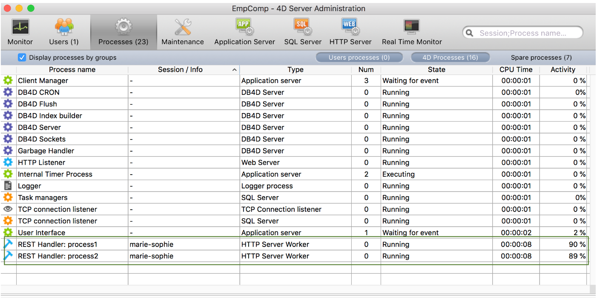

A **remote datastore** is a reference, on a local 4D application (4D or 4D Server), to a [datastore](dsMapping.md#datastore) stored in another 4D application.

The local 4D application connects to and references the remote datastore through a call to the [`Open datastore`](../API/DataStoreClass.md#open-datastore) command.

On the remote machine, 4D opens a [session](../WebServer/sessions.md) to handle requests from the application that call `Open datastore`. Requests internally use the [REST API](../REST/gettingStarted.md), which means that they might require [available licenses](../REST/authUsers.md).

## Using web sessions

When you work with a remote datastore referenced through calls to the [`Open datastore`](../API/DataStoreClass.md#open-datastore) command, the connection with the requesting processes is handled via [web sessions](../WebServer/sessions.md) on the remote machine.

The web session created on the remote datastore is identified using a internal session ID which is associated to the `localID` on the 4D application side. Essa sessão gerencia automaticamente o acesso a dados, seleções de entidades ou entidades.

The `localID` is local to the machine that connects to the remote datastore, which means:

- If other processes of the same application need to access the same remote datastore, they can use the same `localID` and thus, share the same session.
- If another process of the same application opens the same remote datastore but with another `localID`, it will create a new session on the remote datastore.
- If another machine connects to the same remote datastore with the same `localID`, it will create another session with another cookie.

Estes princípios são ilustrados nos gráficos seguintes:

### Visionamento de sessões

Os processos que gerenciam sessões para acesso ao armazenamento de dados são mostrados na janela de administração do 4D Server:

- name: "REST Handler: \\<process name\>"
- type: type Worker Server HTTP
- session: session name is the user name passed to the `Open datastore` command.

No exemplo a seguir, dois processos estão sendo executados na mesma sessão:

## Fechamento das sessões

As described in the [session lifetime](../WebServer/sessions.md#session-lifetime) paragraph, a web session is automatically closed by 4D when there has been no activity during its timeout period. The default timeout is 60 mn, but this value can be modified using the _connectionInfo_ parameter of the `Open datastore` command.

Se uma solicitação for enviada ao repositório de dados remoto depois que a sessão tiver sido fechada, ela será recriada automaticamente, se possível (licença disponível, servidor não parado...). However, keep in mind that the context of the session regarding locks and transactions is lost (see below).

## Bloqueio e transacções

Os recursos do ORDA relacionados ao bloqueio de entidades e à transação são gerenciados no nível do processo em repositórios de dados remotos, assim como no modo cliente/servidor do ORDA:

- If a process locks an entity from a remote datastore, the entity is locked for all other processes, even when these processes share the same session (see [Entity locking](entities.md#entity-locking)). Se várias entidades que apontam para um mesmo registro tiverem sido bloqueadas em um processo, todas elas deverão ser desbloqueadas no processo para remover o bloqueio. Se um bloqueio tiver sido colocado em uma entidade, o bloqueio será removido quando não houver mais referência a essa entidade na memória.
- Transactions can be started, validated or cancelled separately on each remote datastore using the `dataStore.startTransaction()`, `dataStore.cancelTransaction()`, and `dataStore.validateTransaction()` functions. Não têm impacto noutros datastores.
- Classic 4D language commands (`START TRANSACTION`, `VALIDATE TRANSACTION`, `CANCEL TRANSACTION`) only apply to the main datastore (returned by `ds`).
  Se uma entidade de um datastore remoto é segurada por uma transação em um processo, outros processos não podem atualizá-lo, mesmo que esses processos compartilhem a mesma sessão.
- Os bloqueios nas entidades são removidos e as transações são anuladas:
  - quando o processo é eliminado.
  - quando a sessão é encerrada no servidor
  - quando a sessão é encerrada na janela de administração do servidor.
