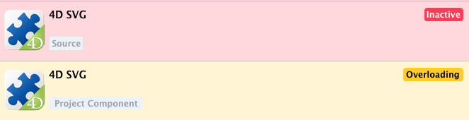
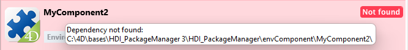

A 4D component is a set of 4D code and/or 4D forms representing one or more functionalities that you can add and use in your projects. For example, the [4D SVG](https://github.com/4d/4D-SVG) component adds advanced commands and an integrated rendering engine that can be used to display SVG files.

You can [develop](../Extensions/develop-components.md) and [build](../Desktop/building.md) your own 4D components, or download public components shared by the 4D community that [can be found on GitHub](https://github.com/search?q=4d-component\&type=Repositories).

## Interpreted and compiled components

Components can be interpreted or [compiled](../Desktop/building.md). The package folder of a component can contain:

- either a Project folder (interpreted component)
- or a .4DZ file (compiled component)

A 4D project running in interpreted mode can use either interpreted or compiled components. A 4D project running in compiled mode cannot use interpreted components. Por isso não pode ser usado em um componente.

## Loading components

### Básicos

To load a component in your 4D project, you just need to:

1. Reference the component name in the **dependencies.json** file of your 4D project. This manifest file must be saved in the **Sources** folder of the 4D project folder, e.g.:
   ```
   /MyProjectRoot/Project/Sources/dependencies.json
   ```
2. By default, copy the component's package folder (_i.e._ the project root folder of the component) at the same level as your 4D project, e.g.:
   ```
   /MyProjectRoot/
   /MyProjectComponentRoot/
   ```

Thanks to this architecture, you can easily copy all your components at the same level as your projects and reference them in your **dependencies.json** files. However, you can customize the path of your components, see below.

### dependencies.json

The **/Sources/dependencies.json** file contents must be like:

```json
{
	"dependencies": {
		"myComponent1" : {},
		"myComponent2" : {}
	}
}
```

... where "myComponent1" and "myComponent2" are the name of the components located at the same level as you project that you want to be loaded in your project.

### Defining component path

If you want to customize the location of your components, you can use a **environment4d.json** file. This file allows you to declare the paths for the components that are not stored at the same level as the project folder.

You can use absolute or relative paths, expressed in POSIX syntax as described in [this paragraph](../Concepts/paths#posix-syntax). Relative paths are relative to the environment4d.json file.

Exemplos:

```json
{
	"dependencies": {
		"myComponent1" : "MyComponent1",
		"myComponent2" : "../MyComponent2",
        "myComponent3" : "file:///Users/jean/MyComponent3"
    }
}
```

The **environment4d.json** file can be stored in your project package folder or in one of its parent folders, at any level (up to the root). The benefit of this architecture is that you can store this environment file in a parent folder of your projects and decide not to commit it, allowing you to have your local component organization.

### Loading sequence

In the absence of **environment4d.json** for a given dependency, or if this file lacks information on a dependency listed in **dependencies.json**, the package manager then utilizes the name mentioned in **dependencies.json** to retrieve the dependency next to the project package folder.


:::info Compatibidade

Components located in the legacy [**Components** folder of your project](architecture.md#components) are loaded after the above sequence if there is no conflict with existing dependencies.

:::

## Monitoring Project Dependencies

In an opened project, you can get information about dependencies and their current loading status in the **Dependencies** panel.

To display the Dependencies panel:

- with 4D, select the **Design/Project Dependencies** menu item (Development environment),<br/>
  

- with 4D Server, select the **Window/Project Dependencies** menu item.<br/>
  

The Dependency panel is then displayed. Dependencies are sorted by name in alphabetical order:


### Dependency Origin

The Dependencies panel lists all project dependencies, whatever their origin, i.e. wherever they come from. The dependency origin is provided by the tag under its name:


The following origins are supported:

| Origin tag        | Descrição                                                                         |
| ----------------- | --------------------------------------------------------------------------------- |
| 4D Component      | Built-in 4D component, stored in the `Components` folder of the 4D application    |
| Source            | Component declared in the [`dependencies.json`](#dependenciesjson) file           |
| Environment       | Component declared in the [`environnement4d.json`](#environment4djson) file       |
| Project Component | Component located in the [`Components`](architecture.md#components) legacy folder |

**Right-click** in a dependency line and select **Show on disk** to reveal the location of a dependency:


:::note

This item is not displayed if the dependency is inactive because its files are not found.

:::

### Dependency Status

A project dependency can have different status in the current configuration. You can filter dependencies according to their status by selecting the appropriate tab at the top of the Dependencies panel:


- **Active**: the dependency is correctly loaded and can be used in the project.
- **Inactive**: the dependency is not loaded in the project and is not available. There are many possible reasons for this status: conflict with another component (see below), missing files, version incompatibility...
- **Conflict**: the dependency is loaded but is in conflict with at least one other dependency (same name at another location). Dependencies in conflict are grouped so that you can check the origin of the conflict and take appropriate actions.

Dependencies requiring the developer's attention (**Inactive** and **Conflict**) are indicated by a label at the right side of the line and a specific background color:



In case of inactive or conflict status, a tooltip is displayed when you hover over the dependency line, detailing the reason for this status:


