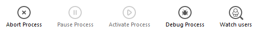

The **Processes** page lists all the processes underway.

The "Processes" button indicates, in parentheses, the total number of processes running in the server (this number does not take into account any display filters applied to the window nor the state of the **Display processes by groups** option).

Pode alterar a ordem das colunas simplesmente arrastando e largando as áreas de cabeçalho das colunas. Também pode ordenar a lista de valores da coluna clicando no respetivo cabeçalho.

Like the Users page, this page contains a dynamic [search/filtering area](users.md#searchfiltering-area) that can be used to reduce the number of rows displayed in the list to those that correspond to the text entered in the search area. A pesquisa/filtragem é efetuada nas colunas Nome da sessão e Nome do processo.

Existem também três botões de atalho que podem ser utilizados para filtrar o tipo de processo apresentado na janela:

- **Users processes**: Processes generated by and for the user sessions. Estes processos são precedidos de um ícone sob a forma de uma persona.
- **4D Processes**: Processes generated by the 4D Server engine. Estes processos são precedidos de um ícone com a forma de uma roda dentada.
- **Spare processes**: Processes that are inactive but kept temporarily and that can be reused at any time. Este mecanismo otimiza a reatividade do 4D Server. Estes processos são precedidos de um ícone com a forma de uma roda dentada.

The **Display processes by groups** option lets you group together the internal processes of 4D Server as well as the client processes, for better readability. Quando você marcar essa opção:

- the "twinned" 4D client processes (main 4D client process and 4D client base process, see [Process Type](#process-type)) are grouped as one,
- é criado um grupo "Gestores de tarefas"; inclui os processos internos dedicados à divisão de tarefas (Equilibrador partilhado, Gestor de sessões de rede, Trabalhador do grupo exclusivo),
- é criado um grupo "Gestores de clientes", que inclui vários processos internos dos clientes.

A área inferior da janela é utilizada para apresentar a representação gráfica da atividade do(s) processo(s) selecionado(s).

> You can select several rows by holding down the **Shift** key for an adjacent selection or **Ctrl** (Windows) / **Command** (macOS) for a non-adjacent selection.

A atividade do processo é a percentagem de tempo que 4D Server dedicou a este processo (proporção). A janela fornece as seguintes informações para cada processo:

- Tipo de processo (ver abaixo),
- Sessão/Info:
  - Processo 4D - em branco,
  - Processo usuário - nome do usuário 4D,
  - Processo web - caminho URL,
- Nome do processo,
- Number of the process (as returned by the [`New process`](https://doc.4d.com/4dv19/help/command/en/page317.html) command for example). O número do processo é o número atribuído no servidor. No caso de um processo global, este número pode ser diferente do atribuído na máquina cliente.
- Estado atual do processo,
- Tempo de execução (em segundos) do processo desde a sua criação,
- Percentagem de tempo que 4D Server dedicou a este processo (rácio).

## Tipo de processo

Cada processo é identificado por um ícone e por um tipo. A cor e a forma do ícone indicam o tipo de processo:

| icon                                       | type                                                                                                                                                                                                                   |
| ------------------------------------------ | ---------------------------------------------------------------------------------------------------------------------------------------------------------------------------------------------------------------------- |
|   | Servidor de aplicações                                                                                                                                                                                                 |
|   | Servidor SQL                                                                                                                                                                                                           |
|   | Servidor DB4D (motor de base de dados)                                                                                                                                                              |
|   | Servidor Web                                                                                                                                                                                                           |
|   | Servidor SOAP                                                                                                                                                                                                          |
|   | Processo de cliente 4D protegido (processo de desenvolvimento de um 4D ligado)                                                                                                                      |
|   | Main process of a connected 4D client or process created with `New process` on a connected 4D client (Collaborative process, equivalent on the server of the process created on the client machine) |
|   | Processo de base cliente 4D (processo paralelo a um processo cliente 4D. Processo preemptivo responsável pelo controlo do processo cliente 4D principal correspondente)             |
|   | Processo de reserva (antigo ou futuro "Processo cliente 4D banco de dados")                                                                                                                         |
|  | Worker servidor SQL                                                                                                                                                                                                    |
|  | Worker servidor HTTP                                                                                                                                                                                                   |
|  | Procedimento armazenado (processo lançado por um 4D conectado e rodando no servidor)                                                                                                                |
|  | Método Web (lançado por uma 4DACTION, por exemplo)                                                                                                                                                  |
|  | Método Web (preemptivo)                                                                                                                                                                             |
|  | Método SOAP (acionado por um serviço Web)                                                                                                                                                           |
|  | Método SOAP (preemptivo)                                                                                                                                                                            |
|  | Logger (registrador)                                                                                                                                                                                |
|  | Listener ligação TCP                                                                                                                                                                                                   |
|  | Gestor de sessões TCP                                                                                                                                                                                                  |
|  | Outro processo                                                                                                                                                                                                         |
|  | Processo worker (cooperativo)                                                                                                                                                                       |
|  | Processo 4D client (preemptivo)                                                                                                                                                                     |
|  | Procedimento armazenado (processo preemptivo)                                                                                                                                                       |
|  | Processo worker (apropriativo)                                                                                                                                                                      |

> Each main 4D client process and its "twinned" 4D client base process are grouped together when the **Display processes by groups** option is checked.

## Botões de administração

A página também tem cinco botões de controle que atuam nos processos selecionados. Observe que você só pode agir em processos usuários.

- **Abort Process**: can be used to abort the selected process(es). Quando clicar neste botão, aparece uma caixa de diálogo de aviso para que se possa confirmar ou cancelar a operação.

> You can also abort the selected process(es) directly without displaying the confirmation dialog box by holding down the **Alt** key while clicking on this button, or by using the [`ABORT PROCESS BY ID`](https://doc.4d.com/4dv19/help/command/en/page1634.html) command.

- **Pause Process**: can be used to pause the selected process(es).
- **Activate Process**: can be used to reactivate the selected process(es). Os processos devem ter sido colocados em pausa anteriormente (utilizando o botão acima ou por programação); caso contrário, este botão não tem qualquer efeito.
- **Debug Process**: can be used to open on the server machine one or more debugger windows for the selected process(es). Quando clicar neste botão, aparece uma caixa de diálogo de aviso para que se possa confirmar ou cancelar a operação. Note que a janela do depurador só é exibida quando o código 4D for realmente executado na máquina do servidor (por exemplo, em um gatilho ou na execução de um método com o atributo "Execute on Server").

> You can also debug a process directly without displaying the confirmation dialog box by holding down the **Alt** key while clicking on this button.

- **Watch users**: used to display, on the [Users page](users.md), all the processes of the selected user(s). Este botão está ativo quando pelo menos um processo do utilizador for selecionado.
