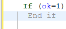
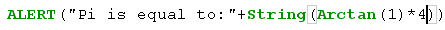
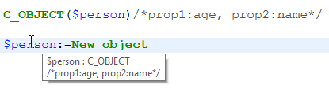
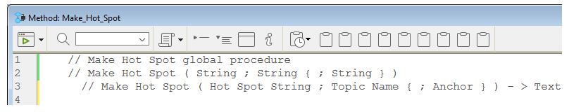
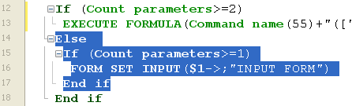
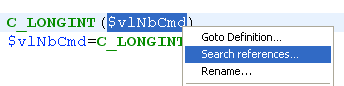

4D tem um poderoso editor de código embutido que oferece um amplo conjunto de funcionalidades para edição de código altamente produtiva, como preenchimento inteligente de código, navegação de código, depuração, busca, e mais.


O editor de código funciona de forma semelhante a um editor de texto. Escrever um método ou uma classe é geralmente uma combinação de digitar texto, selecionar componentes e arrastar itens do Explorador ou de outras janelas. Você também pode usar várias funções de preenchimento automático para criar métodos mais rapidamente.

Você pode rolar através do conteúdo de métodos, classes e funções, que podem incluir até 32.000 linhas de código ou 2 GB de texto.

O Editor de código 4D fornece verificação básica de erros de sintaxe. É efetuada uma verificação de erros adicional quando o código é executado. Para obter mais informações sobre como lidar com erros, consulte [Debugging](../Depuração/basics.md).

## Interface

### Barra de ferramentas

Cada janela do Editor de Código possui uma barra de ferramentas que fornece acesso instantâneo a funções básicas relacionadas à execução e edição de código.

| Elemento                                     | Ícone                                                                             | Descrição                                                                                                                                                                                                                                                                                                                                                                                                                                                                                                                                                                                                                                                                                                                                                                                                                                                                                                                                                                                                                                                                                                                                                                                                                       |
| -------------------------------------------- | --------------------------------------------------------------------------------- | ------------------------------------------------------------------------------------------------------------------------------------------------------------------------------------------------------------------------------------------------------------------------------------------------------------------------------------------------------------------------------------------------------------------------------------------------------------------------------------------------------------------------------------------------------------------------------------------------------------------------------------------------------------------------------------------------------------------------------------------------------------------------------------------------------------------------------------------------------------------------------------------------------------------------------------------------------------------------------------------------------------------------------------------------------------------------------------------------------------------------------------------------------------------------------------------------------------------------------- |
| **Execução do método**                       |                     | Ao trabalhar com métodos, cada janela do Code Editor tem um botão que pode ser usado para executar o método atual. Usando o menu associado a este botão, você pode escolher o tipo de execução:<ul><li>**Executar novo processo**: Cria um processo e executa o método no modo padrão neste processo.</li><li>**Executar e depurar novo processo**: Cria um novo processo e exibe o método na janela do Depurador para execução passo a passo neste processo.</li><li>**Executar no processo do Aplicativo**: Executa o método no modo padrão no contexto do processo do Aplicativo (ou seja, a janela de exibição do registro).</li><li>**Executar e depurar no processo do Aplicativo**: Exibe o método na janela do Depurador para execução passo a passo no contexto do processo do Aplicativo (ou seja, a janela de exibição do registro).</li></ul>Para obter mais informações sobre a execução de métodos, consulte [Chamando Métodos do Projeto](../Concepts/methods.md#calling-project-methods). |
| **Procurar no método**                       |                                | Exibe a área de [\*Pesquisa](#find-and-replace).                                                                                                                                                                                                                                                                                                                                                                                                                                                                                                                                                                                                                                                                                                                                                                                                                                                                                                                                                                                                                                                                                                                                                                |
| **Macros**                                   |                              | Insere uma macro na seleção. Clique na seta pendente para visualizar uma lista de macros disponíveis. Para obter mais informações sobre como criar e instanciar macros, consulte [Macros](#macros).                                                                                                                                                                                                                                                                                                                                                                                                                                                                                                                                                                                                                                                                                                                                                                                                                                                                                                                                                                             |
| **Expandir tudo / Recolher tudo**            |        | Estes botões permitem expandir ou recolher todas as estruturas de fluxo de controle do código.                                                                                                                                                                                                                                                                                                                                                                                                                                                                                                                                                                                                                                                                                                                                                                                                                                                                                                                                                                                                                                                                                                                  |
| **Informações sobre o método**               |        | Exibe a caixa de diálogo de [Propriedades do Método](../Concepts/methods.md#project-method-properties) (apenas métodos de projeto).                                                                                                                                                                                                                                                                                                                                                                                                                                                                                                                                                                                                                                                                                                                                                                                                                                                                                                                                                                                                                                                          |
| **Últimos valores da área de transferência** |  | Exibe os últimos valores armazenados na área de transferência.                                                                                                                                                                                                                                                                                                                                                                                                                                                                                                                                                                                                                                                                                                                                                                                                                                                                                                                                                                                                                                                                                                                                                  |
| **Pranchetas**                               |                        | Nove pranchetas disponíveis no editor de código. Você pode [usar estes clipboards](./write-class-method.md#multiple-copy-paste-and-numbering-of-clipboards) clicando neles diretamente ou usando atalhos de teclado. Você pode usar uma [opção de Preferências](Preferences/methods.md#options-1) para ocultá-las.                                                                                                                                                                                                                                                                                                                                                                                                                                                                                                                                                                                                                                                                                                                                                                                                                                                              |
| **Menu de navegação suspenso**               |                        | Permite navegar dentro de métodos e classes com conteúdo marcado automaticamente ou marcadores declarados manualmente. Ver abaixo                                                                                                                                                                                                                                                                                                                                                                                                                                                                                                                                                                                                                                                                                                                                                                                                                                                                                                                                                                                                                                                                               |

### Área de edição

É aqui que escreve e edita o seu código. O editor recua automaticamente o texto do código e colore os diferentes elementos de sintaxe para uma estrutura de código clara.

É possível personalizar a apresentação da área de edição. Qualquer personalização é automaticamente passada para todas as janelas do editor de código:

| Opção                                     | Descrição                                                                                                                                                                                                                                                                                                 | Definido em...                                                                                                                                                                         |
| ----------------------------------------- | --------------------------------------------------------------------------------------------------------------------------------------------------------------------------------------------------------------------------------------------------------------------------------------------------------- | -------------------------------------------------------------------------------------------------------------------------------------------------------------------------------------------------------------------------------------- |
| **fuente** y **tamaño de la fuente**      | Define o tipo de letra e o tamanho dos caracteres a utilizar na área de edição                                                                                                                                                                                                                            | **Preferências** > [**Métodos**](../Preferences/methods.md) ou **Método > Visualização** > **Fonte Maior** ou **Fonte Menor**                                                                                                          |
| **estilo e cor dos elementos de sintaxe** | atribui uma cor e/ou estilo específicos a cada tipo de elemento da linguagem 4D.  Você também pode alterar as diferentes cores usadas na interface da área de edição (destaque, fundo, etc.).                                          | Clique com o botão direito do mouse em um elemento de linguagem (variável, palavra-chave, etc.) > Submenú **Estilo**. Or **Preferences** > [**Methods**](../Preferences/methods.md) |
| **espaços**                               | Você pode exibir os espaços entre as palavras usando pontos (.) em vez de espaços em branco. Esta opção se aplica a todos os elementos de código (nomes de comandos, variáveis, comentários, etc.). | **Método > Ver > Espaços em branco**                                                                                                                                                                                                   |
| **temas**                                 | Pode selecionar o tema Escuro ou Claro, ou definir um tema personalizado                                                                                                                                                                                                                                  | **Preferências** > [**Métodos**](../Preferences/methods.md)                                                                                                                                                                            |
| **largura das indentações de código**     | Definir a largura das indentações do código                                                                                                                                                                                                                                                               | **Preferências** > [**Métodos**](../Preferences/methods.md)                                                                                                                                                                            |

#### Mudar barras

Barras coloridas mostram instantaneamente onde as linhas de código foram modificadas desde que o método foi aberto:


As barras de alteração mudam de cor para indicar se as modificações foram salvas ou não:

- amarelo: a linha foi modificada e o método ainda não foi guardado.
- verde: A linha foi modificada e o método foi guardado.

### Área listas

A área de lista permite exibir uma ou mais listas de elementos necessários para escrever métodos e classes (comandos, constantes, formulários, etc.). Você pode escolher o número e o conteúdo das listas exibidas na janela.

Por padrão, o editor de código apresenta quatro listas. Você pode ocultar ou mostrar todas as listas clicando no ícone no canto inferior direito da janela. 

Você pode aumentar ou reduzir a largura relativa de cada área da lista arrastando uma de suas divisões. Também é possível ajustar o tamanho da área de lista em relação à área de edição arrastando a linha divisória entre elas.

- Ao clicar duas vezes em um item em uma lista, ele será inserido na área de edição, na posição do cursor.
- Para **modificar o conteúdo** de uma lista, clique na área do título da lista em questão: um menu pop-up será exibido, permitindo que você escolha o tipo de item a ser exibido.


- Para adicionar ou remover uma lista, clique na área do título de uma das listas e escolha o comando correspondente no menu suspenso.
  O comando **Remover esta lista** está desativado quando você clica na última lista. Se você deseja ocultar todas as listas, você deve clicar no botão **mostrar ou ocultar listas** no canto inferior direito da janela ou ocultá-las por padrão nas **Preferências**.

- Você pode ocultar as listas em todas as janelas das seguintes maneiras:
  - Selecione a opção **Exibir > Listas** no menu **Método** (uma marca de seleção indica se as listas estão sendo exibidas)
  - Desmarque a opção **Preferências** > **Métodos** > **Opções** > **Mostrar Listas**. Para que as modificações feitas na caixa de diálogo **Preferências** sejam consideradas, todos os métodos, classes ou funções abertos devem ser fechados e reabertos.

#### Listas de itens disponíveis

Você pode exibir as seguintes listas de itens na área de listas da janela do Code Editor:

- **Todas as tabelas e campos**: Nomes de tabelas e campos do banco de dados em forma de lista hierárquica. Quando você inserir um nome de campo no método, clicando duas vezes no seu nome, A 4D inseriu-a respeitando a sintaxe e adiciona o nome da tabela ou subtabela, como o caso pode ser.
- **Tabela** (submenú): Nomes dos campos da tabela selecionada usando o submenu.
- **Tabela atual**: Nomes dos campos da tabela atual (disponível em gatilhos, métodos de formulário e métodos de objeto).
- **Formulários projeto**: Nomes de formulários projeto de banco de dados. Quando você clica duas vezes no nome de um projeto de formulário, 4D insere o mesmo respeitando a sintaxe: o nome do formulário é inserido entre as cotações.
- **Formulários de tabela**: Nomes de tabelas do banco de dados e nomes de formulários em forma de lista hierárquica. Quando você inserir o nome de um formulário em um método, clicando duas vezes em seu nome, 4D insere ele respeitando a sintaxe: o nome do formulário é inserido entre aspas e é precedido pelo nome da tabela e um ponto e vírgula. Por exemplo: [Table]; "Form".
- **Métodos**: nomes de métodos projeto do banco de dados.
- **Todas as pastas**: Nomes das pastas de objetos e subpastas definidas no banco de dados exibidas na forma de uma lista hierárquica. As pastas podem ser utilizadas para organizar objetos de uma forma personalizada. São geridos a partir da página inicial do explorador.
- **Pastas** (submenú): Conteúdo da pasta selecionada usando o submenu.
- **Macros**: Nomes de macros definidos para o banco de dados (ver [Criando e utilizando macros](#creating-and-using-macros)).
- **Comandos**: comandos de idioma 4D em ordem alfabética.
- **Comandos por temas**: comandos da linguagem 4D classificados por tema em forma de lista hierárquica.
- **Barras de menu**: Nomes e números das barras de menu [criadas com o editor de barras de menu 4D](../Menus/creating.md).
- **Constantes**: constantes do 4D e de quaisquer plug-ins, classificadas por tema em forma de lista hierárquica.
- **Listas**: Nomes de listas.
- **Todos os comandos de plug-in**: Comandos para todos os plug-ins instalados no banco de dados (se houver), classificados por tema em forma de lista hierárquica.
- **Palavras SQL**: conjunto de palavras-chave reconhecidas pelo analisador de sintaxe 4D SQL. Essa lista inclui comandos (por exemplo, SELECT), cláusulas (por exemplo, WHERE), bem como funções (ABS).
- **Funções SQL**: funções SQL 4D.

**Nota:** Com exceção do elemento Macros, todas as listas estão por ordem alfabética.

#### Guardar como modelo

Você pode salvar as listas definidas na janela do Editor de Código na forma de um modelo. Depois que o modelo é salvo, os parâmetros definidos nele serão usados para cada nova janela do Editor de Código que é aberta.

Os seguintes parâmetros são armazenados no modelo:

- Tamanho relativo das áreas de edição e de lista
- Número de listas
- Localização e conteúdo de cada lista
- Largura relativa de cada lista

Para salvar uma janela do Editor de Código como um modelo, escolha **Método** > **Salvar como Modelo**. O modelo é guardado imediatamente (não aparece nenhuma caixa de diálogo). Está armazenado nas **Preferências** do aplicativo 4D. Se já existir um modelo anterior, ele será substituído.

### Área de pontos de paragem

Esta área, localizada à esquerda da área de edição, permite que você exiba os números de linha e insira pontos de interrupção diretamente ao lado de instruções específicas. Os pontos de interrupção são úteis durante a fase de depuração de sua programação. Eles interrompem a execução do seu código em locais específicos e exibem o depurador.

Para mais informações sobre pontos de interrupção, consulte a seção [Depuração](../Debugging/breakpoints.md#breakpoints).

Você pode exibir ou ocultar os números de linhas na área de pontos de quebra para cada janela do Editor de Código.

- Para habilitar ou desabilitar a exibição dos números de linha por padrão, escolha **Preferências** > **Métodos** > **Mostrar números de linha**.
- Para modificar essa exibição separadamente para cada janela do Editor de Código, escolha **Método** > **Visualizar** > **Números de Linha**.

Exibir as linhas de números torna mais fácil encontrar o seu caminho na janela. O comando **Método** > **Ir al número de linha...** também permite aproveitar essa exibição.

Este tipo de busca é útil quando usada em conjunto com o [compilador](../Project/compiler.md), que sinaliza erros de tempo de execução pelo número da linha em que eles ocorrem.

### Barra de estado

A barra de status localizada na parte inferior direita do editor da janela exibe a posição do cursor em todos os momentos:


- **Ln**: Número da linha
- **C**: número de coluna, ou seja, o nível na hierarquia das estruturas de programação. O primeiro nível é 0. O número da coluna é útil para debugar, pois essa informação pode ser fornecida pelo interpretador em caso de erro no código.
- **Ch**: Localização do caractere na linha.
- : Ocultar/exibir listas.

Quando você define o cursor em um comando, função ou parâmetros, a barra de status exibe a sintaxe do comando. Se você escrever ou selecionar um parâmetro, a área mostra o parâmetro atual em **bold**:


### Menu de navegação suspenso

O menu suspenso de navegação ajuda você a organizar seu código e navegar com mais facilidade dentro de suas classes e métodos:


Algumas tags são adicionadas automaticamente, e você pode complementar a lista suspensa usando [marcadores](#manual-tagging).

#### Navegação de código

Clique em um item da lista suspensa para acessar sua primeira linha no código. Você também pode navegar com as teclas de seta e pressionar **Enter**.

#### Marcação automática

Construtores, declarações de métodos, funções e atributos computados são automaticamente marcados e adicionados à lista suspensa.

Quando não existe uma etiqueta na classe/método, a ferramenta apresenta "Sem etiqueta".

Os seguintes itens são adicionados automaticamente:

| Ícone                                                                       | Elemento                                                          |
| --------------------------------------------------------------------------- | ----------------------------------------------------------------- |
|                          | Sem etiqueta                                                      |
|                | Class constructor ou declaração de método                         |
|  | Atributo calculado (get, set, orderBy e query) |
|                      | Nome da função de classe                                          |

#### Marcação manual

Ao adicionar marcadores no seu código, pode adicionar as seguintes etiquetas ao menu pendente:

| Ícone                                                   | Elemento                        |
| ------------------------------------------------------- | ------------------------------- |
|  | MARK: etiqueta  |
|  | TODO: etiqueta  |
|    | FIXME: etiqueta |

Declara-os acrescentando comentários como:

```4d
// FIXME: Correção dos seguintes itens
```

As declarações não diferenciam maiúsculas de minúsculas; escrever `fixme:` tem o mesmo efeito.

A adição de um hífen após a tag `MARK:` desenha uma linha de separação no editor de código e no menu suspenso. Por isso, estou a escrever isto:


Os resultados são os seguintes:


Todos os marcadores localizados dentro de funções são recuados na lista suspensa, exceto as tags `MARK:` localizadas no final das funções e não seguidas de instruções. Estes aparecerão no primeiro nível.

#### Ordem de visualização

As etiquetas são exibidas em sua ordem de aparecimento dentro do método/classe.

Para exibir as tags de um método ou classe em ordem alfabética, faça uma das seguintes:

- \*\*Clique direito na ferramenta suspensa
- mantenha pressionado **Cmd** no macOS ou **Alt** no Windows e clique na ferramenta suspensa

> As etiquetas em funções movem-se com os seus itens pais.

### Atalhos

Várias funcionalidades do Editor de Código do 4D estão disponíveis através de atalhos de teclado padrão.

:::info macOS

No macOS, use a tecla **Command** em vez da tecla **Ctrl** mencionada (Windows).

:::

| **Atalho**                                                                                                                                                                                                    | **Ação**                                                                                                                                                                                                                                                |
| ------------------------------------------------------------------------------------------------------------------------------------------------------------------------------------------------------------- | ------------------------------------------------------------------------------------------------------------------------------------------------------------------------------------------------------------------------------------------------------- |
| **Selecção e navegação**                                                                                                                                                                                      |                                                                                                                                                                                                                                                         |
| Duplo clique                                                                                                                                                                                                  | Selecionar o nome de um elemento da linguagem                                                                                                                                                                                                           |
| [Alt]+Clique duas vezes                                                                                                                                   | Selecionar um nome de elemento de língua contendo espaços (constante, método, etc.)                                                                                                                                  |
| [Shift]+[seta para a direita]                                                                         | Criar e ampliar a seleção, personagem por caractere, para a direita ou Reduzir a seleção, personagem por caracter a partir da esquerda                                                                                                                  |
| [Shift]+[seta para a esquerda]                                                                        | Reduzir a seleção, caractere por caractere, da direita ou Criar e ampliar a seleção, caractere por caractere, para a esquerda                                                                                                                           |
| [Shift]+[seta para baixo]                                                                             | Criar e ampliar uma seleção, linha por linha, da parte superior à parte inferior                                                                                                                                                                        |
| [Shift]+[seta para cima]                                                                              | Criar e ampliar uma seleção, linha por linha, de baixo para cima                                                                                                                                                                                        |
| [Ctrl]+[Shift]+[seta para a direita]              | Criar e ampliar a seleção, palavra a palavra, a partir da direita                                                                                                                                                                                       |
| [Ctrl]+[Shift]+[seta para a esquerda]             | Reduza a seleção, palavra por palavra, à direita, ou crie e amplie a seleção, palavra por palavra, à esquerda                                                                                                                                           |
| [Ctrl]+[seta para a direita]                                                                          | Mover o ponto de inserção, palavra a palavra, da esquerda para a direita                                                                                                                                                                                |
| [Ctrl]+[left arrow]                                                                                   | Mover o ponto de inserção, palavra a palavra, da direita para a esquerda                                                                                                                                                                                |
| [Alt]+[seta para baixo]                                                                               | Mover a(s) linha(s) onde se encontra o cursor para a parte inferior                                                                                                                                               |
| [Alt]+[seta para cima]                                                                                | Mover a(s) linha(s) onde se encontra o cursor para o topo                                                                                                                                                         |
| [Home]                                                                                                                                                    | Posicione o ponto de inserção no início da linha                                                                                                                                                                                                        |
| [End]                                                                                                                                                     | Colocar o ponto de inserção no fim da linha                                                                                                                                                                                                             |
| [Ctrl]+[Home]                                                                                         | Colocar o ponto de inserção no início do método                                                                                                                                                                                                         |
| [Ctrl]+[End]                                                                                          | Colocar o ponto de inserção no final do método                                                                                                                                                                                                          |
| [Shift]+[Home]                                                                                        | Selecione todos os caracteres da linha que estão à esquerda do cursor                                                                                                                                                                                   |
| [Shift]+[End]                                                                                         | Selecione todos os caracteres da linha que estão à direita do cursor                                                                                                                                                                                    |
| [PgUp]                                                                                                                                                    | Rolar o conteúdo do método, página por página, da parte inferior até a parte superior (não modificar o ponto de inserção)                                                                                                            |
| [PgDn]                                                                                                                                                    | Rolar o conteúdo do método, página por página, de cima para baixo (não modifica o ponto de inserção)                                                                                                                                 |
| [**Introspecção**](#goto-definition)                                                                                                                                                                          |                                                                                                                                                                                                                                                         |
| [Ctrl]+K ou [Alt]+clique duas vezes                                                                   | Mesmo que o comando [**Ir para definição**](#goto-definition)                                                                                                                                                                                           |
| \[Ctrl\] (Windows) or \[Alt\] (macOS)+hovering over a token | Sublinhar o token (elemento linguístico identificado). Clique no token sublinhado = igual ao comando [**Goto definition**] (#goto-definition) |
| [**Encontrar e substituir**](#find-and-replace)                                                                                                                                                               |                                                                                                                                                                                                                                                         |
| [Ctrl]+F                                                                                                                                                  | Find                                                                                                                                                                                                                                                    |
| [Ctrl]+G                                                                                                                                                  | Encontrar o próximo                                                                                                                                                                                                                                     |
| [Ctrl]+[Shift]+G                                                                                      | Procurar Anterior                                                                                                                                                                                                                                       |
| [Ctrl]+E                                                                                                                                                  | Encontrar o mesmo próximo                                                                                                                                                                                                                               |
| [Ctrl]+[Shift]+E                                                                                      | Encontrar o mesmo anterior                                                                                                                                                                                                                              |
| [Ctrl]+[Alt]+F                                                                                        | Substituir                                                                                                                                                                                                                                              |
| [Ctrl]+[Alt]+G                                                                                        | Substituir próximo                                                                                                                                                                                                                                      |
| [Ctrl]+[Alt]+[Shift]+G                            | Reemplazar anterior                                                                                                                                                                                                                                     |
| [**Clipboards**](#clipboards)                                                                                                                                                                                 |                                                                                                                                                                                                                                                         |
| [Shift]+clique ou [Alt]+clique no ícone da área de transferência                                      | Copiar texto selecionado para uma área de transferência                                                                                                                                                                                                 |
| [Ctrl]+[Shift]+tecla numérica                                                                         | Copiar texto selecionado numa área de transferência numérica                                                                                                                                                                                            |
| [Ctrl]+clique no ícone da área de transferência                                                                                                           | Colar o conteúdo de uma área de transferência na localização do cursor                                                                                                                                                                                  |
| [Ctrl]+chave numérica                                                                                                                                     | Colar o conteúdo da área de transferência numérica na localização do cursor                                                                                                                                                                             |

:::tip

A maioria desses atalhos pode ser personalizada na caixa de diálogo [4D Preferences] (../Preferences/shortcuts.md).

:::

## Editar código

O 4D utiliza técnicas padrão de edição de texto para digitar e editar no Editor de Código.

O Editor de Código usa convenções de exibição (estilo, cor) para os elementos de sintaxe. Você pode [personalizar estas convenções](#customizing-the-editing-area). Conforme você digita, ao validar sua entrada, o 4D avalia o texto da linha e aplica o formato de exibição apropriado. 4D também recua cada linha para seu nível adequado em relação à linha anterior quando você usa estruturas de programação (If, End if...).

Pode utilizar as teclas de setas para se deslocar rapidamente de uma linha para outra. Usar as teclas de seta para mover-se por várias linhas é mais rápido do que clicar, pois o editor atrasa a avaliação da linha em busca de erros.

No Windows, o editor de código inclui um Editor de Código de Entrada (IME) para facilitar a edição de código em sistemas japoneses ou chineses.

O Editor de Código inclui numerosos [atalhos de navegação](#shortcuts).

#### Uso de la barra invertida

O caractere de barra invertida (`\`) tem um suporte específico na linguagem 4D:

- inserido no final das linhas, permite escrever uma única instrução em [várias linhas](../Concepts/quick-tour.md#code-on-several-lines).
- permite definir [sequências de escape](../Concepts/quick-tour.md#escape-sequences).

:::caution

O caractere de barra invertida (`\`) é usado como separador em [nomes de caminho no Windows](../Concepts/paths.md#windows). Em geral, o 4D interpretará corretamente os nomes de caminho do Windows inseridos no Code Editor substituindo a barra invertida simples por uma barra invertida dupla. Por exemplo, `C:\MyDocuments` se tornará `C:\\MyDocuments`. No entanto, se escrever C:\MyDocuments\New, 4D mostrará C:\MyDocuments\New"`. Nesse caso, a segunda barra invertida é interpretada incorretamente como `\N`(uma [sequência de escape] existente(../Concepts/quick-tour.md#escape-sequences)). Você deve então digitar um duplo`\\\` quando quiser inserir uma barra invertida antes de um caractere usado em uma das sequências de escape reconhecidas por 4D.

:::

### Arrastar e largar

Do Explorer, você pode arrastar e soltar tabelas, campos, formulários, métodos de projeto, constantes ou comandos 4D. Quando você arrasta e solta um elemento, 4D sempre usa a sintaxe correta. Por exemplo, se você arrastar o nome do campo First Name da tabela `[People]`, ele aparecerá no Code Editor como `[People]First Name`. Da mesma forma, se você arrastar o nome do formulário Input da tabela People, ele aparecerá no Code Editor como `[People]; "Input"`.

Quando você insere um comando arrastando-o da página **Comandos** do Explorer, ele aparece com sua sintaxe (que consiste em todos os seus parâmetros) no Editor de código. Essa funcionalidade simplesmente lembra você dos parâmetros que o comando espera. Assim, você pode usar uma sintaxe mais adequada ao seu uso.

Você também pode arrastar e soltar dentro de um método, classe, função ou entre dois métodos diferentes. No Editor de Código, o mecanismo de arrastar e soltar é ativado assim que uma parte do texto é selecionada.
Por padrão, o mecanismo de arrastar e soltar **move** o texto selecionado. Para **copiá-lo**, mantenha pressionada a tecla **Ctrl** (Windows) ou a tecla **Option** (macOS) durante a operação.

### Alternância entre letras maiúsculas e minúsculas

Você pode modificar automaticamente o caso dos caracteres selecionados usando os comandos em **Métodos** > **Caixa** ou o menu de contexto do editor:

- **Maiúsculas** / **Minúsculas**: Muda os caracteres selecionados para maiúsculas ou minúsculas.
- **camelCase** / **CamelCase** : Muda os caracteres selecionados para "camel case". Isso consiste em alterar a primeira letra de cada palavra do grupo para maiúscula. Este tipo de notação é frequentemente utilizado para as nomenclaturas de variáveis. hireDate e PurchaseDate são exemplos de duas variantes da notação camel case.

Quando você aplica um desses comandos a uma seleção de texto, os espaços e os caracteres "_" são removidos e a primeira letra de cada palavra se torna maiúscula.

### Trocar expressão

A função **Swap Expression** pode ser usada para inverter os argumentos de uma expressão que atribui um valor. Por exemplo,

`variable1:=variable2`

torna-se

`variable2:=variable1`

Essa função é extremamente útil para reverter um conjunto de atribuições usadas para obter ou definir propriedades ou para corrigir erros de entrada. Para usar essa função, selecione a(s) linha(s) a ser(em) modificada(s) e, em seguida, escolha **Method** > **Swap Expression** ou use o menu de contexto da área. Dentro da seleção, apenas as linhas que atribuem um valor serão modificadas.

### Área de transferência

Além da operação padrão de copiar e colar, o 4D oferece duas funções adicionais que permitem trabalhar com o conteúdo de diferentes áreas de transferência:

- O programa armazena em memória as últimas 10 ações de "copiar" ou "recortar" que foram executadas no Editor de Código durante a sessão atual. Cada um dos diferentes conteúdos salvos desta forma pode ser reutilizado a qualquer momento. Para isso, use o comando **Clipboard History** do menu de contexto do Editor de código ou o botão "Last Clipboard values" da barra de ferramentas:

  

  São apresentadas as primeiras palavras dos itens copiados ou cortados. Selecione um item para inseri-lo no local atual do cursor.

- Nove áreas de transferência numeradas adicionais estão disponíveis e podem ser empregadas diretamente usando os botões da barra de ferramentas do Editor de Código ou [usando atalhos de teclado](#atalhos):


### Linhas em movimento

Você pode mover a linha onde o cursor está diretamente, sem selecioná-la primeiro, usando os comandos **Mover Linhas para Cima** e **Mover Linhas para Baixo** no menu **Método**. Você também pode fazer isso usando **Alt/Option** + **Seta para cima** ou **Seta para baixo** [atalho de teclado] (#atalhos).

### Funções de preenchimento automático

O editor de código fornece funções de preenchimento automático. 4D exibe automaticamente sugestões baseadas nos primeiros caracteres digitados.

No exemplo abaixo, digitar a string "cop" faz com que seja exibido um triângulo azul indicando que há várias sugestões disponíveis:


Quando os caracteres inseridos correspondem a uma única possibilidade, esse valor sugerido aparece em cinza (e é inserido se você pressionar a tecla **Tab**):
 ---> 

> Se você marcou as opções \*\*Inserir () e fechar } ) ] " na página **Métodos** das **Preferências**, o 4D também adicionará automaticamente **()** depois de um comando 4D, palavra-chave ou método de projeto que requer um ou mais argumentos obrigatórios (depois de aceitar uma sugestão ou conclusão):
>  -> 

O autocompletamento também funciona com estruturas de código (por exemplo, If...End if, For each...End for each): quando você insere a primeira parte da estrutura, o Code Editor sugere automaticamente a parte final:


Se houver várias sugestões disponíveis, 4D as exibe em uma lista pop-up quando você pressiona a tecla **Tab**:


A lista está por ordem alfabética. Escolha o valor clicando duas vezes nele ou role a lista usando as teclas de seta do teclado e, em seguida, pressione **Enter**, **Carriage Return** ou **Tab** para inserir o valor selecionado.

Por padrão, você também pode inserir um valor sugerido pressionando uma das seguintes teclas delimitadoras `( ; : = < [ {` após selecionar um valor: o valor inserido é seguido pelo delimitador, pronto para a entrada de dados.

  +  **(** key --> 

> Você pode desativar o uso de delimitadores para inserir valores sugeridos em **Preferences** > **Methods** > **Options**.

Você pode pressionar a tecla **Esc** para fechar a lista pop-up ou pode continuar digitando enquanto ela estiver aberta. Os valores sugeridos na lista pop-up são atualizados como caracteres adicionais são digitados.

Se os caracteres digitados correspondem a diferentes tipos de objetos, a lista os exibe em seu estilo atual. Podem ser visualizados os seguintes tipos de objetos:

- Comandos 4D
- Comandos SQL
- Métodos utilizador
- Nomes de tabelas
- Nomes de campos
- Constantes
- Variáveis declaradas no método
- Nomes de propriedade de objeto
- Comandos Plug-in
- Palavras-chave 4D
- Palavras-chave SQL
- Macros (apresentadas entre < >)

> Por motivos práticos, você pode desativar a exibição automática da lista de sugestões para **constantes**, **variáveis (locais ou entre processos) e atributos de objetos**, **tabelas** e/ou **protótipos**. Essas opções podem ser encontradas em **Preferências** > **Métodos** > **Opções**

#### Nomes de propriedade de objeto

O 4D exibe automaticamente sugestões sensíveis a maiúsculas e minúsculas de todos os nomes de propriedades de objetos válidos no código 4D quando você:

- digite um ponto "." depois de um objeto ou
- utilizar a tecla Tab após um ponteiro objeto desreferenciado "->".


> A propriedade `length` é sempre incluída para uso com coleções.

Uma vez criados, os nomes das propriedades são armazenados em uma lista global interna e ficam disponíveis sempre que um método/classe/função é aberto, fechado ou muda de foco.


A lista de sugestões é atualizada dinamicamente enquanto você edita o código. Ao alternar entre janelas, os nomes de propriedades novos/editados são sempre adicionados à lista global. A lista também é atualizada quando você visualiza um método, uma classe ou uma função no Explorer.

Quando o banco de dados é reiniciado, a lista é reinicializada.

> Você pode desativar a exibição automática das propriedades do objeto em **Preferências** > **Métodos** > **sugestões**.

## Procurar e substituir

O editor de código possui poderosas funcionalidades de **buscar e substituir** que se aplicam à janela atual.

Uma área de busca e substituição pode ser exibida na barra de ferramentas de qualquer janela de método:


Para exibir essa área, clique no ícone **Encontrar no método** da [barra de ferramentas](#barra de ferramentas) ou selecione uma função de localização ou substituição por meio de um [**atalho**](#atalhos) ou de um comando do submenu **Editar > Localizar**. Você pode fechar essa área a qualquer momento clicando no botão **x** no lado direito da barra de ferramentas.

:::tip

A funcionalidade **Localizar no Design** na barra de ferramentas do 4D ou no menu **Editar** não é específica do editor de código, mas pode ser usada para pesquisar um valor entre todos os métodos e classes.

:::

### Find

Selecione **Find > Find...** no menu **Edit** ou digite **Ctrl+F** (Windows)/**Cmd+F** (macOS) para exibir/ativar a área _Search_.

A pesquisa definida nessa área será executada no código localizado na janela.

A área de entrada **find** permite que você insira a string a ser pesquisada. Esta área é uma caixa de combinação que armazena as últimas 10 sequências de caracteres que foram pesquisadas ou substituídas durante a sessão. Se você destacar o texto antes de escolher o comando **Find...**, ele aparecerá nessa área. Pode então utilizar este texto ou substituí-lo por outro.

Depois que uma cadeia é inserida ou selecionada, todas as ocorrências encontradas na janela aberta são destacadas e o lado direito da área exibe o número total de ocorrências encontradas. Também indica a posição atual do cursor entre todos os resultados.

Pressione a tecla **Enter** para selecionar a ocorrência mais próxima ao cursor. Você também pode clicar nos botões **Próximo / Anterior**  para selecionar todas as ocorrências sequencialmente no início ou no fim do método atual, a partir da localização inicial do cursor, ou usar os comandos **Procurar Próximo** e **Procurar Anterior** do [menu **Editar**](#shortcuts).

#### Opções

- **Sensível a maiúsculas e minúsculas** : Leva em consideração as maiúsculas e minúsculas dos caracteres conforme eles foram inseridos na área de localização. Essa opção também considera os caracteres diacríticos. Por exemplo, uma busca por "MyVar" não encontrará "myVar"; uma busca por "dej" não encontrará "déjà".
- **Palavra Inteira** : Limita a pesquisa a ocorrências exatas da palavra que está sendo procurada. Quando esta opção for marcada, por exemplo, uma busca por "cliente" não irá encontrar nem "clientes" nem "meucliente." When this option is checked, for instance, a search for "client" will not find either "clients" or "myclient."

### Substituir

Haga clic en el botón de alternancia **v** situado a la izquierda del área _Buscar_ para mostrar/ocultar el área _Reemplazar_. También puede seleccionar **Buscar > Reemplazar...** en el menú **Editar** o escribir **Ctrl+Alt+F** (Windows)/**Cmd+Alt+F** (macOS).

El área de entrada _Reemplazar_ se utiliza para definir la cadena de caracteres que sustituirá a la definida anteriormente.

Haga clic en el botón **Reemplazar** para iniciar la búsqueda con todas las opciones definidas y reemplazar la primera ocurrencia encontrada. 4D begins searching from the current text insertion point and continues to the end of the method. It is then possible to continue finding/replacing using the **Replace Next** and **Replace Previous** commands of the [**Edit** menu](#shortcuts).

Haga clic en el botón **Reemplazar todo** para reemplazar todas las ocurrencias correspondientes a los criterios de búsqueda directamente en el método abierto.

### Encontrar o mesmo

El comando **Buscar el mismo** se utiliza para buscar cadenas de caracteres idénticas a la seleccionada. This command is only active if you have selected at least one character in the Code Editor.

The search carried out is of the "Find Next" type in the current code editor window.

Los comandos **Find Same Next** y **Find Same Previous** se utilizan para encontrar cadenas de caracteres _estrictamente_ idénticas a las seleccionadas. Por exemplo, as maiúsculas e minúsculas devem corresponder.

### Marcar tudo

El comando **Editar > Marcar todo** se activa cuando ya se ha especificado una búsqueda en la caja de diálogo buscar o reemplazar. When you select this command, 4D puts a bookmark at each line that contains an item corresponding to the "current" search criteria. Deste modo, é fácil identificar todos os resultados da pesquisa. Para más información sobre marcadores, consulte [Marcadores](#bookmarks).

## Avisos e erros

Thanks to the 4D Code Live Checker, the syntax, consistency, and structure of the entered code are automatically checked in order to prevent execution errors. For example, the Code Live Checker can detect that a right parenthesis is missing or that you used an unknown dataclass attribute.

The Code Live Checker is activated at three levels:

- quando você escreve código no editor de código,
- cuando [verifique la sintaxis](../Project/compiler.md#check-syntax) en el compilador,
- cuando [compile](../Project/compiler.md) el proyecto.

4D verifica automaticamente a sintaxe do código para ver se está correta. If you enter text or select a component that is not correct, 4D displays a symbol to indicate the incorrect expression.

Dois tipos de símbolos são exibidos:

- **warnings** : Warnings are intended to draw your attention to statements that might lead to execution errors. Não impedem a compilação.
- **errors**: errors are anomalies that prevent the code from being executed correctly. Eles devem ser corrigidos, caso contrário o projeto não será compilado.

When you move the mouse over the symbol, a help tip displays the cause of the error:


O Verificador de código ao vivo é ativado enquanto você insere o código. When a line of a method, class or function is marked as having improper syntax, check and fix the entry. Se a linha estiver correta, 4D removerá o símbolo de erro. Quando salvar ou fechar a janela, todo o método é validado.

Puede formatear la línea actual (sin avanzar a la línea siguiente) presionando la tecla **Intro** del teclado numérico. 4D evaluates the line, formats it, marks any errors, and places the insertion point at the end of the line.

The Code Live Checker checks for:

- erros básicos de sintaxe (operadores errados, erros de ortografia e similares)
- la estructura de las instrucciones (`If`, `End if` y así sucesivamente)
- matching enclosing characters in the code such as parentheses or brackets (see tip below)
- the calls of attributes and functions according to your model (ORDA) and user class definitions. For example, the Code Live Checker generates an error when a call to a dataclass computed attribute is not compatible with the declared computed attribute type.

:::tip

When you type an enclosing character, 4D indicates the match by framing the start/end characters with gray rectangles by default:



You can modify the way 4D indicates matching enclosing characters or disable this feature in the [**Preferences**](../Preferences/methods.md#options-1).

:::

The Code Live Checker cannot detect some errors that only occur during execution. Erros de execução são capturados por 4D quando o código é executado. Sin embargo, tenga en cuenta que el compilador  también proporciona una ayuda indispensable para detectar errores.

## Dicas de ajuda

O Editor de código fornece várias informações contextuais utilizando dicas de ajuda. Aparecem quando se passa o rato por cima de um objeto.

:::tip

La [barra de estado](#status-bar) también ofrece información contextual.

:::

- **Errores**: al pasar el ratón sobre el símbolo que indica un error a la izquierda del área de edición, aparece un consejo de ayuda que muestra la causa del error (ver [Errores de sintaxis](#syntax-errors)).

- **Documentación de comandos 4D**: al pasar el ratón sobre un comando o función 4D, un mensaje de ayuda ofrece su sintaxis junto con una breve descripción de su funcionamiento.
  

- **Tipo de variable y descripción**: al pasar el ratón sobre una variable, un mensaje de ayuda muestra su tipo (si se ha definido explícitamente en el método) y el comentario asociado, si existe.
  

- **Métodos o funciones proyecto**: al pasar el ratón sobre un método proyecto o función clase, aparece un mensaje de ayuda:

  - ou os comentários especificados no Explorador.
  - o las primeras líneas del método o función de clase si incluye comentarios (líneas que empiezan por // o /_..._/ bloque de comentarios). It is common practice to insert documentation for the method as well as its parameters in the form of comments at the beginning of the method. You can get this information directly in the help tip, just make sure to first remove any comments found in the Explorer.
    Comments at the beginning of a method:
    
    Help tip in another method:
    

- También puede crear un **archivo de documentación dedicado** llamado `<MethodName>.md` en la carpeta `<package>/documentation`. Ver [Visualización de la documentación en el editor de código](../Project/documentation.md#viewing-documentation-in-the-code-editor)

## Comentar / Não comentar

El lenguaje 4D soporta los [comentarios](../Concepts/quick-tour.md#comments), que son líneas de código inactivas. O editor de código não aplica nenhum estilo específico nos comentários. The length of comments is limited to the maximum size of 32,000 characters per line.

Existen dos tipos de comentarios: `//comment` (comentario de una línea) y `/*comment*/`(comentarios en línea o bloques de comentarios multilínea).

Se pueden crear comentarios digitando los caracteres `/`. Or, the **Comment/Uncomment** command, found in the **Method** menu as well as in the Code Editor context menu is used to mark a group of selected lines of code as single line comments, or, on the contrary, to remove the single line comment characters from a selection. Para utilizar este comando, seleccione el código que desea marcar como comentado y, a continuación, seleccione el comando **Comentar/Descomentar**:

 --> 

Cuando la selección sólo contiene código activo, se aplica el comando **Comentario**. Or, the <strong x-id="1">Comment/Uncomment</strong> command, found in the <strong x-id="1">Method</strong> menu as well as in the Code Editor context menu is used to mark a group of selected lines of code as single line comments, or, on the contrary, to remove the single line comment characters from a selection. Cuando la selección contiene sólo líneas comentadas, se aplica el comando **Descomentar**.

> El comando **Comentar/Descomentar** sólo funciona con líneas completas --- no puede utilizarse para comentar sólo parte de una línea.

## Expandir / Recolher

4D code located inside loops and conditions can now be collapsed or expanded, in order to facilitate the reading of methods:

- Expanded code:
  

- Collapsed code:
  

If you place the mouse over the expand button [...], a help tip appears, displaying the first lines of the hidden code.

A collapsed portion of code can be selected, copied, pasted or deleted. Todas as linhas incluídas nesse documento serão copiadas, coladas ou excluídas, respectivamente. Quando uma parte do código é colada, é automaticamente expandida.

Existem várias formas de expandir e recolher código:

- Click on the expand/collapse icons ([+] and [-] under Windows) or on the opening button [...]
- Utilice los comandos del submenú **Método > Contraer/Expandir**:

  - **Contraer selección** / **Expandir selección**: contrae o expande todas las estructuras de código que se encuentran en la selección de texto.
  - **Contraer nivel actual** / **Expandir nivel actual**: contrae o expande la estructura del código en el nivel en el que se encuentra el cursor. Estos comandos también están disponibles en el **menú contextual** del editor.
  - **Contraer todo** / **Expandir todo**: contrae o expande todos los bucles y condiciones de un método. Estes comandos também estão disponíveis na barra de ferramentas do editor.

## Blocos

Os blocos podem ser definidos por:

- Aspas
- Parênteses
- Uma estrutura lógica (If/Else/End if, While/End while, Repeat/Until Case of/End case)
- Parêntesis

### Selecionar bloco envolvente

La función **Seleccionar bloque envolvente** se utiliza para seleccionar el "bloque envolvente" del código que contiene el punto de inserción.

If a block of text is already selected, the function selects the enclosing block of the next highest level and so on, until the entire method is selected.

Si presiona **Ctrl+Mayús+B** (Windows) o **Comando+Mayús+B** (macOS), podrá invertir esta operación y anular la selección del último bloque delimitador seleccionado.

**Nota:** si el punto de inserción se sitúa en una estructura de tipo `If` o `Else`, el bloque que lo encierra será el que contenga, respectivamente, la sentencia `If` o `Else`.

### Início do bloco ou fim do bloco

Dos comandos facilitan el desplazamiento dentro de estructuras de código (por ejemplo, `If...Else...End if`):

- **Inicio de bloque**: sitúa el cursor al final de la estructura actual, justo después de la palabra clave inicial.
- **Fin de bloque**: sitúa el cursor al final de la estructura actual, justo después de la palabra clave final.

Estos comandos se encuentran en el menú **Método**, así como en el menú contextual del editor. Também pode utilizar os seguintes atalhos:

- Windows: **Ctrl + flecha arriba** o **Ctrl** + **flecha abajo**'
- macOS: **Comando** + **flecha arriba** o **Comando** +**flecha abajo**.

## Marcadores

4D permite que você associe marcadores a certas linhas em seus métodos. You can then browse quickly within the code by passing from one bookmark to another using specific commands.


A bookmark moves along with its original row if additional rows are inserted in the method. Os marcadores são guardados com os métodos.

Los marcadores se gestionan utilizando el submenú **Marcadores** del menú **Método**:

- **Alternar**: asocia un marcador a la línea actual (donde se encuentra el cursor) si no tiene ya uno o elimina el marcador existente si lo tiene. Esta función también está disponible utilizando el comando **Alternar marcador** del menú contextual del editor o utilizando el atajo de teclado **Ctrl+F3** (Windows) o **Comando+F3** (macOS).
- **Eliminar todo**: elimina todos los marcadores de la ventana en primer plano.
- **Ir al siguiente** / **Ir al anterior**: permite navegar entre los marcadores de la ventana. Selecting one of these commands places the cursor on the first character of the line associated with the bookmark concerned. También puede utilizar los atajos de teclado **F3** (ir a la siguiente) o **Mayús+F3** (ir a la anterior).

:::info

Puede utilizar marcadores como señalizadores de líneas que contengan un elemento [encontrado mediante una búsqueda](#find). Neste caso, 4D adiciona automaticamente os marcadores. Para más información, consulte [Marcar todos](#bookmark-all).

:::

## Revelar no Explorador

El comando **Revelar en el Explorador...** abre una ventana del Explorador con el elemento de destino seleccionado. Para ello, coloque el cursor dentro del nombre del elemento o selecciónelo y, a continuación, elija **Método** > **Revelar en el Explorador...**.

## Pesquisar chamadores

El comando **Buscar los llamantes** del menú **Método** solo está habilitado para métodos proyecto. It searches for all the objects (other methods or menus) that reference the project method.

Selecting the **Find...** command displays the following dialog box:

Este comando apresenta os seus resultados numa nova janela.

## Ir para Definição

El comando **Ir a definición** abre la definición de un elemento referenciado en el Editor de Código. Para ello, coloque el cursor dentro del nombre del objeto o selecciónelo, y elija **Método** > **Ir a Definición...** o utilice el menú contextual del editor.

:::tip

Esta funcionalidad también está disponible a través del atajo de teclado **Ctrl+K** (Windows) / **Command+K** (macOS) o  **Alt+doble clic**.

:::

El efecto del comando **Ir a definición...** varía en función del elemento de destino:

- with a project method, it displays the contents of the method in a new window of the Code Editor
- com um nome de classe ou função classe, ele abre a classe no Editor de código
- with a built-in 4D command or function, it has the same effect as the [**Show documentation**](#show-documentation) command.

## Mostrar documentação

El comando **Mostrar documentación...** abre la documentación del elemento de destino. Para ello, coloque el cursor dentro del nombre del elemento o selecciónelo y, a continuación, elija **Método** > **Mostrar documentación...** o utilice el menú contextual. O efeito varia consoante o elemento alvo. Por exemplo:

- Selecting a project method or a user class and choosing **Show documentation...** selects the method in the Explorer and switches to the documentation tab
- Al seleccionar un comando, función o nombre de clase 4D y elegir **Mostrar documentación...** se muestra la documentación en línea.
- Si no se selecciona ningún elemento, el comando abre la documentación del método actualmente abierto en el Editor de Código, [si existe](../Project/documentation.md).

:::tip

Para mostrar la documentación de un comando del lenguaje "clásico" 4D, seleccione el nombre del comando o simplemente sitúe el cursor en el nombre y presione **F1**. The documentation of the command is displayed in a new window of your default browser. 4D busca la documentación en función de los ajustes realizados en las Preferencias (ver [Ubicación de la documentación](../Preferences/general.md#documentation-location)).

:::

## Pesquisar referências

El comando **Buscar Referencias...** que se encuentra en el menú **Método** o en el menú contextual del Editor de Código encuentra todos los objetos (métodos y formularios) del proyecto en los que el elemento actual del método está referenciado (utilizado

The current item is either the one selected or the one where the cursor is located. Pode ser um nome de campo, nome de variável, comando, cadeia de caracteres e assim por diante. For example, the following action looks for all the occurrences of the _vlNbCmd_ variable in the database:



Este comando apresenta os seus resultados numa nova janela.

## Macros

Pode utilizar macro-comandos nos seus métodos. A utilização de macro-comandos poupa muito tempo durante a introdução de código.

Um macro-comando é uma secção de código 4D que está permanentemente acessível e que pode ser inserida em qualquer lugar nos seus métodos, qualquer que seja o tipo de base de dados aberta. As macros podem conter todos os tipos de texto, comandos e constantes 4D, bem como etiquetas especiais que são substituídas no momento da inserção da macro por valores derivados do contexto do método. Por ejemplo, una macro puede contener la etiqueta `<method_name/>;` en el momento de la inserción de la macro, esta etiqueta será sustituida por el nombre del método proyecto actual.

As macros são armazenadas num ou mais ficheiros de formato XML (texto). Podem ser colocados numa lista do editor de código; também podem ser chamados através do menu de contexto do editor ou através da função de preenchimento automático.

As macros 4D são escritas em formato XML. Pode usar o ficheiro macro padrão 4D como está ou modificá-lo.

### Localização das macros

4D carga las macros desde una carpeta llamada **Macros v2**. As macros devem estar na forma de um ou mais ficheiros XML que são colocados nesta pasta.

A pasta "Macros v2" pode ser localizada:

- Na pasta 4D ativa da máquina. As macros são então partilhadas para todas as bases de dados.
  **Note:** The location of the active 4D folder varies according to the operating system used. For more information, refer to the description of the [Get 4D folder](https://doc.4d.com/4Dv19R4/4D/19-R4/Get-4D-folder.301-5739515.en.html) command in the 4D _Language Reference_ manual.
- Junto ao ficheiro de estrutura da base de dados. As macros só são carregadas para esta estrutura.
- Para los componentes: en la carpeta **Components** de la base. As macros só são carregadas se o componente estiver instalado.

Estas três localizações podem ser utilizadas simultaneamente: é possível instalar uma pasta "Macros v2" em cada localização. The macros will be loaded in the following order: 4D folder, structure file, component 1... component X.

### Macros predefinidas

4D oferece um conjunto de macros padrão contendo, por exemplo, palavras-chave de fluxo de controlo. Estas macros se incluyen en el archivo por defecto "_Macros.xml_", ubicado en la carpeta "Macros v2" que se crea en la carpeta 4D activa de la máquina durante el arranque inicial de 4D.

Pode modificar este ficheiro ou o conteúdo da pasta posteriormente, como desejar (ver o parágrafo seguinte). No caso de problemas com essa pasta, ela pode ser apagada e 4D a recriará na próxima inicialização.

### Adicionar macros personalizadas

Pode adicionar macros personalizadas no ficheiro "Macros.xml" utilizando um editor de texto padrão ou através de programação. Também é possível adicionar ficheiros XML de macros personalizadas nesta pasta.

No modo local, o arquivo de macros pode ser aberto enquanto se usa 4D. A lista de macros disponíveis é atualizada em cada evento que ativa 4D. Por exemplo, é possível colocar o editor de texto em primeiro plano, modificar o ficheiro de macros e depois voltar ao método: a nova macro fica então disponível no editor de código.

As macros vazias ou incorretas não são mostradas.

#### Verificando a sintaxe das macros personalizadas

Os arquivos de macro-comandos de 4D devem estar em conformidade com o padrão XML. This means more particularly that XML declaration `<?xml version="1.0" ...?>` and document declaration `<!DOCTYPE macros SYSTEM "http://www.4d.com/dtd/2007/macros.dtd">` statements are mandatory at the beginning of a macro file in order for it to be loaded. São suportados os diferentes tipos de codificação XML. No entanto, recomenda-se a utilização de uma codificação compatível com Mac/PC (UTF-8). 4D fornece uma DTD que pode ser usada para validar os ficheiros macro. Este ficheiro encontra-se na seguinte localização:

- Windows: \Resources\DTD\macros.dtd
- Mac OS: :Contents:Resources:DTD:macros.dtd

Se um ficheiro de macros não contiver os comandos de declaração ou não puder ser validado, não é carregado.

#### Sintaxe das macros 4D

As macros 4D são construídas usando etiquetas XML personalizadas chamadas "elementos".

Algunas etiquetas indican el inicio y el final de la definición (etiquetas dobles del tipo `<tag> </tag>`), otras se sustituyen por valores de contexto de inserción (`<tag/>`).

Em conformidade com as especificações XML, algumas etiquetas de elementos podem incluir atributos. Salvo indicação em contrário, estes atributos são facultativos sendo utilizado um valor por defeito quando são omissos. A sintaxe dos elementos com atributos é a seguinte:

- Etiquetas dobles: `<tag attribute="value"> </macro>`
- Etiquetas individuales: `<tag attribute="value"/>`

If the element accepts several attributes, you can group them in the same line of command, separated by a space:
`\<tag attribute1="value" attribute2="value" attribute3="value"... >`

Eis a lista de etiquetas e o seu modo de utilização:

| **Etiquetas dos elementos** | **Description**                                                                                                                                                                                                                                                                                                                                                                                                                                                                                                                                                                                                                                                                                                                                                                                                   |
| --------------------------- | ----------------------------------------------------------------------------------------------------------------------------------------------------------------------------------------------------------------------------------------------------------------------------------------------------------------------------------------------------------------------------------------------------------------------------------------------------------------------------------------------------------------------------------------------------------------------------------------------------------------------------------------------------------------------------------------------------------------------------------------------------------------------------------------------------------------- |
| `<macros> </macros>`        | Início e fim do ficheiro macro (etiqueta obrigatória).                                                                                                                                                                                                                                                                                                                                                                                                                                                                                                                                                                                                                                                                                                                         |
| `<macro> </macro>`          | Início e fim da definição de uma macro e dos seus atributos.                                                                                                                                                                                                                                                                                                                                                                                                                                                                                                                                                                                                                                                                                                                                      |
|                             | _Atributos_:                                                                                                                                                                                                                                                                                                                                                                                                                                                                                                                                                                                                                                                                                                                                                                                      |
|                             | - name: Nome\*\*da macro tal como aparece nos menus e nas listas do Editor de código (atributo obrigatório).                                                                                                                                                                                                                                                                                                                                                                                                                                                                                                                                                                                                                                                   |
|                             | * type_ahead_text: Cadeia de caracteres\*\* a introduzir para chamar a macro utilizando a função type-ahead (também conhecida como autocomplete)\*.                                                                                                                                                                                                                                                                                                                                                                                                                                                                                                                                                                  |
|                             | - in_menu: Booleano que indica se a macro pode ser chamada utilizando o menu de contexto\*. Valores = "true" (padrão) ou "false."                                                                                                                                                                                                                                                                                                                                                                                                                                                                                                                                                                                         |
|                             | * type_ahead: Booleano que indica se a macro pode ser chamada utilizando a função type-ahead (também conhecida como autocomplete)\*. Valores = "true" (padrão) ou "false."                                                                                                                                                                                                                                                                                                                                                                                                                                                                                                                             |
|                             | - method_event: Utilizado para acionar a chamada automática da macro em função da fase de tratamento atual de cada método (criação, encerramento, etc.). Values = "on_load": The macro is triggered on the opening of each method, "on_save": The macro is triggered when each method is saved (closing of a modified method or saving using the File>Save command, "on_create": The macro is triggered when each method is created, "on_close": The macro is triggered when each method is closed.                                |
|                             | "on_save" e "on_close" podem ser utilizados em conjunto --- por outras palavras, ambos os eventos são gerados quando um método modificado é fechado. Por outro lado, "on_create" e "on_load" nunca são gerados de forma consecutiva. Este atributo pode ser utilizado, por exemplo, para pré-formatar métodos quando estes são criados (comentários na área do cabeçalho) ou para registar informações como a data e a hora em que são encerrados.                                                                                                                                                                                                         |
|                             | * version: utilizada para activar el nuevo modo de soportar selecciones de texto para la macro (ver más adelante la sección "Acerca de la etiqueta `<method>`"). Para ativar este novo modo, passe o valor "2". Se omitir este atributo ou passar version="1", o modo anterior é mantido.                                                                                                                                                                                                                                                                                                                                                                                                                                      |
|                             | - in_toolbar: Booleano que indica se a macro deve estar presente no menu do botão Macro da barra de ferramentas. Valores= "true" (padrão) ou "false".                                                                                                                                                                                                                                                                                                                                                                                                                                                                                                                                                                     |
| `<selection/>`              | Etiqueta substituída pelo texto selecionado quando a macro é inserida. A selecção pode estar vazia.                                                                                                                                                                                                                                                                                                                                                                                                                                                                                                                                                                                                                                                                               |
| `<text> </text>`            | Início e fim do código que deve ser inserido no método. Um retorno de carro será adicionado antes e depois do código.                                                                                                                                                                                                                                                                                                                                                                                                                                                                                                                                                                                                                                                             |
| `<method> </method>`        | Início e fim do nome do método do projeto e do seu parâmetro (opcional). O método é executado quando a macro é chamada. Pode passar um parâmetro na forma ("param1;param2;..."). This parameter will be received in the method using the variables $1, $2, etc. This parameter will be received in the method using the variables $1, $2, etc. For additional information about this tag, refer to the "About the <code>&lt;method&gt;</code> Tag" section below. Para más información sobre esta etiqueta, consulte la sección "Acerca de la etiqueta `<method>`". |
| `<caret/>`                  | Localização do ponto de inserção no código após a macro ter sido inserida.                                                                                                                                                                                                                                                                                                                                                                                                                                                                                                                                                                                                                                                                                                                        |
| `<user_4D/>`                | Etiqueta substituída pelo nome do usuário 4D atual.                                                                                                                                                                                                                                                                                                                                                                                                                                                                                                                                                                                                                                                                                                                                               |
| `<user_os/>`                | Etiqueta substituída pelo nome do usuário do sistema atual.                                                                                                                                                                                                                                                                                                                                                                                                                                                                                                                                                                                                                                                                                                                                       |
| `<method_name/>`            | Tag substituída pelo nome do método atual.                                                                                                                                                                                                                                                                                                                                                                                                                                                                                                                                                                                                                                                                                                                                                        |
| `<method_path/>`            | Tag replaced by path syntax (as returned by [`METHOD Get path`](https://doc.4d.com/4dv19R/help/command/en/page1164.html) of the current method.                                                                                                                                                                                                                                                                                                                                                                                                                                                                                                                                                                                                                                |
| `<date/>`                   | Tag substituída pela data actual.                                                                                                                                                                                                                                                                                                                                                                                                                                                                                                                                                                                                                                                                                                                                                                 |
|                             | _Attribute_:                                                                                                                                                                                                                                                                                                                                                                                                                                                                                                                                                                                                                                                                                                                                                                                      |
|                             | * format: Formato 4D utilizado para mostrar a data. Se nenhum formato for definido, será usado o formato padrão. Valores = número do formato 4D (0 a 8).                                                                                                                                                                                                                                                                                                                                                                                                                                                                                                                                                                       |
| `<time/>`                   | Tag substituída pela hora atual.                                                                                                                                                                                                                                                                                                                                                                                                                                                                                                                                                                                                                                                                                                                                                                  |
|                             | _Attribute_:                                                                                                                                                                                                                                                                                                                                                                                                                                                                                                                                                                                                                                                                                                                                                                                      |
|                             | - format: Formato 4D utilizado para mostrar a hora. Se nenhum formato for definido, será usado o formato padrão. Valores = número do formato 4D (0 a 6).                                                                                                                                                                                                                                                                                                                                                                                                                                                                                                                                                                       |
| `<clipboard/>`              | Etiqueta substituída pelo conteúdo da área de transferência.                                                                                                                                                                                                                                                                                                                                                                                                                                                                                                                                                                                                                                                                                                                                      |
|                             | _Attribute_:                                                                                                                                                                                                                                                                                                                                                                                                                                                                                                                                                                                                                                                                                                                                                                                      |
|                             | * index: Área de transferência a ser colada. Valores = número da área de transferência (0 a 9).                                                                                                                                                                                                                                                                                                                                                                                                                                                                                                                                                                                                                                                |

- As macros podem ser chamadas utilizando o menu de contexto do editor de código ou utilizando a função de antecipação de digitação (ver a seção seguinte).

- Se quiser estar em conformidade com as especificações da linguagem XML, não deve utilizar caracteres alargados (caracteres acentuados, aspas, etc.).

Aqui está um exemplo de definição de macro:

| **Conteúdo da macro**                                                                | **Comments**                                                                                                                                                                       |
| ------------------------------------------------------------------------------------ | ---------------------------------------------------------------------------------------------------------------------------------------------------------------------------------- |
| `<?xml version="1.0"...?>`                                                           | Declaração XML                                                                                                                                                                     |
| `<!DOCTYPE macros SYSTEM>`                                                           | Declaração do documento                                                                                                                                                            |
| `<macros>`                                                                           | Início do ficheiro XML das macros                                                                                                                                                  |
| `<macro name="RecordLoop">`                                                          | Início da definição e nome da macro                                                                                                                                                |
| `<text>`                                                                             | Início do código da macro                                                                                                                                                          |
| For($i;1;Records in selection(`<Selection/>`)) | La etiqueta `<Selection/>` será reemplazada por el código seleccionado en el método 4D al momento de la inserción de la macro (por ejemplo, un nombre de tabla) |
| SAVE RECORD(`<Selection/>`)                                       |                                                                                                                                                                                    |
| NEXT RECORD(`<Selection/>`)                                       |                                                                                                                                                                                    |
| End for                                                                              |                                                                                                                                                                                    |
| `</text>`                                                                            | Fim do código macro                                                                                                                                                                |
| `</macro>`                                                                           | Fim da definição de macro                                                                                                                                                          |
| `</macros>`                                                                          | Fim do ficheiro XML das macros                                                                                                                                                     |

#### Sobre la etiqueta `<method>`

La etiqueta `<method>` permite generar y utilizar macrocomandos que ejecutan métodos proyecto 4D. Isto permite aos programadores criar funções sofisticadas que podem ser distribuídas através de macro-comandos associados a componentes. For example, the following macro will cause the _MyMethod_ method to be executed with the name of the current method as parameter:

`<method>MyMethod("<method_name/>")</method>`

O código de um método chamado é executado num novo processo. Este processo é encerrado quando o método é executado.

> O processo da estrutura permanece congelado até que a execução do método chamado seja concluída. Deve certificar-se de que a execução é rápida e que não há risco de bloquear a aplicação. If this occurs, use the **Ctrl+F8** (Windows) or **Command+F8** (Mac OS) command to "kill" the process.

### Chamada de macros

Por predefinição, as macros podem ser chamadas utilizando o menu de contexto ou a barra de ferramentas do Editor de código, a função de preenchimento automático ou uma lista específica na parte inferior da janela do Editor de código.

Note-se que, para cada macro, é possível restringir a possibilidade de a chamar utilizando o menu de contexto e/ou a função de preenchimento automático.

#### Menu contextual e barra de ferramentas

By default, all macros can be called via the context menu of the Code Editor (using the **Insert macro** hierarchical command) or the **Macros** button of the toolbar.

The _in_menu_ attribute of the `<macro>` tag is used to set whether or not the macro appears in this menu.

No menu de contexto, as macros são apresentadas pela ordem do ficheiro "Macros.xml" e de quaisquer ficheiros XML adicionais. Assim, é possível alterar a ordem modificando estes arquivos.

#### Autocompletar

By default, all macros are accessible using the autocomplete (aka type-ahead) function (see [Writing a method](./write-class-method.md)). The _type_ahead_ attribute of the `<macro>` tag can be used to exclude a macro from this type of operation.

**Note:** If the macro contains the `<selection/>` tag, it will not appear in the autocomplete pop-up window.

#### Lista do editor de código

You can display your macros in a list of the Code Editor (see [Writing a method](./write-class-method.md)). Basta fazer duplo clique no nome de uma macro na lista para a chamar. Não é possível excluir uma macro específica desta lista.

### Notas de compatibilidade

O suporte de macro pode mudar de uma versão de 4D para outra. Para manter as diferentes versões compatíveis enquanto mantém suas personalizações, 4D não remove nenhuma versão anterior. Se quiser utilizar as últimas funcionalidades disponíveis, tem de adaptar a sua versão em conformidade.

#### Variáveis de seleção de texto para métodos

It is recommended to manage text selections using the [GET MACRO PARAMETER](https://doc.4d.com/4Dv19R4/4D/19-R4/GET-MACRO-PARAMETER.301-5739797.en.html)and [SET MACRO PARAMETER](https://doc.4d.com/4Dv19R4/4D/19-R4/SET-MACRO-PARAMETER.301-5739788.en.html)  Estes comandos podem ser utilizados para ultrapassar o particionamento dos espaços de execução do projeto/componente anfitrião, permitindo assim a criação de componentes dedicados à gestão de macros. Para ativar este modo para uma macro, é necessário declarar o atributo Versão com o valor 2 no elemento Macro. Neste caso, o 4D não gerencia mais as variáveis predefinidas _textSel,_textReplace, etc. e são utilizados os comandos [GET MACRO PARAMETER](https://doc.4d.com/4dv19/help/command/en/page997.html) e [SET MACRO PARAMETER](https://doc.4d.com/4dv19/help/command/en/page998.html). Este atributo deve ser declarado da seguinte forma:

`<macro name="MyMacro" version="2">`<br/> `--- Text of the macro ---`<br/> `</macro>`

Se este atributo não for indicado, é mantido o modo anterior.

#### Incompatibilidades relacionadas com a norma XML

Devem ser observadas regras de sintaxe rigorosas para que os arquivos de macros respeitem a norma XML. Isto pode levar a incompatibilidades com o código das macros criadas com versões anteriores e impedir o carregamento de ficheiros XML. As principais causas de mau funcionamento são as seguintes

- Los comentarios del tipo "// mi comentario", permitidos dentro de los elementos `<macro>` en versiones anteriores de 4D, no son compatibles con la sintaxis XML. Las líneas de comentarios deben respetar la forma estándar `"<!-- mi comentario -->"`.
- Los símbolos `<>` utilizados más particularmente para los nombres de objetos interprocesos deben codificarse. For example, the `<>params` variable must be written `&lt;>params`.
- La etiqueta de declaración inicial `<macros>` podía omitirse en versiones anteriores de 4D. Agora é obrigatório; caso contrário, o ficheiro não será carregado.
