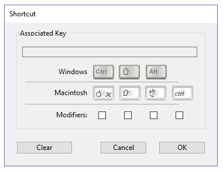

A página Interface é usada para definir várias opções relacionadas à interface do projeto.

## Geral

Esta área permite-lhe definir várias opções relativas ao ecrã.

### Fonte a ser usada com o comando MESSAGE

Haga clic en **Seleccionar...** para definir la fuente y el tamaño de los caracteres utilizados por el comando `MESSAGE`.

The default font and its size depend on the platform where 4D is running.

> This property also affects the following parts of 4D: <li>certain preview areas of the Explorer</li><li>the ruler of the Form editor</li>

### Exibir janelas

Other options configure the display of various windows in the Application mode.

- **Pantalla de inicio**: cuando esta opción no está seleccionada, la [pantalla de inicio de la barra de menú actual](Menus/bars.md#splash-screen) no aparece en modo Aplicación. Cuando oculte esta ventana, le corresponderá gestionar la visualización de todas sus ventanas por programación, por ejemplo en el método base `On Startup`.

- **Escritura de caché**: cuando esta opción está marcada, 4D muestra una ventana en la parte inferior izquierda de la pantalla mientras se vacían los datos de la caché. Since this operation momentarily blocks user actions, displaying this window lets them know that flushing is underway.

:::note

Puede definir la [frecuencia de escritura de la caché](database.md#memory-page) en **Propiedades** > **Base de datos** > **Memoria**.

:::

- **Progreso de la impresión**: permite, durante la impresión, activar o desactivar la visualización de la caja de diálogo de progreso de la impresión.

- **Usar modo SDI en Windows**: cuando esta opción está marcada, 4D habilita automáticamente el [modo SDI (Single-Document Interface)](../Menus/sdi.md) en su aplicación cuando se ejecuta en un [contexto soportado](../Menus/sdi.md#sdi-mode-availability). Al seleccionar esta opción, en Windows el menú **Ejecutar** de la barra de menú de 4D le permite seleccionar el modo en el que desea probar la aplicación:

  

:::note

This option can be selected on macOS but will be ignored when the application is executed on this platform.

:::

### Aparência

This menu lets you select the color scheme to use at the main application level. A color scheme defines a global set of interface colors for texts, backgrounds, windows, etc., used in your forms.

> Esta opção só funciona no macOS. No Windows, é sempre utilizado o esquema "Light".

Os seguintes esquemas estão disponíveis:

- **Light**: the application will use the Default Light Theme
  
- **Escuro**: o aplicativo irá usar o Tema Escuro Padrão
  
- **Heredado** (por defecto): la aplicación heredará el nivel de prioridad superior (es decir, las preferencias del usuario del sistema operativo)

> Os temas predefinidos podem ser tratados com CSS. Para más información, consulte la sección [Media Queries](../FormEditor/createStylesheet.md#media-queries).

O esquema de aplicação principal será aplicado aos formulários por defeito. No entanto, ele pode ser substituído:

- por el comando [SET APPLICATION COLOR SCHEME](https://doc.4d.com/4dv19R/help/command/en/page1762.html) a nivel de la sesión de trabajo;
- utilizando la propiedad de formulario [Color Scheme](../FormEditor/propertiesForm.html#color-scheme) en cada nivel de formulario (nivel de prioridad más alto). **Nota:** cuando se imprimen, los formularios utilizan siempre la paleta "Light".

## Atalhos

You use the Shortcuts area for viewing and modifying default shortcuts for three basic 4D form operations in your desktop applications. Esses atalhos são idênticos em ambas as plataformas. Os ícones das teclas indicam as teclas correspondentes para Windows e macOS.

Os atalhos predefinidos são os seguintes:

- Aceptación de formulario de entrada: **Entrada**
- Anulación de entrada: **Esc**
- Añadir al subformulario: **Ctrl+Mayús+/** (Windows) o **Comando+Mayús+/** (macOS)

Para cambiar el acceso directo de una operación, haga clic en el botón **Editar** correspondiente. Aparece a seguinte caixa de diálogo:

Para cambiar el acceso directo, escriba la nueva combinación de teclas en su teclado y haga clic en **OK**. Si prefiere no tener un acceso directo para una operación, haga clic en **Borrar**.
