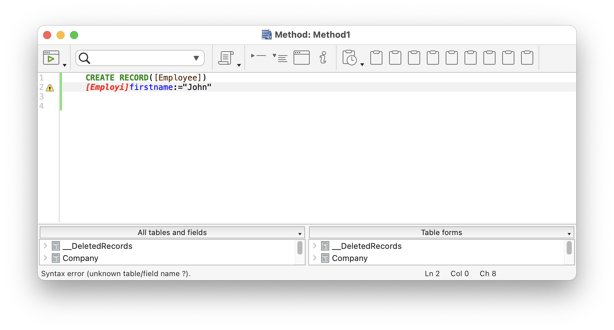

Os erros são comuns. Seria incomum escrever um número substancial de linhas de código sem gerar quaisquer erros. Por outro lado, tratar e/ou corrigir erros também é normal!

O ambiente de desenvolvimento 4D fornece várias ferramentas de depuração para todos os tipos de erros.

## Tipos de erro

### Erros de dactilografia

Os erros de digitação são detectados pelo editor de código. São exibidos em vermelho e são fornecidas informações adicionais na parte inferior da janela. Aqui está um erro de dactilografia:

Esses erros de digitação geralmente causam erros de sintaxe (na imagem acima, o nome da tabela é desconhecido). Obtém a descrição do erro quando validar a linha de código. Quando isso ocorrer, corrija o erro de digitação e digite Enter para validar a correção.

### Erros de sintaxe

Alguns erros só podem ser detectados quando o método for executado. La [ventana de error de sintáxis](#syntax-error-window) aparece cuando ocurre un error durante la ejecución del código. Por exemplo:

Expanda el área **Detalles** para mostrar el último error y su número.

### Erros ambientais

Ocasionalmente, pode não haver memória suficiente para criar um BLOB. Ou, quando se acede a um documento no disco, o documento pode não existir ou pode já estar aberto por outra aplicação. Estes erros ambientais não ocorrem diretamente devido ao seu código ou à forma como o escreveu. La mayoría de las veces estos errores son fáciles de tratar con un [método de captura de errores](Concepts/error-handling.md) instalado utilizando el comando `ON ERR CALL`.

### Erros de concepção ou de lógica

Estes são geralmente o tipo de erro mais difícil de encontrar. Com exceção dos erros de digitação, todos os tipos de erros acima enumerados são, em certa medida, abrangidos pela expressão "erro de conceção ou de lógica". Utilice el [depurador ](debugger.md) para detectarlos. Por exemplo:

- Puede ocurrir un *error de sintaxis* cuando intenta utilizar una variable que aún no está inicializada.
- Puede ocurrir un *error de entorno* cuando intenta abrir un documento, porque el nombre de ese documento es recibido por una subrutina que no obtuvo el valor correcto como parámetro.

Os erros de concepção ou lógicos incluem também situações como:

- Un registro no está correctamente actualizado porque, mientras se llama a `SAVE RECORD`, se olvidó de la primera prueba de si el registro estaba bloqueado o no.
- Um método não faz exatamente o que se espera, porque a presença de um parâmetro opcional não é testada.

Por vezes, a parte do código que apresenta o erro pode ser diferente do código que está efetivamente na origem do problema.

### Erros de execução

No modo Aplicação, pode obter erros que não se vêem no modo interpretado. Aqui está um exemplo:

Para encontrar rapidamente a origem do problema, reabrir a versão interpretada do ficheiro da estrutura, abrir o método e ir para a linha correspondente.

## Janela de erro sintáctico

A janela erro de sintaxe aparece automaticamente quando a execução de um método é interrompida. Isto pode acontecer quando:

- um erro impede a continuação da execução do código
- el método produce una afirmación falsa (ver el comando `ASSERT`)

A área de texto superior apresenta uma mensagem que descreve o erro. A área de texto inferior mostra a linha que estava a ser executada quando ocorreu o erro; a área onde ocorreu o erro é realçada. A secção Detalhes expandidos contém a "pilha" de erros relacionados com o processo.

A janela de erro de sintaxe propõe várias opções:

- **Modificar**: detiene la ejecución de todos los métodos. 4D muda para o ambiente de Design e o método com o erro é aberto no Editor de Código, permitindo sua correção. Utilize esta opção quando reconhecer imediatamente o erro e puder corrigi-lo sem mais investigações.

- **Rastrear**: entra en modo Rastrear/Depurador. Se muestra la ventana del [Depurador](debugger.md). Si la línea actual solo se ha ejecutado parcialmente, es posible que tenga que hacer clic en el botón **rastrear** varias veces.

- **Continuar**: la ejecución continua. A linha com o erro pode ser parcialmente executada, dependendo da localização do erro. Continue com cuidado: o erro pode impedir que o resto do seu método seja executado corretamente. Recomendamos hacer clic en **Continuar** sólo si el error está en una llamada trivial (como `SET WINDOW TITLE`) que no impide ejecutar y probar el resto de su código.

> Consejo: para ignorar un error que ocurre repetidamente (por ejemplo, en bucles), puede convertir el botón **Continuar** en un botón **Ignorar**. Mantenga presionada la tecla **Alt** (Windows) u **Opción** (macOS) y haga clic en el botón **Continuar** la primera vez que aparece. La etiqueta del botón cambia a **Ignorar** si el diálogo es llamado de nuevo por el mismo error.

- **Abandonar**: detiene la ejecución del método y devuelve al estado antes del inicio de la ejecución del método:

  - Se um método formulário ou um método objeto estiver a ser executado em resposta a um evento, é interrompido e o usuário regressa ao formulário.
  - Se o método estiver sendo executado a partir do ambiente Application, o usuário regressa a esse ambiente.

- **Copiar**: copia la información de depuración en el portapapeles. A informação descreve o ambiente interno do erro (número, componente interno, etc.). Eles são formatados como texto tabulado.

- **Guardar...**: guarda el contenido de la ventana de error de sintaxis y la cadena de llamadas en un archivo `.txt`.

## Depurador

Un error común de los principiantes al tratar con la detección de errores es hacer clic en **Abandonar** en la ventana de error de sintaxis, volver al editor de código, y tratar de averiguar lo que está pasando mirando el código. Não faça isso! Ahorrará mucho tiempo y energía utilizando siempre el **Depurador**.

O depurador permite-lhe percorrer os métodos lentamente. Apresenta todas as informações necessárias para compreender o motivo do erro. Assim que tiver esta informação, saberá como corrigir o erro.

Outra razão para utilizar o depurador é para desenvolver código. Por vezes, pode escrever um algoritmo que é mais complexo do que o habitual. Apesar de todos os sentimentos de realização, não pode ter a certeza absoluta de que a sua codificação está 100% correcta. En lugar de ejecutarlo "ciego", puede utilizar el comando `TRACE` al comienzo de su código, luego ejecutarlo paso a paso para mantener un ojo en lo que sucede.

## Rupturas

No processo de depuração, pode ser necessário saltar o rastreio de algumas partes do código até uma determinada linha. O, puede querer rastrear el código cuando una expresión dada tiene un determinado valor (e.. "$myVar > 1000"), o cada vez que se llama un comando 4D específico.

Estas necesidades están cubiertas por **puntos de interrupción** y las funciones de **captura de comando**. Podem ser configurados a partir do editor de código, do depurador ou do explorador de execução.
