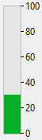

A progress indicator (also called "thermometer") is designed to display or set numeric or date/time values graphically.


## Utilizar os indicadores

Os indicadores podem ser utilizados para visualizar ou definir valores. Por exemplo, se um indicador de progresso recebe um valor por um método, ele exibe o valor. Se o usuário arrastar o ponto indicador, o valor muda. The value can be used in another object such as a field or an enterable or non-enterable object.

A variável associada ao indicador controla a visualização. O usuário coloca valores no código ou utiliza valores do código através de métodos. For example, a method for a field or enterable object could be used to control a progress indicator:

```4d
 $vTherm:=[Employees]Salary
```

Este método atribui o valor do campo Salary à variável $vTherm. Este método seria anexado ao campo Salário.

Por outro lado, é possível utilizar o indicador para controlar o valor num campo. O usuário arrasta o indicador para definir o valor. Neste caso, o método torna-se:

```4d
 [Employees]Salary:=$vTherm
```

O método atribui o valor do código ao campo Salary. À medida que o usuário arrasta o indicador, o valor no campo Salário muda.

## Termómetro predefinido



O termómetro é o indicador básico de progresso.

É possível apresentar barras de termômetros horizontais ou verticais. Isto é determinado pela forma do objeto que desenha.

Estão disponíveis várias opções gráficas: valores mínimos/máximos, graduações, passos.

### Propriedades compatíveis

[Barber shop](properties_Scale.md#barber-shop) - [Bold](properties_Text.md#bold) - [Border Line Style](properties_BackgroundAndBorder.md#border-line-style) -[Bottom](properties_CoordinatesAndSizing.md#bottom) - [Class](properties_Object.md#css-class) - [Display graduation](properties_Scale.md#display-graduation) - [Enterable](properties_Entry.md#enterable) - [Execute object method](properties_Action.md#execute-object-method) - [Expression Type](properties_Object.md#expression-type) (only "integer", "number", "date", or "time") - [Font](properties_Text.md#font) - [Font Color](properties_Text.md#font-color) - [Font Size](properties_Text.md#font-size) - [Height](properties_CoordinatesAndSizing.md#height) - [Italic](properties_Text.md#italic) - [Graduation step](properties_Scale.md#graduation-step) -[Help Tip](properties_Help.md#help-tip) - [Horizontal Sizing](properties_ResizingOptions.md#horizontal-sizing) - [Label Location](properties_Scale.md#label-location) - [Left](properties_CoordinatesAndSizing.md#left) - [Maximum](properties_Scale.md#maximum) - [Minimum](properties_Scale.md#minimum) - [Number Format](properties_Display.md#number-format) - [Object Name](properties_Object.md#object-name) - [Right](properties_CoordinatesAndSizing.md#right) - [Step](properties_Scale.md#step) - [Top](properties_CoordinatesAndSizing.md#top) - [Type](properties_Object.md#type) - [Underline](properties_Text.md#underline) - [Variable or Expression](properties_Object.md#variable-or-expression) - [Vertical Sizing](properties_ResizingOptions.md#vertical-sizing) - [Visibility](properties_Display.md#visibility) - [Width](properties_CoordinatesAndSizing.md#width)

## Barber shop


**Barber shop** é uma variante do termômetro predefinido. Para activar esta variante, es necesario definir la propiedad [Barber shop](properties_Scale.md#barber-shop).

> In JSON code, just remove "max" property from a default thermometer object to enable the Barber shop variant.

La Barber shop muestra una animación continua, como la [spinner](spinner.md). These thermometers are generally used to indicate to the user that the program is in the process of carrying out a long operation. Cuando se selecciona esta variante termómetro, [las propiedades de la escala gráfica](properties_Scale.md) no están disponibles.

Quando o formulário é executado, o objeto não é animado. La animación se gestiona pasando un valor a su [variable o expresión asociada](properties_Object.md#variable-or-expression):

- 1 = Iniciar a animação,
- 0 = Parar a animação.

### Propriedades compatíveis

[Barber shop](properties_Scale.md#barber-shop) - [Bold](properties_Text.md#bold) - [Border Line Style](properties_BackgroundAndBorder.md#border-line-style) -[Bottom](properties_CoordinatesAndSizing.md#bottom) - [Class](properties_Object.md#css-class) - [Enterable](properties_Entry.md#enterable) - [Execute object method](properties_Action.md#execute-object-method) - [Expression Type](properties_Object.md#expression-type) (only "integer", "number", "date", or "time") - [Font](properties_Text.md#font) - [Font Color](properties_Text.md#font-color) - [Font Size](properties_Text.md#font-size) - [Height](properties_CoordinatesAndSizing.md#height) - [Help Tip](properties_Help.md#help-tip) - [Horizontal Sizing](properties_ResizingOptions.md#horizontal-sizing) - [Italic](properties_Text.md#italic) - [Left](properties_CoordinatesAndSizing.md#left) - [Object Name](properties_Object.md#object-name) - [Right](properties_CoordinatesAndSizing.md#right) - [Top](properties_CoordinatesAndSizing.md#top) - [Type](properties_Object.md#type) - [Underline](properties_Text.md#underline) - [Variable or Expression](properties_Object.md#variable-or-expression) - [Vertical Sizing](properties_ResizingOptions.md#vertical-sizing) - [Visibility](properties_Display.md#visibility) - [Width](properties_CoordinatesAndSizing.md#width)

## Veja também

- [rulers](ruler.md)
- [steppers](stepper.md)
