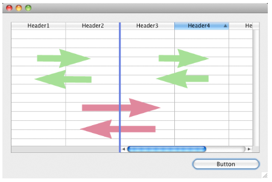

---

## Colunas

Coleção de colunas do list box.

#### Gramática JSON

| Nome    | Tipo de dados               | Valores possíveis                              |
| ------- | --------------------------- | ---------------------------------------------- |
| columns | colecção de objectos coluna | Contém as propriedades das colunas de list box |

Para ver una lista de las propiedades que soportan los objetos columna, consulte la sección [Propiedades específicas de la columna](listbox_overview.md#column-specific-properties).

#### Objectos suportados

[List Box](listbox_overview.md)

---

## Nome formulário detalhe

`List box do tipo selecção`

Specifies the form to use for modifying or displaying individual records of the list box.

O formulário especificado é apresentado:

- cuando se utilizan las acciones estándar `Add Subrecord` y `Edit Subrecord` aplicadas al list box (ver [Utilización de las acciones estándar](https://doc.4d.com/4Dv20/4D/20/Using-standard-actions.300-6263819.en.html)),
- cuando se hace doble clic en una línea y la propiedad [Doble clic en la línea ](#double-click-on-row)está definida en "Editar registro" o "Mostrar registro".

#### Gramática JSON

| Nome       | Tipo de dados | Valores possíveis                                                                                                                                  |
| ---------- | ------------- | -------------------------------------------------------------------------------------------------------------------------------------------------- |
| detailForm | string        | <li>Name (string) of table or project form</li><li>POSIX path (string) to a .json file describing the form</li><li>Object describing the form</li> |

#### Objectos suportados

[List Box](listbox_overview.md)

---

## Duplo clique em linha

`List box do tipo selecção`

Sets the action to be performed when a user double-clicks on a row in the list box. As opções disponíveis são:

- **No hacer nada** (por defecto): hacer doble clic en una línea no desencadena ninguna acción automática.
- **Editar registro**: al hacer doble clic en una línea se muestra el registro correspondiente en el formulario detallado definido [ para el list box](#detail-form-name). O registo é aberto em modo de leitura-escrita para poder ser modificado.
- **Mostrar registro**: idéntica a la acción anterior, salvo que el registro se abre en modo de sólo lectura para que no pueda ser modificado.

> \> > Double-clicking an empty row is ignored in list boxes.

Independientemente de la acción seleccionada/elegida, se genera el evento de formulario `On Double clicked`.

Para las dos últimas acciones, también se genera el evento de formulario `On Open Detail`. `On Close Detail` se genera cuando un registro mostrado en el formulario detallado asociado al list box está a punto de cerrarse (independientemente de que el registro se haya modificado o no).

#### Gramática JSON

| Nome                   | Tipo de dados | Valores possíveis                   |
| ---------------------- | ------------- | ----------------------------------- |
| doubleClickInRowAction | string        | "editSubrecord", "displaySubrecord" |

#### Objectos suportados

[List Box](listbox_overview.md)

---

## Ressaltar conjunto

`List box do tipo selecção`

Esta propiedad se utiliza para especificar el conjunto a utilizar para gestionar los registros resaltados en el list box (cuando se selecciona la fuente de datos **Arrays**, se utiliza un conjunto booleano con el mismo nombre que el list box).

4D crea un conjunto por defecto llamado _ListBoxSetN_ donde _N_ empieza en 0 y se incrementa según el número de list boxes en el formulario. Se necessário, pode alterar o conjunto predefinido. Puede ser un conjunto local, proceso o interproceso (recomendamos utilizar un conjunto local, por ejemplo _$LBSet_, para limitar el tráfico de red). É então mantido automaticamente por 4D. If the user selects one or more rows in the list box, the set is updated immediately. If you want to select one or more rows by programming, you can apply the commands of the “Sets” theme to this set.

> - The highlighted status of the list box rows and the highlighted status of the table records are completely independent.
> - If the “Highlight Set” property does not contain a name, it will not be possible to make selections in the list box.

#### Gramática JSON

| Nome         | Tipo de dados | Valores possíveis |
| ------------ | ------------- | ----------------- |
| highlightSet | string        | Nome do conjunto  |

#### Objectos suportados

[List Box](listbox_overview.md)

---

## Colunas bloqueadas e colunas estáticas

Locked columns and static columns are two separate and independent functionalities in list boxes:

- Locked columns always stay displayed to the left of the list box; they do not scroll horizontally.
- As colunas estáticas não podem ser movidas por arrastar e largar dentro do list box.

> Puede definir columnas estáticas y bloqueadas por programación, consulte la sección "List Box" en el manual _de Lenguaje 4D_.

Estas propriedades interagem da seguinte forma:

- Se definir colunas que são apenas estáticas, estas não podem ser deslocadas.

- Se definir colunas bloqueadas, mas não estáticas, pode ainda alterar a sua posição livremente na área bloqueada. No entanto, uma coluna bloqueada não pode ser movida para fora dessa área bloqueada.



- If you set all of the columns in the locked area as static, you cannot move these columns within the locked area.


- You can set a combination of locked and static columns according to your needs. For example, if you set three locked columns and one static column, the user can swap the two right-most columns within the locked area (since only the first column is static).

### Número de colunas estáticas

Number of columns that must stay permanently displayed in the left part of the list box, even when the user scrolls through the columns horizontally.

#### Gramática JSON

| Nome              | Tipo de dados | Valores possíveis         |
| ----------------- | ------------- | ------------------------- |
| lockedColumnCount | integer       | mínimo: 0 |

#### Objectos suportados

[List Box](listbox_overview.md)

### Número de colunas

Número de colunas que não podem ser movidas durante a execução.

#### Gramática JSON

| Nome              | Tipo de dados | Valores possíveis         |
| ----------------- | ------------- | ------------------------- |
| staticColumnCount | integer       | mínimo: 0 |

#### Objectos suportados

[List Box](listbox_overview.md)

---

## Número de colunas trancadas

Define o número de colunas do list box.

> You can add or remove columns dynamically by programming, using commands such as [`LISTBOX INSERT COLUMN`](https://doc.4d.com/4dv20/help/command/en/page829.html) or [`LISTBOX DELETE COLUMN`](https://doc.4d.com/4dv20/help/command/en/page830.html).

#### Gramática JSON

| Nome        | Tipo de dados | Valores possíveis         |
| ----------- | ------------- | ------------------------- |
| columnCount | integer       | mínimo: 1 |

#### Objectos suportados

[List Box](listbox_overview.md)

---

## Array controle linha

`List box do tipo array`

Um array 4D que controla a apresentação das linhas do list box.

Pode definir as propriedades de interface "oculto", "desativado" e "selecionável" para cada linha de um list box baseado num array utilizando este array. También puede ser designado utilizando el comando `LISTBOX SET ARRAY`.

O array de controlo de linhas deve ser do tipo Longint e incluir o mesmo número de linhas que o list box. Cada elemento del _Array de control de líneas_ define el estado de la interfaz de su línea correspondiente en el list box. Three interface properties are available using constants in the "List Box" constant theme:

| Parâmetros               | Valor | Comentário                                                                                                                                                                                                                                                                                                                                                                                                                                                                                                                                                                                                                                                                                                                                                                                                                                                                    |
| ------------------------ | ----- | ----------------------------------------------------------------------------------------------------------------------------------------------------------------------------------------------------------------------------------------------------------------------------------------------------------------------------------------------------------------------------------------------------------------------------------------------------------------------------------------------------------------------------------------------------------------------------------------------------------------------------------------------------------------------------------------------------------------------------------------------------------------------------------------------------------------------------------------------------------------------------- |
| lk row is disabled       | 2     | A linha correspondente é desactivada. O texto e os controlos, como as caixas de verificação, estão esbatidos ou a cinzento. As áreas de entrada de texto inserível já não são inseríveis. Valor padrão: Activado                                                                                                                                                                                                                                                                                                                                                                                                                                                                                                                                                                                              |
| lk row is hidden         | 1     | A linha correspondente é ocultada. A ocultação de linhas apenas afeta a visualização do list box. The hidden rows are still present in the arrays and can be managed by programming. Los comandos de lenguaje, más concretamente `LISTBOX Get number of rows` o `LISTBOX GET CELL POSITION`, no tienen en cuenta el estado mostrado/oculto de las líneas. Por ejemplo, en un list box con 10 líneas en el que las 9 primeras líneas están ocultas, `LISTBOX Get number of rows` devuelve 10. From the user’s point of view, the presence of hidden rows in a list box is not visibly discernible. Somente as linhas visíveis podem ser selecionadas (por exemplo, usando o comando Selecionar tudo). Valor padrão: Visível |
| lk row is not selectable | 4     | A linha correspondente não é selecionável (não é possível realçar). Las áreas de entrada de texto ya no se pueden modificar a menos que esté activada la opción [Single-Click Edit](properties_Entry.md#single-click-edit). No entanto, os controlos como as caixas de verificação e as listas continuam a funcionar. Esta definição é ignorada se o modo de seleção do list box é "Nenhum". Valor por defeito: Selecionável                                                                                                                                                                                                                                                                                                                                               |

To change the status for a row, you just need to set the appropriate constant(s) to the corresponding array element. Por exemplo, se não quiser que a linha #10 seja selecionável, você pode digitar:

```4d
 aLControlArr{10}:=lk row is not selectable
```


É possível definir várias propriedades de interface de uma só vez:

```4d
 aLControlArr{8}:=lk row is not selectable + lk row is disabled
```


Note that setting properties for an element overrides any other values for this element (if not reset). Por exemplo:

```4d
 aLControlArr{6}:=lk row is disabled + lk row is not selectable
 //define a linha 6 como desativada E não selecionável
 aLControlArr{6}:=lk row is disabled
 //define a linha 6 como desativada mas selecionável novamente
```

#### Gramática JSON

| Nome             | Tipo de dados | Valores possíveis                  |
| ---------------- | ------------- | ---------------------------------- |
| rowControlSource | string        | Nome do array de controlo de linha |

#### Objectos suportados

[List Box](listbox_overview.md)

---

## Modo seleção

Designa a opção que permite aos utilizadores selecionar linhas:

- **Ninguna**: las líneas no se pueden seleccionar si se elige este modo. Hacer clic en la lista no tendrá ningún efecto a menos que la opción [Edición con un solo clic](properties_Entry.md#single-click-edit) esté activada. Las teclas de navegación sólo hacen que la lista se desplace; no se genera el evento de formulario `On Selection Change`.
- **Simple**: en este modo se puede seleccionar una línea a la vez. Ao clicar em uma linha, ela será selecionada. A **Ctrl+click** (Windows) or **Command+click** (macOS) on a row toggles its state (between selected or not).\
  The Up and Down arrow keys select the previous/next row in the list. As outras teclas de navegação percorrem a lista. El evento de formulario `On Selection Change` se genera cada vez que se cambia la línea actual.
- **Múltiple**: en este modo se pueden seleccionar varias líneas simultáneamente.

#### Gramática JSON

| Nome          | Tipo de dados | Valores possíveis            |
| ------------- | ------------- | ---------------------------- |
| selectionMode | string        | "multiple", "single", "none" |

#### Objectos suportados

[List Box](listbox_overview.md)
