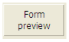

---

## Tipo

`CONFIGURAÇÃO OBRIGATÓRIA`

Esta propiedad designa el tipo del [objeto formulario activo o inactivo](formObjects_overview.md).

#### Gramática JSON

| Nome | Tipo de dados | Valores possíveis                                                                                                                                                                                                                                                                                        |
| ---- | ------------- | -------------------------------------------------------------------------------------------------------------------------------------------------------------------------------------------------------------------------------------------------------------------------------------------------------- |
| type | string        | "button", "buttonGrid", "checkbox", "combo", "dropdown", "groupBox", "input", "line", "list", "listbox", "oval", "picture", "pictureButton", "picturePopup", "plugin", "progress", "radio", "rectangle", "ruler", "spinner", "splitter", "stepper", "subform", "tab", "text", "view", "webArea", "write" |

#### Objectos suportados

[Área 4D View Pro](viewProArea_overview) - [Área 4D Write Pro](writeProArea_overview) - [Botão](button_overview.md) - [Grade de botões](buttonGrid_overview.md) - [Caixa de seleção](checkbox_overview.md) - [Combo Box](comboBox_overview.md) - [Lista suspensa](dropdownList_Overview.md) - [Group Box](groupBox.md) - [Lista hierárquica](list_overview.md) - [List Box](listbox_overview.md) - [Coluna List Box](listbox_overview.md#list-box-columns) - [Rodapie List Box](listbox_overview.md#list-box-footers) - [Cabeçalho de List Box](listbox_overview.md#list-box-headers) - [Botão de imagem](pictureButton_overview.md) - [Menu pop-up com imagem](picturePopupMenu_overview.md) - [Área de Plug-in](pluginArea_overview.md) - [Indicador de progresso](progressIndicator.md) - [Botão de opção](radio_overview.md) - [Spinner](spinner.md) - [Separador](splitters.md) -  - [Etapas](stepper.md) - [Subformulário](subform_overview.md) - [Control de pestañas](tabControl.md) - [Área de texto](text.md) - [Área web](webArea_overview.md)

---

## Nome de objeto

Cada objeto de formulário ativo está associado a um nome de objeto. Cada nome de objeto deve ser único.

> Os nomes dos objectos estão limitados a um tamanho de 255 bytes.

Ao usar a linguagem 4D, você pode se referir a um objeto de formulário ativo pelo nome do objeto (para obter mais informações sobre isso, consulte [Propriedades Objeto](https://doc.4d.com/4Dv17R5/4D/17-R5/Object-Properties.300-4128195.en.html) no manual de referência da linguagem 4D).

Para obter mais informações sobre regras de nomenclatura para objetos de formulário, consulte a seção [Identificadores](Concepts/identifiers.md).

#### Gramática JSON

| Nome | Tipo de dados | Valores possíveis                                                 |
| ---- | ------------- | ----------------------------------------------------------------- |
| name | string        | Qualquer nome permitido que não pertença a um objeto já existente |

#### Objectos suportados

[Área 4D View Pro](viewProArea_overview) - [Área 4D Write Pro](writeProArea_overview) - [Botão](button_overview.md) - [Grade de botões](buttonGrid_overview.md) - [Caixa de seleção](checkbox_overview.md) - [Combo Box](comboBox_overview.md) - [Lista suspensa](dropdownList_Overview.md) - [Group Box](groupBox.md) - [Lista hierárquica](list_overview.md) - [List Box](listbox_overview.md) - [Coluna List Box](listbox_overview.md#list-box-columns) - [Rodapie List Box](listbox_overview.md#list-box-footers) - [Cabeçalho de List Box](listbox_overview.md#list-box-headers) - [Botão de imagem](pictureButton_overview.md) - [Menu pop-up com imagem](picturePopupMenu_overview.md) - [Área de Plug-in](pluginArea_overview.md) - [Indicador de progresso](progressIndicator.md) - [Spinner](spinner.md) - [Separador](splitters.md) - [Imagem estática](staticPicture.md) - [Etapas](stepper.md) - [Botão de opção](radio_overview.md) - [Subformulário](subform_overview.md) - [Control de pestañas](tabControl.md) - [Área de texto](text.md) - [Área web](webArea_overview.md)

---

## Guardar valor

Esta propriedade está disponível quando a opção [Salvar Geometria](FormEditor/properties_FormProperties.md#save-geometry) está marcada para o formulário.

Essa funcionalidade só é suportada por objetos que contribuam para a geometria geral do formulário. Por exemplo, essa opção está disponível para caixas de seleção porque seu valor pode ser usado para ocultar ou exibir áreas adicionais na janela.

Eis a lista de objetos cujo valor pode ser guardado:

| Object                                     | Valor guardado                                                                                            |
| ------------------------------------------ | --------------------------------------------------------------------------------------------------------- |
| [Caixa de seleção](checkbox_overview.md)   | Valor da variável associada (0, 1, 2)                                                  |
| [Lista suspensa](dropdownList_Overview.md) | Número da linha seleccionada                                                                              |
| [Botão de rádio](radio_overview.md)        | Valor da variável associada (1, 0, True ou False para os botões, consoante o seu tipo) |
| [Controle de guias](tabControl.md)         | Número da aba selecionada                                                                                 |

#### Gramática JSON

| Nome          | Tipo de dados | Valores possíveis |
| ------------- | ------------- | ----------------- |
| memorizeValue | boolean       | true, false       |

#### Objectos suportados

[Casilla de selección](checkbox_overview.md) - [Lista desplegable](dropdownList_Overview.md) - [Botón de radio](radio_overview.md) - [Control de pestañas](tabControl.md)

---

## Variável ou expressão

> Consulte também **[Expression](properties_DataSource.md#expression)** para colunas do list box do tipo seleção e coleção.

Esta propriedade especifica a fonte dos dados. Cada objeto de formulário ativo está associado a um nome de objeto e a um nome de variável. O nome da variável pode diferir do nome do objeto. No mesmo formulário, você pode usar a mesma variável várias vezes, mas cada [nome do objeto](#object-name) deve ser exclusivo.

> O tamanho do nome da variável é limitado a 31 bytes. Consulte a seção [Identificadores](Concepts/identifiers.md) para obter mais informações sobre regras de nomenclatura.

As variáveis de objeto do formulário permitem controlar e monitorar os objetos. Por exemplo, quando um botão é clicado, sua variável é definida como 1; em todos os outros momentos, ela é 0. A expressão associada a um indicador de progresso permite que você leia e altere a configuração atual.

As variáveis ou expressões podem ser digitáveis ou não digitáveis e podem receber dados do tipo Texto, Inteiro, Numérico, Data, Hora, Imagem, Booliano ou Objeto.

#### Gramática JSON

| Nome       | Tipo de dados              | Valores possíveis                                                                                                                                                                                                                                                           |
| ---------- | -------------------------- | --------------------------------------------------------------------------------------------------------------------------------------------------------------------------------------------------------------------------------------------------------------------------- |
| dataSource | string ou array de strings | <li>Variável 4D, nome de campo ou qualquer expressão.</li><li>String vazia para [variáveis dinâmicas](#dynamic-variables).</li><li>Matriz de strings (coleção de nomes de matriz) para uma coluna [hierarchical listbox](listbox_overview.md#hierarchical-list-boxes)]</li> |

### Expressões

Você pode usar uma [expressão](Concepts/quick-tour.md#expressions) como fonte de dados para um objeto. Se permite toda expresión 4D válida: expresión simple, propiedad de objeto, fórmula, función 4D, nombre de método proyecto o campo que utilice la sintaxis estándar `[Table]Field`. A expressão é avaliada quando o formulário é executado e reavaliada para cada evento do formulário. The expression is evaluated when the form is executed and reevaluated for each form event.

> Se o valor inserido corresponder tanto a um nome de variável quanto a um nome de método, 4D considera que você está indicando o método.

### Variáveis dinâmicas

Você pode deixar a cargo de 4D a criação de variáveis associadas aos objetos do formulário (botões, variáveis inseríveis, caixas de seleção etc.) dinamicamente e de acordo com suas necessidades. Para ello, basta con dejar en blanco la propiedad "Variable o expresión" (o el campo JSON de `dataSource`).

Quando uma variável não é nomeada, quando o formulário é carregado, 4D cria uma variável para o objeto, com um nome calculado único no espaço das variáveis de processo do intérprete (o que significa que esse mecanismo pode ser usado mesmo no modo compilado). Esta variável temporária será destruída quando o formulário for fechado.
Para que este princípio funcione em modo compilado, é imperativo que as variáveis dinâmicas sejam explicitamente tipadas. Há duas formas de o fazer:

- Você pode definir o tipo usando a propriedade [Tipo de expressão](#expression-type).
- Você pode usar um código de inicialização específico quando o formulário for carregado, usando, por exemplo, o comando `VARIABLE TO VARIABLE`:

```4d
 If(Form event code=On Load)
    var $init : Text
    $Ptr_object:=OBJECT Get pointer(Object named;"comments")
    $init:=""
    VARIABLE TO VARIABLE(Current process;$Ptr_object->;$init)
 End if
```

No código 4D, as variáveis dinâmicas podem ser acessadas usando um ponteiro obtido com o comando `OBJECT Get pointer`. Por exemplo:

```4d
  // atribuir a hora 12:00:00 à variável do objeto "tstart"
 $p :=OBJECT Get pointer(Object named;"tstart")
 $p->:=?12:00:00?
```

Este mecanismo tem duas vantagens:

- Por um lado, ele permite o desenvolvimento de componentes do tipo "subformulário" que podem ser usados várias vezes no mesmo formulário host. Tomemos como exemplo o caso de um subformulário datepicker que é inserido duas vezes em um formulário host para definir uma data inicial e uma data final. Esse subformulário usará objetos para escolher a data do mês e do ano. Será necessário que esses objetos trabalhem com variáveis diferentes para a data de início e a data de término. Permitir que 4D crie sua variável com um nome exclusivo é uma forma de resolver essa dificuldade.
- Por outro lado, pode ser utilizado para limitar a utilização da memória. De facto, os objectos formulário só funcionam com variáveis processo ou inter-processo. No entanto, no modo compilado, uma instância de cada variável de processo é criada em todos os processos, incluindo os processos do servidor. Essa instância ocupa memória, mesmo quando o formulário não é usado durante a sessão. Portanto, permitir que 4D crie variáveis dinamicamente ao carregar os formulários pode economizar memória.

### List box array

Para un list box array, la propiedad **Variable o Expresión** normalmente contiene el nombre de la variable array definida para el list box y para cada columna. No entanto, você pode usar uma matriz de strings (contendo nomes de matrizes) como valor *dataSource* para uma coluna de caixa de listagem para definir uma [caixa de listagem hierárquica] (listbox_overview.md#hierarchical-list-boxes).

#### Objectos compatíveis

[Área 4D View Pro](viewProArea_overview) - [Área 4D Write Pro](writeProArea_overview) - [Botão](button_overview.md) - [Grade de botões](buttonGrid_overview.md) - [Caixa de seleção](checkbox_overview.md) - [Combo Box](comboBox_overview.md) - [Lista suspensa](dropdownList_Overview.md) - [Lista hierárquica](list_overview.md#overview) - [List Box](listbox_overview.md#overview) - [Coluna List Box](listbox_overview.md#list-box-columns) - [Cabeçalho List Box](listbox_overview.md#list-box-headers) - [Rodapie de List Box](listbox_overview.md#list-box-footers) - [Menu pop-up com imagem](picturePopupMenu_overview.md) - [Área de Plug-in](pluginArea_overview.md#overview) - [Indicador de progresso](progressIndicator.md) - [Botão de opção](radio_overview.md) - [Seletor](spinner.md) - [Separador](splitters.md) - [Etapas](stepper.md) - [Subformulário](subform_overview.md#overview) - [Controle de tabulação](tabControl.md) - [Área web](webArea_overview.md)

---

## Tipo de expressão

> Essa propriedade é chamada de [**Data Type**](properties_DataSource.md#data-type-expression-type) na Lista de propriedades para [selection](listbox_overview.md#selection-list-boxes) e [collection](listbox_overview.md#collection-or-entity-selection-list-boxes) e para colunas de caixa de listagem do tipo [Drop-down Lists](dropdownList_Overview.md) associadas a um [objeto](FormObjects/dropdownList_Overview.md#using-an-object) ou a um [array](FormObjects/dropdownList_Overview.md#using-an-array).

Especifique o tipo de dados para a expressão ou variável associada ao objeto. Observe que o principal objetivo dessa configuração é definir as opções (como formatos de exibição) disponíveis para o tipo de dados. Não digita efetivamente a variável em si. Considerando a compilação do projeto, você deve [declarar a variável](Concepts/variables.md#declaring-variables).

No entanto, essa propriedade tem uma função de digitação nos seguintes casos específicos:

- **[Variáveis dinâmicas](#dynamic-variables)**: você pode usar essa propriedade para declarar o tipo de variáveis dinâmicas.
- **[List Box Columns](listbox_overview.md#list-box-columns)**: essa propriedade é usada para associar um formato de exibição aos dados da coluna. Os formatos fornecidos dependerão do tipo de variável (caixa de lista de tipos de matriz) ou do tipo de data/campo (caixas de lista de tipos de coleção e seleção). Os formatos padrão 4D que podem ser usados são: Alfa, Numeric, Data, Hora, Imagem e Booleano. O tipo de texto não tem formatos de visualização específicos. Também estão disponíveis quaisquer formatos personalizados existentes.
- **[Variables imagen](input_overview.md)**: puede utilizar este menú para declarar las variables antes de cargar el formulario en modo interpretado. Mecanismos nativos específicos governam a exibição de variáveis de imagens em formas. Esses mecanismos requerem maior precisão na configuração das variáveis: a partir de agora, elas devem já ter sido declaradas antes de carregarem o formulário — i. ., mesmo antes do evento `No carregamento` — ao contrário de outros tipos de variáveis. Para fazer isso, você também precisa que a instrução `C_PICTURE(varName)` tenha sido executada antes de carregar o formulário (tipicamente, no método chamando o comando `DIALOG`), ou para que a variável tenha sido digitada no nível de formulário usando a propriedade do tipo de expressão.
  Caso contrário, a variável de imagem não será exibida corretamente (apenas no modo de interpretação).

#### Gramática JSON

| Nome               | Tipo de dados | Valores possíveis                                                                                                                                                                                                                                                                                                                            |
| ------------------ | ------------- | -------------------------------------------------------------------------------------------------------------------------------------------------------------------------------------------------------------------------------------------------------------------------------------------------------------------------------------------- |
| dataSourceTypeHint | string        | <li>**objetos padrão:** "inteiro", "boolean", "number", "picture", "text", date", "time", "arrayText", "arrayDate", "arrayTime", "arrayNumber", "collection", "object", "undefined"</li><li>**colunas da caixa de lista:** "booleano", "number", "picture", "text", date", "time". *Array/selection list box only*: "integer", "object"</li> |

#### Objectos suportados

[Check Box](checkbox_overview.md) - [Combo Box](comboBox_overview.md) - [Drop-down List](dropdownList_Overview.md) - [Input](input_overview.md) - [List Box Column](listbox_overview.md#list-box-columns) - [List Box Footer](listbox_overview.md#list-box-footers) - [Plug-in Area](pluginArea_overview.md#overview) - [Progress indicator](progressIndicator.md) - [Radio Button](radio_overview.md) - [Ruler](ruler.md) - [Spinner](spinner.md) - [Stepper](stepper.md) - [Subform](subform_overview.md) - [Tab Control](tabControl.md)

---

## Classe CSS

Lista de palabras separadas por espacios que se utilizan como selectores de clase en los [archivos css](FormEditor/createStylesheet.md#style-sheet-files).

#### Gramática JSON

| Nome    | Tipo de dados | Valores possíveis                                                                                                         |
| ------- | ------------- | ------------------------------------------------------------------------------------------------------------------------- |
| "class" | string        | Uma cadeia de caracteres com o(s) nome(s) do CSS separados por caracteres de espaço |

#### Objectos compatíveis

[Área 4D View Pro](viewProArea_overview) - [Área 4D Write Pro](writeProArea_overview) - [Botão](button_overview.md) - [Grade de botões](buttonGrid_overview.md) - [Caixa de seleção](checkbox_overview.md) - [Combo Box](comboBox_overview.md) - [Lista suspensa](dropdownList_Overview.md) - [Group Box](groupBox.md) - [Lista hierárquica](list_overview.md) - [List Box](listbox_overview.md) - [Coluna List Box](listbox_overview.md#list-box-columns) - [Rodapie List Box](listbox_overview.md#list-box-footers) - [Cabeçalho de List Box](listbox_overview.md#list-box-headers) - [Botão de imagem](pictureButton_overview.md) - [Menu pop-up com imagem](picturePopupMenu_overview.md) - [Área de Plug-in](pluginArea_overview.md) - [Indicador de progresso](progressIndicator.md) - [Botão de opção](radio_overview.md) - [Spinner](spinner.md) - [Separador](splitters.md) -  - [Etapas](stepper.md) - [Subformulário](subform_overview.md) - [Control de pestañas](tabControl.md) - [Área de texto](text.md) - [Área web](webArea_overview.md)

---

## Seleção de entidade ou coleção

Para usar elementos da coleção ou entidades para definir o conteúdo da linha da caixa de lista.

Insira uma expressão que retorne uma coleção ou uma seleção de entidades. Geralmente, você irá digitar o nome de uma variável, um elemento de coleção ou uma propriedade que contém uma coleção ou uma seleção de entidade.

A coleção ou a seleção da entidade deve estar disponível para o formulário quando for carregada. Each element of the collection or each entity of the entity selection will be associated to a list box row and will be available as an object through the [`This`](../Concepts/classes.md#this) keyword:

- si ha utilizado una colección de objetos, puede llamar a **This** en la expresión de la fuente de datos para acceder a cada valor de propiedad, por ejemplo `This.<propertyPath>`.
- si ha utilizado una selección de entidades, puede llamar a **This** en la expresión de la fuente de datos para acceder a cada valor de atributo, por ejemplo `This.<attributePath>`.

> Si ha utilizado una colección de valores escalares (y no objetos), 4D le permite mostrar cada valor llamando a **This.value** en la expresión datasource. However in this case you will not be able to modify values or to access the current object (see below).

#### Gramática JSON

| Nome       | Tipo de dados | Valores possíveis                                                              |
| ---------- | ------------- | ------------------------------------------------------------------------------ |
| dataSource | string        | Expressão que devolve uma coleção ou uma seleção de entidades. |

#### Objectos suportados

[List Box](listbox_overview.md)

---

## Fonte de dados

Especifique o tipo de list box.


- **Arrays**(por defecto): utiliza elementos de array como líneas del list box.
- **Selección actual**: utiliza expresiones, campos o métodos cuyos valores se evaluarán para cada registro de la selección actual de una tabla.
- **Selección temporal**: utiliza expresiones, campos o métodos cuyos valores se evaluarán para cada registro de una selección temporal.
- **Colección o Selección de entidades**: utilice elementos de colección o entidades para definir el contenido de las líneas del list box. Tenga en cuenta que con este tipo de list box, debe definir la propiedad [Colección o Selección de entidades](properties_Object.md#collection-or-entity-selection).

#### Gramática JSON

| Nome        | Tipo de dados | Valores possíveis                                           |
| ----------- | ------------- | ----------------------------------------------------------- |
| listboxType | string        | "array", "currentSelection", "namedSelection", "collection" |

#### Objectos suportados

[List Box](listbox_overview.md)

---

## Tipo de plug-in

Nombre del [área externa del plug-in](pluginArea_overview.md) asociada al objeto. Plug-in external area names are published in the manifest.json file of the plug-in.

#### Gramática JSON

| Nome           | Tipo de dados | Valores possíveis                                                             |
| -------------- | ------------- | ----------------------------------------------------------------------------- |
| pluginAreaKind | string        | Nome da área externa do plug-in (começa com um carácter %) |

#### Objectos suportados

[Área de Plug-in](pluginArea_overview.md)

---

## Grupo Rádio

Enables radio buttons to be used in coordinated sets: only one button at a time can be selected in the set.

#### Gramática JSON

| Nome       | Tipo de dados | Valores possíveis   |
| ---------- | ------------- | ------------------- |
| radioGroup | string        | Nome do grupo rádio |

#### Objectos suportados

[Botão de rádio](radio_overview.md)

---

## Título

Permite inserir uma etiqueta num objeto. O tipo de letra e o estilo desta etiqueta podem ser especificados.

Pode forçar um retorno de carro na etiqueta utilizando o carácter \ (barra invertida).



Para inserir um \ na etiqueta, introduzir "\\".

Por padrão, a etiqueta é colocada no centro do objeto. When the object also contains an icon, you can modify the relative location of these two elements using the [Title/Picture Position](properties_TextAndPicture.md#titlepicture-position) property.

Para la traducción de la aplicación, puede introducir una referencia XLIFF en el área del título de un botón (ver [Apéndice B: arquitectura XLIFF](https://doc.4d.com/4Dv17R5/4D/17-R5/Appendix-B-XLIFF-architecture.300-4163748.en.html)).

#### Gramática JSON

| Nome | Tipo de dados | Valores possíveis |
| ---- | ------------- | ----------------- |
| text | string        | qualquer texto    |

#### Objectos suportados

[Botón](button_overview.md) - [Casilla de selección](checkbox_overview.md) - [Encabezado List Box](listbox_overview.md#list-box-headers) - [Botón radio](radio_overview.md) - [ÁreaTexto](text.md)

---

## Cálculo de variáveis

Esta propiedad define el tipo de cálculo que se realizará en un área [pie de columna](listbox_overview.md#list-box-footers).

> The calculation for footers can also be set using the [`LISTBOX SET FOOTER CALCULATION`](https://doc.4d.com/4dv19/help/command/en/page1140.html) 4D command.

Existem vários tipos de cálculos disponíveis. The following table shows which calculations can be used according to the type of data found in each column and indicates the type automatically affected by 4D to the footer variable (if it is not typed by the code):

| Cálculo                                   | Num | Text | Date | Hora | Bool | Pict | tipo var rodapé         |
| ----------------------------------------- | --- | ---- | ---- | ---- | ---- | ---- | ----------------------- |
| Mínimo                                    | X   | X    | X    | X    | X    |      | Igual ao tipo de coluna |
| Máximo                                    | X   | X    | X    | X    | X    |      | Igual ao tipo de coluna |
| Soma                                      | X   |      |      | X    | X    |      | Igual ao tipo de coluna |
| Contagem                                  | X   | X    | X    | X    | X    | X    | Integer                 |
| Média                                     | X   |      |      | X    |      |      | Real                    |
| Desvio padrão(\*)      | X   |      |      | X    |      |      | Real                    |
| Variância(\*)          | X   |      |      | X    |      |      | Real                    |
| Soma dos quadrados(\*) | X   |      |      | X    |      |      | Real                    |
| Personalizado ("none") | X   | X    | X    | X    | X    | X    | Qualquer                |

(\*) Apenas para list boxes do tipo array.

> Sólo las [variables](Concepts/variables.md) declaradas o dinámicas pueden utilizarse para mostrar los cálculos de pie de página. No se soportan otros tipos de [expresiones](Concepts/quick-tour.md#expressions) como `Form.value`.

Note that the calculation does not take the shown/hidden state of list box rows into account. If you want to restrict a calculation to only visible rows, you must use a custom calculation.

*Null* no se tienen en cuenta para ningún cálculo.

If the column contains different types of values (collection-based column for example):

- Average and Sum only take numerical elements into account (other element types are ignored).
- Mínimo y Máximo devuelven un resultado según el orden habitual de las listas de tipos, tal como se define en la función [collection.sort()](API/CollectionClass.md#sort).

Using automatic calculations in footers of columns based upon expressions has the following limitations:

- es **soportado** con todos los tipos de list boxes cuando la expresión es "simple" (como `[table]field` o `this.attribute`),
- se **soporta pero no se recomienda** por razones de rendimiento con list boxes colección/selección de entidades cuando la expresión es "compleja" (distinta de `this.attribute`) y el list box contiene un gran número de líneas,
- **no se soporta** con list boxes selección actual/selección temporal cuando la expresión es "compleja". Precisa utilizar cálculos personalizados.

Cuando está configurado **Personalizado** ("none" en JSON), 4D no realiza cálculos automáticos y debe asignar el valor de la variable en esta área por programación.

#### Gramática JSON

| Nome                | Tipo de dados | Valores possíveis                                                                                     |
| ------------------- | ------------- | ----------------------------------------------------------------------------------------------------- |
| variableCalculation | string        | "none", "minimum", "maximum", "sum", "count", "average", "standardDeviation", "variance", "sumSquare" |

#### Objectos suportados

[Rodapé de Listbox](listbox_overview.md#list-box-footers)
