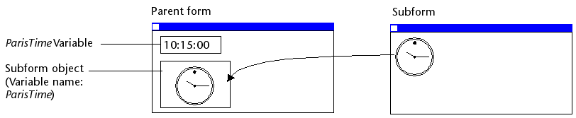

Um subformulário é um formulário incluído noutro formulário.

## Terminologia

Para definir claramente os conceitos implementados com subformulários, aqui estão algumas definições para certos termos utilizados:

- **Subformulario**: un formulario destinado a ser incluido en otro formulario, llamado a su vez formulario padre.
- **Formulario padre**: un formulario que contiene uno o más subformularios.
- **Contenedor de subformulario**: un objeto incluido en el formulario padre, que muestra una instancia del subformulario.
- **Instancia de subformulario**: la representación de un subformulario en un formulario padre. Esse conceito é importante porque é possível exibir várias instâncias do mesmo subformulário em um formulário pai.
- **Formulario listado**: instancia de subformulario mostrada como una lista.
- **Formulario detallado**: formulario de entrada tipo página asociado a un subformulario tipo lista al que se accede haciendo doble clic en la lista.

## Sub formulários lista

Um subformulário lista permite que você insira, visualize e modifique dados em outras tabelas. Normalmente, os subformulários de lista são usados em bancos de dados nos quais você estabeleceu relações Um para Muitos. Um subformulário de lista em um formulário em uma tabela One relacionada permite visualizar, inserir e modificar dados em uma tabela Many relacionada. Você pode ter vários subformulários provenientes de tabelas diferentes no mesmo formulário. No entanto, não é possível colocar dois subformulários que pertençam à mesma tabela na mesma página de um formulário.

Por exemplo, um banco de dados do gerenciador de contatos pode usar um subformulário de lista para exibir todos os números de telefone de um determinado contato. Embora os números de telefone apareçam na tela Contatos, as informações são, na verdade, armazenadas em uma tabela relacionada. Usando uma relação de um para muitos, esse design de banco de dados facilita o armazenamento de um número ilimitado de números de telefone por contato. Com as relações automáticas, você pode apoiar a entrada de dados diretamente na tabela Many relacionada sem programação.

Embora os subformulários de lista geralmente estejam associados a muitas tabelas, uma instância de subformulário pode exibir os registros de qualquer outra tabela do banco de dados.

Também é possível permitir que o usuário introduza dados no formulário Lista.
Dependendo da configuração do subformulário, o usuário pode exibir o formulário detalhado clicando duas vezes em um subregistro ou usando os comandos para adicionar e editar subregistros.

> 4D ofrece tres acciones estándar para satisfacer las necesidades básicas de gestión de los subregistros: `Edit Subrecord`, `Delete Subrecord` y `Add Subrecord`. Quando o formulário incluir várias instâncias de subformulários, a ação será aplicada ao subformulário que tiver o foco.

## Subformulários em página

Os subformulários de página podem exibir os dados do subregistro atual ou qualquer tipo de valor pertinente, dependendo do contexto (variáveis, figuras etc.). Uma das principais vantagens do uso de subformulários de página é que eles podem incluir funcionalidades avançadas e interagir diretamente com o formulário pai (widgets). Os subformulários de página também têm suas próprias propriedades e eventos específicos; você pode gerenciá-los inteiramente por meio de programação.

El subformulario en página utiliza el formulario de entrada indicado por la propiedad [Formulario detallado](properties_Subform.md#detail-form). Ao contrário de um subformulário de lista, o formulário usado pode vir da mesma tabela que o formulário pai. Também é possível usar um formulário de projeto. Quando executado, um subformulário de página tem as mesmas características de exibição padrão de um formulário de entrada.

> Os widgets 4D são objetos compostos predefinidos com base em subformulários de página. Se describen detalladamente en un manual aparte, [4D Widgets](https://doc.4d.com/4Dv19/4D/19/4D-Widgets.100-5462909.en.html).

### Utilizar a variável ou expressão ligada

Puede vincular [una variable o una expresión](properties_Object.md#variable-or-expression) a un objeto contenedor de subformulario. Isso é muito útil para sincronizar valores do formulário principal e de seus subformulários.

By default, 4D creates a variable or expression of [object type](properties_Object.md#expression-type) for a subform container, which allows you to share values in the context of the subform using the `Form` command ([see below](#using-the-subform-bound-object)). However, you can use a variable or expression of any scalar type (time, integer, etc.) especially if you only need to share a single value:

- Define a bound variable or expression of a scalar type and call the `OBJECT Get subform container value` and `OBJECT SET SUBFORM CONTAINER VALUE` commands to exchange values when [On Bound Variable Change](../Events/onBoundVariableChange.md) or [On Data Change](../Events/onDataChange.md) form events occur. Esta solução é recomendada para sincronizar um único valor.
- Defina una variable o expresión vinculada del tipo **objecto** y utilice el comando `Form` para acceder a sus propiedades desde el subformulario. Esta solução é recomendada para sincronizar vários valores.

### Sincronização do formulário principal e do subformulário (valor único)

A vinculação da mesma variável ou expressão ao contêiner do subformulário e a outros objetos do formulário pai permite vincular os contextos do formulário pai e do subformulário para dar os toques finais em interfaces sofisticadas. Imagine un subformulario que contiene un reloj que muestra una hora estática, insertado en un formulario padre que contiene un [área de entrada](input_overview.md):



En el formulario padre, ambos objetos (área de entrada y contenedor subformulario) **tienen el mismo valor que *Variable o Expresión***. Puede ser una variable (por ejemplo, `parisTime`), o una expresión (por ejemplo, `Form.parisTime`).

:::info

Para mostrar una hora estática, debe utilizar el [tipo de datos](properties_DataSource.md#data-type-expression-type) apropiado para la [variable o la expresión](properties_Object.md#variable-or-expression):

- Si utiliza una variable (por ejemplo, `parisTime`), debe ser del tipo `texto` o `tiempo`.
- Si utiliza una expresión (por ejemplo, `Form.myValue`), debe contener un valor `texto`.

O valor do texto deve ter o formato "hh:mm:ss".

:::

En el subformulario, el objeto reloj se gestiona a través de la propiedad `Form.clockValue`.

#### Atualização do conteúdo de um subformulário

Caso 1: O valor da variável da forma pai ou expressão é modificado e essa modificação deve ser passado para um subformulário.

`parisTime` o `Form.parisTime` cambia a "12:15:00" en el formulario padre, bien porque el usuario lo ha introducido, bien porque se ha actualizado dinámicamente (a través de la sentencia `String(Current time)` por ejemplo). Esto activa el evento [On Bound Variable Change](../Events/onBoundVariableChange.md) en el método formulario del subformulario.

O seguinte código é executado:

```4d
// Subform form method
If (Form event code=On Bound Variable Change) //bound variable or expression was modified in the parent form
	Form.clockValue:=OBJECT Get subform container value //synchonize the local value
End if
```

Actualiza el valor de `Form.clockValue` en el subformulario:


Se genera el evento formulario [On Bound Variable Change](../Events/onBoundVariableChange.md):

- assim que um valor for atribuído à variável/expressão do formulário pai, mesmo que o mesmo valor seja reatribuído
- se o subformulário pertence à página formulário atual ou à página 0.

Note that, as in the above example, it is preferable to use the `OBJECT Get subform container value` command which returns the value of the expression in the subform container rather than the expression itself because it is possible to insert several subforms in the same parent form (for example, a window displaying different time zones contains several clocks).

Modificar a variável ou expressão vinculada aciona eventos de formulário que permitem sincronizar os valores do formulário pai e do subformulário:

- Utilice el evento de formulario [On Bound Variable Change](../Events/onBoundVariableChange.md) para indicar al subformulario (método de formulario del subformulario) que la variable o expresión fue modificada en el formulario padre.
- Utilice el evento de formulario [On Data Change](../Events/onDataChange.md) para indicar al contenedor del subformulario que el valor de la variable o expresión fue modificado en el subformulario.

#### Atualização do conteúdo de um formulário pai

Caso 2: o conteúdo do subformulário é modificado e esta modificação deve ser transmitida ao formulário principal.

Dentro del subformulario, el botón cambia el valor de la expresión `Form.clockValue` de tipo Text asociada al objeto reloj. Esto activa el evento de formulario [On Data Change](../Events/onDataChange.md) dentro del objeto reloj (este evento debe estar seleccionado para el objeto), que actualiza el valor `Form.parisTime` en el formulario principal.

O seguinte código é executado:

```4d
// subform clock object method
If (Form event code=On Data Change) //whatever the way the value is changed
	OBJECT SET SUBFORM CONTAINER VALUE(Form.clockValue) //Push the value to the container
End if
```


Cada vez que cambia el valor de `Form.clockValue` en el subformulario, también se actualiza `parisTime` o `Form.parisTime` en el contenedor del subformulario.

> Se o valor da variável ou expressão é definido em vários locais, o 4D usa o valor que foi carregado por último. Ele aplica a seguinte ordem de carregamento: 1 - Métodos de objeto do subformulário, 2 - Método de formulário do subformulário, 3 - Métodos de objeto do formulário pai, 4 - Método de formulário do formulário pai

### Sincronização formulário principal e do subformulário (valores múltiplos)

Por defecto, 4D vincula una variable o expresión de [tipo de objeto](properties_Object.md#expression-type) a cada subformulario. O conteúdo desse objeto pode ser lido e/ou modificado a partir do formulário pai e do subformulário, o que permite compartilhar vários valores em um contexto local.

Cuando se asocia al contenedor del subformulario, este objeto es devuelto por el comando `Form` directamente en el subformulario. Como os objetos são sempre passados por referência, se o usuário modificar o valor de uma propriedade no subformulário, ele será automaticamente salvo no próprio objeto e, portanto, estará disponível para o formulário pai. Por outro lado, se uma propriedade do objeto for modificada pelo usuário no formulário pai ou por programação, ela será automaticamente atualizada no subformulário. Não é necessária qualquer gestão de eventos.

Por ejemplo, en un subformulario, las entradas están vinculadas a las propiedades del objeto `Form` (del formulario del subformulario):


No formulário pai, o subformulário é apresentado duas vezes. Cada contenedor de subformulario está asociado a una expresión que es una propiedad del objeto `Form` (del formulario padre):


El botón sólo crea las propiedades `mother` y `father` en el objeto `Form` del padre:

```4d
//Método de objeto do botão Adicionar valores
Form.mother:=New object("lastname"; "Hotel"; "firstname"; "Anne")
Form.father:=New object("lastname"; "Golf"; "firstname"; "Félix")
```

Quando você executa o formulário e clica no botão, você vê que todos os valores são exibidos corretamente:


Se você modificar um valor tanto no formulário principal quanto no subformulário, ele será automaticamente atualizado no outro formulário porque o mesmo objeto é utilizado:


### Utilização de ponteiros (compatibilidade)

En versiones anteriores a 4D v19 R5, la sincronización entre formularios padre y subformularios se gestionaba a través de **punteros**. Por exemplo, para atualizar um objeto subformulário, você pode chamar o seguinte código:

```4d
// Subform form method
If (Form event code=On Bound Variable Change) 
	ptr:=OBJECT Get pointer(Object subform container) 
	clockValue:=ptr-> 
End if
```

**Este principio aún se soporta por compatibilidad, pero ahora es obsoleto, ya que no permite vincular expresiones a subformularios.** Ya no debería utilizarse en sus desarrollos. In any cases, we recommend to use the [`Form` command](#synchronizing-parent-form-and-subform-multiple-values) or the [`OBJECT Get subform container value` and `OBJECT SET SUBFORM CONTAINER VALUE` commands](#synchronizing-parent-form-and-subform-single-value) to synchronize form and subform values.

### Programação entre formulários avançada

A comunicação entre o formulário pai e as instâncias do subformulário pode exigir mais do que a troca de valores por meio da variável vinculada. Na verdade, você pode querer atualizar as variáveis nos subformulários de acordo com as ações realizadas no formulário principal e vice-versa. Se usarmos o exemplo anterior do subformulário do tipo "relógio dinâmico", podemos querer definir um ou mais horários de alarme para cada relógio.

4D implementou os seguintes mecanismos para atender a essas necessidades:

- Llamada de un objeto contenedor desde el subformulario utilizando el comando `CALL SUBFORM CONTAINER`
- Ejecución de un método en el contexto del subformulario mediante el comando `EXECUTE METHOD IN SUBFORM`

> El comando `GOTO OBJECT` busca el objeto de destino en el formulario padre aunque se ejecute desde un subformulario.

#### Comando CALL SUBFORM CONTAINER

El comando `CALL SUBFORM CONTAINER` permite que una instancia de subformulario envíe un [evento](../Events/overview.md) al objeto contenedor del subformulario, que puede procesarlo en el contexto del formulario padre. O evento é recebido no método do objeto contentor. Ele pode estar na origem de qualquer evento detectado pelo subformulário (clique, arrastar e soltar etc.).

O código do evento não tem restrições (por exemplo, 20000 ou -100). Puede utilizar un código que corresponda a un evento existente (por ejemplo, 3 para `On Validate`), o utilizar un código personalizado. No primeiro caso, você só pode usar eventos que você verificou na Lista de Propriedades para sub-formulários. No segundo caso, o código não deve corresponder a nenhum evento de formulário existente. Recomenda-se usar um valor negativo para ter certeza de que esse código não será usado por 4D em versões futuras.

Para más información, consulte la descripción del comando `CALL SUBFORM CONTAINER`.

#### Comando EXECUTE METHOD IN SUBFORM

El comando `EXECUTE METHOD IN SUBFORM` permite que un formulario o uno de sus objetos solicite la ejecución de un método en el contexto de la instancia del subformulario, lo que le da acceso a las variables, objetos, etc. del subformulario. Este método também pode receber parâmetros.

Este mecanismo é ilustrado no diagrama seguinte:


Para más información, consulte la descripción del comando `EXECUTE METHOD IN SUBFORM`.

## Propriedades compatíveis

[Border Line Style](properties_BackgroundAndBorder.md#border-line-style) - [Bottom](properties_CoordinatesAndSizing.md#bottom) - [Class](properties_Object.md#css-class) - [Detail Form](properties_Subform.md#detail-form) - [Double click on empty row](properties_Subform.md#double-click-on-empty-row) - [Double click on row](properties_Subform.md#double-click-on-row) - [Enterable in list](properties_Subform.md#enterable-in-list) - [Expression Type](properties_Object.md#expression-type) - [Focusable](properties_Entry.md#focusable) - [Height](properties_CoordinatesAndSizing.md#height) -
[Hide focus rectangle](properties_Appearance.md#hide-focus-rectangle) -
[Horizontal Scroll Bar](properties_Appearance.md#horizontal-scroll-bar) - [Horizontal Sizing](properties_ResizingOptions.md#horizontal-sizing) - [Left](properties_CoordinatesAndSizing.md#left) - [List Form](properties_Subform.md#list-form) - [Method](properties_Action.md#method) - [Object Name](properties_Object.md#object-name) - [Print Frame](properties_Print.md#print-frame) - [Right](properties_CoordinatesAndSizing.md#right) - [Selection mode](properties_Subform.md#selection-mode) - [Source](properties_Subform.md#source) - [Top](properties_CoordinatesAndSizing.md#top) - [Type](properties_Object.md#type) - [Variable or Expression](properties_Object.md#variable-or-expression) - [Vertical Scroll Bar](properties_Appearance.md#vertical-scroll-bar) - [Vertical Sizing](properties_ResizingOptions.md#vertical-sizing) - [Visibility](properties_Display.md#visibility) - [Width](properties_CoordinatesAndSizing.md#width)
