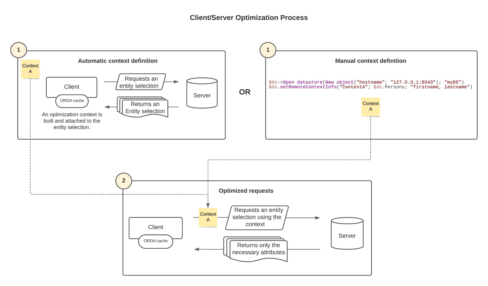

4D fornece otimizações para solicitações ORDA que usam seleções de entidades ou carregam entidades em arquiteturas cliente/servidor. Essas otimizações aceleram a execução de seu aplicativo 4D ao reduzir drasticamente o volume de informações transmitidas pela rede. Estes incluem:

- o **contexto de otimização**
- o **Cache ORDA**

## Arquiteturas suportadas

As arquiteturas cliente/servidor de ORDA que suportam a otimização são:

- Os datastores servidor acessados pelas aplicações 4D remotas através de [**`ds`**](../API/DataStoreClass.md#ds),
- [Dastores remotos](remoteDatastores.md), acessado via [**`Open datastore`**](../API/DataStoreClass.md#open-datastore) (solicitações clientes REST).

## Contexto de otimização

O contexto de otimização é baseado nas seguintes implementações:

- Quando um cliente solicita uma seleção de entidade do servidor, 4D "aprende" automaticamente quais atributos da seleção de entidade são realmente usados no lado do cliente durante a execução do código e constrói um "contexto de otimização" correspondente. Esse contexto é anexado à seleção da entidade e armazena os atributos usados. Será atualizado dinamicamente se outros atributos forem usados depois. Os seguintes métodos e funções accionam a fase de aprendizagem:
  - [`Create entity selection`](../API/EntitySelectionClass.md#create-entity-selection)
  - [`dataClass.fromCollection()`](../API/DataClassClass.md#fromcollection)
  - [`dataClass.all()`](../API/DataClassClass.md#all)
  - [`dataClass.get()`](../API/DataClassClass.md#get)
  - [`dataClass.query()`](../API/DataClassClass.md#query)
  - [`entitySelection.query()`](../API/EntitySelectionClass.md#query)

- As solicitações subsequentes enviadas ao servidor sobre a mesma seleção de entidade reutilizam automaticamente o contexto de otimização e obtêm apenas os atributos necessários do servidor, o que acelera o processamento. Por exemplo, em uma [caixa de lista baseada em seleção de entidades](#entity-selection-based-list-box), a fase de aprendizagem ocorre durante a exibição da primeira linha. a visualização das linhas seguintes é optimizada. As funções a seguir associam automaticamente o contexto de otimização da seleção da entidade de origem à seleção da entidade retornada:
  - [`entitySelection.and()`](../API/EntitySelectionClass.md#and)
  - [`entitySelection.minus()`](../API/EntitySelectionClass.md#minus)
  - [`entitySelection.or()`](../API/EntitySelectionClass.md#or)
  - [`entitySelection.orderBy()`](../API/EntitySelectionClass.md#orderBy)
  - [`entitySelection.slice()`](../API/EntitySelectionClass.md#slice)
  - [`entitySelection.drop()`](../API/EntitySelectionClass.md#drop)

- Um contexto de otimização existente pode ser passado como uma propriedade para outra seleção de entidade das mesmas dataclass, Desta forma, ignorando a fase de aprendizagem e acelerando a aplicação (veja [Reutilizando a propriedade de contexto](#reusing-the-context-property) abaixo).

- Você pode criar contextos de otimização manualmente usando a função [`dataStore.setRemoteContextInfo()`](../API/DataStoreClass.md#setremotecontextinfo) (veja [contextos preconfigurando](#preconfiguring-contexts)).



:::note Nota de compatibilidade

Contextos tratados em conexões estabelecidas através de [`Open datastore`](../API/DataStoreClass.md#open-datastore) só podem ser usadas entre versões principais similares de 4D. Por exemplo, uma aplicação remota 4D 20.x pode usar apenas contextos de um servidor 4D Server 20.x datastore.

:::

### Exemplo

Dado o seguinte código:

```4d
 $sel:=$ds. Employee.query("firstname = ab@")
 For each($e;$sel)
    $s:=$e.firstname+" "+$e.lastname+" works for "+$e.employer.name // $e.employer refers to Company table
 End for each
```

Graças à otimização, esta solicitação receberá apenas dados de atributos usados (nome, sobrenome, empregador, empregador. jogo) em *$sel* da segunda iteração do laço.

### Reutilizando a propriedade `context`

Você pode aumentar os benefícios da otimização usando a propriedade **context**. Essa propriedade faz referência a um contexto de otimização "aprendido" para uma seleção de entidade. Ele pode ser passado como parâmetro para funções ORDA que retornam novas seleções de entidades, de modo que as seleções de entidades solicitem diretamente os atributos usados ao servidor e ignorem a fase de aprendizado.

> Você também pode criar contextos usando a função [`.setRemoteContextInfo()`](../API/DataStoreClass.md#setremotecontextinfo).

A mesma propriedade de contexto de otimização pode ser passada para um número ilimitado de seleções de entidades na mesma classe de dados. Todas as funções ORDA que manipulam seleções de entidades suportam a propriedade **context** (por exemplo, [`dataClass.query()`](../API/DataClassClass.md#query) ou [`dataClass.all()`](../API/DataClassClass.md#all)). No entanto, lembre-se de que um contexto é atualizado automaticamente quando novos atributos são usados em outras partes do código. A reutilização do mesmo contexto em códigos diferentes pode resultar em sobrecarga do contexto e, portanto, reduzir sua eficiência.

> Um mecanismo semelhante é implementado para as entidades que são carregadas, de modo que apenas atributos usados são requisitados (veja a função [`dataClass.get()`](../API/DataClassClass.md#get)).

**Exemplo com `dataClass.query()`:**

```4d
 var $sel1; $sel2; $sel3; $sel4; $querysettings; $querysettings2 : Objeto
 var $data : Coleção
 $querysettings:=Novo objeto("contexto"; shortList")
 $querysettings2:=Novo objeto("contexto";"longList")

 $sel1:=ds. Colaborador. uery("Sobrenome = S@";$querysettings)
 $data:=extractData($sel1) // No método extractData uma otimização é acionada   
 // e associada ao contexto "shortList"

 $sel2:=ds. Colaborador. uery("Sobrenome = Sm@";$querysettings)
 $data:=extractData($sel2) // No método extractData a otimização associada a   
 // ao contexto "shortList" é aplicada

 $sel3:=ds. Colaborador. uery("Sobrenome = Smith";$querysettings2)
 $data:=extractDetailedData($sel3) // No método extractDetailedData uma otimização  
 // é acionada e associada ao contexto "longList"

 $sel4:=ds. Colaborador. uery("Sobrenome = Brown";$querysettings2)
 $data:=extractDetailedData($sel4) // No método extractDetailedData a otimização  
 // associada ao contexto "longList" é aplicada
```

### List box baseado em uma seleção de entidades

Otimização de seleção de entidade é aplicada automaticamente para caixas de lista de seleção baseadas em entidade em aplicações desktop 4D de cliente/servidor, ao exibir e rolar um conteúdo da caixa de lista: apenas os atributos exibidos na caixa de lista são requisitados do servidor.

Um contexto "modo de página" específico também é fornecido ao carregar a entidade atual através da expressão da propriedade **item atual** da caixa de lista (veja [Caixas de lista de seleção de coleções ou entidades](FormObjects/listbox_overview. d#list-box-types)). Esse recurso permite que você não sobrecarregue o contexto inicial da caixa de lista neste caso, especialmente se a "página" solicitar atributos adicionais. Observe que apenas o uso da expressão do **item atual** irá criar/usar o contexto da página (acesso através de `entitySeletion\[index]` irá alterar o contexto de seleção da entidade).

As solicitações subsequentes ao servidor enviadas pelas funções de navegação da entidade também darão suporte a essa otimização. As funções a seguir associam automaticamente o contexto de otimização da entidade de origem à entidade retornada:

- [`entity.next()`](../API/EntityClass.md#next)
- [`entity.first()`](../API/EntityClass.md#first)
- [`entity.last()`](../API/EntityClass.md#last)
- [`entity.previous()`](../API/EntityClass.md#previous)

Por exemplo, o código a seguir carrega a entidade selecionada e permite a navegação na seleção da entidade. As entidades são carregadas em um contexto separado e o contexto inicial da caixa de listagem não é alterado:

```4d
 $myEntity:=Form.currentElement //expressão do item atual
  //... fazer algo
 $myEntity:=$myEntity.next() //carrega a próxima entidade usando o mesmo contexto
```

### Pré-configuração de contextos

Um contexto de otimização deve ser definido para cada recurso ou algoritmo do seu aplicativo, a fim de obter os melhores desempenhos. Por exemplo, um contexto pode ser usado para consultas sobre clientes, outro contexto para consultas sobre produtos, etc.

Se quiser fornecer aplicativos finais com o mais alto nível de otimização, você pode pré-configurar seus contextos e, assim, economizar fases de aprendizado, seguindo estas etapas:

1. Projete seus algoritmos.
2. Execute seu aplicativo e deixe que o mecanismo de aprendizado automático preencha os contextos de otimização.
3. Chame a função [`dataStore.getRemoteContextInfo()`](../API/DataStoreClass.md#getremotecontextinfo) ou [`dataStore.getAllRemoteContexts()`](../API/DataStoreClass.md#getallremotecontexts) para coletar contextos. Você pode usar as funções [`entitySelection.getRemoteContextAttributes()`](../API/EntitySelectionClass.md#getremotecontextattributes) e [`entity.getRemoteContextAttributes()`](../API/EntityClass.md#getremotecontextattributes) para analisar como seus algoritmos usam atributos.
4. Na etapa final, chame a função [`dataStore.setRemoteContextInfo()`](../API/DataStoreClass.md#setremotecontextinfo) para construir contextos na inicialização da aplicação e [usá-los](#reusing-the-context-property) em seus algoritmos.

## Cache ORDA

Por motivos de otimização, os dados solicitados do servidor por meio do ORDA são carregados no cache remoto do ORDA (que é diferente do cache 4D). O cache do ORDA é organizado por classe de dados e expira após 30 segundos.

Os dados contidos no cache são considerados expirados quando o tempo limite é atingido. Qualquer acesso a dados expirados enviará um pedido ao servidor. Os dados expirados permanecem na cache até que seja necessário espaço.

Você pode forçar os dados de seleção de entidades no cache ORDA a expirar a qualquer momento usando a função [`atualizar ()`](../API/EntitySelectionClass.md#refresh).

Por padrão, o cache ORDA é tratado de forma transparente pelo 4D. No entanto, você pode controlar seu conteúdo usando as seguintes funções da classe ORDA:

- [dataClass.setRemoteCacheSettings()](../API/DataClassClass.md#setremotecachesettings)
- [dataClass.getRemoteCache()](../API/DataClassClass.md#getremotecache)
- [dataClass.clearRemoteCache()](../API/DataClassClass.md#clearremotecache)
