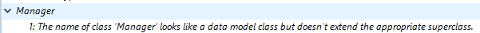

Você pode compilar seus projetos, ou seja, traduzir todos os seus métodos para o idioma da máquina. Compilar um projeto permite que você verifique a consistência do código e acelere a sua execução, Além de tornar possível ofuscar o código na sua totalidade. A compilação constitui um passo indispensável entre o desenvolvimento de projectos que utilizam o 4D e a sua implantação como aplicações isoladas.

## Compilar

A compilação é tratada do seu aplicativo 4D e é inteiramente automática.

> No macOS, a compilação requer que você instale o `Xcode`. Veja [esta seção](#silicon-compilador) para mais informações sobre este requisito.

1. Abra a janela do compilador selecionando o comando **Compiler...** no menu **Design** ou no botão da barra de ferramentas **Compilador**.

   

   

> Você também pode iniciar diretamente a compilação selecionando o item de menu **Iniciar Compilação** do menu **Design**.

2. Clique no botão **Compilar** para iniciar a compilação usando as [configurações de compilação](#configurações do compilador).

Se nenhum erro for detectado, a compilação atual começa e a mensagem "Compilação com sucesso" é exibida na parte inferior da janela quando a compilação é concluída:


Você pode imediatamente [executar sua aplicação em modo compilado](#run-compiled) e ver o quão mais rápido ela é.

Se erros forem detectados, o processo é interrompido e a mensagem "Compilação falhou" é exibida. A área de informação da janela exibe os nomes de métodos e números de linha envolvidos em uma lista hierárquica:


Clique duas vezes em cada erro detectado para abrir o método ou a classe em questão diretamente no Editor de Código 4D. A linha que contém o erro é destacada e o tipo de erro é exibido na área de sintaxe da janela.

Use os comandos **Erro anterior** / **Próximo Erro** do menu **Método** para navegar de um erro para o outro.

O número de erros encontrados durante as suas primeiras compilações pode ser um desafio, mas não deixe isso te avisar. Logo você descobrirá que eles muitas vezes nascem da mesma fonte, ou seja, não conformidade com certas convenções do projeto. O compilador sempre fornece um [diagnóstico exato](#error-file) dos erros para ajudá-lo a corrigi-los.

> A compilação requer uma licença adequada. Sem esta licença, não é possível realizar uma compilação (os botões estão desativados). No entanto, ainda é possível verificar a sintaxe e gerar métodos de digitação.

## Executar a compilação

Uma vez que um projeto é compilado, é possível mudar do [modo interpretado para o modo compilado](Concepts/interpretado. d) e vice-versa, a qualquer momento e sem ter que sair do aplicativo 4D (exceto quando o código interpretado for removido). Para fazer isso, use os comandos **Reiniciar Interpretado** e **Reiniciar Compilado** do menu **Executar**. A [caixa de diálogo de projeto aberta](GettingStarted/creating.md#options) também oferece uma escolha entre o modo interpretado ou compilado para a inicialização do banco de dados.

Quando você alternar de um modo para o outro, a 4D fecha o modo atual e abre o novo. Isto é equivalente a sair e reabrir a aplicação. Cada vez que você mudar de um modo para outro, O 4D executa os dois seguintes métodos de banco de dados (se especificado) nessa ordem: `Na saída` -> `Na inicialização`.

Se você modificar seu projeto em modo interpretado, é necessário recompilá-lo para que suas edições sejam levadas em conta no modo compilado.

## Características da janela do compilador

Além do botão [**Compilar**](#compilar), a janela Compilador oferece recursos adicionais que são úteis durante a fase de desenvolvimento do projeto.

### Verificar sintaxe

O botão **Verificar sintaxe** inicia a execução da fase de verificação de sintaxe. No final do processo de verificação, quaisquer erros detectados estão listados na área de informação. Você pode clicar duas vezes em uma linha de erro para exibir o método correspondente.

A verificação de sintaxe também pode ser iniciada diretamente usando o comando **Verificar sintaxe** associado com o botão da barra de ferramentas **Compiler**. Esta é a única opção disponível se você não tiver uma licença adequada para permitir a compilação de aplicativos.

### Gerar digitação

O botão **Gerar Typing** cria ou atualiza métodos do compilador. Os métodos do Compilador são métodos do projeto que agrupam todas as declarações de digitação de variável e matriz (processo e interprocesso), assim como os parâmetros de [método declarado fora dos protóticos](. /Concepts/parameters.md#method-parameters-declared-outside-prototypes). Esses métodos, quando eles existem, são usados diretamente pelo compilador durante a compilação de código, resultando em tempos de compilação mais rápidos.

O nome desses métodos deve começar com `Compiler_`. Você pode definir o nome padrão para cada um dos 5 métodos do compilador na [janela de configurações do compilador](#compiler-methods-for). Os métodos do compilador que são gerados e mantidos pelo 4D automaticamente têm o atributo `Invisível`:


Apenas os métodos necessários do compilador (ou seja, aqueles para os quais os itens já existem no projeto) são gerados.

A área de informação indica quaisquer erros encontrados durante a criação ou atualização de métodos. Clicar duas vezes em uma linha de erro faz com que o método e a linha em questão sejam exibidos no Editor de Código.

### Limpar código compilado

O botão **Limpar código compilado** exclui o código compilado do projeto. Quando você clicar nele, todo o [código gerado durante a compilação](#classic-compilador) é excluído, o comando **Reiniciar Compilado** do menu **Executar** está desativado e a opção "Projeto Compilado" não está disponível na inicialização.

### Mostrar/ocultar avisos

Você pode alternar a exibição de [warnings](#warnings) na janela do Compilador clicando no botão **Mostrar/Esconder Warnings**:


Quando esta opção é marcada, os avisos (se houver) são exibidos na janela, após os outros tipos de erro. Estas aparecem em itálico:



Um duplo clique num aviso abre o método correspondente.

## Parâmetros do compilador

A aba "Compilador" da caixa de diálogo Configurações permite que você defina parâmetros relacionados à compilação do projeto. Você pode abrir diretamente esta página através da [janela do compilador](#janela do compilador) clicando no botão **Configurações do Compilador**:


### Opções de compilação

Esta área agrupa as opções genéricas usadas durante o processo de compilação.

#### Gerar o arquivo de símbolo

Usado para gerar o arquivo de símbolo (veja [arquivo de símbolo](#símbolo-arquivo)). O arquivo de símbolo é criado na [pasta Logs](Project/architecture.md#logs) do projeto com o nome `ProjectName_symbols.txt`.

#### Gerar arquivo de erro

Usado para gerar o arquivo de erro (consulte [arquivo de erro](#error-file)) no momento da verificação de sintaxe. O arquivo de erro foi criado na [pasta Logs](Project/architecture.md#logs) do projeto com o nome `ProjectName_errors.xml`.

#### Caminho de compilação

Usado para definir o número de passagens (análise de código) executadas pelo compilador e, portanto, a duração da compilação.

- **Digite as variáveis**: Marque essa opção se você deseja que o compilador infere o tipo de variáveis e parâmetros em seu código. Esta opção requer que o compilador execute todas as etapas que tornam a compilação possível, o que aumenta a duração da compilação.
- **As variáveis de processo e interprocessos são digitadas**: O passe para digitação de processo e variáveis de interprocesso, bem como parâmetros de método declarados fora de protótipos não são executados. Esta opção pode ser usada quando você já realizou a digitação de todos os seus processos e variáveis de processo por conta própria ou usando a função para a geração automática de métodos do compilador.
- **Todas as variáveis são digitadas**: a passagem para digitar variáveis locais, de processo e interprocessos, bem como parâmetros de método declarados fora de protótipos não é executada. Use essa opção quando tiver certeza de que todos os processos locais, e variáveis de interprocesso, bem como parâmetros de métodos, foram claramente digitados.

:::tip

Você pode usar o botão [Gerar Typing](#generate-typing) e compilar com uma das duas últimas opções.

:::

#### Objectivo de compilação

<details><summary>História</summary>

| Release | Mudanças   |
| ------- | ---------- |
| 19      | Adicionado |

</details>

Esta configuração permite selecionar a família de processadores para a qual seu projeto 4D deve ser compilado nativamente. O compilador 4D pode criar código nativo para duas famílias de processadores:

- \*\*Os processadores Intel/AMD (todas as máquinas),
- \*\*os processadores Apple Silicon.

Duas opções de alvo estão disponíveis. O resultado depende do processador da máquina em que 4D está em execução.

| *Opção*                                                                   | *no Windows Intel/AMD*                                                              | *macOS Intel*                                                                                         | *no macOS Silicon*                                                                                    |
| ------------------------------------------------------------------------- | ----------------------------------------------------------------------------------- | ----------------------------------------------------------------------------------------------------- | ----------------------------------------------------------------------------------------------------- |
| **Todos os processadores (Intel/AMD e Apple Silicon)** | Código para Intel/AMD<br/>*Não é possível produzir código Apple Silicon no Windows* | Código para o Apple Silicon + Código para Intel/AMD<br/>*Dois códigos compilados estarão disponíveis* | Código para o Apple Silicon + Código para Intel/AMD<br/>*Dois códigos compilados estarão disponíveis* |
| **O meu processador (processador)**                    | Código para Intel/AMD                                                               | Código para Intel/AMD                                                                                 | Código para Apple Silicon                                                                             |

> O alvo do compilador Apple Silicon requer que o aplicativo **Clang** esteja instalado em sua máquina. Clang vem com a versão mais recente do Xcode. Veja os [requisitos do compilador do Silício](#requerimentos) para mais informações.

### Digitação padrão

Use esta área para definir o tipo padrão para objetos de banco de dados ambíguos.

- **Numérico**: Usado para forçar a digitação numérica de uma forma inequívoca, seja de forma real ou longa. Isso não substituirá as diretivas que você possa ter definido em seu projeto. Você pode otimizar a execução do seu banco de dados escolhendo o tipo Longint.
- **Botão**: Usado para forçar o botão a digitar de uma forma inequívoca, seja de forma real ou longa. Isso não substituirá as diretivas que você possa ter definido em seu projeto. Este tipo se aplica a botões, bem como caixas de seleção, botões de imagem, grades de botão, botões de rádio, imagens de menus pop-up e listas suspensas.

### Métodos de Compilação para...

Esta área permite renomear os métodos do Compilador que são gerados automaticamente pelo compilador quando você clica em [Gerar Typing](#generate-typing).

Até 5 métodos do compilador podem ser gerados; um método do compilador só é gerado se o projeto contiver os seguintes itens:

- **Variáveis**: agrupa as declarações de variáveis processam;
- **Variáveis Interprocessadas**: Grupos interprocessam declarações de variáveis entre processamentos;
- **Arrays**: Agrupa as declarações de matrizes de processo;
- **Matrizes Interprocessadas**: Grupos juntos declarações matrizes interprocessos;
- \*\*Métodos \*\*: Agrupa as declarações do parâmetro do método (por exemplo, `C_LONGINT(meumétodo;$1;$2)`) para [parâmetros de método declarados fora dos protóticos](../Concepts/parameters.md#method-parameters-declared-outside-prototypes). Para obter mais informações, consulte [método `Compiler_Methods`](../Concepts/parameters.md#compiler_methods-method).

Você pode renomear cada um desses métodos nas áreas correspondentes, mas eles sempre serão precedidos pela etiqueta `Compiler_` (não modificável). O nome de cada método (prefixo incluído) não deve ter mais de 31 caracteres. Deve também ser único e cumprir com [regras 4D para métodos de nomeação](Concepts/identifiers.md#project-methods).

## Avisos

Avisos são mensagens específicas geradas pelo compilador quando verifica a sintaxe. Essas mensagens destinam-se a chamar a sua atenção para afirmações que podem levar a erros de execução. Não impedem a compilação.

Dependendo das circunstâncias e do estilo de programação utilizado, avisos podem ser mais ou menos relevantes. Você pode ativar ou desativar avisos, na caixa de diálogo do compilador e nos editores de código (editor de código 4D e código VS), globalmente através da [guia de avisos](#warnings-tab) ou localmente usando [`//%W`](#disabling-and-enabling-warnings-localmente).

### Aba "Avisos"


Esta aba permite definir quais avisos devem ser exibidos globalmente. Da lista de todos os possíveis avisos com seus tipos, seu código e sua etiqueta localizada, ordenados por código de aviso.

Para reduzir a lista, você pode pesquisar palavras por etiquetas e códigos de aviso usando a caixa de texto **Pesquisar em códigos e rótulos** ou o ícone da lupa à esquerda.

Por padrão, todos os tipos de advertência são checados e habilitados.

Quando você modificar o estado de exibição de aviso, as informações são armazenadas no arquivo "warnings.json", colocado na pasta de configurações do projeto.

O botão **Redefinir para as configurações de fábrica** define todas as caixas de seleção de status de exibição para valores padrão e exclui o arquivo "warnings.json".

### Desativar e ativar avisos localmente

Você pode controlar avisos em partes específicas do seu código usando comentários especiais para desativá-los ou habilitá-los.

Para desativar os avisos, insira os seguintes comentários antes e após a seção de código, onde você deseja desativar os avisos:

```4d
// Antes da parte do código selecionado, use
  //%W-<warning number>

// Após a parte do código selecionada, use
  //%W+<warning number>
```

Para reativar os avisos em uma seção de código, use os seguintes comentários:

```4d
// Antes da parte do código selecionado, use
  //%W-<warning number>

// Após a parte do código selecionada, use
  //%W+<warning number>
```

Somente avisos com números podem ser desativados ou habilitados. Números de aviso são especificados no final de cada mensagem na lista de erros de compilação ou na lista encontrada na aba de alerta.
Por exemplo, para desativar o seguinte aviso:

*1: Redefinição da variável $a (550.10)*

... você só precisa escrever os seguintes comentários no seu método 4D:

```4d
  var $a : Text
  $a:="hello world"
  
  //%W-550.10
  var $a : Text
  //%W+550.10
  
```

:::note

Os comentários de advertências especiais têm prioridade sobre as configurações de exibição de avisos definidas na aba de avisos.

:::

## Ferramentas de compilação

### Arquivo de símbolos

Se você marcar a opção [**Gerar o arquivo de símbolos**](#generate-the-symbol-file) nas configurações do compilador, um arquivo de símbolo chamado `ProjectName_symbols. xt` é criado na [pasta Logs](Project/architecture.md#logs) do projeto durante a compilação. Está dividido en varias partes:

#### Lista das variáveis processo e interprocesso

Estas duas listas contêm quatro colunas:

- Nomes de variáveis do processo e matrizes de interprocesso usados em seu projeto. Estas variáveis são enumeradas por ordem alfabética.
- Tipo da variável. Os tipos são definidos por comandos da diretiva do compilador ou são determinados pelo compilador com base na utilização da variável. Se o tipo de uma variável não puder ser determinado, a coluna estará vazia.
- Número de dimensões se a variável for um array.
- Referência ao contexto no qual o compilador estabeleceu o tipo da variável. Se a variável é usada em vários contextos, o contexto mencionado é o usado pelo compilador para determinar seu tipo.
  - Se a variável foi encontrada em um método de banco de dados, o nome do método de banco de dados é dado, precedido por (M)\*.
  - Se a variável foi encontrada em um método do projeto, o método é identificado como foi definido em 4D, precedido por (M).
  - Se a variável for encontrada em um gatilho, o nome da tabela é dado, precedido por (TM).
  - Se a variável foi encontrada em um método do formulário, o nome do formulário é dado, precedido pelo nome da tabela e (FM).
  - Se a variável foi encontrada em um método do objeto, o nome do método do objeto é fornecido, precedido pelo nome do formulário, nome da tabela, e por (OM).
  - Se a variável for um objeto em um formulário e não aparecer em qualquer projeto, formulário, método do objeto, ou gatilho, o nome do formulário em que aparece é dado, precedido por (F).
    No final de cada lista, você pode encontrar os tamanhos das variáveis do processo e interprocessos em bytes.

> Ao compilar, o compilador não pode determinar em qual processo uma determinada variável do processo é usada. Uma variável processo pode ter um valor diferente em cada processo. Consequentemente, todas as variáveis do processo são sistematicamente duplicadas à medida que cada novo processo é lançado: portanto, é aconselhável ter cuidado com a quantidade de memória que eles vão utilizar. Também, tenha em mente que o espaço para variáveis de processo não está relacionado ao tamanho da pilha para o processo.

#### Lista de variáveis locais

A lista de variáveis locais é classificada pelo método do banco de dados, método do projeto, acionado, método do formulário e método do objeto, na mesma ordem que em 4D.

Esta lista está dividida em três colunas:

- lista das variáveis locais utilizadas no método;
- tipo da variável;
- número de dimensões se a variável for um array.

#### Lista completa de métodos

Uma lista completa de seus métodos banco de dados e projeto é apresentada no final do ficheiro com:

- o seu tipo (procedimento ou função que devolve um valor)
- os tipos de dados de seus parâmetros e o resultado retornado
- o número de chamadas
- a propriedade Thread Safe ou Thread Unsafe.

Esta informação aparece da seguinte forma:

```
Procedimiento o función <Method name>(tipos de datos de los parámetros):
tipo resultado, número de llamadas, Thread Safe o Thread Unsafe
```

### Arquivo de erros

Você pode escolher se quer ou não gerar um arquivo de erro durante a compilação usando a opção [**Gerar arquivo de erro**](#generate-error-file) nas configurações do compilador. O arquivo de erro é automaticamente chamado `projectName_errors.xml` e é colocado na [pasta de logs](Project/architecture.md#logs) do projeto.

Embora os erros possam ser acessados diretamente através da [janela do compilador](#compile), pode ser útil ter um arquivo de erro que pode ser transmitido de uma máquina para outra. O arquivo de erro é gerado no formato XML para facilitar a análise automática de seu conteúdo. Também permite a criação de interfaces customizadas de exibição de erros.

O comprimento do arquivo de erro depende do número de erros e avisos emitidos pelo compilador.

A estrutura do arquivo de erro é a seguinte:

- No topo do arquivo está a lista de erros e avisos, classificados por método e na sua ordem de criação em 4D.
- Na seção ***Erros gerais***, todas as impossibilidades de tipagem e ambiguidades de identidade estão agrupadas. Estes erros e avisos estão listados usando o seguinte formato:
  - número da linha no método (0 indica erros gerais)
  - atributo de aviso indicando se a anomalia detectada é um aviso (warning="true") ou um erro (warning="false")
  - diagnóstico que descreve o erro

Se o seu projeto não tiver nenhum erro geral, o arquivo não terá uma seção de *Erros gerais*.

Um arquivo de erro pode conter três tipos de mensagens:

- **Erros ligados a uma linha específica**: esses erros são exibidos no contexto — a linha em que eles foram encontrados — com uma explicação. O compilador relata esse tipo de erro quando encontra uma expressão em que vê uma inconsistência relacionada ao tipo de dados ou sintaxe. Na janela do compilador, clique duas vezes em cada erro detectado para abrir o método em questão diretamente no Editor de Código 4D, com a linha que contém o erro destacado.

- **Erros gerais**: Estes são erros que tornam impossível a compilação do projeto. Há dois casos em que o compilador informa um erro geral:
  - Não foi possível determinar o tipo de dados de uma variável processo.
  - Dois tipos diferentes de objetos têm o mesmo nome.

Erros gerais são tão nomeados porque não podem ser associados a qualquer método específico. No primeiro caso, o compilador não pôde executar uma digitação especificada em nenhum lugar do projeto. Na segunda, não foi possível decidir se um determinado nome deve ser associado a um objeto em vez de com outro.

- \*\*Avisos: os avisos não são erros. Não impedem a compilação do projecto, limitando-se a apontar potenciais erros de código. Na janela do compilador, os avisos aparecem em itálico. Clique duas vezes em cada aviso para abrir o método em questão diretamente no Editor de Código 4D, com a linha que contém o aviso destacado.

### Verificação do intervalo

O código gerado pelo compilador 4D verifica automaticamente que todo acesso a um elemento de matriz ou uma referência de caractere é feito dentro do intervalo real de elementos do array ou de caracteres de string. Os acessos fora do intervalo provocarão erros de execução em tempo de execução.

Em alguns casos, pode preferir que a verificação de intervalos não se aplique a certas partes do código consideradas fiáveis. Mais especificamente, no caso de repetições que se repetem por diversas vezes. e ao executar a base de dados compilada em máquinas mais antigas, a verificação por intervalo pode diminuir significativamente o processamento. Se você tem certeza absoluta de que o código em causa é confiável e não pode causar erros no sistema, você pode desabilitar a verificação por intervalo localmente.

Para fazer isso, você deve cercar o código para ser excluído da verificação do intervalo com os comentários especiais `//%R-` e `//%R+`. O comentário `//%R-` desabilita a verificação de intervalo e `//%R+` habilita novamente:

```4d
  // %R- para desativar o intervalo verificando
 
 ... //Coloque o código a ser excluído do intervalo verificando aqui
 
  // %R+ para habilitar a verificação de intervalo novamente para o resto
```

## Sobre os compiladores

4D contém dois compiladores:

- um compilador "clássico", usado para compilar código nativo para processadores Intel/AMD;
- um compilador Silicon, para compilar código nativo para processadores Apple Silicon.

O compilador clássico pode ser usado em qualquer plataforma, enquanto o compilador do Silicon só pode ser usado em uma máquina Mac:

|             |    Compilar para Windows    |   Compilar para Intel Mac   |  Compilar para Silicon Mac  |
| ----------- | :-------------------------: | :-------------------------: | :-------------------------: |
| Em Windows  | &#10003 | &#10003 | &#10007 |
| Intel Mac   | &#10003 | &#10003 | &#10003 |
| Silicon Mac | &#10003 | &#10003 | &#10003 |

Ambos os compiladores estão integrados em 4D. O compilador apropriado é automaticamente selecionado, dependendo da opção de [meta de compilação](#compilation-target).

### Compilador clássico

O compilador clássico gera código nativo compilado para processadores Intel/AMD em qualquer máquina. Não necessita de qualquer configuração específica.

O código compilado resultante é armazenado na pasta [DerivedData](architecture.md#deriveddata) do projeto.

### Compilador Silicon

O compilador Silicon gera código compilado nativo para processadores de Apple Silicon, como *Apple M1*.

O código compilado resultante é armazenado na pasta [Libraries](architecture.md#libraries) do projeto.

#### Requisitos

- **Máquina Apple**: O compilador Silicon só pode ser executado a partir de uma máquina Apple.
- **Arquitetura do Projeto 4D**: O compilador Silicon só está disponível para desenvolvimentos 4D usando [arquitetura do projeto](architecture.md).
- **Xcode ou Ferramentas para Desenvolvedor**: O compilador Silicon chama o compilador macOS de código aberto para compilar o projeto de código C++ na [segunda etapa](#incremental-compilador) da compilação. *clang* requer bibliotecas nativas da Apple, que são fornecidas pelo pacote **Xcode** ou **Developer Tools**.
  - **Si ya tiene** Xcode o Developer Tools instalados en su ordenador, sólo tiene que asegurarse de que su versión cumple con los requisitos de 4D.
  - **Si no tiene** ninguna de estas herramientas instaladas en su ordenador, tendrá que descargar una de ellas desde el sitio web Apple Developer.

> Recomendamos instalar **Xcode**, que es bastante sencillo de instalar. Puede decidir instalar **Developer Tools** que es más compacto, sin embargo su instalación es un poco más compleja.

In any cases, the 4D Silicon compiler will warn you if your configuration does not comply with its requirements.

#### Compilador incremental

O compilador Silicon é incremental, o que significa que:

- Durante la primera compilación, se compilan **todos los métodos 4D**. Esta etapa pode demorar algum tempo. No entanto, só ocorre uma vez.
- Durante todas las compilaciones posteriores, sólo se procesan los métodos **nuevos o modificados**, lo que reduce drásticamente el tiempo de compilación.
