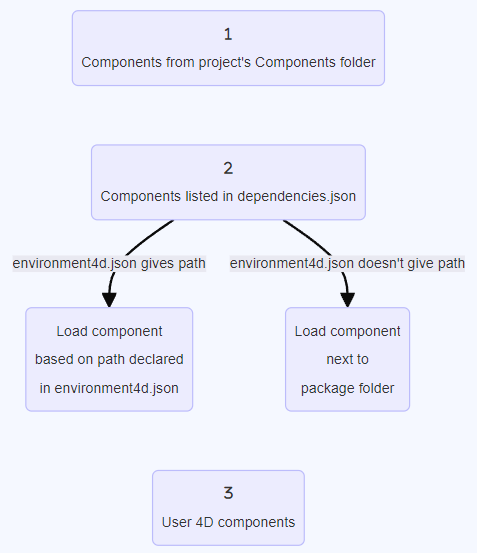
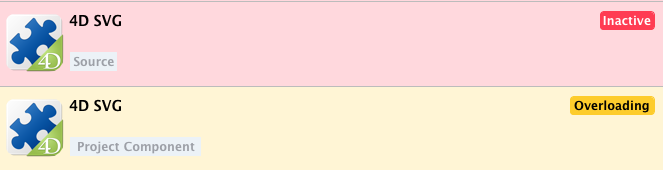

Um componente 4D é um conjunto de código 4D e/ou formulários que representam uma ou mais funcionalidades que pode adicionar e usar nos seus projetos. Por exemplo, o componente [4D SVG](https://github.com/4d/4D-SVG) adiciona comandos avançados e um mecanismo de renderização integrado que pode ser usado para exibir arquivos SVG.

Você pode [develop](../Extensions/develop-components.md) e [build](../Desktop/building. d) seus próprios componentes 4D ou baixe componentes públicos compartilhados pela comunidade 4D que [pode ser encontrada no GitHub](https://github.com/search?q=4d-component\&type=Repositórios).

Ao desenvolver em 4D, os arquivos de componentes podem ser armazenados de forma transparente no seu computador ou em um repositório do Github.

## Componentes interpretados e compilados

Componentes podem ser interpretados ou [compiled](../Desktop/building.md). A pasta do pacote de um componente pode conter:

- ou uma pasta de projeto (componente interpretado)
- ou um arquivo .4DZ (componente compilado)

Um projeto 4D em modo interpretado pode usar componentes interpretados ou compilados. Um projeto 4D em execução no modo compilado não pode usar componentes interpretados. Por isso não pode ser usado em um componente.

## Carregando componentes

:::note

Esta página descreve como trabalhar com componentes nos ambientes **4D** e **4D Server**. Em outros ambientes, os componentes são geridos de forma diferente:

- em [4D no modo remoto](../Desktop/clientServer.md), componentes são carregados pelo servidor e enviados para a aplicação remota.
- em aplicações mescladas, componentes são [incluídos na etapa de compilação](../Desktop/building.md#plugins--components-page).

:::

### Visão Geral

Para carregar um componente no seu projeto 4D, você pode:

- copie os arquivos de componentes na pasta [**Components** do seu projeto] (architecture.md#components),
- ou declare o componente no arquivo **dependencies.json**.

Os componentes declarados no arquivo **dependencies.json** podem ser armazenados em locais diferentes:

- no mesmo nível da pasta do pacote do seu projeto 4D: este é o local padrão,
- em qualquer lugar de sua máquina: o caminho do componente deve ser declarado no arquivo **environment4d.json**
- em um repositório GitHub: o caminho do componente pode ser declarado no arquivo **dependencies.json** ou no arquivo **environment4d.json**, ou em ambos os arquivos.

Se o mesmo componente for instalado em locais diferentes, uma [ordem de prioridade](#prioridade) é aplicada.

### dependencies.json vs environment4d.json

#### dependencies.json

O arquivo **dependencies.json** faz referência a todos os componentes necessários em seu projeto 4D. Esse arquivo deve estar localizado na pasta **Sources** da pasta do projeto 4D, por exemplo:

```
	/MyProjectRoot/Project/Sources/dependencies.json
```

Pode conter:

- nomes de componentes [armazenado localmente](#declaring-local-components) (caminho ou caminho padrão definido em um arquivo **environment4d.json**),
- nomes de componentes [armazenados nos repositórios do GitHub](#declaring-components-stored-on-github) (seus caminhos podem ser definidos neste arquivo ou em um arquivo **environment4d.json**).

#### environment4d.json

O arquivo **environment4d.json** é opcional. Ele permite que você defina **caminhos personalizados** para alguns ou todos os componentes declarados no arquivo **dependencies.json**. Este arquivo pode ser armazenado na pasta pacote de projeto ou em uma das pastas pais, a qualquer nível (superior à raiz).

Os principais benefícios desta arquitetura são os seguintes:

- você pode armazenar o **ambiente4d. arquivo son** em uma pasta pai de seus projetos e decida não fazer commit dele, permitindo que você tenha sua organização local de componentes.
- se quiser usar o mesmo repositório GitHub para vários projetos, você poderá fazer referência a ele no arquivo **environment4d.json** e declará-lo no arquivo **dependencies.json**.

### Prioridade

Uma vez que os componentes podem ser instalados de maneiras diferentes, uma ordem de prioridade é aplicada quando o mesmo componente é referenciado em vários locais:

**Prioridade mais alta**

1. Componentes armazenados na pasta [**Components** do projeto](architecture.md#components).
2. Componentes declarados no arquivo **dependencies.json**.
3. Componentes 4D do usuário interno (por exemplo, 4D NetKit, 4D SVG...)

**Prioridade menor**



Quando um componente não pode ser carregado por causa de outra instância do mesmo componente localizada em um nível de prioridade mais alto ela recebe o *Sobrecarregado* [status](#dependency-status). O componente carregado tem o *Sobrecarga* [status](#dependency-status).

(a rota declarada em **environment4d.json** substitui a rota em **dependencies.json** para configurar um ambiente local).

### Declarando componentes locais

Você declara um componente local no arquivo [**dependencies.json**](#dependencyjson) da seguinte maneira:

```json
{
    "dependencies": {
        "myComponent1" : {},
        "myComponent2" : {}
    }
}
```

... onde "myComponent1" e "myComponent2" são o nome dos componentes a serem carregados.

Por padrão, se "myComponent1" e "myComponent2" não forem declarados em um [arquivo environment4d.json](#environment4djson), 4D irá procurar a pasta de pacote do componente (*i. .* A pasta raiz do projeto do componente) no mesmo nível que a pasta de pacote do seu projeto 4D, por exemplo:

```
	/MyProjectRoot/
	/MyProjectComponentRoot/
```

Graças a essa arquitetura, você pode simplesmente copiar todos os seus componentes no mesmo nível dos seus projetos e fazer referência a eles nos arquivos **dependencies.json**.

:::note

Se você não quer se beneficiar das **dependências. arquitetura do son**, você pode instalar componentes locais copiando seus arquivos na pasta [**Components** do seu projeto](architecture.md#components).

:::

#### Personalizando caminhos dos componentes

Se você deseja personalizar a localização dos componentes locais, você declara os caminhos para as dependências que não são armazenados no mesmo nível que a pasta do projeto no [**environment4d. son**](#environment4djson) arquivo.

Você pode usar caminhos absolutos ou relativos, expressos na sintaxe POSIX, conforme descrito no [parágrafo](../Concepts/paths#sintaxe posix). Caminhos relativos são relativos ao arquivo environment4d.json.

Exemplos:

```json
{
	"dependencies": {
		"myComponent1" : "MyComponent1",
		"myComponent2" : "../MyComponent2",
        "myComponent3" : "file:///Users/jean/MyComponent3"
    }
}
```

:::note

Se um caminho do componente for declarado no **ambiente4d. arquivo son** não é encontrado quando o projeto é iniciado, o componente não é carregado e obtém o *Não encontrado* [status](dependency-status), mesmo que uma versão do componente exista ao lado da pasta do pacote do projeto.

:::

### Declarando componentes armazenados no GitHub

Componentes 4D disponíveis como lançamentos do GitHub podem ser referenciados e carregados automaticamente nos seus projetos 4D.

:::note

Em relação aos componentes armazenados no GitHub, ambos os arquivos [**dependencies.json**](#dependenciesjson) e [**environment4d.json**](#environment4djson) suportam o mesmo conteúdo.

:::

#### Configurando o repositório GitHub

Para ser capaz de fazer referência direta e usar um componente 4D armazenado no GitHub, você precisa configurar o repositório do componente GitHub:

- Compacte os arquivos de componentes no formato ZIP.
- Nomeie este arquivo com o mesmo nome do repositório do GitHub.
- Integre o arquivo em uma [versão do GitHub](https://docs.github.com/en/repositories/releasing-projects-on-github/managing-releases-in-a-repository) do repositório.

Essas etapas podem ser facilmente automatizadas, com o código 4D ou usando o GitHub Actions, por exemplo.

#### Declarando caminhos

Você declara um componente armazenado no GitHub no arquivo [**dependencies.json**](#dependencyjson) da seguinte maneira:

```json
{
	"dependencies": {
		"myGitHubComponent1": {
			"github" : "JohnSmith/myGitHubComponent1"
		},
		"myGitHubComponent2": {}
	}
}
```

... onde "myGitHubComponent1" é referenciado e declarado para o projeto, embora "myGitHubComponent2" seja apenas referenciado. Você precisa declará-lo no arquivo [**environment4d.json**] (#environment4djson):

```json
{
	"dependencies": {
		"myGitHubComponent2": {
			"github" : "JohnSmith/myGitHubComponent2"
		}
	}
}
```

"myGitHubComponent2" pode ser usado por vários projetos.

#### Tags e versões

Ao criar uma versão no GitHub, você especifica uma **etiqueta** e uma **versão**.

- **Etiquetas** são textos que fazem referência exclusiva a uma versão. **Etiquetas** são textos que fazem referência exclusiva a uma versão. In the [**dependencies.json** file](#dependencyjson) and [**environment4d.json**](#environment4djson) files, you can indicate the release tag you want to use in your project. Por exemplo :

```json
{
	"dependencies": {
		"myFirstGitHubComponent": {
			"github": "JohnSmith/myFirstGitHubComponent",
			"tag": "beta2"
		}
	}
}
```

- Uma versão também é identificada por uma **versão**. O sistema de versionamento usado é baseado no conceito de *Semantic Versioning*, que é o mais usado. Cada número de versão é identificado da seguinte forma: `majorNumber.minorNumber.pathNumber`. Da mesma forma que para marcadores, você pode indicar a versão do componente que você deseja usar em seu projeto, como neste exemplo:

```json
{
	"dependencies": {
		"myFirstGitHubComponent": {
			"github": "JohnSmith/myFirstGitHubComponent",
			"version": "2.1.3"
		}
	}
}
```

A versão é usada para definir quais versões podem ser usadas. É usada uma [versão semântica padrão] (https://regex101.com/r/Ly7O1x/3/). Um intervalo é definido por duas versões semânticas, um mínimo e um máximo, com as operadoras '\< ë> £>= ├<= ├='. O `*` pode ser usado como um espaço reservado para todas as versões. ~ e ^ prefixos define versões começando em um número e até a próxima versão principal e secundária.

Eis alguns exemplos:

- "latest": a versão com o selo "latest" nas versões GitHub.
- "\*": a versão mais recente lançada.
- "1.\*": todas as versões da versão principal 1.
- "1.2.\*": todos os patches da versão menor 1.2.
- "^1.2.3" ou ">=1.2.3": a última versão 1, começando com a versão 1.2.3.
- "~1.2.3" ou ">1.2.3": a última versão principal 1, começando com a versão logo após a versão 1.2.3.
- "<=1.2.3": a versão mais recente até a 1.2.3.
- "1.0.0 - 1.2.3" ou ">=1.0.0 <=1.2.3": versão entre 1.0.0 e 1.2.3.
- "`<1.2.3 || >=2`": versão que não está entre 1.2.3 e 2.0.0.

Se você não especificar uma tag ou uma versão, 4D recupera automaticamente a "versão mais recente".

#### Repositórios privados

Se você quiser integrar um componente localizado em um repositório privado, precisará dizer ao 4D para usar um token de conexão para acessá-lo.

Para fazer isso, em sua conta GitHub, crie um token **classic** com direitos de acesso a **repo**.

:::note

Para mais informações, consulte a [interface de token do GitHub](https://github.com/settings/tokens).

:::

Em seguida, insira a chave "github" em seu arquivo [**environment4d.json**](#environment4djson):

```json
{
	"github": {
		"token": "ghpXXXXXXXXXXXXUvW8x9yZ"
	},
	"dependencies": {

		"mySecondGitHubComponent": {
			"github": "JohnSmith/mySecondGitHubComponent"
		}
	}
}
```

#### Cache local para dependências

Os componentes GitHub referenciados são baixados em uma pasta de cache local e carregados em seu ambiente. A pasta de cache local é armazenada na seguinte localização:

- en macOs: `$HOME/Library/Caches/<app name>/Dependencies`
- no Windows: `C:\Users\<username>\AppData\Local\<app name>\Dependencies`

...onde `<app name>` pode ser "4D", "4D Server" ou "tool4D".

#### dependency-lock.json

Um arquivo `dependency-lock.json` foi criado na pasta [`userPreferences`](architecture.md#userpreferencesusername) do seu projeto.

Este arquivo registra informações como o estado das dependências, caminhos, urls, erros de carregamento, bem como outras informações. Pode ser útil para o gerenciamento de carregamentos de componentes ou solução de problemas.

## Monitoramento das dependências do projeto

Em um projeto aberto, você pode obter informações sobre dependências e seu estado de carregamento atual no painel **Dependências**.

Para exibir o painel Dependências:

- with 4D, selecione o item de menu **Dependências de Design/Projeto** (Ambiente de Desenvolvimento),<br/>
  

- with 4D Server, selecione o item de menu **Window/Project Dependencies**.<br/>
  

O painel Dependência é então exibido. Dependências são classificadas por nome em ordem alfabética:


### Origem da dependência

O painel de Dependências lista todas as dependências do projeto, independentemente da sua origem, ou seja, de onde vierem. A origem da dependência é fornecida pela etiqueta sob seu nome:


As seguintes origens são possíveis:

| Tag de origem                     | Descrição                                                                    |
| --------------------------------- | ---------------------------------------------------------------------------- |
| Componente 4D                     | Componente 4D incorporado, armazenado na pasta `Components` da aplicação 4D  |
| dependencies.json | Component declared in the [`dependencies.json`](#dependenciesjson) file      |
| Ambiente                          | Componente declarado no arquivo [`environnement4d.json`](#environment4djson) |
| Componente do projeto             | Componente localizado na pasta [`Components`](architecture.md#components)    |

**Clique com o botão direito do mouse** em uma linha de dependência e selecione **Mostrar no disco** para revelar o local de uma dependência:


:::note

Este item não é exibido se a dependência estiver inativa porque seus arquivos não foram encontrados.

:::

O ícone do componente e o logotipo da localização fornecem informações adicionais:

- O logotipo do componente indica se é fornecido por 4D ou por um desenvolvedor terceiro.
- Os componentes locais podem ser diferenciados de componentes do GitHub usando um ícone pequeno.


### Filtragem de dependências

Por padrão, todas as dependências identificadas pelo gerenciador de dependências são listadas, independentemente de seu [status] (#dependency-status). Você pode filtrar as dependências exibidas de acordo com o seu status, selecionando a guia apropriada na parte superior do painel Dependências:


- **Ativo**: dependências carregadas e podem ser usadas no projeto. Isso inclui dependências *overloading*, que são de fato carregadas. Dependências *Sobrecarregadas* são listadas no painel **Conflitos**, junto com todas as dependências conflitantes.
- **Inativo**: dependências que não estão carregadas no projeto e não estão disponíveis. Há muitas razões possíveis para este status: arquivos ausentes, incompatibilidade de versão...
- **Conflito**: dependências carregadas, mas que sobrecarregam pelo menos outra dependência em um [nível de prioridade](#priority) inferior. Dependências sobrecarregadas também são exibidas para que você possa verificar a origem do conflito e tomar as medidas adequadas.

### Status de dependência

Dependências que exigem a atenção do desenvolvedor são indicadas por um **rótulo de status** no lado direito da linha e uma cor de fundo específica:



Estão disponíveis as seguintes etiquetas de status:

- **Overloaded**: a dependência não é carregada porque está sobrecarregada por outra dependência com o mesmo nome em um [nível de prioridade] mais alto (#prioridade).
- **Overloading**: a dependência está carregada e está sobrecarregando uma ou mais dependências com o mesmo nome em um [nível de prioridade] inferior (#prioridade).
- **Not found**: a dependência está declarada no arquivo dependencies.json, mas não foi encontrada.
- **Inactive**: a dependência não é carregada porque não é compatível com o projeto (por exemplo, o componente não é compilado para a plataforma atual).
- **Duplicated**: a dependência não é carregada porque existe uma outra dependência com o mesmo nome no mesmo local (e é carregado).

Uma dica é exibida quando você passa o mouse sobre a linha de dependência, provando informações adicionais sobre o status:


