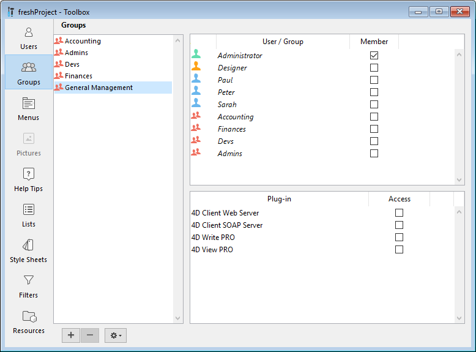

4D fornece aos usuários privilégios de acesso comuns e certos poderes. Quando o usuário e sistema de grupos tiver sido iniciado, esses privilégios começam a funcionar.

## Usuários e grupos em projectos

Em aplicações projecto (ficheiros .4DProject ou .4dz), os utilizadores e grupos 4D podem ser configurados tanto em ambientes usuário único como multi-usuário. Sin embargo, **el control de acceso** sólo es efectivo con 4D Server. A tabela abaixo lista as principais funcionalidades de usuários e grupos e sua disponibilidade:

|                                                            | 4D (usuário único)                   | 4D Server |
| ---------------------------------------------------------- | ------------------------------------------------------- | --------- |
| Adicionar/editar usuários e grupos                         | sim                                                     | sim       |
| Atribuir acesso de usuário/grupo a servidores              | sim                                                     | sim       |
| Identificação de usuário                                   | não (todos os usuários são Designer) | sim       |
| Controle de acesso quando o Designer for atribuído a senha | não (todos os acessos são Designer)  | sim       |

> Para obtener información sobre la identificación de usuarios y el control de acceso en los despliegues monopuesto, consulte [este párrafo](overview.md#access-control-in-single-user-applications).

## Designer e Administrador

El usuario más poderoso se llama el **Diseñador**. Nenhum aspecto do banco de dados é fechado ao Designer.
O Designer pode:

- acessar todos os servidores de banco de dados sem restrição,
- criar usuários e grupos,
- atribuir privilégios de acesso a grupos,
- acessar o ambiente Design.
  Em ambiente monousuário, direitos de acesso de Designer são sempre usados.
  Em ambiente cliente/servidor, atribuir uma senha ao Designer ativa a exibição do diálogo de login de usuário 4D.  Acesso ao ambiente Design é apenas leitura.

Después del Diseñador, el siguiente usuario más poderoso es el **Administrador**, al que se le suelen encomendar las tareas de gestión del sistema de acceso y las funciones de administración.

O Administrador não pode:

- criar usuários e grupos,
- acessar ao monitor e janela de Administração 4D Server
- acessar a janela MSC para gerenciar cópias de segurança, restaurações ou servidor.

O administrador pode:

- editar o usuário Designer
- como padrão, acessar as partes protegidas do banco de dados. O Administrador não pode acessar o modo Design se for restringido. In particular, the Administrator cannot access to the Design mode if it is restricted. O administrador é inscrito em todo novo grupo, mas é possível remover o nome do Administrador de qualquer grupo.

Tanto o Designer quanto o Administrador estão disponíveis como padrão em todos os bancos de dados. En la [caja de diálogo de gestión de usuarios](#users-and-groups-editor), los iconos del Diseñador y del Administrador se muestran en rojo y verde respectivamente:

- Ícone Designer: 
- Ícone Administrador: 

Pode renomear os usuários Designer e Administardor. Na linguagem, o ID de Designer é sempre 1 e a ID de Administrador é sempre 2.

O Designer e Administrador podem cada um criar até 16.000 grupos e 16 mil usuários.

## Editor de grupos

O editor de usuários está na Barra de Ferramentas de 4D.

> El editor de usuarios y grupos se puede mostrar en tiempo de ejecución utilizando el comando [EDIT ACCESS](https://doc.4d.com/4dv19R/help/command/en/page281.html).
> Toda la configuración de usuarios y grupos también puede editarse durante la ejecución de la aplicación utilizando los comandos del lenguaje 4D del tema `Usuarios y Grupos`.

### Adicionar e modificar usuários

Para usar o editor de usuários para criar contas de usuário, estabeleça as propriedades e atribua aos vários grupos.

Para adicionar um usuário da Barra de Ferramentas:

1. Seleccione **Caja de herramientas > Usuarios** en el menú **Diseño** o haga clic en el botón **Caja de herramientas** de la barra de herramientas de 4D.
   4D exibe o editor de usuários.

La lista de usuarios muestra todos los usuarios, incluyendo el [Diseñador y el Administrador](#designer-and-administrator).

2. Click on the  button located below the list of users.
   OR Right-click in the list of users and choose **Add** or **Duplicate** in the context menu.

> El comando **Duplicar** se puede utilizar para crear varios usuarios que tengan las mismas características rápidamente.

4D adiciona um novo usuário para a lista, chamado "Novo usuárioX" como padrão.

3. Digite o nome de usuário.
   Enter the user name. Puede renombrar un usuario en cualquier momento utilizando el comando **Renombrar** del menú contextual, o utilizando los atajos Alt+clic (Windows) u Opción+clic (macOS), o haciendo dos veces clic en el nombre que quiera cambiar.

4. Para introducir una contraseña del usuario, haga clic en el botón **Editar...** en el área de propiedades del usuario e introduzca la contraseña dos veces en la caja de diálogo.
   Pode usar até 15 caracteres alfanuméricos para a senha. O editor de senhas é sensível a maiúsculas ou minúsculas.

> Los usuarios pueden cambiar su contraseña en cualquier momento según las opciones de la página "Seguridad" de las propiedades de la estructura, o utilizando el comando `CHANGE PASSWORD`.

5. Estabeleça os grupos aos quais o usuário vai pertencer com a tabela "Membro de Grupos".
   Pode adicionar ou remover os usuários selecionados de ou para um grupo marcando a opção correspondente na coluna Membro.

La pertenencia de los usuarios a los distintos grupos también puede definirse por grupos en la página [Grupos](#configuring-access-groups).

### Apagar um usuário

Para eliminar un usuario, selecciónelo y haga clic en el botón de eliminación o utilice el comando **Suprimir** del menú contextual.

Usuários deletados não aparecem mais no editor de Usuários. Note que as IDs de usuários deletados são retribuídas quando novas contas de usuário forem criadas.

### Propriedades de usuário

- El campo **Tipo de usuario**: el campo Tipo de usuario contiene "Diseñador", "Administrador" o (para todos los demás usuarios) "Usuario".

- **Método de inicio**: nombre de un método asociado que se ejecutará automáticamente cuando el usuario abra la aplicación (opcional). Esse método pode ser usado por exemplo para carregar as preferências de usuário.

## Editor de usuários

O editor para grupos está na Barra de ferramentas de 4D.

### Grupos de configuração

Pode usar o editor de grupos para estabelecer os elementos que cada grupo conter (usuários ou outros grupos) e distribuir acesso aos plug-ins.

Lembre que se um grupo for criado não pode ser apagado. Se quiser desativar um grupo, precisa remover primeiro todos seus usuários.

Para criar um gurpo:

1. Seleccione **Caja de herramientas > Grupos** en el menú **Diseño** o haga clic en el botón **Caja de herramientas** de la barra de herramientas de 4D luego haga clic en el botón **Grupos**.
   4D exibe a janela de editor de grupos. A lista de grupos exibe todos os grupos do banco de dados.

2. Clique no botão  localizado abaixo da lista dos grupos.\
   OR\
   Right-click in the list of groups and choose the **Add** or **Duplicate** command in the context menu.

> O comando Dupplicate/Duplicar pode ser usado para criar vários grupos tendo as mesmas características.

4D adiciona um novo grupo para a lista, chamado "Novo grupoX".

3. Digite o nome do novo grupo.
   O nome de grupo pode ter até 15 caracteres.
   Puede renombrar un grupo en cualquier momento utilizando el comando **Renombrar** del menú contextual, o utilizando los atajos Alt+clic (Windows) u Opción+clic (macOS), o haciendo dos veces clic en el nombre que quiera cambiar.

### Colocar usuários ou grupos dentro de grupos

Pode colocar qualquer usuário ou grupo dentro de um grupo, e pode também colocar um grupo dentro de vários outros grupos. Não é obrigatório colocar um usuário em um grupo.

Para colocar um usuário ou grupo em um grupo, precisa marcar a opção "Membro" para cada usuário ou grupo na área de atribuição de membros:

Se marcar o nome de usuário, esse usuário é adicionado ao grupo. Se marcar o nome de um grupo, todos os usuários do grupo serão adicionados ao novo grupo.
The affiliated user or group will then have the same access privileges as those assigned to the new group.

A colocação de grupos noutros grupos permite-lhe criar uma hierarquia de usuários. The users of a group placed in another group will have the access privileges of both groups. Ver "[Un esquema de jerarquía de acceso](#an-access-hierarchy-scheme)" abajo.

To remove a user or group from another group, you just need to deselect the corresponding option in the member attribution area.

### Atribuição de um grupo a um plug-in ou a um servidor

You can assign a group privileges to any plug-ins installed in the database. Isto inclui todos os plug-ins 4D e de terceiros.

Distributing access to the plug-ins lets you control the use of the licenses you possess for these plug-ins. Any users that do not belong to the access group of a plug-in cannot load this plug-in.

> Used licenses remain attached to 4D user accounts in the group for the whole 4D session.

The “Plug-in” area on the Groups page of the tool box lists all the plug-ins loaded by the 4D application. To give a group access to a plug-in, you simply need to check the corresponding option.

Las líneas **4D Client Web Server** y **4D Client SOAP Server** permiten controlar la posibilidad de publicación Web y SOAP (Web Services) de cada 4D en modo remoto. Essas licenças são consideradas como licenças de plug-in por 4D Server. Therefore, in the same way as for plug-ins, you can restrict the right to use these licenses to a specific group of users.

### Um esquema de acesso hierárquico

The best way to ensure the security of your database and provide users with different levels of access is to use an access hierarchy scheme. Users can be assigned to appropriate groups and groups can be nested to create a hierarchy of access rights. Esta secção discute várias abordagens a esse esquema.

In this example, a user is assigned to one of three groups depending on their level of responsibility. Usuários atribuídos ao grupo Accounting são responsáveis pela entrada de dados. Users assigned to the Finances group are responsible for maintaining the data, including updating records and deleting outdated records. Users assigned to the General Management group are responsible for analyzing the data, including performing searches and printing analytical reports.

The groups are then nested so that privileges are correctly distributed to the users of each group.

- The General Management group contains only “high-level” users.
  

- The Finances group contains data maintenance users as well as General Management users, thus the users in General Management have the privileges of the Finances group as well.
  

- The Accounting group contains data entry users as well as Finances group users, so the users who belong to the Finances group and the General Management group enjoy the privileges of the Accounting group as well.
  

You can decide which access privileges to assign to each group based on the level of responsibility of the users it includes.

Such a hierarchical system makes it easy to remember to which group a new user should be assigned. You only have to assign each user to one group and use the hierarchy of groups to determine access.

## Atribuir grupos de acesso

Groups are assigned access privileges to specific parts or features of the application:

- Acesso ao ambiente Desenho e ao Explorador de execução,
- Servidor HTTP,
- Servidor REST,
- Servidor SQL.

Estes acessos são definidos no diálogo Parâmetros. O exemplo abaixo mostra direitos de acesso ao explorador de Execução e ao Design sendo atribuidos ao grupo "Devs":

También se utilizan grupos para [distribuir las licencias disponibles](#assigning-a-group-to-a-plug-in-or-to-a-server). Esta distribuição é definida no editor Grupos.

## Ficheiro Directory.json

Los usuarios, grupos, así como sus derechos de acceso se almacenan en un archivo específico del proyecto llamado **directory.json**.

This file can be stored at the following locations, depending on your needs:

- Se você quiser usar o mesmo diretório para todos os arquivos de dados (ou se você usar um arquivo de dados único), armazene o arquivo **directory.json** na pasta de configurações do usuário, i.e. na pasta "Settings" [no mesmo nível que a pasta "Projeto"](Project/architecture.md#project-folder) (local padrão).
- Si desea utilizar un archivo directorio específico para archivar datos, almacene el archivo **directory.json** en la carpeta["Settings" de la carpeta "Data"](Project/architecture.md#settings). Si un archivo **directory.json** está presente en esta ubicación, tiene prioridad sobre el archivo en la carpeta Settings usuario. This custom/local Users and Groups configuration will left untouched by an application upgrade.

> To allow for safe changes of passwords and group memberships in a deployed environment, you can include your **directory.json** file in the server application during the build, using the [corresponding build application option](../Desktop/building.md#embed-the-project-users-and-groups-in-built-server-application).
