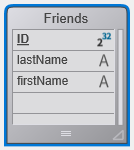
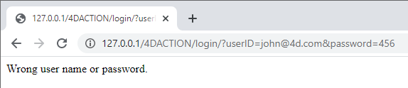

This "Getting started" section is geared at first-time users who want an overall overview on how to go from zero to a 4D website that handles data from the database. Vamos começar!

## Exemplo Hello World

Vamos começar fazendo com que o servidor Web envie "Hello World" para o navegador. La forma más sencilla de hacerlo es crear un proyecto, iniciar el servidor web y escribir un pequeño código que devuelva un texto en el método base `On Web Connection`.

### Iniciar o servidor Web

Para iniciar o servidor web 4D:

1. Inicie sua aplicação 4D e crie um projeto 4D novo e vazio.
2. En el menú **Ejecutar**, seleccione **Arrancar el servidor web**.

É tudo! El servidor web se inicia (verá que el elemento del menú cambia a **Detener el servidor web**). Está agora pronto para processar pedidos. Para o verificar, vamos apresentar a página inicial padrão.

### Exibição da página inicial padrão

El servidor web 4D crea automáticamente una página `index.html` por defecto en la carpeta raíz por defecto `WebFolder`, creada al mismo nivel que la carpeta Project.

1. Inicie um navegador da Web e conecte-se ao endereço IP do servidor da Web (a porta http padrão do servidor Web 4D é 80). Si el servidor web y el navegador están en la misma máquina, puede seleccionar **Probar servidor web** en el menú **Ejecutar**.

É apresentada a página inicial predefinida:


### Exibindo Hello World

1. Abra el Explorador, muestre la lista de Métodos base y haga doble clic en `On Web Connection`.

2. Digite o seguinte código:

```4d
Case of 
	: ($1="/hello")
		WEB SEND TEXT("Hello World!")
	Else 
		// Error 404 for example
End case 
```

The [`On Web Connection`](httpRequests.md#on-web-connection) database method is called for incoming requests and receives the target URL in the `$1` parameter. Este código muito simples apenas envia o texto para o navegador.

3. No seu browser, introduza o seguinte URL:

```
http://localhost/hello
```

O servidor Web processa o pedido e devolve-o:


## Obter dados da base de dados

Agora vamos ver como é simples obter dados do banco de dados. Primeiro, vamos criar uma tabela e preenchê-la com alguns dados.

Create a basic database with, for example, a single table containing some records:




### Exibição de dados em uma página

La solución más sencilla para mostrar los datos es llamar a una [página de plantillas](templates.md) que contenga etiquetas.

1. Usando qualquer editor de texto, crie um arquivo com as seguintes linhas:

```html
<html>
<body>
<!--#4DCODE ALL RECORDS([Friends])-->
<!--#4DLOOP [Friends]-->
<!--#4DTEXT [Friends]lastName--> <!--#4DTEXT [Friends]firstName--><br/>
<!--#4DENDLOOP-->
</body>
</html>
```

2. Nombre el archivo "friends.shtml" y guárdelo en la **WebFolder** de su proyecto.
3. No seu browser, introduza o seguinte URL:

```
http://localhost/friends.shtml
```

Las páginas `.shtml` son procesadas automáticamente por el servidor web. A sua página preenchida com dados é devolvida:


### Pedido REST

Si no sólo queremos _visualizar_ datos, sino _utilizarlos_, podemos utilizar ORDA y el servidor REST. Gracias al [concepto ORDA](ORDA/overview.md), la tabla `Friends` se asigna automáticamente a una clase de datos y está disponible a través de [REST](REST/gettingStarted.md).

1. Utilizaremos el servidor REST para acceder a los datos: vaya a la caja de diálogo **Parámetros**, seleccione **Web** > **Funcionalidades Web** y marque la opción **Exponer como servidor REST**.


2. No seu browser, introduza o seguinte URL:

```
http://localhost/rest/$catalog
```

O servidor Web devolve os resultados em JSON:

```json
{
	"__UNIQID": "3F1B6ACFFE12B64493629AD76011922D",
	"dataClasses": [
		{
			"name": "Friends",
			"uri": "/rest/$catalog/Friends",
			"dataURI": "/rest/Friends"
		}
	]
}
```

You get the catalog, i.e. the list of exposed dataclasses and attributes in the datastore.

Você também pode obter qualquer dado.

3. Introduzir o seguinte URL:

```
http://localhost/rest/Friends
```

The server returns the entities, i.e. the data, from the Friends dataclass:

```json
{
	"__DATACLASS": "Friends",
	"__entityModel": "Friends",
	"__GlobalStamp": 0,
	"__COUNT": 4,
	"__FIRST": 0,
	"__ENTITIES": [
		{
			"__KEY": "1",
			"__TIMESTAMP": "2020-10-27T14:29:01.914Z",
			"__STAMP": 1,
			"ID": 1,
			"lastName": "Smith",
			"firstName": "John"
		},
		{
			"__KEY": "2",
			"__TIMESTAMP": "2020-10-27T14:29:16.035Z",
			"__STAMP": 1,
			"ID": 2,
			"lastName": "Brown",
			"firstName": "Danny"
		},
		{
			"__KEY": "3",
			"__TIMESTAMP": "2020-10-27T14:29:43.945Z",
			"__STAMP": 1,
			"ID": 3,
			"lastName": "Purple",
			"firstName": "Mark"
		},
		{
			"__KEY": "4",
			"__TIMESTAMP": "2020-10-27T14:34:58.457Z",
			"__STAMP": 1,
			"ID": 4,
			"lastName": "Dupont",
			"firstName": "Jenny"
		}
	],
	"__SENT": 4
}
```

Este ejemplo muy sencillo muestra cómo el servidor web interactúa de forma transparente con el servidor [REST](REST/gettingStarted.md) para devolver cualquier dato solicitado, siempre que esté expuesto. In your web interfaces, you can easily bind the javascript or html code with returned data. Vea el [Explorador de datos web](Admin/dataExplorer.md) integrado para tener un ejemplo de interfaz web sofisticada vinculada a las clases de datos.

## Início de sessão e sessão

In the above sections, we get free access to the application from web requests. However, in the world of web applications, data access security is the first priority. When connecting to the 4D web server, users must be authentified and their navigation controlled.

### Criação de uma tabela de usuários

The most simple and secured way to log a user on the 4D web server is based upon the following scenario:

- Los usuarios se almacenan en una tabla dedicada y no expuesta (llamada _WebUsers_ por ejemplo)
- La tabla _WebUsers_ podría estar [encriptada](MSC/encrypt.md) y almacena el login del usuario y un hash de su contraseña.

1. Criar uma tabela com alguns campos, por exemplo:


2. Escreva e execute o seguinte código para criar um usuário:

```4d
var $webUser : cs.WebUsersEntity

$webUser:=ds.WebUsers.new()
$webUser.firstName:="John"
$webUser.lastName:="Doe"
// a senha seria inserida pelo usuário
$webUser.password:=Generate password hash("123")
$webUser.userId:="john@4d.com"
$webUser.save()
```

### Autenticação de usuários

> Para que sea segura de extremo a extremo, es necesario que toda la conexión se establezca mediante [https](webServerConfig.md#enable-https).

1. Abra o Explorador e crie um método projeto chamado "login".

2. Escreva o seguinte código:

```4d
var $indexUserId; $indexPassword : Integer
var $userId; $password : Text
var $user; $info : Object
ARRAY TEXT($anames; 0)
ARRAY TEXT($avalues; 0)

// get values sent in the header of the request
WEB GET VARIABLES($anames; $avalues)

// look for header login fields
$indexUserId:=Find in array($anames; "userId")
$userId:=$avalues{$indexUserId}
$indexPassword:=Find in array($anames; "password")
$password:=$avalues{$indexPassword}

//look for a user with the entered name in the users table
$user:=ds.WebUsers.query("userId = :1"; $userId).first()

If ($user#Null) //a user was found
		//check the password
    If (Verify password hash($password; $user.password))
    		//password ok, fill the session
        $info:=New object()
        $info.userName:=$user.firstName+" "+$user.lastName
        Session.setPrivileges($info)
        	//You can use the user session to store any information
        WEB SEND TEXT("Welcome "+Session.userName)
    Else 
        WEB SEND TEXT("Wrong user name or password.")
    End if 
Else 
    WEB SEND TEXT("Wrong user name or password.")
End if 
```

3. Despliegue las propiedades del método haciendo clic en el botón **[i]** del editor de código, marque la opción `etiquetas 4D y URLs (4DACTION...)` y haga clic en **Aceptar**.


4. No seu browser, introduza o seguinte URL:

```
http://localhost/4DACTION/login/?userID=john@4d.com&password=123
```

> Using such URLs is not recommended, it is only presented here to keep the example simple. A more realistic login request must be handled through a web form and a POST request. Consulte [esta página](sessions.md#example) para ver un ejemplo de formulario POST.

Em seguida, será registado para a sessão:


As credenciais incorretas serão rejeitadas:



Una vez que un usuario se registra, puede manejar la sesión asociada utilizando el método `WEB Get Current Session ID`. Ver la página [Sesiones de usuario](sessions.md).
