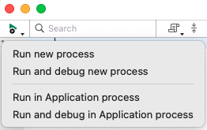
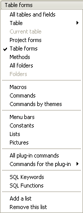
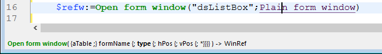
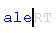
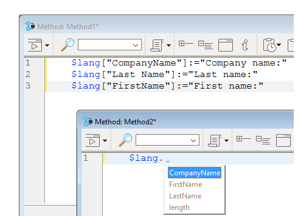
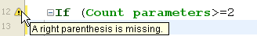
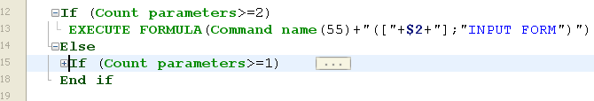

4D tem um poderoso editor de código embutido que oferece um amplo conjunto de funcionalidades para edição de código altamente produtiva, como preenchimento inteligente de código, navegação de código, depuração, busca, e mais.


O editor de código funciona de forma semelhante a um editor de texto. Escrever um método ou uma classe é geralmente uma combinação de digitar texto, selecionar componentes e arrastar itens do Explorador ou de outras janelas. Você também pode usar várias funções de preenchimento automático para criar métodos mais rapidamente.

You can scroll through the contents of methods, classes and functions, which can include up to 32,000 lines of code or 2 GB of text.

O Editor de código 4D fornece verificação básica de erros de sintaxe. É efetuada uma verificação de erros adicional quando o código é executado. Para obter mais informações sobre como lidar com erros, consulte [Debugging](../Depuração/basics.md).

## Interface

### Barra de ferramentas

Each Code Editor window has a toolbar that provides instant access to basic functions related to code execution and editing.

| Elemento                                     | Ícone                                                                             | Descrição                                                                                                                                                                                                                                                                                                                                                                                                                                                                                                                                                                                                                                                                                                                                                                                                                                                                                                                                                                                                                                                                                                                                                                                                                |
| -------------------------------------------- | --------------------------------------------------------------------------------- | ------------------------------------------------------------------------------------------------------------------------------------------------------------------------------------------------------------------------------------------------------------------------------------------------------------------------------------------------------------------------------------------------------------------------------------------------------------------------------------------------------------------------------------------------------------------------------------------------------------------------------------------------------------------------------------------------------------------------------------------------------------------------------------------------------------------------------------------------------------------------------------------------------------------------------------------------------------------------------------------------------------------------------------------------------------------------------------------------------------------------------------------------------------------------------------------------------------------------ |
| **Execução do método**                       |                     | When working with methods, each Code Editor window has a button that can be used to run the current method. Usando o menu associado a este botão, você pode escolher o tipo de execução:<ul><li>**Executar novo processo**: Cria um processo e executa o método no modo padrão neste processo.</li><li>**Executar e depurar novo processo**: Cria um novo processo e exibe o método na janela do Depurador para execução passo a passo neste processo.</li><li>**Executar no processo do Aplicativo**: Executa o método no modo padrão no contexto do processo do Aplicativo (ou seja, a janela de exibição do registro).</li><li>**Executar e depurar no processo do Aplicativo**: Exibe o método na janela do Depurador para execução passo a passo no contexto do processo do Aplicativo (ou seja, a janela de exibição do registro).</li></ul>Para obter mais informações sobre a execução de métodos, consulte [Chamando Métodos do Projeto](../Concepts/methods.md#calling-project-methods). |
| **Procurar no método**                       |                                | Exibe a área de [\*Pesquisa](#find-and-replace).                                                                                                                                                                                                                                                                                                                                                                                                                                                                                                                                                                                                                                                                                                                                                                                                                                                                                                                                                                                                                                                                                                                                                         |
| **Macros**                                   |                              | Insere uma macro na seleção. Clique na seta pendente para visualizar uma lista de macros disponíveis. Para obter mais informações sobre como criar e instanciar macros, consulte [Macros](#macros).                                                                                                                                                                                                                                                                                                                                                                                                                                                                                                                                                                                                                                                                                                                                                                                                                                                                                                                                                                      |
| **Expandir tudo / Recolher tudo**            |        | These buttons allow expanding or collapsing all the control flow structures of the code.                                                                                                                                                                                                                                                                                                                                                                                                                                                                                                                                                                                                                                                                                                                                                                                                                                                                                                                                                                                                                                                                                                                 |
| **Informações sobre o método**               |        | Exibe a caixa de diálogo de [Propriedades do Método](../Concepts/methods.md#project-method-properties) (apenas métodos de projeto).                                                                                                                                                                                                                                                                                                                                                                                                                                                                                                                                                                                                                                                                                                                                                                                                                                                                                                                                                                                                                                                   |
| **Últimos valores da área de transferência** |  | Exibe os últimos valores armazenados na área de transferência.                                                                                                                                                                                                                                                                                                                                                                                                                                                                                                                                                                                                                                                                                                                                                                                                                                                                                                                                                                                                                                                                                                                                           |
| **Pranchetas**                               |                        | Nove pranchetas disponíveis no editor de código. Você pode [usar estes clipboards](./write-class-method.md#multiple-copy-paste-and-numbering-of-clipboards) clicando neles diretamente ou usando atalhos de teclado. Você pode usar uma [opção de Preferências](Preferences/methods.md#options-1) para ocultá-las.                                                                                                                                                                                                                                                                                                                                                                                                                                                                                                                                                                                                                                                                                                                                                                                                                                                       |
| **Menu de navegação suspenso**               |                        | Lets you navigate inside methods and classes with automatically tagged content or manually declared markers. Ver abaixo                                                                                                                                                                                                                                                                                                                                                                                                                                                                                                                                                                                                                                                                                                                                                                                                                                                                                                                                                                                                                                                                                  |

### Área de edição

É aqui que escreve e edita o seu código. The editor automatically indents code text and colors the different syntax elements for clear code structure.

É possível personalizar a apresentação da área de edição. Qualquer personalização é automaticamente passada para todas as janelas do editor de código:

| Opção                                     | Descrição                                                                                                                                                                                                                                                                                   | Definido em...                                                                                                                                                                                                                                                                                               |
| ----------------------------------------- | ------------------------------------------------------------------------------------------------------------------------------------------------------------------------------------------------------------------------------------------------------------------------------------------- | ------------------------------------------------------------------------------------------------------------------------------------------------------------------------------------------------------------------------------------------------------------------------------------------------------------------------------------------------------------ |
| **fuente** y **tamaño de la fuente**      | Define o tipo de letra e o tamanho dos caracteres a utilizar na área de edição                                                                                                                                                                                                              | **Preferências** > [**Métodos**](../Preferences/methods.md) ou **Método > Visualização** > **Fonte Maior** ou **Fonte Menor**                                                                                                                                                                                                                                |
| **estilo e cor dos elementos de sintaxe** | atribui uma cor e/ou estilo específicos a cada tipo de elemento da linguagem 4D.  Você também pode alterar as diferentes cores usadas na interface da área de edição (destaque, fundo, etc.).                            | Right-click on a language element (variable, keyword, etc.) Right-click on a language element (variable, keyword, etc.) > <strong x-id="1">Style</strong> submenu. > Submenú **Estilo**. Ou **Preferences** > [**Methods**](../Preferences/methods.md) |
| **espaços**                               | Você pode exibir os espaços entre as palavras usando pontos (.) em vez de espaços em branco. This option applies to all the code elements (command names, variables, comments, etc.). | **Método > Ver > Espaços em branco**                                                                                                                                                                                                                                                                                                                         |
| **temas**                                 | Pode selecionar o tema Escuro ou Claro, ou definir um tema personalizado                                                                                                                                                                                                                    | **Preferências** > [**Métodos**](../Preferences/methods.md)                                                                                                                                                                                                                                                                                                  |
| **largura das indentações de código**     | Definir a largura das indentações do código                                                                                                                                                                                                                                                 | **Preferências** > [**Métodos**](../Preferences/methods.md)                                                                                                                                                                                                                                                                                                  |

#### Mudar barras

Colored bars instantly show you where lines of code were modified since the method was opened:


The change bars change colors to indicate whether or not the modifications were saved:

- amarelo: a linha foi modificada e o método ainda não foi guardado.
- verde: A linha foi modificada e o método foi guardado.

### Área listas

The lists area lets you display one or more lists of elements necessary for writing methods and classes (commands, constants, forms, etc.). You can choose the number and contents of the lists displayed in the window.

Por padrão, o editor de código apresenta quatro listas. You can hide or show all lists by clicking on the icon at the botton right of the window. 

You can enlarge or reduce the relative width of each list area by dragging one of its partitions. It is also possible to adjust the size of the list area in relation to that of the editing area by dragging the dividing line between them.

- Double-clicking on an item in a list causes it to be inserted into the editing area, at the location of the cursor.
- Para **modificar o conteúdo** de uma lista, clique na área do título da lista em questão: um menu pop-up será exibido, permitindo que você escolha o tipo de item a ser exibido.



- To add or remove a list, click in the title area of one of the lists and choose the corresponding command in the pop-up menu.
  O comando **Remover esta lista** está desativado quando você clica na última lista. Se você deseja ocultar todas as listas, você deve clicar no botão **mostrar ou ocultar listas** no canto inferior direito da janela ou ocultá-las por padrão nas **Preferências**.

- Pode ocultar as listas em todas as janelas das seguintes formas:
  - Selecione a opção **Exibir > Listas** no menu **Método** (uma marca de seleção indica se as listas estão sendo exibidas)
  - Desmarque a opção **Preferências** > **Métodos** > **Opções** > **Mostrar Listas**. Para que as modificações feitas na caixa de diálogo **Preferências** sejam consideradas, todos os métodos, classes ou funções abertos devem ser fechados e reabertos.

#### Listas de itens disponíveis

You can display the following lists of items in the lists area of the Code Editor window:

- **Todas as tabelas e campos**: Nomes de tabelas e campos do banco de dados em forma de lista hierárquica. When you insert a field name into the method by double-clicking on its name, 4D inserts it while respecting the syntax and adds the name of the table or subtable as the case may be.
- **Tabela** (submenú): Nomes dos campos da tabela selecionada usando o submenu.
- **Tabela atual**: Nomes dos campos da tabela atual (disponível em gatilhos, métodos de formulário e métodos de objeto).
- **Formulários projeto**: Nomes de formulários projeto de banco de dados. When you double-click on a project form name, 4D inserts its while respecting the syntax: the form name is inserted between quotes.
- **Formulários de tabela**: Nomes de tabelas do banco de dados e nomes de formulários em forma de lista hierárquica. When you insert a form name into a method by double-clicking its name, 4D inserts it while respecting the syntax: the form name is inserted between quotes and is preceded by the name of the table and a semi-colon. Por exemplo: [Table]; "Form".
- **Métodos**: nomes de métodos projeto do banco de dados.
- **Todas as pastas**: Nomes das pastas de objetos e subpastas definidas no banco de dados exibidas na forma de uma lista hierárquica. As pastas podem ser utilizadas para organizar objetos de uma forma personalizada. São geridos a partir da página inicial do explorador.
- **Pastas** (submenú): Conteúdo da pasta selecionada usando o submenu.
- **Macros**: Nomes de macros definidos para o banco de dados (ver [Criando e utilizando macros](#creating-and-using-macros)).
- **Comandos**: comandos de idioma 4D em ordem alfabética.
- **Comandos por temas**: comandos da linguagem 4D classificados por tema em forma de lista hierárquica.
- **Barras de menu**: Nomes e números das barras de menu [criadas com o editor de barras de menu 4D](../Menus/creating.md).
- **Constantes**: constantes do 4D e de quaisquer plug-ins, classificadas por tema em forma de lista hierárquica.
- **Listas**: Nomes de listas.
- **Todos os comandos de plug-in**: Comandos para todos os plug-ins instalados no banco de dados (se houver), classificados por tema em forma de lista hierárquica.
- **Palavras SQL**: conjunto de palavras-chave reconhecidas pelo analisador de sintaxe 4D SQL. This list includes commands (e.g. SELECT), clauses (e.g. WHERE) as well as functions (ABS).
- **Funções SQL**: funções SQL 4D.

**Nota:** Com exceção do elemento Macros, todas as listas estão por ordem alfabética.

#### Guardar como modelo

You can save the lists set in the Code Editor window in the form of a template. Once the template is saved, the parameters set in it will be used for each new Code Editor window that is opened.

Os seguintes parâmetros são armazenados no modelo:

- Tamanho relativo das áreas de edição e de lista
- Número de listas
- Localização e conteúdo de cada lista
- Largura relativa de cada lista

Para salvar uma janela do Editor de Código como um modelo, escolha **Método** > **Salvar como Modelo**. O modelo é guardado imediatamente (não aparece nenhuma caixa de diálogo). Está armazenado nas **Preferências** do aplicativo 4D. Se já existir um modelo anterior, ele será substituído.

### Área de pontos de paragem

This area, located to the left of the editing area, allows you to display the line numbers and to insert break points directly next to specific instructions. Os pontos de interrupção são úteis durante a fase de depuração de sua programação. They stop the execution of your code at specific locations and display the debugger.

Para mais informações sobre pontos de interrupção, consulte a seção [Depuração](../Debugging/breakpoints.md#breakpoints).

You can display or hide the line numbers in the break points area for each window of the Code Editor.

- Para habilitar ou desabilitar a exibição dos números de linha por padrão, escolha **Preferências** > **Métodos** > **Mostrar números de linha**.
- Para modificar essa exibição separadamente para cada janela do Editor de Código, escolha **Método** > **Visualizar** > **Números de Linha**.

Displaying the line numbers makes it easier to find your way around in the window. O comando **Método** > **Ir al número de linha...** também permite aproveitar essa exibição.

Este tipo de busca é útil quando usada em conjunto com o [compilador](../Project/compiler.md), que sinaliza erros de tempo de execução pelo número da linha em que eles ocorrem.

### Barra de estado

The status bar located at the bottom right part of the editor window displays the position of the cursor at all times:


- **Ln**: Número da linha
- **C**: número de coluna, ou seja, o nível na hierarquia das estruturas de programação. O primeiro nível é 0. The column number is useful for debugging since this information can be provided by the interpreter in the event of an error in the code.
- **Ch**: Localização do caractere na linha.
- : Ocultar/exibir listas.

When you set the cursor in a command, function or parameter(s), the status bar displays the syntax of the command. Se você escrever ou selecionar um parâmetro, a área mostra o parâmetro atual em **bold**:


### Menu de navegação suspenso

The navigation dropdown helps you organize your code and navigate more easily inside your classes and methods:


Algumas tags são adicionadas automaticamente, e você pode complementar a lista suspensa usando [marcadores](#manual-tagging).

#### Navegação de código

Click an item in the dropdown list to go to its first line in the code. Você também pode navegar com as teclas de seta e pressionar **Enter**.

#### Marcação automática

Constructors, method declarations, functions and computed attributes are automatically tagged and added to the dropdown list.

Quando não existe uma etiqueta na classe/método, a ferramenta apresenta "Sem etiqueta".

Os seguintes itens são adicionados automaticamente:

| Ícone                                                                       | Elemento                                                          |
| --------------------------------------------------------------------------- | ----------------------------------------------------------------- |
|                          | Sem etiqueta                                                      |
|                | Class constructor ou declaração de método                         |
|  | Atributo calculado (get, set, orderBy e query) |
|                      | Nome da função de classe                                          |

#### Marcação manual

Ao adicionar marcadores no seu código, pode adicionar as seguintes etiquetas ao menu pendente:

| Ícone                                                   | Elemento                        |
| ------------------------------------------------------- | ------------------------------- |
|  | MARK: etiqueta  |
|  | TODO: etiqueta  |
|    | FIXME: etiqueta |

Declara-os acrescentando comentários como:

```4d
// FIXME: Correção dos seguintes itens
```

As declarações não diferenciam maiúsculas de minúsculas; escrever `fixme:` tem o mesmo efeito.

A adição de um hífen após a tag `MARK:` desenha uma linha de separação no editor de código e no menu suspenso. Por isso, estou a escrever isto:


Os resultados são os seguintes:


Todos os marcadores localizados dentro de funções são recuados na lista suspensa, exceto as tags `MARK:` localizadas no final das funções e não seguidas de instruções. Estes aparecerão no primeiro nível.

#### Ordem de visualização

As etiquetas são exibidas em sua ordem de aparecimento dentro do método/classe.

To display the tags of a method or class in alphabetical order, do one of the following:

- \*\*Clique direito na ferramenta suspensa
- mantenha pressionado **Cmd** no macOS ou **Alt** no Windows e clique na ferramenta suspensa

> As etiquetas em funções movem-se com os seus itens pais.

### Atalhos

Multiple features of 4D's Code Editor are available through default keyboard shortcuts.

:::info macOS

No macOS, use a tecla **Command** em vez da tecla **Ctrl** mencionada (Windows).

:::

| **Atalho**                                                                                                                                                                                                    | **Ação**                                                                                                                                                                                                                                                |
| ------------------------------------------------------------------------------------------------------------------------------------------------------------------------------------------------------------- | ------------------------------------------------------------------------------------------------------------------------------------------------------------------------------------------------------------------------------------------------------- |
| **Selecção e navegação**                                                                                                                                                                                      |                                                                                                                                                                                                                                                         |
| Duplo clique                                                                                                                                                                                                  | Selecionar o nome de um elemento da linguagem                                                                                                                                                                                                           |
| [Alt]+Clique duas vezes                                                                                                                                   | Selecionar um nome de elemento de língua contendo espaços (constante, método, etc.)                                                                                                                                  |
| [Shift]+[seta para a direita]                                                                         | Create and enlarge the selection, character by character, to the right, or Reduce the selection, character by character, from the left                                                                                                                  |
| [Shift]+[seta para a esquerda]                                                                        | Reduce the selection, character by character, from the right or Create and enlarge the selection, character by character, to the left                                                                                                                   |
| [Shift]+[seta para baixo]                                                                             | Create and enlarge a selection, line by line, from the top to the bottom                                                                                                                                                                                |
| [Shift]+[seta para cima]                                                                              | Create and enlarge a selection, line by line, from the bottom to the top                                                                                                                                                                                |
| [Ctrl]+[Shift]+[seta para a direita]              | Criar e ampliar a seleção, palavra a palavra, a partir da direita                                                                                                                                                                                       |
| [Ctrl]+[Shift]+[seta para a esquerda]             | Reduce the selection, word for word, from the right, or create and enlarge the selection, word by word, from the left                                                                                                                                   |
| [Ctrl]+[seta para a direita]                                                                          | Mover o ponto de inserção, palavra a palavra, da esquerda para a direita                                                                                                                                                                                |
| [Ctrl]+[left arrow]                                                                                   | Mover o ponto de inserção, palavra a palavra, da direita para a esquerda                                                                                                                                                                                |
| [Alt]+[seta para baixo]                                                                               | Mover a(s) linha(s) onde se encontra o cursor para a parte inferior                                                                                                                                               |
| [Alt]+[seta para cima]                                                                                | Mover a(s) linha(s) onde se encontra o cursor para o topo                                                                                                                                                         |
| [Home]                                                                                                                                                    | Posicione o ponto de inserção no início da linha                                                                                                                                                                                                        |
| [End]                                                                                                                                                     | Colocar o ponto de inserção no fim da linha                                                                                                                                                                                                             |
| [Ctrl]+[Home]                                                                                         | Colocar o ponto de inserção no início do método                                                                                                                                                                                                         |
| [Ctrl]+[End]                                                                                          | Colocar o ponto de inserção no final do método                                                                                                                                                                                                          |
| [Shift]+[Home]                                                                                        | Select all the characters in the line that are to the left of the cursor                                                                                                                                                                                |
| [Shift]+[End]                                                                                         | Select all the characters in the line that are to the right of the cursor                                                                                                                                                                               |
| [PgUp]                                                                                                                                                    | Scroll the contents of the method, page by page, from the bottom to the top (doesn't modify the insertion point)                                                                                                                     |
| [PgDn]                                                                                                                                                    | Scroll the contents of the method, page by page, from the top to the bottom (doesn't modify the insertion point)                                                                                                                     |
| [**Introspecção**](#goto-definition)                                                                                                                                                                          |                                                                                                                                                                                                                                                         |
| [Ctrl]+K ou [Alt]+clique duas vezes                                                                   | Mesmo que o comando [**Ir para definição**](#goto-definition)                                                                                                                                                                                           |
| \[Ctrl\] (Windows) or \[Alt\] (macOS)+hovering over a token | Sublinhar o token (elemento linguístico identificado). Clique no token sublinhado = igual ao comando [**Goto definition**] (#goto-definition) |
| [**Encontrar e substituir**](#find-and-replace)                                                                                                                                                               |                                                                                                                                                                                                                                                         |
| [Ctrl]+F                                                                                                                                                  | Find                                                                                                                                                                                                                                                    |
| [Ctrl]+G                                                                                                                                                  | Encontrar o próximo                                                                                                                                                                                                                                     |
| [Ctrl]+[Shift]+G                                                                                      | Procurar Anterior                                                                                                                                                                                                                                       |
| [Ctrl]+E                                                                                                                                                  | Encontrar o mesmo próximo                                                                                                                                                                                                                               |
| [Ctrl]+[Shift]+E                                                                                      | Encontrar o mesmo anterior                                                                                                                                                                                                                              |
| [Ctrl]+[Alt]+F                                                                                        | Substituir                                                                                                                                                                                                                                              |
| [Ctrl]+[Alt]+G                                                                                        | Substituir próximo                                                                                                                                                                                                                                      |
| [Ctrl]+[Alt]+[Shift]+G                            | Reemplazar anterior                                                                                                                                                                                                                                     |
| [**Clipboards**](#clipboards)                                                                                                                                                                                 |                                                                                                                                                                                                                                                         |
| [Shift]+clique ou [Alt]+clique no ícone da área de transferência                                      | Copiar texto selecionado para uma área de transferência                                                                                                                                                                                                 |
| [Ctrl]+[Shift]+tecla numérica                                                                         | Copiar texto selecionado numa área de transferência numérica                                                                                                                                                                                            |
| [Ctrl]+clique no ícone da área de transferência                                                                                                           | Colar o conteúdo de uma área de transferência na localização do cursor                                                                                                                                                                                  |
| [Ctrl]+chave numérica                                                                                                                                     | Colar o conteúdo da área de transferência numérica na localização do cursor                                                                                                                                                                             |

:::tip

A maioria desses atalhos pode ser personalizada na caixa de diálogo [4D Preferences] (../Preferences/shortcuts.md).

:::

## Editar código

4D uses standard text editing techniques for typing and editing in the Code Editor.

The Code Editor uses display conventions (style, color) for the syntax elements. Você pode [personalizar estas convenções](#customizing-the-editing-area). As you type, when you validate your entry, 4D evaluates the text of the line and applies the appropriate display format. 4D also indents each line to its proper level in relation to the preceding line when you use programming structures (If, End if...).

Pode utilizar as teclas de setas para se deslocar rapidamente de uma linha para outra. Using the arrow keys to move across several lines is quicker than clicking because the editor delays evaluating the line for errors.

Under Windows, the code editor includes an Input Code Editor (IME) to facilitate code editing on Japanese or Chinese systems.

O Editor de Código inclui numerosos [atalhos de navegação](#shortcuts).

#### Uso de la barra invertida

O caractere de barra invertida (`\`) tem um suporte específico na linguagem 4D:

- inserido no final das linhas, permite escrever uma única instrução em [várias linhas](../Concepts/quick-tour.md#code-on-several-lines).
- permite definir [sequências de escape](../Concepts/quick-tour.md#escape-sequences).

:::caution

O caractere de barra invertida (`\`) é usado como separador em [nomes de caminho no Windows](../Concepts/paths.md#windows). In general, 4D will correctly interpret Windows pathnames entered in the Code Editor by replacing the single backslash with a double backslash. Por exemplo, `C:\MyDocuments` se tornará `C:\\MyDocuments`. No entanto, se escrever C:\MyDocuments\New, 4D mostrará C:\MyDocuments\New"`. Nesse caso, a segunda barra invertida é interpretada incorretamente como `\N\` (uma [sequência de escape] existente(../Concepts/quick-tour.md#escape-sequences)). You must therefore enter a double backslash when you want to have a backslash in front of a character used in one of the escape sequences recognized by 4D.

:::

### Arrastar e largar

From the Explorer, you can drag and drop tables, fields, forms, project methods, constants, or 4D commands. Quando você arrasta e solta um elemento, 4D sempre usa a sintaxe correta. Por exemplo, se você arrastar o nome do campo First Name da tabela `[People]`, ele aparecerá no Code Editor como `[People]First Name`. Da mesma forma, se você arrastar o nome do formulário Input da tabela People, ele aparecerá no Code Editor como `[People]; "Input"`.

Quando você insere um comando arrastando-o da página **Comandos** do Explorer, ele aparece com sua sintaxe (que consiste em todos os seus parâmetros) no Editor de código. This feature simply reminds you of the parameters that the command expects. Assim, você pode usar uma sintaxe mais adequada ao seu uso.

In the Code Editor, the drag-and-drop mechanism is activated as soon as a portion of text is selected. You can also drag-and-drop within a method, class, function or between two different ones.
Por padrão, o mecanismo de arrastar e soltar **move** o texto selecionado. Para **copiá-lo**, mantenha pressionada a tecla **Ctrl** (Windows) ou a tecla **Option** (macOS) durante a operação.

### Alternância entre letras maiúsculas e minúsculas

Você pode modificar automaticamente o caso dos caracteres selecionados usando os comandos em **Métodos** > **Caixa** ou o menu de contexto do editor:

- **Maiúsculas** / **Minúsculas**: Muda os caracteres selecionados para maiúsculas ou minúsculas.
- **camelCase** / **CamelCase** : Muda os caracteres selecionados para "camel case". This consists in changing each first letter of a group of attached words to uppercase. Este tipo de notação é frequentemente utilizado para as nomenclaturas de variáveis. hireDate e PurchaseDate são exemplos de duas variantes da notação camel case.

When you apply one of these commands to a text selection, the spaces and "_" characters are removed and the first letter of each word becomes uppercase.

### Trocar expressão

A função **Swap Expression** pode ser usada para inverter os argumentos de uma expressão que atribui um valor. Por exemplo,

`variable1:=variable2`

torna-se

`variable2:=variable1`

This function is extremely useful for reversing a set of assignments used to get or set properties, or to correct input errors. Para usar essa função, selecione a(s) linha(s) a ser(em) modificada(s) e, em seguida, escolha **Method** > **Swap Expression** ou use o menu de contexto da área. Within the selection, only the lines assigning a value will be modified.

### Pranchetas

In addition to the standard copy-paste operation, 4D offers two additional functions that let you work with the contents of different clipboards:

- The program stores the last 10 "copy" or "cut" actions that were performed in the Code Editor in memory during the current session. Each of the different contents saved in this way can be reused at any time. Para isso, use o comando **Clipboard History** do menu de contexto do Editor de código ou o botão "Last Clipboard values" da barra de ferramentas:

  

  São apresentadas as primeiras palavras dos itens copiados ou cortados. Selecione um item para inseri-lo no local atual do cursor.

- Nove áreas de transferência numeradas adicionais estão disponíveis e podem ser empregadas diretamente usando os botões da barra de ferramentas do Editor de Código ou [usando atalhos de teclado](#atalhos):


### Linhas em movimento

Você pode mover a linha onde o cursor está diretamente, sem selecioná-la primeiro, usando os comandos **Mover Linhas para Cima** e **Mover Linhas para Baixo** no menu **Método**. Você também pode fazer isso usando **Alt/Option** + **Seta para cima** ou **Seta para baixo** [atalho de teclado] (#atalhos).

### Funções de preenchimento automático

O editor de código fornece funções de preenchimento automático. 4D exibe automaticamente sugestões baseadas nos primeiros caracteres digitados.

In the example given below, typing the string "cop" causes the display of a blue triangle indicating that several suggestions are available:


Quando os caracteres inseridos correspondem a uma única possibilidade, esse valor sugerido aparece em cinza (e é inserido se você pressionar a tecla **Tab**):
 ---> 

> Se você marcou as opções \*\*Inserir () e fechar } ) ] " na página **Métodos** das **Preferências**, o 4D também adicionará automaticamente **()** depois de um comando 4D, palavra-chave ou método de projeto que requer um ou mais argumentos obrigatórios (depois de aceitar uma sugestão ou conclusão):
>  -> 

O autocompletamento também funciona com estruturas de código (por exemplo, If...End if, For each...End for each): quando você insere a primeira parte da estrutura, o Code Editor sugere automaticamente a parte final:


Se houver várias sugestões disponíveis, 4D as exibe em uma lista pop-up quando você pressiona a tecla **Tab**:


A lista está por ordem alfabética. Escolha o valor clicando duas vezes nele ou role a lista usando as teclas de seta do teclado e, em seguida, pressione **Enter**, **Carriage Return** ou **Tab** para inserir o valor selecionado.

Por padrão, você também pode inserir um valor sugerido pressionando uma das seguintes teclas delimitadoras `( ; : = < [ {` após selecionar um valor: o valor inserido é seguido pelo delimitador, pronto para a entrada de dados.

  +  **(** key --> 

> Você pode desativar o uso de delimitadores para inserir valores sugeridos em **Preferences** > **Methods** > **Options**.

Você pode pressionar a tecla **Esc** para fechar a lista pop-up ou pode continuar digitando enquanto ela estiver aberta. The values suggested in the pop-up list are updated as additional characters are typed.

If the characters typed correspond to different types of objects, the list displays them in their current style. Podem ser visualizados os seguintes tipos de objetos:

- Comandos 4D
- Comandos SQL
- Métodos utilizador
- Nomes de tabelas
- Nomes de campos
- Constantes
- Variables declared in the method
- Nomes de propriedade de objeto
- Comandos Plug-in
- Palavras-chave 4D
- Palavras-chave SQL
- Macros (apresentadas entre < >)

> Por motivos práticos, você pode desativar a exibição automática da lista de sugestões para **constantes**, **variáveis (locais ou entre processos) e atributos de objetos**, **tabelas** e/ou **protótipos**. Essas opções podem ser encontradas em **Preferências** > **Métodos** > **Opções**

#### Nomes de propriedade de objeto

4D automatically displays case-sensitive suggestions of all valid object property names in 4D code when you:

- digite um ponto "." depois de um objeto ou
- utilizar a tecla Tab após um ponteiro objeto desreferenciado "->".


> A propriedade `length` é sempre incluída para uso com coleções.

Once created, property names are stored in an internal global list and are available anytime a method/class/function is opened, closed or changes focus.



A lista de sugestões é atualizada dinamicamente enquanto você edita o código. When switching between windows, new/edited property names are always added to the global list. The list is also updated when you preview a method, class or function in the Explorer.

Quando o banco de dados é reiniciado, a lista é reinicializada.

> Você pode desativar a exibição automática das propriedades do objeto em **Preferências** > **Métodos** > **sugestões**.

## Procurar e substituir

O editor de código possui poderosas funcionalidades de **buscar e substituir** que se aplicam à janela atual.

A search and replace area can be displayed in the toolbar of any method window:


Para exibir essa área, clique no ícone **Encontrar no método** da [barra de ferramentas](#barra de ferramentas) ou selecione uma função de localização ou substituição por meio de um [**atalho**](#atalhos) ou de um comando do submenu **Editar > Localizar**. Você pode fechar essa área a qualquer momento clicando no botão **x** no lado direito da barra de ferramentas.

:::tip

A funcionalidade **Localizar no Design** na barra de ferramentas do 4D ou no menu **Editar** não é específica do editor de código, mas pode ser usada para pesquisar um valor entre todos os métodos e classes.

:::

### Find

Selecione **Find > Find...** no menu **Edit** ou digite **Ctrl+F** (Windows)/**Cmd+F** (macOS) para exibir/ativar a área *Search*.

The search defined in this area will be performed in the code located in the window.

A área de entrada **find** permite que você insira a string a ser pesquisada. This area is a combo box that stores the last 10 strings that have been searched for or replaced during the session. Se você destacar o texto antes de escolher o comando **Find...**, ele aparecerá nessa área. Pode então utilizar este texto ou substituí-lo por outro.

Once a string is entered or selected, all occurrences found in the opened window are highlighted and the right side of the area displays the total number of hits found. Também indica a posição atual do cursor entre todos os resultados.

Pressione a tecla **Enter** para selecionar a ocorrência mais próxima ao cursor. Você também pode clicar nos botões **Próximo / Anterior**  para selecionar todas as ocorrências sequencialmente no início ou no fim do método atual, a partir da localização inicial do cursor, ou usar os comandos **Procurar Próximo** e **Procurar Anterior** do [menu **Editar**](#shortcuts).

#### Opções

- **Sensível a maiúsculas e minúsculas** : Leva em consideração as maiúsculas e minúsculas dos caracteres conforme eles foram inseridos na área de localização. Essa opção também considera os caracteres diacríticos. For instance, a search for "MyVar" will not find "myVar"; a search for "dej" will not find "déjà".
- **Palavra Inteira** : Limita a pesquisa a ocorrências exatas da palavra que está sendo procurada. When this option is checked, for instance, a search for "client" will not find either "clients" or "myclient." When this option is checked, for instance, a search for "client" will not find either "clients" or "myclient."

### Substituir

Clique no botão de alternância **v** no lado esquerdo da área *Search* para exibir/ocultar a área *Replace*. Você também pode selecionar **Find > Replace...** no menu **Edit** ou digitar **Ctrl+Alt+F** (Windows)/**Cmd+Alt+F** (macOS) .

A área de entrada *Replace* é usada para definir a cadeia de caracteres que substituirá a definida acima.

Clique no botão **Replace** para iniciar a pesquisa com todas as opções definidas e substituir a primeira ocorrência encontrada. 4D begins searching from the current text insertion point and continues to the end of the method. É possível então continuar encontrando/substituindo usando os comandos **Substituir Próximo** e **Substituir o anterior** do menu [**Editar**](#atalhos).

Clique no botão **Replace all** para substituir todas as ocorrências correspondentes aos critérios de pesquisa diretamente no método aberto.

### Encontrar o mesmo

O comando **Find Same** é usado para localizar cadeias de caracteres idênticas à selecionada. This command is only active if you have selected at least one character in the Code Editor.

The search carried out is of the "Find Next" type in the current code editor window.

Os comandos **Find Same Next** e **Find Same Previous** são usados para localizar cadeias de caracteres *estritamente* idênticas às selecionadas. Por exemplo, as maiúsculas e minúsculas devem corresponder.

### Marcar tudo

O comando **Editar > Marcar tudo** é ativado quando uma pesquisa já tiver sido especificada na caixa de diálogo localizar ou substituir. When you select this command, 4D puts a bookmark at each line that contains an item corresponding to the "current" search criteria. Deste modo, é fácil identificar todos os resultados da pesquisa. Para obter mais informações sobre marcadores, consulte [Marcadores](#marcadores).

## Avisos e erros

Thanks to the 4D Code Live Checker, the syntax, consistency, and structure of the entered code are automatically checked in order to prevent execution errors. For example, the Code Live Checker can detect that a right parenthesis is missing or that you used an unknown dataclass attribute.

The Code Live Checker is activated at three levels:

- quando você escreve código no editor de código,
- quando você [verifica a sintaxe](../Project/compiler.md#check-syntax) no compilador,
- quando você [compila](../Project/compiler.md) o projeto.

4D verifica automaticamente a sintaxe do código para ver se está correta. If you enter text or select a component that is not correct, 4D displays a symbol to indicate the incorrect expression.

Dois tipos de símbolos são exibidos:

- **[warnings](../Project/compiler.md#warnings)** : Warnings are intended to draw your attention to statements that might lead to execution errors. Não impedem a compilação.
- **errors**: erros são anomalias que impedem que o código seja executado corretamente. Eles devem ser corrigidos, caso contrário o projeto não será compilado.

When you move the mouse over the symbol, a help tip displays the cause of the error:



O Verificador de código ao vivo é ativado enquanto você insere o código. When a line of a method, class or function is marked as having improper syntax, check and fix the entry. Se a linha estiver correta, 4D removerá o símbolo de erro. Quando salvar ou fechar a janela, todo o método é validado.

Você pode formatar a linha atual (sem avançar para a próxima linha) pressionando a tecla **Enter** no teclado numérico. 4D evaluates the line, formats it, marks any errors, and places the insertion point at the end of the line.

The Code Live Checker checks for:

- erros básicos de sintaxe (operadores errados, erros de ortografia e similares)
- a estrutura das declarações (`If`, `End if` e assim por diante)
- matching enclosing characters in the code such as parentheses or brackets (see tip below)
- the calls of attributes and functions according to your model (ORDA) and user class definitions. For example, the Code Live Checker generates an error when a call to a dataclass computed attribute is not compatible with the declared computed attribute type.

:::tip

When you type an enclosing character, 4D indicates the match by framing the start/end characters with gray rectangles by default:


Você pode modificar a forma como o 4D indica os caracteres correspondentes ou desativar esse recurso em [**Preferences**](../Preferences/methods.md#options-1).

:::

The Code Live Checker cannot detect some errors that only occur during execution. Erros de execução são capturados por 4D quando o código é executado. No entanto, lembre-se de que o [compiler](../Project/compiler.md) também fornece ajuda indispensável para a detecção de erros.

## Dicas de ajuda

O Editor de código fornece várias informações contextuais utilizando dicas de ajuda. Aparecem quando se passa o rato por cima de um objeto.

:::tip

A [barra de status](#status-bar) também fornece informações contextuais.

:::

- **Erros**: Quando você passa o mouse sobre o símbolo que indica um erro à esquerda da área de edição, uma dica de ajuda exibe a causa do erro (consulte [Syntax errors](#syntax-errors)).

- **Documentação do comando 4D**: Quando você passa o mouse sobre um comando ou função 4D, uma dica de ajuda fornece sua sintaxe juntamente com uma breve descrição de como funciona.
  

- **Tipo de variável e descrição**: Quando você passa o mouse sobre uma variável, uma dica de ajuda mostra seu tipo (se tiver sido explicitamente definido no método) e o comentário associado, se houver.
  

- **Métodos ou funções do projeto**: Quando você passa o mouse sobre um método de projeto ou função de classe, uma dica de ajuda é exibida:

  - ou os comentários especificados no Explorador.
  - ou as primeiras linhas da função do método ou da classe, se ela incluir comentários (linhas que começam com // ou /*...*/ bloco de comentários). It is common practice to insert documentation for the method as well as its parameters in the form of comments at the beginning of the method. You can get this information directly in the help tip, just make sure to first remove any comments found in the Explorer.
    Comentários no início de um método:
    
    Dica de ajuda em outro método:
    

- Você também pode criar um arquivo de documentação **dedicado** chamado `<MethodName>.md` na pasta `<package>/documentation`. Veja [Visualizar a documentação no editor de código](../Project/documentation.md#viewing-documentation-in-the-code-editor)

## Comentar / Não comentar

A linguagem 4D suporta [comentários](../Concepts/quick-tour.md#comments), que são linhas de código inativas. O editor de código não aplica nenhum estilo específico nos comentários. The length of comments is limited to the maximum size of 32,000 characters per line.

Há dois tipos de comentários: `//comment` (comentário de linha única) e `/*comment*/` (comentários em linha ou blocos de comentários de várias linhas).

Os comentários podem ser criados digitando caracteres `/`. Ou o comando **Comment/Uncomment**, encontrado no menu **Method** e também no menu de contexto do Code Editor, é usado para marcar um grupo de linhas de código selecionadas como comentários de linha única ou, ao contrário, para remover os caracteres de comentário de linha única de uma seleção. Para usar esse comando, selecione o código que será marcado como comentado e em seguida selecione o comando **Comment/Uncomment**:

 --> 

Quando a seleção contém apenas código ativo, o comando **Comentário** é aplicado. Or, the <strong x-id="1">Comment/Uncomment</strong> command, found in the <strong x-id="1">Method</strong> menu as well as in the Code Editor context menu is used to mark a group of selected lines of code as single line comments, or, on the contrary, to remove the single line comment characters from a selection. Quando a seleção contém apenas linhas comentadas, o comando **Uncomment** é aplicado.

> O comando **Comentar/Descomentar** opera apenas com linhas completas --- não pode ser usado para comentar apenas parte de uma linha.

## Expandir / Recolher

4D code located inside loops and conditions can now be collapsed or expanded, in order to facilitate the reading of methods:

- Código expandido:
  

- Código recolhido:
  

If you place the mouse over the expand button [...], a help tip appears, displaying the first lines of the hidden code.

A collapsed portion of code can be selected, copied, pasted or deleted. Todas as linhas incluídas nesse documento serão copiadas, coladas ou excluídas, respectivamente. Quando uma parte do código é colada, é automaticamente expandida.

Existem várias formas de expandir e recolher código:

- Click on the expand/collapse icons ([+] and [-] under Windows) or on the opening button [...]
- Use os comandos do submenu **Method > Collapse/Expand**:

  - **Recolher Seleção** / **Expandir Seleção**: recolhe ou expande todas as estruturas de código encontradas na seleção de texto.
  - **Recolher Nível Atual** / **Expandir Nível Atual**: recolhe ou expande a estrutura do código no nível em que o cursor está localizado. Esses comandos também estão disponíveis no **menu de contexto** do editor.
  - **Recolher tudo** / **Expandir tudo**: colapsa ou expande todos os laços e condições de um método. Estes comandos também estão disponíveis na barra de ferramentas do editor.

## Blocos

Os blocos podem ser definidos por:

- Aspas
- Parênteses
- Uma estrutura lógica (If/Else/End if, While/End while, Repeat/Until Case of/End case)
- Parêntesis

### Selecionar bloco envolvente

A função **Select Enclosing Block** é usada para selecionar o "bloco envolvente" do código que contém o ponto de inserção.

If a block of text is already selected, the function selects the enclosing block of the next highest level and so on, until the entire method is selected.

Pressionar **Ctrl+Shift+B** (Windows) ou **Command+Shift+B** (macOS) permite reverter essa operação e desmarcar o último bloco selecionado.

**Observação:** Se o ponto de inserção for colocado em uma estrutura do tipo `If` ou `Else`, o bloco anexo será aquele que contém, respectivamente, a instrução `If` ou `Else`.

### Início do bloco ou fim do bloco

Dois comandos facilitam a movimentação dentro das estruturas de código (por exemplo, `If...Else...End if`):

- **Início do Bloco**: coloca o cursor no início da estrutura atual, logo antes da palavra-chave inicial.
- **Fim do bloco**: coloca o cursor no final da estrutura atual, logo após a palavra-chave final.

Esses comandos são encontrados no menu **Méto** e no menu de contexto do editor. Também pode utilizar os seguintes atalhos:

- Windows: **Ctrl + seta para cima** ou **Ctrl** + **seta para baixo**'
- macOS: **Comando** + **seta para cima** ou **Comando** +**seta para baixo**.

## Marcadores

4D permite que você associe marcadores a certas linhas em seus métodos. You can then browse quickly within the code by passing from one bookmark to another using specific commands.


A bookmark moves along with its original row if additional rows are inserted in the method. Os marcadores são guardados com os métodos.

Os marcadores são gerenciados usando o submenu **Bookmarks** do menu **Method**:

- **Alternar**: Associa um favorito com a linha atual (onde o cursor está localizado) se ele ainda não tiver um ou remover o favorito existente se o fizer. Essa função também está disponível usando o comando **Toggle Bookmark** do menu de contexto do editor ou usando o atalho de teclado **Ctrl+F3** (Windows) ou **Command+F3** (macOS).
- **Remover tudo**: Remove todos os favoritos da janela em primeiro plano.
- **Para o próximo** / **Para o anterior**: Permite a navegação entre os marcadores na janela. Selecting one of these commands places the cursor on the first character of the line associated with the bookmark concerned. Você também pode usar os atalhos de teclado **F3** (ir para o próximo) ou **Shift+F3** (ir para o anterior).

:::info

Você pode usar marcadores como marcadores de linhas que contêm um [item encontrado por uma pesquisa] (#find). Neste caso, 4D adiciona automaticamente os marcadores. Para obter mais informações, consulte [Bookmark all](#bookmark-all).

:::

## Revelar no Explorador

O comando **Revelar no Explorer...** abre uma janela do Explorer com o elemento de destino selecionado. Para fazer isso, coloque o cursor dentro do nome do elemento ou selecione-o e, em seguida, escolha **Método** > **Revelar no Explorer...** .

## Pesquisar chamadores

O comando **Search Callers** no menu **Method** só é ativado para métodos de projeto. It searches for all the objects (other methods or menus) that reference the project method.

**Nota:** O comando **Pesquisar Chamadores...** também está disponível em **Explorador** > **Métodos**

Este comando apresenta os seus resultados numa nova janela.

## Ir para Definição

O comando **Goto Definition** abre a definição de um elemento referenciado no Editor de código. Para fazer isso, coloque o cursor dentro do nome do objeto ou selecione-o e escolha **Method** > **Goto Definition...** ou use o menu de contexto do editor.

:::tip

Essa funcionalidade também está disponível através do atalho de teclado **Ctrl+K** (Windows) / **Command+K** (macOS) ou **Alt+double-click**.

:::

O efeito do comando **Ir a Definição...** varia dependendo do elemento de destino:

- with a project method, it displays the contents of the method in a new window of the Code Editor
- com um nome de classe ou função classe, ele abre a classe no Editor de código
- com um comando ou função 4D integrado, ele tem o mesmo efeito que o comando [**Mostrar documentação**](#show-documentation).

## Mostrar documentação

O comando **Mostrar documentação...** abre a documentação do elemento de destino. Para fazer isso, coloque o cursor dentro do nome do elemento ou selecione-o e, em seguida, escolha **Método** > **Mostrar documentação...** ou use o menu contextual. O efeito varia consoante o elemento alvo. Por exemplo:

- Selecionar um método de projeto ou uma classe de usuário e escolher **Mostrar documentação...** seleciona o método no Explorador e muda para a guia de documentação
- Ao selecionar um comando, função ou nome de classe 4D e escolher **Mostrar documentação...** será exibida a documentação online.
- Se nenhum elemento for selecionado, o comando abre a documentação do método atualmente aberto no Editor de Código, [se houver](../Project/documentation.md).

:::tip

Para exibir a documentação de um comando da linguagem "clássica" do 4D, selecione o nome do comando ou simplesmente coloque o cursor no nome e pressione **F1**. The documentation of the command is displayed in a new window of your default browser. O 4D procura a documentação dependendo das configurações feitas nas Preferências (consulte [Local da documentação](../Preferences/general.md#documentation-location)).

:::

## Pesquisar referências

O comando **Search References...** encontrado no menu **Method** ou no menu de contexto do Editor de código localiza todos os objetos (métodos e formulários) no projeto em que o item atual do método é referenciado (usado).

The current item is either the one selected or the one where the cursor is located. Pode ser um nome de campo, nome de variável, comando, cadeia de caracteres e assim por diante. Por exemplo, a ação a seguir procura todas as ocorrências da variável *vlNbCmd* no banco de dados:


Este comando apresenta os seus resultados numa nova janela.

## Macros

Pode utilizar macro-comandos nos seus métodos. A utilização de macro-comandos poupa muito tempo durante a introdução de código.

Um macro-comando é uma secção de código 4D que está permanentemente acessível e que pode ser inserida em qualquer lugar nos seus métodos, qualquer que seja o tipo de base de dados aberta. As macros podem conter todos os tipos de texto, comandos e constantes 4D, bem como etiquetas especiais que são substituídas no momento da inserção da macro por valores derivados do contexto do método. Por exemplo, uma macro pode conter a tag `<method_name/>;` no momento da inserção da macro, essa tag será substituída pelo nome do método do projeto atual.

As macros são armazenadas num ou mais ficheiros de formato XML (texto). Podem ser colocados numa lista do editor de código; também podem ser chamados através do menu de contexto do editor ou através da função de preenchimento automático.

As macros 4D são escritas em formato XML. Pode usar o ficheiro macro padrão 4D como está ou modificá-lo.

### Localização das macros

4D carrega as macros de uma pasta chamada **Macros v2**. As macros devem estar na forma de um ou mais ficheiros XML que são colocados nesta pasta.

A pasta "Macros v2" pode ser localizada:

- Na pasta 4D ativa da máquina. As macros são então partilhadas para todas as bases de dados.
  \*\*Nota: O local da pasta 4D ativa varia de acordo com o sistema operacional utilizado. Para mais informações, consulte a descrição do comando [Get 4D folder](https://doc.4d.com/4Dv19R4/4D/19-R4/Get-4D-folder.301-5739515.en.html) no manual de *Referência de Linguagem* do 4D.
- Junto ao ficheiro de estrutura da base de dados. As macros só são carregadas para esta estrutura.
- Para componentes: na pasta **Components** da base de dados. As macros só são carregadas se o componente estiver instalado.

Estas três localizações podem ser utilizadas simultaneamente: é possível instalar uma pasta "Macros v2" em cada localização. As macros serão carregadas na seguinte ordem: Pasta 4D, arquivo de estrutura, componente 1... componente X.

### Macros predefinidas

4D oferece um conjunto de macros padrão contendo, por exemplo, palavras-chave de fluxo de controlo. Estas macros se incluyen en el archivo por defecto "*Macros.xml*", ubicado en la carpeta "Macros v2" que se crea en la carpeta 4D activa de la máquina durante el arranque inicial de 4D.

Pode modificar este ficheiro ou o conteúdo da pasta posteriormente, como desejar (ver o parágrafo seguinte). No caso de problemas com essa pasta, ela pode ser apagada e 4D a recriará na próxima inicialização.

### Adicionar macros personalizadas

Pode adicionar macros personalizadas no ficheiro "Macros.xml" utilizando um editor de texto padrão ou através de programação. Também é possível adicionar ficheiros XML de macros personalizadas nesta pasta.

No modo local, o arquivo de macros pode ser aberto enquanto se usa 4D. A lista de macros disponíveis é atualizada em cada evento que ativa 4D. Por exemplo, é possível colocar o editor de texto em primeiro plano, modificar o ficheiro de macros e depois voltar ao método: a nova macro fica então disponível no editor de código.

As macros vazias ou incorretas não são mostradas.

#### Verificando a sintaxe das macros personalizadas

Os arquivos de macro-comandos de 4D devem estar em conformidade com o padrão XML. Isso significa, mais especificamente, que a declaração XML `<?xml version="1.0" ...?>` e a declaração de documento `<!DOCTYPE macros SYSTEM "http://www.4d.com/dtd/2007/macros.dtd">` são obrigatórias no início de um arquivo de macro para que ele seja carregado. São suportados os diferentes tipos de codificação XML. No entanto, recomenda-se a utilização de uma codificação compatível com Mac/PC (UTF-8). 4D fornece uma DTD que pode ser usada para validar os ficheiros macro. Este ficheiro encontra-se na seguinte localização:

- Windows: \Resources\DTD\macros.dtd
- Mac OS: :Contents:Resources:DTD:macros.dtd

Se um ficheiro de macros não contiver os comandos de declaração ou não puder ser validado, não é carregado.

#### Sintaxe das macros 4D

As macros 4D são construídas usando etiquetas XML personalizadas chamadas "elementos".

Algunas etiquetas indican el inicio y el final de la definición (etiquetas dobles del tipo `<tag> </tag>`), otras se sustituyen por valores de contexto de inserción (`<tag/>`).

Em conformidade com as especificações XML, algumas etiquetas de elementos podem incluir atributos. Salvo indicação em contrário, estes atributos são facultativos sendo utilizado um valor por defeito quando são omissos. A sintaxe dos elementos com atributos é a seguinte:

- Etiquetas dobles: `<tag attribute="value"> </macro>`
- Etiquetas individuales: `<tag attribute="value"/>`

Se o elemento aceitar vários atributos, você poderá agrupá-los na mesma linha de comando, separados por um espaço:
`\<tag attribute1="value" attribute2="value" attribute3="value"... >`

Eis a lista de etiquetas e o seu modo de utilização:

| **Etiquetas dos elementos** | **Description**                                                                                                                                                                                                                                                                                                                                                                                                                                                                                                                                                                                                                                                                                                                                                              |
| --------------------------- | ---------------------------------------------------------------------------------------------------------------------------------------------------------------------------------------------------------------------------------------------------------------------------------------------------------------------------------------------------------------------------------------------------------------------------------------------------------------------------------------------------------------------------------------------------------------------------------------------------------------------------------------------------------------------------------------------------------------------------------------------------------------------------- |
| `<macros> </macros>`        | Início e fim do ficheiro macro (etiqueta obrigatória).                                                                                                                                                                                                                                                                                                                                                                                                                                                                                                                                                                                                                                                                                    |
| `<macro> </macro>`          | Início e fim da definição de uma macro e dos seus atributos.                                                                                                                                                                                                                                                                                                                                                                                                                                                                                                                                                                                                                                                                                                 |
|                             | *Atributos*:                                                                                                                                                                                                                                                                                                                                                                                                                                                                                                                                                                                                                                                                                                                                                 |
|                             | - name: Nome\*\*da macro tal como aparece nos menus e nas listas do Editor de código (atributo obrigatório).                                                                                                                                                                                                                                                                                                                                                                                                                                                                                                                                                                                                              |
|                             | * type_ahead_text: Cadeia de caracteres\*\* a introduzir para chamar a macro utilizando a função type-ahead (também conhecida como autocomplete)\*.                                                                                                                                                                                                                                                                                                                                                                                                                                                                                                                             |
|                             | - in_menu: Booleano que indica se a macro pode ser chamada utilizando o menu de contexto\*. Valores = "true" (padrão) ou "false."                                                                                                                                                                                                                                                                                                                                                                                                                                                                                                                                                    |
|                             | * type_ahead: Booleano que indica se a macro pode ser chamada utilizando a função type-ahead (também conhecida como autocomplete)\*. Valores = "true" (padrão) ou "false."                                                                                                                                                                                                                                                                                                                                                                                                                                                                                        |
|                             | - method_event: Utilizado para acionar a chamada automática da macro em função da fase de tratamento atual de cada método (criação, encerramento, etc.). Valores = "on_load": A macro é acionada na abertura de cada método, "on_save": A macro é acionada quando cada método é salvo (fechamento de um método modificado ou salvamento usando o comando File>Save, "on_create": A macro é acionada quando cada método é criado, "on_close": A macro é acionada quando cada método é fechado. |
|                             | "on_save" e "on_close" podem ser utilizados em conjunto --- por outras palavras, ambos os eventos são gerados quando um método modificado é fechado. Por outro lado, "on_create" e "on_load" nunca são gerados de forma consecutiva. Este atributo pode ser utilizado, por exemplo, para pré-formatar métodos quando estes são criados (comentários na área do cabeçalho) ou para registar informações como a data e a hora em que são encerrados.                                                                                                                                                                    |
|                             | * version: utilizada para activar el nuevo modo de soportar selecciones de texto para la macro (ver más adelante la sección "Acerca de la etiqueta `<method>`"). Para ativar este novo modo, passe o valor "2". Se omitir este atributo ou passar version="1", o modo anterior é mantido.                                                                                                                                                                                                                                                                                                                                                                                                 |
|                             | - in_toolbar: Booleano que indica se a macro deve estar presente no menu do botão Macro da barra de ferramentas. Valores= "true" (padrão) ou "false".                                                                                                                                                                                                                                                                                                                                                                                                                                                                                                                                |
| `<selection/>`              | Etiqueta substituída pelo texto selecionado quando a macro é inserida. A selecção pode estar vazia.                                                                                                                                                                                                                                                                                                                                                                                                                                                                                                                                                                                                                                          |
| `<text> </text>`            | Início e fim do código que deve ser inserido no método. Um retorno de carro será adicionado antes e depois do código.                                                                                                                                                                                                                                                                                                                                                                                                                                                                                                                                                                                                                        |
| `<method> </method>`        | Início e fim do nome do método do projeto e do seu parâmetro (opcional). O método é executado quando a macro é chamada. Pode passar um parâmetro na forma ("param1;param2;..."). Este parâmetro será recebido no método usando as variáveis $1, $2, etc. Para más información sobre esta etiqueta, consulte la sección "Acerca de la etiqueta `<method>`".                                                                                                                                                                                                                                             |
| `<caret/>`                  | Localização do ponto de inserção no código após a macro ter sido inserida.                                                                                                                                                                                                                                                                                                                                                                                                                                                                                                                                                                                                                                                                                   |
| `<user_4D/>`                | Etiqueta substituída pelo nome do usuário 4D atual.                                                                                                                                                                                                                                                                                                                                                                                                                                                                                                                                                                                                                                                                                                          |
| `<user_os/>`                | Etiqueta substituída pelo nome do usuário do sistema atual.                                                                                                                                                                                                                                                                                                                                                                                                                                                                                                                                                                                                                                                                                                  |
| `<method_name/>`            | Tag substituída pelo nome do método atual.                                                                                                                                                                                                                                                                                                                                                                                                                                                                                                                                                                                                                                                                                                                   |
| `<method_path/>`            | Tag substituída pela sintaxe do caminho (conforme retornado por [`METHOD Get path`](https://doc.4d.com/4dv19R/help/command/en/page1164.html) do método atual.                                                                                                                                                                                                                                                                                                                                                                                                                                                                                                                                                                             |
| `<date/>`                   | Tag substituída pela data actual.                                                                                                                                                                                                                                                                                                                                                                                                                                                                                                                                                                                                                                                                                                                            |
|                             | *Attribute*:                                                                                                                                                                                                                                                                                                                                                                                                                                                                                                                                                                                                                                                                                                                                                 |
|                             | * format: Formato 4D utilizado para mostrar a data. Se nenhum formato for definido, será usado o formato padrão. Valores = número do formato 4D (0 a 8).                                                                                                                                                                                                                                                                                                                                                                                                                                                                                                                                  |
| `<time/>`                   | Tag substituída pela hora atual.                                                                                                                                                                                                                                                                                                                                                                                                                                                                                                                                                                                                                                                                                                                             |
|                             | *Attribute*:                                                                                                                                                                                                                                                                                                                                                                                                                                                                                                                                                                                                                                                                                                                                                 |
|                             | - format: Formato 4D utilizado para mostrar a hora. Se nenhum formato for definido, será usado o formato padrão. Valores = número do formato 4D (0 a 6).                                                                                                                                                                                                                                                                                                                                                                                                                                                                                                                                  |
| `<clipboard/>`              | Etiqueta substituída pelo conteúdo da área de transferência.                                                                                                                                                                                                                                                                                                                                                                                                                                                                                                                                                                                                                                                                                                 |
|                             | *Attribute*:                                                                                                                                                                                                                                                                                                                                                                                                                                                                                                                                                                                                                                                                                                                                                 |
|                             | * index: Área de transferência a ser colada. Valores = número da área de transferência (0 a 9).                                                                                                                                                                                                                                                                                                                                                                                                                                                                                                                                                                                                           |

- As macros podem ser chamadas utilizando o menu de contexto do editor de código ou utilizando a função de antecipação de digitação (ver a seção seguinte).

- Se quiser estar em conformidade com as especificações da linguagem XML, não deve utilizar caracteres alargados (caracteres acentuados, aspas, etc.).

Aqui está um exemplo de definição de macro:

| **Conteúdo da macro**                                                                | **Comments**                                                                                                                                                   |
| ------------------------------------------------------------------------------------ | -------------------------------------------------------------------------------------------------------------------------------------------------------------- |
| `<?xml version="1.0"...?>`                                                           | Declaração XML                                                                                                                                                 |
| `<!DOCTYPE macros SYSTEM>`                                                           | Declaração do documento                                                                                                                                        |
| `<macros>`                                                                           | Início do ficheiro XML das macros                                                                                                                              |
| `<macro name="RecordLoop">`                                                          | Início da definição e nome da macro                                                                                                                            |
| `<text>`                                                                             | Início do código da macro                                                                                                                                      |
| For($i;1;Records in selection(`<Selection/>`)) | A tag `<Selection/>` será substituída pelo código selecionado no método 4D no momento da inserção da macro (por exemplo, um nome de tabela) |
| SAVE RECORD(`<Selection/>`)                                       |                                                                                                                                                                |
| NEXT RECORD(`<Selection/>`)                                       |                                                                                                                                                                |
| End for                                                                              |                                                                                                                                                                |
| `</text>`                                                                            | Fim do código macro                                                                                                                                            |
| `</macro>`                                                                           | Fim da definição de macro                                                                                                                                      |
| `</macros>`                                                                          | Fim do ficheiro XML das macros                                                                                                                                 |

#### Sobre a tag `<method>`

A etiqueta `<method>` permite-lhe gerar e utilizar macro-comandos que executam métodos de projeto 4D. Isto permite aos programadores criar funções sofisticadas que podem ser distribuídas através de macro-comandos associados a componentes. Por exemplo, a macro a seguir fará com que o método *MyMethod* seja executado com o nome do método atual como parâmetro:

`<method>MyMethod("<method_name/>")</method>`

O código de um método chamado é executado num novo processo. Este processo é encerrado quando o método é executado.

> O processo da estrutura permanece congelado até que a execução do método chamado seja concluída. Deve certificar-se de que a execução é rápida e que não há risco de bloquear a aplicação. If this occurs, use the **Ctrl+F8** (Windows) or **Command+F8** (Mac OS) command to "kill" the process.

### Chamada de macros

Por predefinição, as macros podem ser chamadas utilizando o menu de contexto ou a barra de ferramentas do Editor de código, a função de preenchimento automático ou uma lista específica na parte inferior da janela do Editor de código.

Note-se que, para cada macro, é possível restringir a possibilidade de a chamar utilizando o menu de contexto e/ou a função de preenchimento automático.

#### Menu contextual e barra de ferramentas

Por predefinição, todas as macros podem ser chamadas através do menu de contexto do Editor de código (utilizando o comando hierárquico **Inserir macro**) ou o botão **Macros** da barra de ferramentas.

O atributo *in_menu* da tag `<macro>` é usado para definir se a macro aparece ou não neste menu.

No menu de contexto, as macros são apresentadas pela ordem do ficheiro "Macros.xml" e de quaisquer ficheiros XML adicionais. Assim, é possível alterar a ordem modificando estes arquivos.

#### Autocompletar

Por padrão, todas as macros são acessíveis usando a função autocomplete (aka type-ahead) (veja [escrevendo um método](./write-class-method.md)). O atributo *type_ahead* da tag `<macro>` pode ser usado para excluir uma macro deste tipo de operação.

**Nota:** Se a macro contiver a etiqueta `<selection/>`, ela não aparecerá na janela pop-up de preenchimento automático.

#### Lista do editor de código

Você pode exibir seus macros em uma lista do Editor de Código (veja [Escrevendo um método](./write-class-method.md)). Basta fazer duplo clique no nome de uma macro na lista para a chamar. Não é possível excluir uma macro específica desta lista.

### Notas de compatibilidade

O suporte de macro pode mudar de uma versão de 4D para outra. Para manter as diferentes versões compatíveis enquanto mantém suas personalizações, 4D não remove nenhuma versão anterior. Se quiser utilizar as últimas funcionalidades disponíveis, tem de adaptar a sua versão em conformidade.

#### Variáveis de seleção de texto para métodos

É recomendado gerenciar seleções de texto usando o [GET MACRO PARAMETER](https://doc.4d.com/4dv19/help/command/en/page997.html) e os comandos [SET MACRO PARAMETER](https://doc.4d.com/4dv19/help/command/en/page998.html). Estes comandos podem ser utilizados para ultrapassar o particionamento dos espaços de execução do projeto/componente anfitrião, permitindo assim a criação de componentes dedicados à gestão de macros. Para ativar este modo para uma macro, é necessário declarar o atributo Versão com o valor 2 no elemento Macro. Neste caso, o 4D não gerencia mais as variáveis predefinidas _textSel,_textReplace, etc. e são utilizados os comandos [GET MACRO PARAMETER](https://doc.4d.com/4dv19/help/command/en/page997.html) e [SET MACRO PARAMETER](https://doc.4d.com/4dv19/help/command/en/page998.html). Este atributo deve ser declarado da seguinte forma:

`<macro name="MyMacro" version="2">`<br/> `--- Text of the macro ---`<br/> `</macro>`

Se este atributo não for indicado, é mantido o modo anterior.

#### Incompatibilidades relacionadas com a norma XML

Devem ser observadas regras de sintaxe rigorosas para que os arquivos de macros respeitem a norma XML. Isto pode levar a incompatibilidades com o código das macros criadas com versões anteriores e impedir o carregamento de ficheiros XML. As principais causas de mau funcionamento são as seguintes

- Comentários do tipo "// meu comentário", permitido dentro de `<macro>` elementos nas versões anteriores de 4D, não são compatíveis com a sintaxe XML. As linhas de comentários devem respeitar a forma normalizada `"<!-- o meu comentário -->"`.
- Os símbolos `<>` usados mais especialmente para nomes de objetos entre processos devem ser codificados. Por exemplo, a variável `<>params` deve ser escrita `&lt;>params`.
- A etiqueta de declaração inicial `<macros>` podia ser omitida em versões anteriores de 4D. Agora é obrigatório; caso contrário, o ficheiro não será carregado.
