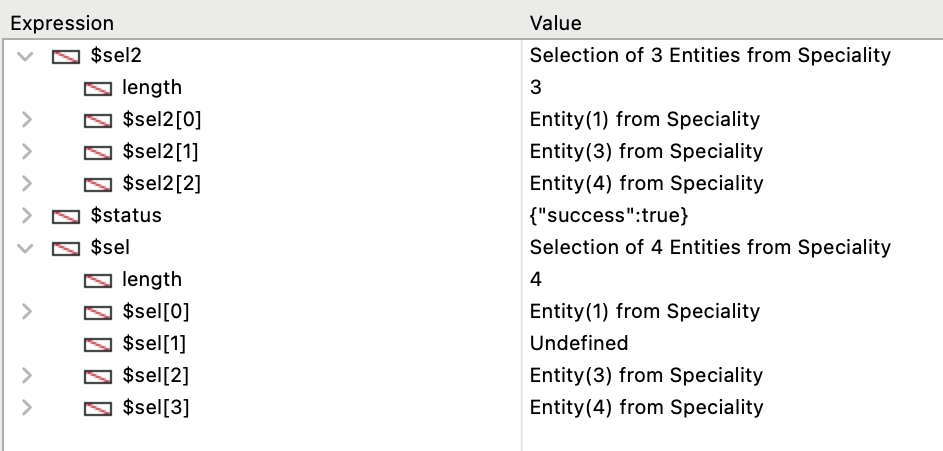

Uma seleção de entidade é um objeto que contém uma ou mais referências a [entidades](ORDA/dsMapping.md#entity) pertencentes à mesma [Dataclass](ORDA/dsMapping.md#dataclass). Uma seleção de entidades pode conter 0, 1 ou X entidades da dataclass -- onde X pode representar o número total de entidades contidas na dataclass.

As seleções de entidades podem ser criadas a partir de seleções existentes usando várias funções da classe [`DataClass`](DataClassClass.md), como [`.all()`](DataClassClass.md#all) ou [`.query()`](DataClassClass.md#query), ou funções da própria classe `EntityClass`, como [`.and()`](#and) ou [`orderBy()`](#orderby). Você também pode criar seleções de entidades em branco usando a função [`dataClass.newSelection()`](DataClassClass.md#newselection) ou o comando [`Create entity selection`](../commands/create-entity-selection.md).

### Resumo

|                                                                                                                                                                                  |
| -------------------------------------------------------------------------------------------------------------------------------------------------------------------------------- |
| [<!-- INCLUDE EntitySelectionClass.index.Syntax -->](#index)<br/><!-- INCLUDE EntitySelectionClass.index.Summary -->                                                             |
| [<!-- INCLUDE EntitySelectionClass.attributeName.Syntax -->](#attributename)<br/><!-- INCLUDE EntitySelectionClass.attributeName.Summary -->                                     |
| [<!-- INCLUDE #EntitySelectionClass.add().Syntax -->](#add)<br/><!-- INCLUDE #EntitySelectionClass.add().Summary -->                                                             |
| [<!-- INCLUDE #EntitySelectionClass.and().Syntax -->](#and)<br/><!-- INCLUDE #EntitySelectionClass.and().Summary -->                                                             |
| [<!-- INCLUDE #EntitySelectionClass.at().Syntax -->](#at)<br/><!-- INCLUDE #EntitySelectionClass.at().Summary -->                                                                |
| [<!-- INCLUDE #EntitySelectionClass.average().Syntax -->](#average)<br/><!-- INCLUDE #EntitySelectionClass.average().Summary -->                                                 |
| [<!-- INCLUDE #EntitySelectionClass.clean().Syntax -->](#clean)<br/><!-- INCLUDE #EntitySelectionClass.clean().Summary -->                                                       |
| [<!-- INCLUDE #EntitySelectionClass.contains().Syntax -->](#contains)<br/><!-- INCLUDE #EntitySelectionClass.contains().Summary -->                                              |
| [<!-- INCLUDE #EntitySelectionClass.copy().Syntax -->](#contains)<br/><!-- INCLUDE #EntitySelectionClass.copy().Summary -->                                                      |
| [<!-- INCLUDE #EntitySelectionClass.count().Syntax -->](#count)<br/><!-- INCLUDE #EntitySelectionClass.count().Summary -->                                                       |
| [<!-- INCLUDE #EntitySelectionClass.distinct().Syntax -->](#distinct)<br/><!-- INCLUDE #EntitySelectionClass.distinct().Summary -->                                              |
| [<!-- INCLUDE #EntitySelectionClass.distinctPaths().Syntax -->](#distinctpaths)<br/><!-- INCLUDE #EntitySelectionClass.distinctPaths().Summary -->                               |
| [<!-- INCLUDE #EntitySelectionClass.drop().Syntax -->](#drop)<br/><!-- INCLUDE #EntitySelectionClass.drop().Summary -->                                                          |
| [<!-- INCLUDE #EntitySelectionClass.extract().Syntax -->](#extract)<br/><!-- INCLUDE #EntitySelectionClass.extract().Summary -->                                                 |
| [<!-- INCLUDE #EntitySelectionClass.first().Syntax -->](#first)<br/><!-- INCLUDE #EntitySelectionClass.first().Summary -->                                                       |
| [<!-- INCLUDE #EntitySelectionClass.getDataClass().Syntax -->](#getdataclass)<br/><!-- INCLUDE #EntitySelectionClass.getDataClass().Summary -->                                  |
| [<!-- INCLUDE #EntitySelectionClass.getRemoteContextAttributes().Syntax -->](#getremotecontextattributes)<br/><!-- INCLUDE #EntityClass.getRemoteContextAttributes().Summary --> |
| [<!-- INCLUDE #EntitySelectionClass.isAlterable().Syntax -->](#isalterable)<br/><!-- INCLUDE #EntitySelectionClass.isAlterable().Summary -->                                     |
| [<!-- INCLUDE #EntitySelectionClass.isOrdered().Syntax -->](#isordered)<br/><!-- INCLUDE #EntitySelectionClass.isOrdered().Summary -->                                           |
| [<!-- INCLUDE #EntitySelectionClass.last().Syntax -->](#last)<br/><!-- INCLUDE #EntitySelectionClass.last().Summary -->                                                          |
| [<!-- INCLUDE #EntitySelectionClass.length.Syntax -->](#length)<br/><!-- INCLUDE #EntitySelectionClass.length.Summary -->                                                        |
| [<!-- INCLUDE #EntitySelectionClass.max().Syntax -->](#max)<br/><!-- INCLUDE #EntitySelectionClass.max().Summary -->                                                             |
| [<!-- INCLUDE #EntitySelectionClass.min().Syntax -->](#min)<br/><!-- INCLUDE #EntitySelectionClass.min().Summary -->                                                             |
| [<!-- INCLUDE #EntitySelectionClass.minus().Syntax -->](#minus)<br/><!-- INCLUDE #EntitySelectionClass.minus().Summary -->                                                       |
| [<!-- INCLUDE #EntitySelectionClass.or().Syntax -->](#or)<br/><!-- INCLUDE #EntitySelectionClass.or().Summary -->                                                                |
| [<!-- INCLUDE #EntitySelectionClass.orderBy().Syntax -->](#orderby)<br/><!-- INCLUDE #EntitySelectionClass.orderBy().Summary -->                                                 |
| [<!-- INCLUDE #EntitySelectionClass.orderByFormula().Syntax -->](#orderbyformula)<br/><!-- INCLUDE #EntitySelectionClass.orderByFormula().Summary -->                            |
| [<!-- INCLUDE #EntitySelectionClass.query().Syntax -->](#query)<br/><!-- INCLUDE #EntitySelectionClass.query().Summary -->                                                       |
| [<!-- INCLUDE #EntitySelectionClass.queryPath.Syntax -->](#querypath)<br/><!-- INCLUDE #EntitySelectionClass.queryPath.Summary -->                                               |
| [<!-- INCLUDE #EntitySelectionClass.queryPlan.Syntax -->](#queryplan)<br/><!-- INCLUDE #EntitySelectionClass.queryPlan.Summary -->                                               |
| [<!-- INCLUDE #EntitySelectionClass.refresh().Syntax -->](#refresh)<br/><!-- INCLUDE #EntitySelectionClass.refresh().Summary -->                                                 |
| [<!-- INCLUDE #EntitySelectionClass.selected().Syntax -->](#selected)<br/><!-- INCLUDE #EntitySelectionClass.selected().Summary -->                                              |
| [<!-- INCLUDE #EntitySelectionClass.slice().Syntax -->](#slice)<br/><!-- INCLUDE #EntitySelectionClass.slice().Summary -->                                                       |
| [<!-- INCLUDE #EntitySelectionClass.sum().Syntax -->](#sum)<br/><!-- INCLUDE #EntitySelectionClass.sum().Summary -->                                                             |
| [<!-- INCLUDE #EntitySelectionClass.toCollection().Syntax -->](#tocollection)<br/><!-- INCLUDE #EntitySelectionClass.toCollection().Summary -->                                  |

#### Veja também

[`USE ENTITY SELECTION`](../commands/use-entity-selection.md)

<!-- REF EntitySelectionClass.index.Desc -->

## &#91;*index*&#93;

<details><summary>História</summary>

| Release | Mudanças   |
| ------- | ---------- |
| 17      | Adicionado |

</details>

<!-- REF EntitySelectionClass.index.Syntax -->***&#91;index&#93;*** : 4D.Entity<!-- END REF -->

#### Descrição

A notação `EntitySelection[index]` <!-- REF EntitySelectionClass.index.Summary -->permite acessar entidades dentro da seleção de entidades usando a sintaxe de coleção padrão<!-- END REF -->: passe a posição da entidade que deseja obter no parâmetro *index*.

Lembre que a entidade correspondente é recarregada a partir da datastore.

*index* pode ser qualquer número entre 0 e `.length`-1.

- Se *index* está fora do intervalo, se devolve um erro.
- Se *index* corresponder a uma entidade descartada, um valor Null será retornado.

:::caution

`EntitySelection[index]` é uma expressão não atribuível, o que significa que não pode ser usada como uma referência editável da entidade com métodos como [`.lock()`](EntityClass.md#lock) ou [`.save()`](EntityClass.md#save). Para trabalhar com a entidade correspondente, é necessário atribuir a expressão devolvida a uma expressão atribuível, como uma variável. Exemplos:

```4d
 $sel:=ds. Employee.all() //criação da entity selection
  //declarações não válidas:
 $result:=$sel[0].lock() //NÃO funcionará
 $sel[0].lastName:="Smith" //NÃO funcionará
 $result:=$sel[0].save() //NÃO funcionará
  //valid code:
 $entity:=$sel[0]  //OK
 $entity.lastName:="Smith" //OK
 $entity.save() //OK
```

:::

#### Exemplo

```4d
 var $employees : cs. EmployeeSelection
 var $employee : cs. EmployeeEntity
 $employees:=ds. Employee.query("lastName = :1";"H@")
 $employee:=$employees[2]  // A terceira entidade da seleção de entidades $employees se recarrega do banco de dados
```

<!-- END REF -->

<!-- REF EntitySelectionClass.attributeName.Desc -->

## .*attributeName*

<details><summary>História</summary>

| Release | Mudanças   |
| ------- | ---------- |
| 17      | Adicionado |

</details>

<!-- REF EntitySelectionClass.attributeName.Syntax -->***.attributeName*** : Collection<br/>***.attributeName*** : 4D.EntitySelection<!-- END REF -->

#### Descrição

Qualquer atributo de classe de dados pode ser usado como uma propriedade de uma seleção de entidade para retornar <!-- REF EntitySelectionClass.attributeName.Summary -->uma "projeção" de valores para o atributo na seleção de entidade<!-- END REF -->. Os valores projetados podem ser uma coleção ou uma nova seleção de entidade, dependendo do [kind](DataClassClass.md#attributename) (`storage` ou `relation`) do atributo.

- Se o tipo de *attributeName* for `storage`:
 `.attributeName` retorna uma coleção de valores do mesmo tipo que *attributeName*.
- Se o tipo de *attributeName* for `relatedEntity`:
 `.attributeName` retorna uma nova seleção de entidade de valores relacionados do mesmo tipo que *attributeName*. Se eliminam os duplicados (se devolve uma seleção de entidades desordenada).
- Se o tipo de *attributeName* for `relatedEntities`:
 `.attributeName` retorna uma nova seleção de entidade de valores relacionados do mesmo tipo que *attributeName*. Se eliminam os duplicados (se devolve uma seleção de entidades desordenada).

Quando se utiliza um atributo de relação como propriedade de uma seleção de entidades, o resultado é sempre outra seleção de entidades, mesmo que só se devolva uma entidade. If the original entity selection and the <em x-id="3">entitySelection</em> parameter are empty, an empty entity selection is returned.

Se o atributo não existir na seleção de entidades, se devolve um erro.

#### Exemplo 1

Projeção de valores de armazenamento:

```4d
 var $firstNames : Collection
 $entitySelection:=ds. Employee.all()
 $firstNames:=$entitySelection.firstName // firstName é um string
```

A coleção resultante é uma coleção de strings, por exemplo:

```4d
[
    "Joanna",
    "Alexandra",
    "Rick"
]
```

#### Exemplo 2

Projeção da entidade relacionada:

```4d
 var $es; $entitySelection : cs. EmployeeSelection
 $entitySelection:=ds. Employee.all()
 $es:=$entitySelection.employer // employer é relacionada aum  Company dataClass
```

O objeto resultane é uma seleção de entidade da Empresa com duplicações removidas (se houver).

#### Exemplo 3

Projeção de entidades relacionadas:

```4d
 var $es : cs. EmployeeSelection
 $es:=ds. Employee.all().directReports // directReports é relacionada a dataclasse Funcionário
```

O objeto resultante é uma seleção de entidade da dataclasse Funcionario sem duplicatas (se houver).

<!-- END REF -->

<!-- REF EntitySelectionClass.add().Desc -->

## .add()

<details><summary>História</summary>

| Release | Mudanças                                              |
| ------- | ----------------------------------------------------- |
| 18 R6   | Suporte do parâmetro *entitySelection*                |
| 18 R5   | Compatível apenas com seleções de entidade alteráveis |
| 17      | Adicionado                                            |

</details>

<!-- REF #EntitySelectionClass.add().Syntax -->**.add**( *entity* : 4D.Entity ) : 4D.EntitySelection<br/>**.add**( *entitySelection* : 4D.EntitySelection ) : 4D.EntitySelection<!-- END REF -->

<!-- REF #EntitySelectionClass.add().Params -->

| Parâmetro       | Tipo                                |                             | Descrição                                                                  |
| --------------- | ----------------------------------- | :-------------------------: | -------------------------------------------------------------------------- |
| entity          | 4D. Entity          |              ->             | Entidade que deve ser adicinonada à entity selection                       |
| entitySelection | 4D. EntitySelection |              ->             | Seleção entidade paara ser adicionado a sellleção entidade originaal       |
| Resultados      | 4D. EntitySelection | <- | Seleção de entidades, incluindo a *entity* ou *entitySelection* adicionada |

<!-- END REF -->

#### Descrição

A função `.add()` <!-- REF #EntitySelectionClass.add().Summary -->adiciona a *entidade* ou *entitySelection* especificada à seleção de entidade original e retorna a seleção de entidade modificada<!-- END REF -->.

> Esta função não modifica a entity selection original.

:::info aviso

A seleção da entidade deve ser *alterável*, ou seja, ter sido criada, por exemplo, por [`.newSelection()`](DataClassClass.md#newselection) ou `Create entity selection`, caso contrário, `.add()` retornará um erro. As entity selections partilháveis não aceitam a adição de entidades. Para mais informações, por favor consulte a seção [Seleções de entidades compartilháveis ou modificáveis](ORDA/entities.md#seleções-de-entidades-compartilháveis-ou-modificáveis).

:::

**Adicionar uma entidade**

- Se a seleção da entidade for ordenada, *entidade* será adicionada ao final da seleção. Se uma referência a mesma entidade já pertencer a seleção de entidades, se duplica e se adiciona uma nova referência.
- Se a seleção da entidade não tiver ordem, *entity* é adicionada em qualquer lugar da seleção, sem uma ordem específica.

**Adicionar uma seleção de entidades**

- Se a selecção de entidades estiver ordenada, a sua ordem é mantida e *entitySelection* é adicionado no final da selecção. Se as referências às mesmas entidades de *entitySelection* já pertencerem à seleção de entidades, elas serão duplicadas e novas referências serão adicionadas.
- Se a seleção de entidade nãofor ordenada, ela fica ordenada.

> Para mais informações, por favor consulte a seção [Seleções de entidades ordenadas ou não ordenadas](ORDA/dsMapping.md#ordered-or-unordered-entity-selection).

A entity selection modificada é devolvida pela função, de modo que as chamadas à função podem ser encadeados.

Ocorrerá um erro se a *entidade* e a seleção da entidade não estiverem relacionadas à mesma classe de dados. Se *entity* for Null, não se produz nenhum erro.

#### Exemplo 1

```4d
 var $employees : cs. EmployeeSelection
 var $employee : cs. EmployeeEntity
 $employees:=ds. Employee.query("lastName = :1";"S@")
 $employee:=ds. Employee.new()
 $employee.lastName:="Smith"
 $employee.save()
 $employees.add($employee) //A entidade $employee se adiciona a entity selection $employees
```

#### Exemplo 2

As chamadas à função podem ser encadeadas:

```4d
 var $sel : cs. ProductSelection
 var $p1;$p2;$p3 : cs. ProductEntity

 $p1:=ds. Product.get(10)
 $p2:=ds. Product.get(11)
 $p3:=ds. Product.get(12)
 $sel:=ds. Product.query("ID &gt; 50")
 $sel:=$sel.add($p1).add($p2).add($p3)
```

#### Exemplo 3

Em uma interface de usuário, temos duas listas. O usuário seleciona itens da lista 1 e as adiciona na lista 2.

```4d
$sellist2:=$sellist2.add($sellist1)
```

<!-- END REF -->

<!-- REF EntitySelectionClass.and().Desc -->

## .and()

<details><summary>História</summary>

| Release | Mudanças   |
| ------- | ---------- |
| 17      | Adicionado |

</details>

<!-- REF #EntitySelectionClass.and().Syntax -->**.and**( *entity* : 4D.Entity ) : 4D.EntitySelection<br/>**.and**( *entitySelection* : 4D.EntitySelection ) : 4D.EntitySelection<!-- END REF -->

<!-- REF #EntitySelectionClass.and().Params -->

| Parâmetro       | Tipo                                |                             | Descrição                                                            |
| --------------- | ----------------------------------- | :-------------------------: | -------------------------------------------------------------------- |
| entity          | 4D. Entity          |              ->             | Entidade a intersectar                                               |
| entitySelection | 4D. EntitySelection |              ->             | Entity selection a intersectar                                       |
| Resultados      | 4D. EntitySelection | <- | Entity selection resultante da intersecção com o operador lógico AND |

<!-- END REF -->

#### Descrição

A função `.and()` <!-- REF #EntitySelectionClass.and().Summary -->combina a seleção de entidades com um parâmetro *entity* ou *entitySelection* usando o operador lógico AND<!-- END REF -->; ela retorna uma nova seleção de entidades não ordenada que contém apenas as entidades referenciadas na seleção de entidades e no parâmetro.

- Se você passar *entidade* como parâmetro, você combina essa entidade com a seleção de entidade. Se a entidade pertencer à entity selection, se devolve uma nova entity selection que só contém a entidade. Senão, uma seleção de entidades vazia é retornada.
- Se você passar *entitySeletion* como parâmetro, combinará as duas seleções da entidade. Uma nova seleção de entidade que contenha só as entidades que são referenciadas em ambas as seleções sejam retornadas. Senão, uma nova seleção de entidade contém a seleção de entidade original e a entidade é retornada.

> Para mais informações, por favor consulte [Seleções de entidades ordenadas vs não ordenadas](ORDA/dsMapping.md#seleção-de-entidades-ordenadas-ou-não-ordenadas). A seleção resultante é sempre desordenada.

Se a seleção de entidade original ou o parâmetro *entitySelection* estiver vazio, ou se a *entidade* for Null, uma seleção de entidade vazia é retornada.

Se a entity selection inicial e o parâmetro não forem relacionados com a mesma dataclass, se produz um erro.

#### Exemplo 1

```4d
 var $employees; $result : cs.ColaboradoreSeleção
 var $employee : cs.ColaboradoreEntity
 $employees:=ds.Empregado. uery("Último Nome = :1"; H@")   
  //A seleção da entidade $employees contém a entidade
  ///com chave primária 710 e outras entidades
  //for ex. "Colin Hetrick" / "Diabo de Grade" / "Sherlock Holmes" (chave primária 710)
 $employee:=ds. mployee.get(710) // Retorna "Sherlock Holmes"

 $result:=$employees. nd($employee) //$result é uma entidade que contém   
  //only a entidade com chave primária 710 ("Sherlock Holmes")
```

#### Exemplo 2

Se quisermos ter uma seleção de empregados chamados "Jones" que morem em Nova York:

```4d
 var $sel1; $sel2; $sel3 : cs.EmployeeSelection
 $sel1:=ds.Employee.query("name =:1";"Jones")
 $sel2:=ds.Employee.query("city=:1";"New York")
 $sel3:=$sel1.and($sel2)
```

<!-- END REF -->

<!-- REF EntitySelectionClass.at().Desc -->

## .at()

<details><summary>História</summary>

| Release | Mudanças   |
| ------- | ---------- |
| 20      | Adicionado |

</details>

<!-- REF #EntitySelectionClass.at().Syntax -->**.at**( *index* : Integer ) : 4D.Entity <!-- END REF -->

<!-- REF #EntitySelectionClass.at().Params -->

| Parâmetro  | Tipo                       |                             | Descrição                     |
| ---------- | -------------------------- | :-------------------------: | ----------------------------- |
| index      | Integer                    |              ->             | Índice da entidade a devolver |
| Resultados | 4D. Entity | <- | A entidade nesse índice       |

<!-- END REF -->

#### Descrição

A função `.at()` <!-- REF #EntitySelectionClass.at().Summary -->retorna a entidade na posição *index*, permitindo o uso de números inteiros positivos e negativos<!-- END REF -->.

Se *index* for negativo (de -1 a -n com n : comprimento da seleção de entidades), a entidade retornada será baseada na ordem inversa da seleção de entidades.

A função devolve Null se o *index* estiver para além dos limites de selecção de entidades.

#### Exemplo

```4d
var $employees : cs.EmployeeSelection
var $emp1; $emp2 : cs.EmployeeEntity
$employees:=ds.Employee.query("lastName = :1"; "H@")
$emp1:=$employees.at(2) //3ª entidade da seleção de entidades $employees
$emp2:=$employees.at(-3) //começando do final, 3ª entidade
	//da seleção de entidades $employees
```

<!-- END REF -->

<!-- REF EntitySelectionClass.average().Desc -->

## .average()

<details><summary>História</summary>

| Release | Mudanças                                                |
| ------- | ------------------------------------------------------- |
| 18 R6   | Retorna indefinido se uma seleção de entidade for vazia |
| 17      | Adicionado                                              |

</details>

<!-- REF #EntitySelectionClass.average().Syntax -->**.average**( *attributePath* : Text ) : Real<!-- END REF -->

<!-- REF #EntitySelectionClass.average().Params -->

| Parâmetro     | Tipo |                             | Descrição                                                                                                                                                |
| ------------- | ---- | :-------------------------: | -------------------------------------------------------------------------------------------------------------------------------------------------------- |
| attributePath | Text |              ->             | Rota do atributo que se utilizará para o cálculo                                                                                                         |
| Resultados    | Real | <- | Media aritmética (média) dos valores das entidades para o atributo (Não se define para uma entity selection vazia) |

<!-- END REF -->

#### Descrição

A função `.average()` <!-- REF #EntitySelectionClass.average().Summary -->retorna a média aritmética (média) de todos os valores não nulos de *attributePath* na seleção de entidades<!-- END REF -->.

Passe no parâmetro *attributePath* a rota de atributo a avaliar.

Só são levados em consideração os valores numéricos para o cálculo. Entretanto, observe que, se o *attributePath* da seleção da entidade contiver tipos de valores mistos, `.average()` levará em conta todos os elementos escalares para calcular o valor médio.

> Os valores de tipo Date são convertidos em valores numéricos (segundos) e são usados para calcular a média.

`.average()` retorna **undefined** se a seleção da entidade estiver vazia ou se *attributePath* não contiver valores numéricos.

Um erro é retornado se:

- *attributePath* is a related attribute,
- *attributePath* não se encontra na classe de dados da entity selection.

#### Exemplo

Se quisermos obter uma lista de funcionários cujo salário for superior ao salário médio:

```4d
 var $averageSalary : Real
 var $moreThanAv : cs.EmployeeSelection
 $averageSalary:=ds.Employee.all().average("salary")
 $moreThanAv:=ds.Employee.query("salary > :1";$averageSalary)
```

<!-- END REF -->

<!-- REF EntitySelectionClass.clean().Desc -->

## .clean()

<details><summary>História</summary>

| Release | Mudanças   |
| ------- | ---------- |
| 20 R6   | Adicionado |

</details>

<!-- REF #EntitySelectionClass.clean().Syntax -->**.clean**() : 4D.EntitySelection<!-- END REF -->

<!-- REF #EntitySelectionClass.clean().Params -->

| Parâmetro  | Tipo                                |                             | Descrição                                         |
| ---------- | ----------------------------------- | :-------------------------: | ------------------------------------------------- |
| Resultados | 4D. EntitySelection | <- | Nova seleção de entidades sem entidades excluídas |

<!-- END REF -->

#### Descrição

A função `.clean()` <!-- REF #EntitySelectionClass.clean().Summary -->retorna uma nova seleção de entidade com base na seleção de entidade original, mas sem as entidades excluídas, se houver<!-- END REF -->.

Por padrão, quando uma entidade é [descartada](EntitySelectionClass.md#drop), sua(s) referência(s) na(s) seleção(ões) de entidade(s) existente(s) se torna(m) *indefinida(s)*, mas não é(são) removida(s) do(s) objeto(s) de seleção de entidade. As entidades excluídas ainda estão incluídas na propriedade [`.length`](#length) e são exibidas como linhas em branco se a seleção da entidade estiver vinculada a um objeto de interface, como uma lista. Nesse caso, chamar a função `.clean()` na seleção de entidades permite que você obtenha uma seleção de entidades nova e atualizada, que não contenha referências de entidades *undefined*.

A seleção da entidade resultante mantém os [critérios de ordem](../ORDA/dsMapping.md#ordered-or-unordered-entity-selection) e a mesma propriedade [alterable/shareable](../ORDA/entities.md#shareable-or-alterable-entity-selections) como a seleção da entidade original.

#### Exemplo

```4d
var $sel; $sel2 : cs.SpecialitySelection
var $status : Object

$sel:=ds.Speciality.query("ID <= 4")
$status:=ds.Speciality.get(2).drop() //exclui a entidade da classe de dados
  //$sel.length = 4

$sel2:=$sel.clean()
  //$sel2.length = 3
```



#### Veja também

[`.refresh()`](#refresh)

<!-- END REF -->

<!-- REF EntitySelectionClass.contains().Desc -->

## .contains()

<details><summary>História</summary>

| Release | Mudanças   |
| ------- | ---------- |
| 17      | Adicionado |

</details>

<!-- REF #EntitySelectionClass.contains().Syntax -->**.contains**( *entity* : 4D.Entity ) : Boolean<!-- END REF -->

<!-- REF #EntitySelectionClass.contains().Params -->

| Parâmetro  | Tipo                       |                             | Descrição                                                     |
| ---------- | -------------------------- | :-------------------------: | ------------------------------------------------------------- |
| entity     | 4D. Entity |              ->             | Entidade a ser avaliada                                       |
| Resultados | Parâmetros                 | <- | Truse se a entidade pertencer à entity selection, senão False |

<!-- END REF -->

#### Descrição

A função `.contains()` <!-- REF #EntitySelectionClass.contains().Summary -->retorna true se a referência da entidade pertencer à seleção de entidades<!-- END REF -->, e false caso contrário.

Em *entity*, especifique a entidade a ser pesquisada na seleção de entidades. Se a entidade for Null, a função devolverá false.

Se *entity* e a entity selection não pertencerem à mesma dataclass, se produz um erro.

#### Exemplo

```4d
 var $employees : cs. EmployeeSelection
 var $employee : cs. EmployeeEntity

 $employees:=ds.Employee.query("lastName=:1";"H@")
 $employee:=ds. Employee.get(610)

 If($employees.contains($employee))
    ALERT("A entidade com chave primaria 610 tem um sobrenome começando com H")
 Else
    ALERT("A entidade com chave primária 610 não tem um sobrenome começando com H")
 End if
```

<!-- END REF -->

<!-- REF EntitySelectionClass.count().Desc -->

## .count()

<details><summary>História</summary>

| Release | Mudanças   |
| ------- | ---------- |
| 17      | Adicionado |

</details>

<!-- REF #EntitySelectionClass.count().Syntax -->**.count**( *attributePath* : Text ) : Real<!-- END REF -->

<!-- REF #EntitySelectionClass.count().Params -->

| Parâmetro     | Tipo |                             | Descrição                                                                 |
| ------------- | ---- | :-------------------------: | ------------------------------------------------------------------------- |
| attributePath | Text |              ->             | Rota do atributo que se utilizará para o cálculo                          |
| Resultados    | Real | <- | Número de valores de *attributePath* que não são null na entity selection |

<!-- END REF -->

#### Descrição

A função `.count()` <!-- REF #EntitySelectionClass.count().Summary -->retorna o número de entidades na seleção de entidades com um valor não nulo em *attributePath*<!-- END REF -->.

> Só são levados em consideração os valores escalares. Os valores de tipo objeto ou coleção são considerados valores nulos.

Um erro é retornado se:

- *attributePath* is a related attribute,
- *attributePath* não se encontra na classe de dados da entity selection.

#### Exemplo

Se quisermos encontrar o número total de empregados para uma empresa sem contar aqueles cujos titulos de mprego não foram especificados:

```4d
 var $sel : cs.EmployeeSelection
 var $count : Real

 $sel:=ds.Employee.query("employer = :1";"Acme, Inc")
 $count:=$sel.count("jobtitle")
```

<!-- END REF -->

<!-- REF EntitySelectionClass.copy().Desc -->

## .copy()

<details><summary>História</summary>

| Release | Mudanças   |
| ------- | ---------- |
| 18 R5   | Adicionado |

</details>

<!-- REF #EntitySelectionClass.copy().Syntax -->**.copy**( { *option* : Integer } ) : 4D.EntitySelection<!-- END REF -->

<!-- REF #EntitySelectionClass.copy().Params -->

| Parâmetro  | Tipo                                |                             | Descrição                                                                   |
| ---------- | ----------------------------------- | :-------------------------: | --------------------------------------------------------------------------- |
| option     | Integer                             |              ->             | `ck shared`: retorna uma seleção de entidade compartilhável |
| Resultados | 4D. EntitySelection | <- | Cópia da entity selection                                                   |

<!-- END REF -->

#### Descrição

A função `.copy()` <!-- REF #EntitySelectionClass.copy().Summary -->retorna uma cópia da entity selection original<!-- END REF -->.

> Esta função não modifica a seleção de entidades original.

Como padrão, se o parâmetro *option* for omitido, a função retorna uma nova seleção de entidade modificável (mesmo que a função seja aplicada a uma seleção de entidade compartilhável). Passe a constante `ck shared` no parâmetro *option* se você quiser criar uma seleção de entidade compartilhável.

> Para informações sobre a propriedade compartilhável das seleções de entidades, consulte a seção [Seleções de entidades compartilháveis ou modificáveis](ORDA/entities.md#shareable-or-alterable-entity-selections).

#### Exemplo

Se criar uma nova seleção de entidade vazia de produtos quando o formulário for carregado:

```4d
 Case of
    :(Form event code=On Load)
       Form.products:=ds.Products.newSelection()
 End case

```

Então esta seleção de entidades é atualizada com produtos e se quiser compartilhar os produtos entre vários processos. Se copiar a seleçãod a entidade Form.products como compartilhável:

```4d
 ...
  // A seleção de entidades de Form.products se atualiza
 Form.products.add(Form.selectedProduct)

 Use(Storage)
    If(Storage.products=Null)
       Storage.products:=New shared object()
    End if

    Use(Storage.products)
       Storage.products:=Form.products.copy(ck shared)
    End use
 End use
```

<!-- END REF -->

<!-- REF EntitySelectionClass.distinct().Desc -->

## .distinct()

<details><summary>História</summary>

| Release | Mudanças                     |
| ------- | ---------------------------- |
| 20      | Suporte de `dk count values` |
| 17      | Adicionado                   |

</details>

<!-- REF #EntitySelectionClass.distinct().Syntax -->**.distinct**( *attributePath* : Text { ; *options* : Integer } ) : Collection<!-- END REF -->

<!-- REF #EntitySelectionClass.distinct().Params -->

| Parâmetro     | Tipo       |                             | Descrição                                 |
| ------------- | ---------- | :-------------------------: | ----------------------------------------- |
| attributePath | Text       |              ->             | Rota do atributo cujos valores quer obter |
| options       | Integer    |              ->             | `dk diacritical`, `dk count values`       |
| Resultados    | Collection | <- | Coleção apenas com valores distintos      |

<!-- END REF -->

#### Descrição

A função `.distinct()` <!-- REF #EntitySelectionClass.distinct().Summary -->retorna uma coleção contendo apenas valores distintos (diferentes) do *attributePath* na seleção da entidade<!-- END REF -->.

A coleção retornada é ordenada automaticamente. Os valores **null** não são devolvidos.

No parâmetro *attributePath*, passe o atributo de entidade cujos valores distintos você deseja obter. Só valores escalares (texto, número, booleano, ou data) podemser manejados. Se o *attributePath* levar a uma propriedade do objeto que contém valores de tipos diferentes, eles serão primeiro agrupados por tipo e, em seguida, classificados. Se <em x-id="3">attributePath</em> levar a uma propriedade de objeto que conter valores de diferentes tipos, primeiro se agrupam por tipo e se ordenam depois.

1. booleans
2. strings
3. números
4. datas

Você pode usar a notação `[]` para designar uma coleção quando *attributePath* é um caminho dentro de um objeto (ver exemplos).

No parâmetro *opções*, você pode passar uma ou uma combinação das seguintes constantes:

| Parâmetros        | Valor | Comentário                                                                                                                                                                                                                                 |
| ----------------- | ----- | ------------------------------------------------------------------------------------------------------------------------------------------------------------------------------------------------------------------------------------------ |
| `dk diacritical`  | 8     | A avaliação é sensível a maiúsculas e minúsculas e diferencia os caracteres acentuados. Como padrão, uma avaliação não-diacrítica é realizada.                                                             |
| `dk count values` | 32    | Devolve a contagem de entidades para cada valor distinto. Quando essa opção é passada, `.distinct()` retorna uma coleção de objetos contendo um par de propriedades `{{"value":*value*; "count":*count*}`. |

:::note

A opção `dk count values` só está disponível com atributos de armazenamento do tipo booleano, string, número e data.

:::

Um erro é retornado se:

- *attributePath* is a related attribute,
- *attributePath* não se encontra na classe de dados da entity selection.

#### Exemplos

Se quiser obter uma coleção que contenha um só elemento por nome de país:

```4d
var $countries : Collection
 $countries:=ds. Employee.all().distinct("address.country")
```

`nicknames` é uma coleção e `extra` é um atributo de objeto:

```4d
$values:=ds. Employee.all().distinct("extra.nicknames[].first")
```

Pretende obter o número de nomes de funções diferentes na empresa:

```4d
var $jobs : Collection
$jobs:=ds. Employee.all().distinct("jobName";dk count values)  
//$jobs[0]={"value":"Developer";"count":17}
//$jobs[1]={"value":"Office manager";"count":5}
//$jobs[2]={"value":"Accountant";"count":2}
//...
```

<!-- END REF -->

<!-- REF EntitySelectionClass.distinctPaths().Desc -->

## .distinctPaths()

<details><summary>História</summary>

| Release | Mudanças   |
| ------- | ---------- |
| 20      | Adicionado |

</details>

<!-- REF #EntitySelectionClass.distinctPaths().Syntax -->**.distinctPaths**( *attribute* : Text ) : Collection<!-- END REF -->

<!-- REF #EntitySelectionClass.distinctPaths().Params -->

| Parâmetro  | Tipo       |                             | Descrição                                                 |
| ---------- | ---------- | :-------------------------: | --------------------------------------------------------- |
| atributo   | Text       |              ->             | Nome do atributo do objecto cujos caminhos pretende obter |
| Resultados | Collection | <- | Nova colecção com caminhos distintos                      |

<!-- END REF -->

#### Descrição

A função `.distinctPaths()` <!-- REF #EntitySelectionClass.distinctPaths().Summary -->retorna uma coleção de caminhos distintos encontrados no objeto indexado *atributo* para a seleção da entidade<!-- END REF -->.

Se *attribute* não for um atributo de objeto indexado, será gerado um erro.

Depois da chamada, o tamanho da coleção retornada é igual ao número de caminhos distintos encontrados no *atributo* para a seleção da entidade. Os caminhos são devolvidos como cadeias de caracteres, incluindo atributos e colecções aninhados, por exemplo "info.address.number" ou "children[].birthdate". Entidades com um valor nulo no *atributo* não são consideradas.

#### Exemplo

Você deseja obter todos os caminhos armazenados em um atributo objeto *fullData*:

```4d
var $paths : Collection
$paths:=ds. Employee.all().distinctPaths("fullData")
//$paths[0]="age"
//$paths[1]="Children"
//$paths[2]="Children[].age"
//$paths[3]="Children[].name"
//$paths[4]="Children.length"
///...
```

:::note

*length* é automaticamente adicionado como caminho para propriedades de coleções aninhadas.

:::

<!-- END REF -->

<!-- REF EntitySelectionClass.drop().Desc -->

## .drop()

<details><summary>História</summary>

| Release | Mudanças   |
| ------- | ---------- |
| 17      | Adicionado |

</details>

<!-- REF #EntitySelectionClass.drop().Syntax -->**.drop**( { *mode* : Integer } ) : 4D.EntitySelection<!-- END REF -->

<!-- REF #EntitySelectionClass.drop().Params -->

| Parâmetro  | Tipo                                |                             | Descrição                                                                                                          |
| ---------- | ----------------------------------- | :-------------------------: | ------------------------------------------------------------------------------------------------------------------ |
| mode       | Integer                             |              ->             | `dk stop dropping on first error`: para a execução do método na primeira entidade não eliminável   |
| Resultados | 4D. EntitySelection | <- | Seleção de entidade vazia se bem-sucedida; caso contrário, seleção de entidade contendo entidades não descartáveis |

<!-- END REF -->

#### Descrição

A função `.drop()` <!-- REF #EntitySelectionClass.drop().Summary -->remove as entidades pertencentes à seleção de entidades da tabela relacionada à sua classe de dados no armazenamento de dados<!-- END REF -->. A entity selection permanece na memória.

> A eliminação de entidades é permanente e não pode ser desfeita. É recomendado chamar esta ação em uma transação para ter uma opção de recuperação.

Se encontrar uma entidade bloqueada durante a execução de `.drop()`, não é eliminado. Como padrão o método processa todas as entidades da seleção de entidades e retorna as entidades não elimináveis na entity selection. Se você deseja que o método pare a execução na primeira entidade não eliminável encontrada, passe a constante `dk stop dropping on first error` no parâmetro *mode*.

#### Exemplo

Exemplo sem a opção `dk stop dropping on first error`:

```4d
 var $employees; $notDropped : cs. EmployeeSelection
 $employees:=ds.Employee.query("firstName=:1";"S@")
 $notDropped:=$employees.drop() // $notDropped for uma entity selection que contém todas as entidades não suprimidas
 If($notDropped.length=0) //A ação de eliminação for exitosa, todas as entidades foram eliminadas
    ALERT("You have dropped "+String($employees.length)+" employees") //A seleção de entidades eliminada permanece na memoria
 Else
    ALERT("Problem during drop, try later")
 End if
```

Exemplo com a opção `dk stop dropping on first error`:

```4d
 var $employees; $notDropped : cs.EmployeeSelection
 $employees:=ds.Employee.query("firstName=:1";"S@")
 $notDropped:=$employees.drop(dk stop dropping on first error) // $notDropped uma entity selection a primeira entidade não descartada
 If($notDropped.length=0) //A ação de eliminação for exitosa, todas as entidades foram eliminadas
    ALERT("You have dropped "+String($employees.length)+" employees") //A seleção de entidades eliminada permanece na memoria
 Else
    ALERT("Problem during drop, try later")
 End if
```

<!-- END REF -->

<!-- REF EntitySelectionClass.extract().Desc -->

## .extract()

<details><summary>História</summary>

| Release | Mudanças   |
| ------- | ---------- |
| 18 R3   | Adicionado |

</details>

<!-- REF #EntitySelectionClass.extract().Syntax -->**.extract**( *attributePath* : Text { ; *option* : Integer } ) : Collection<br/>**.extract**( *attributePath* { ; *targetPath* } { ; *...attributePathN* : Text ; *targetPathN* : Text } ) : Collection<!-- END REF -->

<!-- REF #EntitySelectionClass.extract().Params -->

| Parâmetro     | Tipo       |                             | Descrição                                                                                                            |
| ------------- | ---------- | :-------------------------: | -------------------------------------------------------------------------------------------------------------------- |
| attributePath | Text       |              ->             | Rota de atributo cujos valores serão extraídos para nova coleção                                                     |
| targetpath    | Text       |              ->             | Rota ou nome do atributo objetivo                                                                                    |
| option        | Integer    |              ->             | `ck keep null`: inclui atributos nulos na coleção retornada (ignorado por padrão) |
| Resultados    | Collection | <- | Coleção contendo valores extraídos                                                                                   |

<!-- END REF -->

#### Descrição

A função `.extract()` <!-- REF #EntitySelectionClass.extract().Summary -->retorna uma coleção contendo valores *attributePath* extraídos da seleção de entidades<!-- END REF -->.

*attributePath* pode se referir a:

- um atributo escalar de dataclass,
- entidade relacionada,
- entidades relacionadas.

Se *attributePath* não for válido, se devolve uma coleção vazia.

Esta função aceita duas sintaxes.

**.extract( attributePath : Text { ; option : Integer } ) : Collection**

Com essa sintaxe, `.extract()` preenche a coleção retornada com os valores *attributePath* da seleção da entidade.

Como padrão, entidades para as quais *attributePath* for *null* ou undefined são ignoradas na coleção resultante. Você pode passar a constante `ck keep null` no parâmetro *option* para incluir esses valores como elementos **nulos** na coleção retornada.

- Os atributos de classe de dados com [.kind](DataClassClass.md#attributename) = "relatedEntity" são extraídos como uma coleção de entidades (as duplicações são mantidas).
- Os atributos de classe de dados com [.kind](DataClassClass.md#attributename) = "relatedEntities" são extraídos como uma coleção de seleções de entidades.

**.extract ( attributePath ; targetPath { ; ...attributePathN ; ... targetPathN}) : Collection**

Com essa sintaxe, `.extract()` preenche a coleção retornada com as propriedades *attributePath* da seleção da entidade. Cada elemento da coleção retornada é um objeto com propriedades *targetPath* preenchidas com as propriedades *attributePath* correspondentes. Os valores null são mantidos (o parâmetro *option* é ignorado com essa sintaxe).

Se vários *attributePath* forem fornecidos, um *targetPath* deverá ser fornecido para cada um deles. Somente pares válidos \[*attributePath*, *targetPath*] são extraídos.

- Os atributos dataclass com [.kind](DataClassClass.md#attributename) = "relatedEntity" são extraídos como uma entidade.
- Os atributos dataclass com [.kind](DataClassClass.md#attributename) = "relatedEntities" são extraídos como uma seleção de entidade.

> As entidades de uma colecção de entidades acedidas por \[ ] não são recarregadas da base de dados.

#### Exemplo

Dada a seguinte tabela e relação:


```4d
 var $firstnames; $addresses; $mailing; $teachers : Collection
  //
  //
  //$firstnames é uma coleção de Strings


 $firstnames:=ds. Teachers.all().extract("firstname")
  //
  //$addresses é uma coleção de entities relacionadas ao dataclass Address
  //Valores Null para o endereço são extraídos
 $addresses:=ds. Teachers.all().extract("address";ck keep null)
  //
  //
  //$mailing é uma coleção de objetos com propriedades "who" e "to"
  //conteúdo propriedade "who" é do tipo String
  //conteudo propriedade "to" é do tipo entity (Address dataclass)
 $mailing:=ds. Teachers.all().extract("lastname";"who";"address";"to")
  //
  //
  //$mailing é uma coleção de objetos com propriedades "who" e "city"
  //conteúdo propriedade "who" é tipo String
  //conteúdo propriedade "city" é tipo String
 $mailing:=ds. Teachers.all().extract("lastname";"who";"address.city";"city")
  //
  //$teachers é uma coleção de objetos com propriedades "where" e "who"
  //conteúdo propriedade "where" é String
  //conteúdo propriedade "who" é uma entity selection (Teachers dataclass)
 $teachers:=ds. Address.all().extract("city";"where";"teachers";"who")
  //
  //$teachers é uma coleção de entity selections
 $teachers:=ds. Address.all().extract("teachers")
```

<!-- END REF -->

<!-- REF EntitySelectionClass.first().Desc -->

## .first()

<details><summary>História</summary>

| Release | Mudanças   |
| ------- | ---------- |
| 17      | Adicionado |

</details>

<!-- REF #EntitySelectionClass.first().Syntax -->**.first**() : 4D.Entity<!-- END REF -->

<!-- REF #EntitySelectionClass.first().Params -->

| Parâmetro  | Tipo                       |                             | Descrição                                                                                                       |
| ---------- | -------------------------- | :-------------------------: | --------------------------------------------------------------------------------------------------------------- |
| Resultados | 4D. Entity | <- | Referência para a primeira entidade da seleção da entidade (Null se a seleção estiver vazia) |

<!-- END REF -->

#### Descrição

A função `.first()` <!-- REF #EntitySelectionClass.first().Summary -->retorna uma referência à entidade na primeira posição da seleção de entidades<!-- END REF -->.

O resultado desta função é similar a:

```4d
 $entity:=$entitySel[0]
```

Há, entretanto, uma diferença entre ambas as afirmações quando a seleção estiver vazia:

```4d
 var $entitySel : cs. EmpSelection
 var $entity : cs. EmpEntity
 $entitySel:=ds. Emp.query("lastName = :1";"Nonexistentname") //nenhuma entity correspondente
  //entity selection é esvaziada
 $entity:=$entitySel.first() //retorna Null
 $entity:=$entitySel[0]  //gera um erro
```

#### Exemplo

```4d
 var $entitySelection : cs.EmpSelection
 var $entity : cs.EmpEntity
 $entitySelection:=ds.Emp.query("salary > :1";100000)
 If($entitySelection.length#0)
    $entity:=$entitySelection.first()
 End if
```

<!-- END REF -->

<!-- REF EntitySelectionClass.getDataClass().Desc -->

## .getDataClass()

<details><summary>História</summary>

| Release | Mudanças   |
| ------- | ---------- |
| 17 R5   | Adicionado |

</details>

<!-- REF #EntitySelectionClass.getDataClass().Syntax -->**.getDataClass**() : 4D.DataClass<!-- END REF -->

<!-- REF #EntitySelectionClass.getDataClass().Params -->

| Parâmetro  | Tipo                          |                             | Descrição                                               |
| ---------- | ----------------------------- | :-------------------------: | ------------------------------------------------------- |
| Resultados | 4D. DataClass | <- | Objeto dataclass ao qual a seleção de entidade pertence |

<!-- END REF -->

#### Descrição

A função `.getDataClass()` <!-- REF #EntitySelectionClass.getDataClass().Summary -->retorna a classe de dados da seleção da entidade<!-- END REF -->.

Esta função é principalmente útil  no contexto do código genérico.

#### Exemplo

O seguinte código genérico duplica todas as entidades da entity selection:

```4d
  //duplicate_entities method
  //duplicate_entities($entity_selection)

 #DECLARE ( $entitySelection : 4D. EntitySelection )  
 var $dataClass : 4D. DataClass
 var $entity; $duplicate : 4D. Entity
 var $status : Object
 $dataClass:=$entitySelection.getDataClass()
 For each($entity;$entitySelection)
    $duplicate:=$dataClass.new()
    $duplicate.fromObject($entity.toObject())
    $duplicate[$dataClass.getInfo().primaryKey]:=Null //reset the primary key
    $status:=$duplicate.save()
 End for each
```

<!-- END REF -->

## .getRemoteContextAttributes()

<details><summary>História</summary>

| Release | Mudanças   |
| ------- | ---------- |
| 19R5    | Adicionado |

</details>

<!-- REF #EntitySelectionClass.getRemoteContextAttributes().Syntax -->**.getRemoteContextAttributes**() : Text<!-- END REF -->

<!-- REF #EntitySelectionClass.getRemoteContextAttributes().Params -->

| Parâmetro | Tipo |                             | Descrição                                                               |
| --------- | ---- | --------------------------- | ----------------------------------------------------------------------- |
| resultado | Text | <- | Context attributes linked to the entity selection, separated by a comma |

<!-- END REF -->

> **Advanced mode:** This function is intended for developers who need to customize ORDA default features for specific configurations. Na maioria dos casos, não necessitará de o utilizar.

#### Descrição

The `.getRemoteContextAttributes()` function <!-- REF #EntitySelectionClass.getRemoteContextAttributes().Summary -->returns information about the optimization context used by the entity selection<!-- END REF -->.

If there is no [optimization context](../ORDA/client-server-optimization.md) for the entity selection, the function returns an empty Text.

#### Exemplo

```4d
var $ds : 4D. DataStoreImplementation
var $persons : cs. PersonsSelection
var $p : cs. PersonsEntity

var $info : Text
var $text : Text

$ds:=Open datastore(New object("hostname"; "www.myserver.com"); "myDS")

$persons:=$ds. Persons.all()
$text:="" For each ($p; $persons)
    $text:=$p.firstname+" lives in "+$p.address.city+" / " End for each

$info:=$persons.getRemoteContextAttributes()
//$info = "firstname,address,address.city"
```

#### Veja também

[Entity.getRemoteContextAttributes()](./EntityClass.md#getremotecontextattributes)<br/>[.clearAllRemoteContexts()](./DataStoreClass.md#clearallremotecontexts)<br/>[.getRemoteContextInfo()](./DataStoreClass.md#getremotecontextinfo)<br/>[.getAllRemoteContexts()](./DataStoreClass.md#getallremotecontexts)<br/>[.setRemoteContextInfo()](./DataStoreClass.md#setremotecontextinfo)

<!-- REF EntitySelectionClass.isAlterable().Desc -->

## .isAlterable()

<details><summary>História</summary>

| Release | Mudanças   |
| ------- | ---------- |
| 18 R5   | Adicionado |

</details>

<!-- REF #EntitySelectionClass.isAlterable().Syntax -->**.isAlterable**() : Boolean<!-- END REF -->

<!-- REF #EntitySelectionClass.isAlterable().Params -->

| Parâmetro  | Tipo       |                             | Descrição                                                  |
| ---------- | ---------- | :-------------------------: | ---------------------------------------------------------- |
| Resultados | Parâmetros | <- | True if the entity selection is alterable, False otherwise |

<!-- END REF -->

#### Descrição

The `.isAlterable()` function <!-- REF #EntitySelectionClass.isAlterable().Summary -->returns True if the entity selection is alterable<!-- END REF -->, and False if the entity selection is not alterable.

For more information, please refer to [Shareable or alterable entity selections](ORDA/entities.md#shareable-or-alterable-entity-selections).

#### Exemplo

You are about to display `Form.products` in a [list box](FormObjects/listbox_overview.md) to allow the user to add new products. Se quiser ter certeza que é alterável para que o usuário possa adicionar novos produtos sem erro:

```4d
If (Not(Form.products.isAlterable()))
    Form.products:=Form.products.copy()
End if
...
Form.products.add(Form.product)
```

<!-- END REF -->

<!-- REF EntitySelectionClass.isOrdered().Desc -->

## .isOrdered()

<details><summary>História</summary>

| Release | Mudanças   |
| ------- | ---------- |
| 17      | Adicionado |

</details>

<!-- REF #EntitySelectionClass.isOrdered().Syntax -->**.isOrdered**() : Boolean<!-- END REF -->

<!-- REF #EntitySelectionClass.isOrdered().Params -->

| Parâmetro  | Tipo       |                             | Descrição                                                |
| ---------- | ---------- | :-------------------------: | -------------------------------------------------------- |
| Resultados | Parâmetros | <- | True if the entity selection is ordered, False otherwise |

<!-- END REF -->

#### Descrição

The `.isOrdered()` function <!-- REF #EntitySelectionClass.isOrdered().Summary -->returns True if the entity selection is ordered<!-- END REF -->, and False if it is unordered.

> Esta função devolve sempre True quando a selecção da entidade provém de um datastore remoto.

For more information, please refer to [Ordered or unordered entity selection](ORDA/dsMapping.md#ordered-or-unordered-entity-selection).

#### Exemplo

```4d
 var $employees : cs.EmployeeSelection
 var $employee : cs.EmployeeEntity
 var $isOrdered : Boolean
 $employees:=ds.Employee.newSelection(dk keep ordered)
 $employee:=ds.Employee.get(714) // Gets the entity with primary key 714

  //In an ordered entity selection, we can add the same entity several times (duplications are kept)
 $employees.add($employee)
 $employees.add($employee)
 $employees.add($employee)

 $isOrdered:=$employees.isOrdered()
 If($isOrdered)
    ALERT("The entity selection is ordered and contains "+String($employees.length)+" employees")
 End if
```

<!-- END REF -->

<!-- REF EntitySelectionClass.last().Desc -->

## .last()

<details><summary>História</summary>

| Release | Mudanças   |
| ------- | ---------- |
| 17      | Adicionado |

</details>

<!-- REF #EntitySelectionClass.last().Syntax -->**.last**() : 4D.Entity<!-- END REF -->

<!-- REF #EntitySelectionClass.last().Params -->

| Parâmetro  | Tipo                       |                             | Descrição                                                                                                |
| ---------- | -------------------------- | :-------------------------: | -------------------------------------------------------------------------------------------------------- |
| Resultados | 4D. Entity | <- | Reference to the last entity of the entity selection (Null if empty entity selection) |

<!-- END REF -->

#### Descrição

The `.last()` function <!-- REF #EntitySelectionClass.last().Summary -->returns a reference to the entity in last position of the entity selection<!-- END REF -->.

O resultado desta função é similar a:

```4d
 $entity:=$entitySel[length-1]
```

Se a entity selection estiver vazia, a função devolve Null.

#### Exemplo

```4d
 var $entitySelection : cs.EmpSelection
 var $entity : cs.EmpEntity
 $entitySelection:=ds.Emp.query("salary < :1";50000)
 If($entitySelection.length#0)
    $entity:=$entitySelection.last()
 End if
```

<!-- END REF -->

<!-- REF EntitySelectionClass.length.Desc -->

## .length

<details><summary>História</summary>

| Release | Mudanças   |
| ------- | ---------- |
| 17      | Adicionado |

</details>

<!-- REF #EntitySelectionClass.length.Syntax -->**.length** : Integer<!-- END REF -->

#### Descrição

The `.length` property <!-- REF #EntitySelectionClass.length.Summary -->returns the number of entities in the entity selection<!-- END REF -->. Se a entity selection estiver vazia, devolve 0.

Entity selections always have a `.length` property.

> To know the total number of entities in a dataclass, it is recommended to use the [`getCount()`](DataClassClass.md#getcount) function which is more optimized than the `ds.myClass.all().length` expression.

#### Exemplo

```4d
 var $vSize : Integer
 $vSize:=ds.Employee.query("gender = :1";"male").length
 ALERT(String(vSize)+" male employees found.")
```

<!-- END REF -->

<!-- REF EntitySelectionClass.max().Desc -->

## .max()

<details><summary>História</summary>

| Release | Mudanças                                                |
| ------- | ------------------------------------------------------- |
| 17      | Adicionado                                              |
| 18 R6   | Retorna indefinido se uma seleção de entidade for vazia |

</details>

<!-- REF #EntitySelectionClass.max().Syntax -->**.max**( *attributePath* : Text ) : any<!-- END REF -->

<!-- REF #EntitySelectionClass.max().Params -->

| Parâmetro     | Tipo |                             | Descrição                                        |
| ------------- | ---- | --------------------------- | ------------------------------------------------ |
| attributePath | Text | ->                          | Rota do atributo que se utilizará para o cálculo |
| Resultados    | any  | <- | Highest value of attribute                       |

<!-- END REF -->

#### Descrição

The `.max()` function <!-- REF #EntitySelectionClass.max().Summary -->returns the highest (or maximum) value among all the values of *attributePath* in the entity selection<!-- END REF -->. It actually returns the value of the last entity of the entity selection as it would be sorted in ascending order using the [`.orderBy()`](#orderby) function.

If you pass in *attributePath* a path to an object property containing different types of values, the `.max()` function will return the maximum value within the first scalar type in the default 4D type list order (see [`.sort()`](CollectionClass.md#sort) description).

`.max()` returns **undefined** if the entity selection is empty or *attributePath* is not found in the object attribute.

Um erro é retornado se:

- *attributePath* is a related attribute,
- *attributePath* não se encontra na classe de dados da entity selection.

#### Exemplo

Se quisermos encontrar o maior salário entre as funcionárias mulheres:

```4d
 var $sel : cs.EmpSelection
 var $maxSalary : Real
 $sel:=ds.Employee.query("gender = :1";"female")
 $maxSalary:=$sel.max("salary")
```

<!-- END REF -->

<!-- REF EntitySelectionClass.min().Desc -->

## .min()

<details><summary>História</summary>

| Release | Mudanças                                                |
| ------- | ------------------------------------------------------- |
| 17      | Adicionado                                              |
| 18 R6   | Retorna indefinido se uma seleção de entidade for vazia |

</details>

<!-- REF #EntitySelectionClass.min().Syntax -->**.min**( *attributePath* : Text ) : any<!-- END REF -->

<!-- REF #EntitySelectionClass.min().Params -->

| Parâmetro     | Tipo |                             | Descrição                                        |
| ------------- | ---- | :-------------------------: | ------------------------------------------------ |
| attributePath | Text |              ->             | Rota do atributo que se utilizará para o cálculo |
| Resultados    | any  | <- | Lowest value of attribute                        |

<!-- END REF -->

#### Descrição

The `.min()` function <!-- REF #EntitySelectionClass.min().Summary --> returns the lowest (or minimum) value among all the values of attributePath in the entity selection<!-- END REF -->.  It actually returns the first entity of the entity selection as it would be sorted in ascending order using the [`.orderBy()`](#orderby) function (excluding **null** values).

If you pass in *attributePath* a path to an object property containing different types of values, the `.min()` function will return the minimum value within the first scalar value type in the type list order (see [`.sort()`](CollectionClass.md#sort) description).

`.min()` returns **undefined** if the entity selection is empty or *attributePath* is not found in the object attribute.

Um erro é retornado se:

- *attributePath* is a related attribute,
- *attributePath* não se encontra na classe de dados da entity selection.

#### Exemplo

Neste exemplo, se quisermos encontrar o menor salário entre todos os funcionários mulheres:

```4d
 var $sel : cs.EmpSelection
 var $minSalary : Real
 $sel:=ds.Employee.query("gender = :1";"female")
 $minSalary:=$sel.min("salary")
```

<!-- END REF -->

<!-- REF EntitySelectionClass.minus().Desc -->

## .minus()

<details><summary>História</summary>

| Release | Mudanças                         |
| ------- | -------------------------------- |
| 18 R6   | Support of *keepOrder* parameter |
| 17      | Adicionado                       |

</details>

<!-- REF #EntitySelectionClass.minus().Syntax -->**.minus**( *entity* : 4D.Entity { ; *keepOrder* : Integer } ) : 4D.EntitySelection<br/>**.minus**( *entitySelection* : 4D.EntitySelection { ; *keepOrder* : Integer } ) : 4D.EntitySelection<!-- END REF -->

<!-- REF #EntitySelectionClass.minus().Params -->

| Parâmetro       | Tipo                                |                             | Descrição                                                                                                  |
| --------------- | ----------------------------------- | :-------------------------: | ---------------------------------------------------------------------------------------------------------- |
| entity          | 4D. Entity          |              ->             | Entidade a substrair                                                                                       |
| entitySelection | 4D. EntitySelection |              ->             | seleção de entidade a subtrair                                                                             |
| keepOrder       | Integer                             |              ->             | `dk keep ordered` (integer) to keep the initial order in the resulting entity selection |
| Resultados      | 4D. EntitySelection | <- | New entity selection or a new reference on the existing entity selection                                   |

<!-- END REF -->

#### Descrição

The `.minus()` function <!-- REF #EntitySelectionClass.minus().Summary -->excludes from the entity selection to which it is applied the *entity* or the entities of *entitySelection* and returns the resulting entity selection<!-- END REF -->.

- If you pass *entity* as parameter, the function creates a new entity selection without *entity* (if *entity* belongs to the entity selection). If *entity* was not included in the original entity selection, a new reference to the entity selection is returned.
- If you pass *entitySelection* as parameter, the function returns an entity selection containing the entities belonging to the original entity selection without the entities belonging to *entitySelection*. Para mais informações, por favor consulte [Seleções de entidades ordenadas vs não ordenadas](ORDA/dsMapping.md#seleção-de-entidades-ordenadas-ou-não-ordenadas).

By default, if you omit the *keepOrder* parameter, the resulting entity selection is unordered. If you want to keep the order of the original entity selection (for example if you want to reuse the entity selection in a user interface), pass the `dk keep ordered` constant in *keepOrder*. Neste caso, o resultado é uma seleção de entidade ordenada e a ordem da seleção de entidade inicial é mantida

:::note

If you pass `dk keep ordered` in *keepOrder* and the removed *entitySelection* contains entities duplicated in the original entity selection, all occurences of the duplicates are removed.

:::

If the original entity selection or both the original entity selection and the *entitySelection* parameter are empty, an empty entity selection is returned.

If *entitySelection* is empty or if *entity* is Null, a new reference to the original entity selection is returned.

Se a entity selection inicial e o parâmetro não forem relacionados com a mesma dataclass, se produz um erro.

#### Exemplo 1

```4d
 var $employees; $result : cs.EmployeeSelection
 var $employee : cs.EmployeeEntity

 $employees:=ds.Employee.query("lastName = :1";"H@")
  // The $employees entity selection contains the entity with primary key 710 and other entities
  // for ex. "Colin Hetrick", "Grady Harness", "Sherlock Holmes" (primary key 710)

 $employee:=ds.Employee.get(710) // Returns "Sherlock Holmes"

 $result:=$employees.minus($employee) //$result contains "Colin Hetrick", "Grady Harness"
```

#### Exemplo 2

Se quisermos ter uma seleção de empregados mulheres que se chamam "Jones" que vivem em Nova York:

```4d
 var $sel1; $sel2; $sel3 : cs.EmployeeSelection
 $sel1:=ds.Employee.query("name =:1";"Jones")
 $sel2:=ds.Employee.query("city=:1";"New York")
 $sel3:=$sel1.and($sel2).minus(ds.Employee.query("gender='male'"))
```

#### Exemplo 3

Em uma interface de usuário se tivermos uma lista que exibe itens em uma ordem específica. Se o usuário selecionar itens na lista para remove-los, a ordem deve ser mantida quando refrescar a lista:

```4d
Employee.newSelection(dk keep ordered)
 $employee:=ds.
```

<!-- END REF -->

<!-- REF EntitySelectionClass.or().Desc -->

## .or()

<details><summary>História</summary>

| Release | Mudanças   |
| ------- | ---------- |
| 17      | Adicionado |

</details>

<!-- REF #EntitySelectionClass.or().Syntax -->**.or**( *entity* : 4D.Entity ) : 4D.EntitySelection<br/>**.or**( *entitySelection* : 4D.EntitySelection ) : 4D.EntitySelection<!-- END REF -->

<!-- REF #EntitySelectionClass.or().Params -->

| Parâmetro       | Tipo                                |                             | Descrição                                                              |
| --------------- | ----------------------------------- | :-------------------------: | ---------------------------------------------------------------------- |
| entity          | 4D. Entity          |              ->             | Entidade a intersectar                                                 |
| entitySelection | 4D. EntitySelection |              ->             | Entity selection a intersectar                                         |
| Resultados      | 4D. EntitySelection | <- | New entity selection or new reference to the original entity selection |

<!-- END REF -->

#### Descrição

The `.or()` function <!-- REF #EntitySelectionClass.or().Summary -->combines the entity selection with the *entity* or *entitySelection* parameter using the logical (not exclusive) OR operator<!-- END REF -->; it returns a new, unordered entity selection that contains all the entities from the entity selection and the parameter.

- If you pass *entity* as parameter, you compare this entity with the entity selection. Se a entidade pertencer à selecção de entidades, é devolvida uma nova referência à selecção de entidades. Senão, uma nova seleção de entidade contém a seleção de entidade original e a entidade é retornada.
- If you pass *entitySelection* as parameter, you compare entity selections. A new entity selection containing the entities belonging to the original entity selection or *entitySelection* is returned (or is not exclusive, entities referenced in both selections are not duplicated in the resulting selection).

> Para mais informações, por favor consulte [Seleções de entidades ordenadas vs não ordenadas](ORDA/dsMapping.md#seleção-de-entidades-ordenadas-ou-não-ordenadas). A seleção resultante é sempre desordenada.

If the original entity selection and the *entitySelection* parameter are empty, an empty entity selection is returned. If the original entity selection is empty, a reference to *entitySelection* or an entity selection containing only *entity* is returned.

If *entitySelection* is empty or if *entity* is Null, a new reference to the original entity selection is returned.

Se a entity selection inicial e o parâmetro não forem relacionados com a mesma dataclass, se produz um erro.

#### Exemplo 1

```4d
 var $employees1; $employees2; $result : cs.EmployeeSelection
 $employees1:=ds.Employee.query("lastName = :1";"H@") //Returns "Colin Hetrick","Grady Harness"
 $employees2:=ds.Employee.query("firstName = :1";"C@") //Returns "Colin Hetrick", "Cath Kidston"
 $result:=$employees1.or($employees2) //$result contains "Colin Hetrick", "Grady Harness","Cath Kidston"
```

#### Exemplo 2

```4d
 var $employees; $result : cs.EmployeeSelection
 var $employee : cs.EmployeeEntity
 $employees:=ds.Employee.query("lastName = :1";"H@") // Returns "Colin Hetrick","Grady Harness", "Sherlock Holmes"
 $employee:=ds.Employee.get(686) //the entity with primary key 686 does not belong to the $employees entity selection
  //It matches the employee "Mary Smith"

 $result:=$employees.or($employee) //$result contains "Colin Hetrick", "Grady Harness", "Sherlock Holmes", "Mary Smith"
```

<!-- END REF -->

<!-- REF EntitySelectionClass.orderBy().Desc -->

## .orderBy()

<details><summary>História</summary>

| Release | Mudanças   |
| ------- | ---------- |
| 17      | Adicionado |

</details>

<!-- REF #EntitySelectionClass.orderBy().Syntax -->**.orderBy**( *pathString* : Text ) : 4D.EntitySelection<br/>**.orderBy**( *pathObjects* : Collection ) : 4D.EntitySelection<!-- END REF -->

<!-- REF #EntitySelectionClass.orderBy().Params -->

| Parâmetro   | Tipo                                |                             | Descrição                                                                                     |
| ----------- | ----------------------------------- | :-------------------------: | --------------------------------------------------------------------------------------------- |
| pathString  | Text                                |              ->             | Rota(s) de atributos e instruções de classificação para a entity selection |
| pathObjects | Collection                          |              ->             | Coleção de objetos criterio                                                                   |
| Resultados  | 4D. EntitySelection | <- | New entity selection in the specified order                                                   |

<!-- END REF -->

#### Descrição

The `.orderBy()` function <!-- REF #EntitySelectionClass.orderBy().Summary -->returns a new ordered entity selection containing all entities of the entity selection in the order specified by *pathString* or *pathObjects* criteria<!-- END REF -->.

> - Este método não modifica a seleção de entidade original
> - For more information on ordered entity selections, please refer to the [Ordered or unordered entity selection](ORDA/dsMapping.md#ordered-or-unordered-entity-selection) section.

Deve usar um parâmetro critério para definir como as entidades são ordenadas. Dois parâmetros diferentes são compatíveis:

- *pathString* (Text) : This parameter contains a formula made of 1 to x attribute paths and (optionally) sort orders, separated by commas. A sintaxe é:

```4d
"attributePath1 {desc or asc}, attributePath2 {desc or asc},..."
```

A ordem na qual os atributos forem passados determina a prioridade de ordenação das entidades. Como padrão, atributos são ordenados em ordem ascendente. Pode definir a ordem de clasificação de uma propriedade na string de critérios, separado da rota da propriedade por um só espaço: passe "asc" para ordenar em ordem ascendente ou "desc" em ordem descendente.

- *pathObjects* (collection): each element of the collection contains an object structured in the following way:

```4d
{
    "propertyPath": string,
    "descending": boolean
}
```

Como padrão, atributos são ordenados em ordem ascendente ("descendente" é false)

Pode adicionar quantos objetos quiser nos critérios da coleção.

> Valores null são avaliados como menor que outros valores.

If you pass an invalid attribute path in *pathString* or *pathObject*, the function returns an empty entity selection.

#### Exemplo

```4d
// order by formula
 $sortedEntitySelection:=$entitySelection.orderBy("firstName asc, salary desc")
 $sortedEntitySelection:=$entitySelection.orderBy("firstName")


  // order by collection with or without sort orders
 $orderColl:=New collection
 $orderColl.push(New object("propertyPath";"firstName";"descending";False))
 $orderColl.push(New object("propertyPath";"salary";"descending";True))
 $sortedEntitySelection:=$entitySelection.orderBy($orderColl)

 $orderColl:=New collection
 $orderColl.push(New object("propertyPath";"manager.lastName"))

 $orderColl.push(New object("propertyPath";"salary"))
 $sortedEntitySelection:=$entitySelection.orderBy($orderColl)
```

<!-- END REF -->

<!-- REF EntitySelectionClass.orderByFormula().Desc -->

## .orderByFormula()

<details><summary>História</summary>

| Release | Mudanças   |
| ------- | ---------- |
| 17 R6   | Adicionado |

</details>

<!-- REF #EntitySelectionClass.orderByFormula().Syntax -->**.orderByFormula**( *formulaString* : Text { ; *sortOrder* : Integer } { ; *settings* : Object} ) : 4D.EntitySelection<br/>**.orderByFormula**( *formulaObj* : Object { ; *sortOrder* : Integer } { ; *settings* : Object} ) : 4D.EntitySelection<!-- END REF -->

<!-- REF #EntitySelectionClass.orderByFormula().Params -->

| Parâmetro     | Tipo                                |                             | Descrição                                                      |
| ------------- | ----------------------------------- | :-------------------------: | -------------------------------------------------------------- |
| formulaString | Text                                |              ->             | Formula string                                                 |
| formulaObj    | Object                              |              ->             | Objecto fórmula                                                |
| sortOrder     | Integer                             |              ->             | `dk ascending` (default) or `dk descending` |
| settings      | Object                              |              ->             | Parâmetros da fórmula                                          |
| Resultados    | 4D. EntitySelection | <- | New ordered entity selection                                   |

<!-- END REF -->

#### Descrição

The `.orderByFormula()` function <!-- REF #EntitySelectionClass.orderByFormula().Summary -->returns a new, ordered entity selection<!-- END REF --> containing all entities of the entity selection in the order defined through the *formulaString* or *formulaObj* and, optionally, *sortOrder* and *settings* parameters.

> Esta função não modifica a seleção de entidades original.

You can use either a *formulaString* or a *formulaObj* parameter:

- *formulaString*: you pass a 4D expression such as "Year of(this.birthDate)".
- *formulaObj*: pass a valid formula object created using the `Formula` or `Formula from string` command.

The *formulaString* or *formulaObj* is executed for each entity of the entity selection and its result is used to define the position of the entity in the returned entity selection. O resultado deve ser um tipo ordenavel (booleano, data, número, texto, hora, null).

> Um resultado nullé sempre o menor valor.

By default if you omit the *sortOrder* parameter, the resulting entity selection is sorted in ascending order. Optionnally, you can pass one of the following values in the *sortOrder* parameter:

| Parâmetros    | Valor | Comentário                                   |
| ------------- | ----- | -------------------------------------------- |
| dk ascending  | 0     | Ordem ascendente (padrão) |
| dk descending | 1     | Ordem descendente                            |

Within the *formulaString* or *formulaObj*, the processed entity and thus its attributes are available through the `This` command (for example, `This.lastName`).

You can pass parameter(s) to the formula using the `args` property (object) of the `settings` parameter: the formula receives the `settings.args` object in $1.

#### Exemplo 1

Ordenar estudantes usando uma fórmula fornecida como texto:

```4d
 var $es1; $es2 : cs.StudentsSelection
 $es1:=ds.Students.query("nationality=:1";"French")
 $es2:=$es1.orderByFormula("length(this.lastname)") //ascending by default
 $es2:=$es1.orderByFormula("length(this.lastname)";dk descending)
```

Mesma ordem mas usando objeto fórmula:

```4d
 var $es1; $es2 : cs.StudentsSelection
 var $formula : Object
 $es1:=ds.Students.query("nationality=:1";"French")
 $formula:=Formula(Length(This.lastname))
 $es2:=$es1.orderByFormula($formula) // ascending by default
 $es2:=$es1.orderByFormula($formula;dk descending)
```

#### Exemplo 2

A formula is given as a formula object with parameters; `settings.args` object is received as $1 in the ***computeAverage*** method.

In this example, the "marks" object field in the **Students** dataClass contains students' grades for each subject. Um objeto fórmula é usado para computar a média das notas dos estudantes com coeficientes diferentes para schoolA e schoolB

```4d
 var $es1; $es2 : cs.StudentsSelection
 var $formula; $schoolA; $schoolB : Object
 $es1:=ds.Students.query("nationality=:1";"French")
 $formula:=Formula(computeAverage($1))

 $schoolA:=New object() //settings object
 $schoolA.args:=New object("english";1;"math";1;"history";1) // Coefficients to compute an average

  //Order students according to school A criteria
 $es2:=$es1.entitySelection.orderByFormula($formula;$schoolA)

 $schoolB:=New object() //settings object
 $schoolB.args:=New object("english";1;"math";2;"history";3) // Coefficients to compute an average

  //Order students according to school B criteria
 $es2:=$es1.entitySelection.orderByFormula($formula;dk descending;$schoolB)
```

```4d
  //
  // computeAverage method
  // -----------------------------
 #DECLARE ($coefList : Object) -> $result : Integer
 var $subject : Text
 var $average; $sum : Integer

 $average:=0
 $sum:=0

 For each($subject;$coefList)
    $sum:=$sum+$coefList[$subject]
 End for each

 For each($subject;This.marks)
    $average:=$average+(This.marks[$subject]*$coefList[$subject])
 End for each

 $result:=$average/$sum
```

<!-- END REF -->

<!-- REF EntitySelectionClass.query().Desc -->

## .query()

<details><summary>História</summary>

| Release | Mudanças                               |
| ------- | -------------------------------------- |
| 17 R6   | Soporte dos Parâmetros Formula         |
| 17 R5   | Suporte dos marcadores para os valores |
| 17      | Adicionado                             |

</details>

<!-- REF #EntitySelectionClass.query().Syntax -->**.query**( *queryString* : Text { ; *...value* : any } { ; *querySettings* : Object } ) : 4D.EntitySelection <br/>**.query**( *formula* : Object { ; *querySettings* : Object } ) : 4D.EntitySelection<!-- END REF -->

<!-- REF #EntitySelectionClass.query().Params -->

| Parâmetro     | Tipo                                |                             | Descrição                                                                                                                          |
| ------------- | ----------------------------------- | :-------------------------: | ---------------------------------------------------------------------------------------------------------------------------------- |
| queryString   | Text                                |              ->             | Criterios de pesquisa como string                                                                                                  |
| formula       | Object                              |              ->             | Criterios de pesquisa como objeto fórmula                                                                                          |
| value         | any                                 |              ->             | Valores a usar para placeholders indexados                                                                                         |
| querySettings | Object                              |              ->             | Opções de pesquisa: parâmetros, atributos, args, allowFormulas, contexto, queryPath,queryPlan                      |
| Resultados    | 4D. EntitySelection | <- | New entity selection made up of entities from entity selection meeting the search criteria specified in *queryString* or *formula* |

<!-- END REF -->

#### Descrição

The `.query()` function <!-- REF #EntitySelectionClass.query().Summary -->searches for entities that meet the search criteria specified in *queryString* or *formula* and (optionally) *value*(s) among all the entities in the entity selection<!-- END REF -->, and returns a new object of type `EntitySelection` containing all the entities that are found. Se aplica carregamento diferido/lazy loading.

> Esta função não modifica a seleção de entidades original.

If no matching entities are found, an empty `EntitySelection` is returned.

For detailed information on how to build a query using *queryString*, *value*, and *querySettings* parameters, please refer to the DataClass [`.query()`](DataClassClass.md#query) function description.

> By default if you omit the **order by** statement in the *queryString*, the returned entity selection is [not ordered](ORDA/dsMapping.md#ordered-or-unordered-entity-selection). Note entretanto que em modo Cliente Servidor funciona como uma seleção de entidade ordenada (entidades são adicionadas no final da seleção)

#### Exemplo 1

```4d
 var $entitySelectionTemp : cs.EmployeeSelection
 $entitySelectionTemp:=ds.Employee.query("lastName = :1";"M@")
 Form.emps:=$entitySelectionTemp.query("manager.lastName = :1";"S@")
```

#### Exemplo 2

More examples of queries can be found in the DataClass [`.query()`](DataClassClass.md#query) page.

#### Veja também

[`.query()`](DataClassClass.md#query) for dataclass

<!-- END REF -->

<!-- REF EntitySelectionClass.queryPath.Desc -->

## .queryPath

<details><summary>História</summary>

| Release | Mudanças   |
| ------- | ---------- |
| 17      | Adicionado |

</details>

<!-- REF #EntitySelectionClass.queryPath.Syntax -->**.queryPath** : Text<!-- END REF -->

#### Descrição

The `.queryPath` property <!-- REF #EntitySelectionClass.queryPath.Summary -->contains a detailed description of the query as it was actually performed by 4D<!-- END REF -->. This property is available for `EntitySelection` objects generated through queries if the `"queryPath":true` property was passed in the *querySettings* parameter of the [`.query()`](#query) function.

For more information, refer to the **querySettings parameter** paragraph in the Dataclass[`.query()`](DataClassClass.md#query) page.

<!-- END REF -->

<!-- REF EntitySelectionClass.queryPlan.Desc -->

## .queryPlan

<details><summary>História</summary>

| Release | Mudanças   |
| ------- | ---------- |
| 17      | Adicionado |

</details>

<!-- REF #EntitySelectionClass.queryPlan.Syntax -->**.queryPlan** : Text<!-- END REF -->

#### Descrição

The `.queryPlan` property <!-- REF #EntitySelectionClass.queryPlan.Summary --> contains a detailed description of the query just before it is executed (i.e., the planned query)<!-- END REF -->. This property is available for `EntitySelection` objects generated through queries if the `"queryPlan":true` property was passed in the *querySettings* parameter of the [`.query()`](#query) function.

For more information, refer to the **querySettings parameter** paragraph in the Dataclass[`.query()`](DataClassClass.html#query) page.

<!-- END REF -->

<!-- REF EntitySelectionClass.refresh().Desc -->

## .refresh()

<details><summary>História</summary>

| Release | Mudanças   |
| ------- | ---------- |
| 18 R3   | Adicionado |

</details>

<!-- REF #EntitySelectionClass.refresh().Syntax -->**.refresh**()<!-- END REF -->

<!-- REF #EntitySelectionClass.refresh().Params -->

| Parâmetro | Tipo |     | Descrição                  |
| --------- | ---- | :-: | -------------------------- |
|           |      |     | Não exige nenhum parâmetro |

<!-- END REF -->

#### Descrição

> This function only works with a remote datastore (client / server or `Open datastore` connection).

The `.refresh()` function <!-- REF #EntitySelectionClass.refresh().Summary -->immediately "invalidates" the entity selection data in the [local ORDA cache](../ORDA/client-server-optimization.md#orda-cache)<!-- END REF --> so that the next time 4D requires the entity selection, it will be reloaded from the database.

Como padrão, a cache ORDA local é invaidade depois de 30 segundos. No contexto de aplicações cliente/servidor usando ORDA e a linguagem clássica, este método permite assegurar que a aplicação remota vai sempre funcionar com os últimos dados.

#### Exemplo 1

Neste exemplo, clássico e ORDA modifica os mesmos dados simultaneamente.

```4d
 //On a 4D remote

 var $selection : cs.StudentsSelection
 var $student : cs.StudentsEntity

 $selection:=ds.Students.query("lastname=:1";"Collins")
  //The first entity is loaded in the ORDA cache
 $student:=$selection.first()

  //Update with classic 4D, ORDA cache is not aware of if
 QUERY([Students];[Students]lastname="Collins")
 [Students]lastname:="Colin"
 SAVE RECORD([Students])

  //to get the latest version, the ORDA cache must be invalidated
 $selection.refresh()
  // Even if cache is not expired, the first entity is reloaded from disk
 $student:=$selection.first()

  //$student.lastname contains "Colin"
```

#### Exemplo 2

Uma list box exibe a seleção de entidade Form.students e vários clientes trabalham nele.

```4d
// Método de formulário:
 Case of
    :(Form event code=On Load)
       Form.students:=ds. Students.all()
 End case
  //
  //
  // Em client #1, o usuário carrega atualiza e salva a primeira entidade
  // Em client #2, o usuário carrega atualiza e salva a mesma entidade
  //
  //
  // Em client #1:
 Form.students.refresh() // Invalida a cache ORDA para a seleção de entidade Form.students
  // O conteúdo list box é atualizado na database com atuaização feita pelo  client #2
```

#### Veja também

[`.clean()`](#clean)<br/>
[dataClass.clearRemoteCache()](DataClassClass.md#clearremotecache)

<!-- END REF -->

<!-- REF EntitySelectionClass.selected().Desc -->

## .selected()

<details><summary>História</summary>

| Release | Mudanças   |
| ------- | ---------- |
| 19 R3   | Adicionado |

</details>

<!-- REF #EntitySelectionClass.selected().Syntax -->**.selected**( *selectedEntities* : 4D.EntitySelection ) : Object<!-- END REF -->

<!-- REF #EntitySelectionClass.selected().Params -->

| Parâmetro  | Tipo                                |                             | Descrição                                                                          |
| ---------- | ----------------------------------- | :-------------------------: | ---------------------------------------------------------------------------------- |
| Parâmetros | 4D. EntitySelection |              ->             | Seleção de entidade com entidades para qual saber o ranking da seleção de entidade |
| Resultados | Object                              | <- | Range(s) of selected entities in entity selection               |

<!-- END REF -->

#### Descrição

The `.selected()` function <!-- REF #EntitySelectionClass.selected().Summary -->returns an object describing the position(s) of *selectedEntities* in the original entity selection<!-- END REF -->.

> Esta função não modifica a seleção de entidades original.

Pass in the *selectedEntities* parameter an entity selection containing entities for which you want to know the position in the original entity selection. *selectedEntities* must be an entity selection belonging to the same dataclass as the original entity selection, otherwise an error 1587 - "The entity selection comes from an incompatible dataclass" is raised.

#### Resultados

O objeto retornado contém as propriedades abaixo:

| Propriedade                                                                        | Tipo       | Descrição                                               |
| ---------------------------------------------------------------------------------- | ---------- | ------------------------------------------------------- |
| ranges                                                                             | Collection | Coleção de objetos intervalos                           |
| ranges[].start | Integer    | Primeiro indice de entidade do intervalo                |
| ranges[].end   | Integer    | Último indice de entidade no intervalo. |

If a `ranges` property contains a single entity, `start` = `end`. Indice começa em 0

The function returns an empty collection in the `ranges` property if the original entity selection or the *selectedEntities* entity selection is empty.

#### Exemplo

```4d
var $invoices; $cashSel; $creditSel : cs.Invoices
var $result1; $result2 : Object

$invoices:=ds.Invoices.all()

$cashSelection:=ds.Invoices.query("payment = :1"; "Cash")
$creditSel:=ds.Invoices.query("payment IN :1"; New collection("Cash"; "Credit Card"))

$result1:=$invoices.selected($cashSelection)
$result2:=$invoices.selected($creditSel)

//$result1 = {ranges:[{start:0;end:0},{start:3;end:3},{start:6;end:6}]}
//$result2 = {ranges:[{start:0;end:1},{start:3;end:4},{start:6;end:7}]}

```

<!-- END REF -->

<!-- REF EntitySelectionClass.slice().Desc -->

## .slice()

<details><summary>História</summary>

| Release | Mudanças   |
| ------- | ---------- |
| 17      | Adicionado |

</details>

<!-- REF #EntitySelectionClass.slice().Syntax -->**.slice**( *startFrom* : Integer { ; *end* : Integer } ) : 4D.EntitySelection<!-- END REF -->

<!-- REF #EntitySelectionClass.slice().Params -->

| Parâmetro  | Tipo                                |                             | Descrição                                                                         |
| ---------- | ----------------------------------- | :-------------------------: | --------------------------------------------------------------------------------- |
| startFrom  | Integer                             |              ->             | Indice para iniciar a operação em (incluido)                   |
| end        | Integer                             |              ->             | Final do índice (não incluído)                                 |
| Resultados | 4D. EntitySelection | <- | New entity selection containing sliced entities (shallow copy) |

<!-- END REF -->

#### Descrição

The `.slice()` function <!-- REF #EntitySelectionClass.slice().Summary -->returns a portion of an entity selection into a new entity selection<!-- END REF -->, selected from the *startFrom* index to the *end* index (*end* is not included) or to the last entity of the entity selection. Este método devolve uma cópia superficial da selecção de entidades (utiliza as mesmas referências de entidades).

> Esta função não modifica a seleção de entidades original.

The returned entity selection contains the entities specified by *startFrom* and all subsequent entities up to, but not including, the entity specified by *end*. If only the *startFrom* parameter is specified, the returned entity selection contains all entities from *startFrom* to the last entity of the original entity selection.

- If *startFrom* < 0, it is recalculated as *startFrom:=startFrom+length* (it is considered as the offset from the end of the entity selection). If the calculated value < 0, *startFrom* is set to 0.
- If *startFrom >= length*, the function returns an empty entity selection.
- If *end* < 0, it is recalculated as *end:=end+length*.
- If *end < startFrom* (passed or calculated values), the method does nothing.

Se a seleção de entidade contém entidades que foram abandonadas, também serão retornadas.

#### Exemplo 1

Se quiser obter uma seleção das primeiras 9 entidades da seleção de entidade:

```4d
var $sel; $sliced : cs.EmployeeSelection
$sel:=ds.Employee.query("salary > :1";50000)
$sliced:=$sel.slice(0;9) //
```

#### Exemplo 2

Assuming we have ds. Employee.all().length = 10

```4d
var $slice : cs.EmployeeSelection


$slice:=ds.Employee.all().slice(-1;-2) //tries to return entities from index 9 to 8, but since 9 > 8, returns an empty entity selection

```

<!-- END REF -->

<!-- REF EntitySelectionClass.sum().Desc -->

## .sum()

<details><summary>História</summary>

| Release | Mudanças   |
| ------- | ---------- |
| 17      | Adicionado |

</details>

<!-- REF #EntitySelectionClass.sum().Syntax -->**.sum**( *attributePath* : Text ) : Real<!-- END REF -->

<!-- REF #EntitySelectionClass.sum().Params -->

| Parâmetro     | Tipo |                             | Descrição                                        |
| ------------- | ---- | :-------------------------: | ------------------------------------------------ |
| attributePath | Text |              ->             | Rota do atributo que se utilizará para o cálculo |
| Resultados    | Real | <- | Sum of entity selection values                   |

<!-- END REF -->

#### Descrição

The `.sum()` function <!-- REF #EntitySelectionClass.sum().Summary -->returns the sum for all *attributePath* values in the entity selection<!-- END REF -->.

`.sum()` returns 0 if the entity selection is empty.

A soma só pode ser feita em valores do tipo de número. If the *attributePath* is an object property, only numerical values are taken into account for the calculation (other value types are ignored). In this case, if *attributePath* leads to a property that does not exist in the object or does not contain any numeric values, `.sum()` returns 0.

Um erro é retornado se:

- *attributePath* is not a numerical or an object attribute,
- *attributePath* is a related attribute,
- *attributePath* não se encontra na classe de dados da entity selection.

#### Exemplo

```4d
var $sel : cs.EmployeeSelection
var $sum : Real

$sel:=ds.Employee.query("salary < :1";20000)
$sum:=$sel.sum("salary")
```

<!-- END REF -->

<!-- REF EntitySelectionClass.toCollection().Desc -->

## .toCollection()

<details><summary>História</summary>

| Release | Mudanças   |
| ------- | ---------- |
| 17      | Adicionado |

</details>

<!-- REF #EntitySelectionClass.toCollection().Syntax -->**.toCollection**( { *options* : Integer { ; *begin* : Integer { ; *howMany* : Integer } } ) : Collection<br/>**.toCollection**( *filterString* : Text {; *options* : Integer { ; *begin* : Integer { ; *howMany* : Integer }}} ) : Collection<br/>**.toCollection**( *filterCol* : Collection {; *options* : Integer { ; *begin* : Integer { ; *howMany* : Integer }}} ) : Collection<!-- END REF -->

<!-- REF #EntitySelectionClass.toCollection().Params -->

| Parâmetro    | Tipo       |                             | Descrição                                                                                                       |
| ------------ | ---------- | :-------------------------: | --------------------------------------------------------------------------------------------------------------- |
| filterString | Text       |              ->             | String com caminho(s) de atributo(s) de entidade a extrair                |
| filterCol    | Collection |              ->             | Coleção de caminho(s) de atributo(s) de entidade a extrair                |
| options      | Integer    |              ->             | `dk with primary key`: adds the primary key<br/>`dk with stamp`: adds the stamp |
| begin        | Integer    |              ->             | Designa o índice inicial                                                                                        |
| howMany      | Integer    |              ->             | Número de entidades a extrair                                                                                   |
| Resultados   | Collection | <- | Collection of objects containing attributes and values of entity selection                                      |

<!-- END REF -->

#### Descrição

The `.toCollection()` function <!-- REF #EntitySelectionClass.toCollection().Summary -->creates and returns a collection where each element is an object containing a set of properties and values <!-- END REF -->corresponding to the attribute names and values for the entity selection.

Se nenhum parâmetro de filtro for passado ou se o primeiro parâmetro contiver uma cadeia vazia ou "\*", todos os atributos são extraídos. Attributes with [kind](DataClassClass.md#attributename) property as "relatedEntity" are extracted with the simple form: an object with property \_\_KEY (primary key). Atributos com propriedade tipo como "Entidades relacionadas" não são extraídos.

Ou, pode designar os atributos da entidade a extrair utilizando um parâmetro de filtro. Pode usar um destes dois filtros:

- *filterString* --a string with property paths separated with commas: "propertyPath1, propertyPath2, ...".
- *filterCol* --a collection of strings containing property paths: \["propertyPath1","propertyPath2",...]

If a filter is specified for an attribute of the `relatedEntity` kind:

- propertyPath = "relatedEntity" -> it is extracted with simple form
- propertyPath = "relatedEntity.\*" -> all the properties are extracted
- propertyPath = "relatedEntity.propertyName1, relatedEntity.propertyName2, ..." -> only those properties are extracted

If a filter is specified for an attribute of the `relatedEntities` kind:

- propertyPath = "relatedEntities.\*" -> all the properties are extracted
- propertyPath = "relatedEntities.propertyName1, relatedEntities.propertyName2, ..." -> only those properties are extracted

In the *options* parameter, you can pass the `dk with primary key` and/or `dk with stamp` selector(s) to add the entity's primary keys and/or stamps in extracted objects.

:::caution Warning

Se utilizar outro atributo que não a chave primária como o atributo Um numa relação, o valor deste atributo será escrito na propriedade "__KEY". Keep in mind that it is recommended to use the primary key as One attribute in your relations, especially when you use `.toCollection()` and `.fromCollection()` functions.

:::

The *begin* parameter allows you to indicate the starting index of the entities to extract. Pode passar qualquer valor entre 0 e o comprimento-1 da selecção da entidade.

The *howMany* parameter lets you specify the number of entities to extract, starting with the one specified in *begin*. Dropped entities are not returned but are taken into account according to *howMany*. For example, if *howMany*= 3 and there is 1 dropped entity, only 2 entities are extracted.

If *howMany* > length of the entity selection, the method returns (length - *begin*) objects.

Uma colecção vazia é devolvida se:

- a selecção da entidade está vazia, ou
- *begin* is greater than the length of the entity selection.

#### Exemplo 1

A estrutura abaixo será usada nos exemplos desta seção:


Exemplo sem filtro ou parâmetro de opções:

```4d
 var $employeesCollection : Collection
 var $employees : cs.EmployeeSelection

 $employeesCollection:=New collection
 $employees:=ds.Employee.all()
 $employeesCollection:=$employees.toCollection()
```

Retorna:

```4d
[
    {
        "ID": 416,
        "firstName": "Gregg",
        "lastName": "Wahl",
        "salary": 79100,
        "birthDate": "1963-02-01T00:00:00.000Z",
        "woman": false,
        "managerID": 412,
        "employerID": 20,
        "photo": "[object Picture]",
        "extra": null,
        "employer": {
            "__KEY": 20
        },
        "manager": {
            "__KEY": 412
        }
    },
    {
        "ID": 417,
        "firstName": "Irma",
        "lastName": "Durham",
        "salary": 47000,
        "birthDate": "1992-06-16T00:00:00.000Z",
        "woman": true,
        "managerID": 412,
        "employerID": 20,
        "photo": "[object Picture]",
        "extra": null,
        "employer": {
            "__KEY": 20
        },
        "manager": {
            "__KEY": 412
        }
    }
]
```

#### Exemplo 2

Exemplo com opções:

```4d
var $employeesCollection : Collection
var $employees : cs. EmployeeSelection

$employeesCollection:=New collection
$employees:=ds. Employee.all()
$employeesCollection:=$employees.toCollection("";dk with primary key+dk with stamp)
```

Retorna:

```4d
[
    {
        "__KEY": 416,
        "__STAMP": 1,
        "ID": 416,
        "firstName": "Gregg",
        "lastName": "Wahl",
        "salary": 79100,
        "birthDate": "1963-02-01T00:00:00.000Z",
        "woman": false,
        "managerID": 412,
        "employerID": 20,
        "photo": "[object Picture]",
        "extra": null,
        "employer": {
            "__KEY": 20
        },
        "manager": {
            "__KEY": 412
        }
    },
    {
        "__KEY": 417,
        "__STAMP": 1,
        "ID": 417,
        "firstName": "Irma",
        "lastName": "Durham",
        "salary": 47000,
        "birthDate": "1992-06-16T00:00:00.000Z",
        "woman": true,
        "managerID": 412,
        "employerID": 20,
        "photo": "[object Picture]",
        "extra": null,
        "employer": {
            "__KEY": 20
        },
        "manager": {
            "__KEY": 412
        }
    }]
```

#### Exemplo 3

Exemplo com fatiagem e filtragem nas propriedades:

```4d
var $employeesCollection; $filter : Collection
var $employees : cs. EmployeeSelection

$employeesCollection:=New collection
$filter:=New collection
$filter.push("firstName")
$filter.push("lastName")

$employees:=ds. Employee.all()
$employeesCollection:=$employees.toCollection($filter;0;0;2)
```

Retorna:

```4d
[
    {
        "firstName": "Gregg",
        "lastName": "Wahl"
    },
    {
        "firstName": "Irma",
        "lastName": "Durham"
    }
]

```

#### Exemplo

Example with `relatedEntity` type with simple form:

```4d
var $employeesCollection : Collection
$employeesCollection:=New collection
$employeesCollection:=$employees.toCollection("firstName,lastName,employer")
```

retorna:

```4d
[
    {
        "firstName": "Gregg",
        "lastName": "Wahl",
        "employer": {
            "__KEY": 20
        }
    },
    {
        "firstName": "Irma",
        "lastName": "Durham",
        "employer": {
            "__KEY": 20
        }
    },
    {
        "firstName": "Lorena",
        "lastName": "Boothe",
        "employer": {
            "__KEY": 20
        }
    }
   ]
```

#### Exemplo 2

Example with *filterCol* parameter:

```4d
var $employeesCollection; $coll : Collection
$employeesCollection:=New collection
$coll:=New collection("firstName";"lastName")
$employeesCollection:=$employees.toCollection($coll)
```

Retorna:

```4d
[
    {
        "firstName": "Joanna",
        "lastName": "Cabrera"
    },
    {
        "firstName": "Alexandra",
        "lastName": "Coleman"
    }
]
```

#### Exemplo 6

Exemplo com extracção de todas as propriedades de relatedEntity:

```4d
var $employeesCollection; $coll : Collection
$employeesCollection:=New collection
$coll:=New collection
$coll.push("firstName")
$coll.push("lastName")
$coll.push("employer.*")
$employeesCollection:=$employees.toCollection($coll)
```

Retorna:

```4d
[
    {
        "firstName": "Gregg",
        "lastName": "Wahl",
        "employer": {
            "ID": 20,
            "name": "Irma",
        "lastName": "Durham",
        "employer": {
            "ID": 20,
            "name": "Lorena",
        "lastName": "Boothe",
        "employer": {
            "ID": 20,
            "name": "India Astral Secretary",
            "creationDate": "1984-08-25T00:00:00.000Z",
            "revenues": 12000000,
            "extra": null
        }
    }
  ]
```

#### Exemplo 3

Exemplo com extracção de algumas propriedades de uma relatedEntity:

```4d
var $employeesCollection : Collection
$employeesCollection:=New collection
$employeesCollection:=$employees.toCollection("firstName, lastName, employer.name")
```

```4d
[
    {
        "firstName": "Gregg",
        "lastName": "Wahl",

        "employer": {
            "name": "Irma",
        "lastName": "Durham",
        "employer": {
            "name": "Lorena",
        "lastName": "Boothe",
        "employer": {
            "name": "India Astral Secretary"
        }
    }]
```

#### Exemplo 8

Example with extraction of some properties of `relatedEntities`:

```4d
 var $employeesCollection : Collection
 $employeesCollection:=New collection
 $employeesCollection:=$employees.toCollection("firstName, lastName, directReports.firstName")
```

Retorna:

```4d
[
    {
        "firstName": "Gregg",
        "lastName": "Wahl",
        "directReports": []
    },
    {
        "firstName": "Mike",
        "lastName": "Phan",
        "directReports": [
            {
                "firstName": "Gary"
            },
            {
                "firstName": "Sadie"
            },
            {
                "firstName": "Christie"
            }
        ]
    },
    {
        "firstName": "Gary",

        "lastName": "Reichert",
        "directReports": [
            {
                "firstName": "Rex"
            },
            {
                "firstName": "Jenny"
            },
            {
                "firstName": "Lowell"
            }
        ]
    }]
```

#### Exemplo 9

Example with extraction of all properties of `relatedEntities`:

```4d
var $employeesCollection : Collection
$employeesCollection:=New collection
$employeesCollection:=$employees.toCollection("firstName, lastName, directReports.*")

```

```4d
[
    {
        "firstName": "Gregg",
        "lastName": "Wahl",
        "directReports": []
    },    
    {
        "firstName": "Mike",
        "lastName": "Phan",
        "directReports": [
            {
                "ID": 425,
                "firstName": "Gary",
                "lastName": "Reichert",
                "salary": 65800,
                "birthDate": "1957-12-23T00:00:00.000Z",
                "woman": false,
                "managerID": 424,
                "employerID": 21,
                "photo": "[object Picture]",
                "extra": null,
                "employer": {
                    "__KEY": 21
                },
                "manager": {
                    "__KEY": 424
                }
            },
            {
                "ID": 426,
                "firstName": "Sadie",
                "lastName": "Gallant",
                "salary": 35200,
                "birthDate": "2022-01-03T00:00:00.000Z",
                "woman": true,
                "managerID": 424,
                "employerID": 21,
                "photo": "[object Picture]",
                "extra": null,
                "employer": {
                    "__KEY": 21
                },
                "manager": {
                    "__KEY": 424
                }
            }
                   ]
    },
    {
        "firstName": "Gary",
        "lastName": "Reichert",
        "directReports": [
            {
                "ID": 428,
                "firstName": "Rex",
                "lastName": "Chance",
                "salary": 71600,
                "birthDate": "1968-08-09T00:00:00.000Z",
                "woman": false,

                "managerID": 425,
                "employerID": 21,
                "photo": "[object Picture]",
                "extra": null,
                "employer": {
                    "__KEY": 21
                },
                "manager": {
                    "__KEY": 425
                }
            },
            {
                "ID": 429,
                "firstName": "Jenny",
                "lastName":
```

<!-- END REF -->
