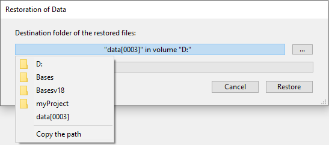
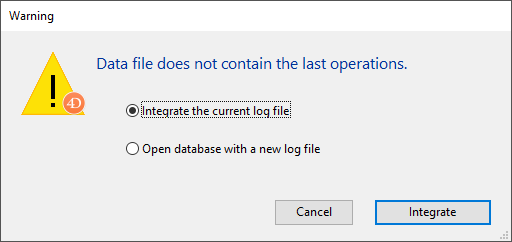

4D lhe permite restaurar conjuntos inteiros de dados de um banco de dados no caso de que se apresente um incidente, independentemente da causa do mesmo. Podem ocorrer dois tipos principais de incidentes:

- A parada inesperada do banco enquanto estiver em uso. Esse incidente pode ocorrer por causa de uma falha de energia, erro em um elemento do sistema, etc. Esse incidente pode ocorrer por causa de uma falha de energia, erro em um elemento do sistema, etc. This incident can occur because of a power outage, system element failure, etc. In this case, depending on the current state of the data cache at the moment of the incident, the restore of the database can require different operations:
    - Se a cache estiver vazia, o banco de dados abre normalmente. Quaisquer mudanças feitas no banco de dados foram registradas. Este caso não exige nenhuma operação particular
    - Se a cache conter operações, o arquivo de dados está intacto mas exige integrar o arquivo de histórico atual.
    - Se a cache estiver no processo de ser escrita, o arquivo de dados está provavelmente danificado. When restoring a backup and integrating the current log file in a encrypted database:

- A perda de um ou mais arquivos do banco de dados. This incident can occur because of defective sectors on the disk containing the database, a virus, manipulation error, etc. The last backup must be restored and then the current log file must be integrated. O último backup deve ser restaurado e o arquivo de histórico atual deve ser integrado. Para saber se um banco de dados foi danificado depois de um incidente, basta relançar o banco de dados com 4D. O programa realiza um autodiagnóstico e detalha as operações de restauração necessárias. Em modo automático, essas operações são realizadas diretamente sem precisar de ajuda da parte do usuário. Se usar uma estratégia de backup regulares, as ferramentas de restauração de 4D permite recuperar (na maioria dos casos) o banco de dados na mesma situação que estava antes do incidente.

> 4D pode lançar procedimentos automaticamente para recuperar os bancos de dados depois de um incidente. Esses mecanismos são gerenciados usando duas opções disponíveis na página **Backup/Backup & Restore** das Configurações. For more information, refer to the [Automatic Restore](./settings.md##automatic-restore-and-log-integration) paragraph.\
> Se o incidente for resultado de uma operação inadequada realizada nos dados (eliminação de um registro, por exemplo), você pode tentar reparar o arquivo de dados usando a função "rollback" no arquivo de log. Esta função está disponível na página [Rollback](MSC/rollback.md) do MSC.

## Restaurar manualmente o backup (diálogo padrão)

Pode restaurar manualmente os conteúdos de um arquivo gerado pelo módulo de cópia de segurança. Uma restauração manual pode ser necessária, por exemplo, para restaurar os conteúdos completos de um arquivo (arquivos projetos e arquivos anexos) ou, para o propósito de realizar pesquisas entre os arquivos. A restauração manual pode também ser realizada junto com a integração do arquivo de histórico atual.

A restauração manual de backups pode ser realizada via a caixa de diálogo de Abertura de documento, ou através da página [Restore](../MSC/restore.md) do MSC. A restauração através do MSC oferece mais opções e permite pré-visualizar os conteúdos dos arquivos. Por outro lado, só podem ser restaurados os arquivos associados à aplicação aberta.

Para restaurar um banco de dados manualmente via uma caixa de diálogo padrão:

1. Escolha **Restaurar...** no menu **Arquivo** do aplicativo 4D.
    Não é obrigatório que um banco de dados seja aberto.
    OU
    Execute o comando `RESTORE` a partir de um método 4D.
    Uma caixa de diálogo de abertura de arquivos vai aparecer.
2. Selecione um arquivo de backup (.4bk) ou um arquivo de backup de log (.4bl) para ser restaurado e clique em **Abrir**.
    Aparece um diálogo que permite especificar o local onde os arquivos serão restaurados. Por padrão, o 4D restaura os arquivos em uma pasta chamada *Archivename* (sem extensão) localizada ao lado do arquivo. Pode exibir a rota:

Você também pode clicar no botão **[...]** para especificar um local diferente.
3. Clique no botão **Restaurar**.
4D extrai todos os arquivos de backup do local especificado.
Se o arquivo de histórico atual ou um arquivo de histórico de backup com o mesmo número que o arquivo de cópia de segurança for armazenado na mesma pasta, 4D examina seus conteúdos. Se conter operações não presentes no arquivo de dados, o programa vai perguntar se deseja integrar essas operações. Integration is done automatically if the **Integrate last log file...** option is checked (see [Automatic Restore](settings.md#automatic-restore-and-log-integration)).

4.(Opcional) Clique em **OK** para integrar o arquivo de log na aplicação restaurada.
Se a restauração e integração forem realizadas corretamente, 4D exibe uma caixa de diálogo indicando que a operação foi feita com sucesso.
5. Clique em **OK**.

A pasta de destino é mostrada. Durante a restauração, 4D coloca todos os arquivos de backup nessa pasta, independente da posição dos arquivos originais no disco quando o backup começou. Dessa forma seus arquivos serão mais fáceis de encontrar.

> Qualquer conteúdo relacionado aos arquivos de dados (arquivos e pasta `Settings`) são restauradas automaticamente em uma subpasta `Data` dentro da pasta de destino.

## Restaurar manualmente a cópia de segurança (MSC)

Você pode restaurar um arquivo manualmente do aplicativo atual usando a [página de restauração](MSC/restore.md) do Centro de Manutenção e Segurança (MSC).

## Integração manual do histórico

If you have not checked the option for the automatic integration of the log file on the Restore page of the MSC (see [Successive integration of several log files](MSC/restore.md#successive-integration-of-several-data-log-files)), a warning dialog box appears during the opening of the application when 4D notices that the log file contains more operations than have been carried out in the data file.

> Para que esse mecanismo funcione, 4D deve poder acessar o arquivo de histórico em seu local atual.

Pode escolher se quer ou não integrar o arquivo de histórico atual. Não integrar o arquivo de histórico atual permite evitar reproduzir erros feitos nos dados.