4D fornece um editor de formulários completo que permite modificar seu formulário até conseguir o efeito que deseja. Com o editor de formulários, é possível criar e eliminar objetos, manipulá-los diretamente e definir as propriedades de objetos e formulários.

## Interface

O editor de formulários apresenta cada formulário JSON na sua própria janela, que tem uma barra de ferramentas e de uma barra de objetos. É possível ter vários formulários abertos ao mesmo tempo.

### Opções de visualização

You can show or hide several interface elements on the current page of the form:

- **Formulário herdado**: Objetos de formulário herdados (se houver um [formulário herdado] (forms.md#inherited-forms)).
- **Página 0**: objetos de [página 0](forms.md#form-pages). This option allows you to distinguish between the objects on the form’s current page and those on page 0.
- **Papel**: bordas da página de impressão, mostradas como linhas cinzas. Este elemento só pode ser exibido por padrão em formulários do tipo ["para impressão"](properties_FormProperties.md#form-type).
- **Réguas**: réguas da janela do editor de formulários.
- **Marcadores**: linhas de controle de saída e marcadores associados que mostram os limites das diferentes áreas do formulário. Este elemento só pode ser exibido por padrão em [formulários lista](properties_FormProperties.md#form-type).
- **Rótulos dos marcadores**: rótulos dos marcadores, disponíveis apenas quando as linhas de controle de saída forem exibidas. Este elemento só pode ser exibido por padrão em [formulários lista](properties_FormProperties.md#form-type).
- **Limites**: limites do formulário. When this option is selected, the form is displayed in the Form editor as it appears in Application mode. This way you can adjust your form without having to switch to the Application mode in order to see the result.

> As configurações [**Size Based on**](properties_FormSize.md#size-based-on), [**Hor margin**](properties_FormSize.md#hor-margin) e [**Vert margin**](properties_FormSize.md#vert-margin) das propriedades do formulário afetam os limites do formulário. When using these settings, the limits are based on the objects in the form. When you modify the size of an object that is located next to the form’s border, it is modified to reflect that change.

#### Visualização por defeito

When a form is opened in the editor, interface elements are displayed or hidden by default, depending on:

- as opções de **exibição padrão do novo formulário** definidas nas Preferências - as opções não marcadas não podem ser exibidas por padrão.
- o [tipo de formulário] atual (properties_FormProperties.md#form-type):
  - Marcadores e rótulos de marcadores são sempre exibidos por padrão em formulários lista
  - O papel é apresentado por defeito nos formulários "para impressão".

#### Exibir/ocultar elementos

Você pode exibir ou ocultar elementos a qualquer momento na janela atual do editor de formulários selecionando **Display** no menu **Form** ou no menu de contexto do editor de formulários:

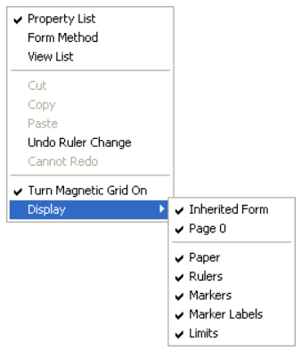

### Regras

The rulers on the side and bottom help you position objects in the form. Elas podem ser [exibidas ou ocultas] (#display-options).

Selecione **Ruler definition...** no menu **Form** para alterar as unidades de medida de modo que o formulário exiba polegadas, centímetros ou pixels.

### Barra de ferramentas

The toolbar of the Form editor offers a set of tools to manipulate and modify the form. Cada janela tem a sua própria barra de ferramentas.


A barra de ferramentas contém os seguintes elementos:

| Ícone                                            | Nome                                                 | Descrição                                                                                                                                                                                                                                                                                                                                                                                                                       |
| ------------------------------------------------ | ---------------------------------------------------- | ------------------------------------------------------------------------------------------------------------------------------------------------------------------------------------------------------------------------------------------------------------------------------------------------------------------------------------------------------------------------------------------------------------------------------- |
|          | Executar o formulário                                | Utilizado para testar a execução do formulário. When you click on this button, 4D opens a new window and displays the form in its context (list of records for a list form and current record page for a detail form). O formulário é executado no processo principal.                                                                                       |
|        | [Ferramenta de seleção](#selecting-objects)          | Permite selecionar, mover e redimensionar objetos de formulário<p>: Quando um objeto do tipo Text ou Group Box é selecionado, pressionar a tecla **Enter** permite alternar para o modo de edição.</p>                                                                                                                                                                                          |
|           | [Ordem de entrada](#data-entry-order)                | Switches to “Entry order” mode, where it is possible to view and change the current entry order of the form. Note that shields allow viewing the current entry order, while still working in the form.                                                                                                                                                                                          |
|           | [Moving](#objetos-em-movimento)                      | Switches to “Move” mode, where it is possible to reach any part of the form quickly by using drag and drop in the window. O cursor assume a forma de uma mão. Este modo de navegação é particularmente útil ao ampliar o formulário.                                                                                                                                            |
|             | [Zoom](#zoom)                                        | Permite modificar a percentagem de visualização do formulário (100% por padrão). You can switch to “Zoom” mode by clicking on the magnifying glass or by clicking directly on the desired bar. Esta função é descrita em pormenor na secção anterior.                                                                                                        |
|        | [Alinhamento](#alinhamento-objetos)                  | This button is linked to a menu that allows changing the level of objects in the form. It is enabled (or not) depending on the objects selected.<br/>Disabled if one selected object position is locked by a CSS property                                                                                                                                                    |
| 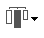    | [Distribuição](#distributing-objects)                | Este botão está ligado a um menu que permite agrupar e desagrupar seleções de objetos no formulário. It is enabled (or not) depending on the objects selected.<br/>Disabled if one selected object position is locked by a CSS property                                                                                                                                      |
| 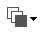           | [Level](#layering-objects)                           | This button is linked to a menu that allows changing the level of objects in the form. É ativada (ou não) em função dos objetos selecionados.                                                                                                                                                                                                                                |
|            | [Group/Ungroup](#grouping-objects)                   | Este botão está ligado a um menu que permite agrupar e desagrupar seleções de objetos no formulário. É ativada (ou não) em função dos objetos selecionados.                                                                                                                                                                                                                  |
|    | [Display and page management](forms.html#form-pages) | Esta área permite passar de uma página de formulário para outra e adicionar páginas. Para navegar entre páginas de formulários, clique nos botões de seta, ou clique na área central e escolha a página a exibir a partir do menu que aparece. Se clicar no botão da seta para a direita enquanto é exibida a última página do formulário, 4D permite-lhe adicionar uma página. |
|   | [CSS Preview](#css-preview)                          | Este botão é utilizado para seleccionar o Modo CSS a utilizar.                                                                                                                                                                                                                                                                                                                                                  |
|            | [Managing views](#views)                             | Este botão apresenta ou oculta a paleta de vistas. Esta função é detalhada em Utilização de vistas de objeto.                                                                                                                                                                                                                                                                                   |
|         | [Displaying shields](#shields)                       | Each click on this button causes the successive display of each type of form shield. The button is also linked to a menu that allows directly selecting the type of shield to display.                                                                                                                                                                                                          |
|          | [Preconfigured object library](objectLibrary.html)   | This button displays the preconfigured object library that provides numerous objects with certain properties that have been predefined.                                                                                                                                                                                                                                                                         |
|  | [List Box Builder](#list-box-builder)                | Este botão cria list boxes entity selection.                                                                                                                                                                                                                                                                                                                                                                    |
|     | [Insert fields](#insert-fields)                      | Esse botão insere todos os campos (exceto os campos do tipo objeto e bolha) da tabela do formulário no formulário, juntamente com seus rótulos e de acordo com os padrões de interface.                                                                                                                                                                                                      |

### Barra de objetos

The object bar contains all the active and inactive objects that can be used in 4D forms. Alguns objectos estão agrupados por temas. Cada tema inclui várias alternativas que pode escolher entre elas. Quando a barra de objectos tem o foco, é possível seleccionar os botões usando as teclas do teclado. The following table describes the object groups available and their associated shortcut key.

| Botão                                      | Agrupar                                                                                                                                                                                                                                                   | Chave |
| ------------------------------------------ | --------------------------------------------------------------------------------------------------------------------------------------------------------------------------------------------------------------------------------------------------------- | :---: |
|       | [Text](FormObjects/text.md) / [Group Box](FormObjects/groupBox.md)                                                                                                                                                                                        |   T   |
|      | [Input](FormObjects/input_overview.md)                                                                                                                                                                                                                    |   F   |
|    | [Lista hierárquica](FormObjects/list_overview.md) / [Caixa de listagem](FormObjects/listbox_overview.md)                                                                                                                                                  |   L   |
|      | [Caixa de Combo](FormObjects/comboBox_overview.md) / [Lista Dropdown](FormObjects/dropdownList_Overview.md) / [Menu de Pop-up de imagens](FormObjects/picturePopupMenu_overview.md)                                                                       |   P   |
| 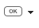    | [Button](FormObjects/button_overview.md) / [Picture Button](FormObjects/pictureButton_overview.md) / [Button Grid](FormObjects/buttonGrid_overview.md)                                                                                                    |   B   |
|      | [Botão de Rádio](FormObjects/radio_overview.md)                                                                                                                                                                                                           |   R   |
|   | [Caixa de seleção] (FormObjects/checkbox_overview.md)                                                                                         |   C   |
|  | [Progress Indicator](FormObjects/progressIndicator.md) / [Ruler](FormObjects/ruler.md) / [Stepper](FormObjects/stepper.md) / [Spinner](FormObjects/spinner.md)                                                                                            |   I   |
| 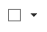 | [Rectangle](FormObjects/shapes_overview.md#rectangle) / [Line](FormObjects/shapes_overview.md#line) / [Oval](FormObjects/shapes_overview.md#oval)                                                                                                         |   S   |
|   | [Splitter](FormObjects/splitters.md) / [Controle de guia](FormObjects/tabControl.md)                                                                                                                                                                      |   D   |
|     | [Plug-in Area](FormObjects/pluginArea_overview.md) / [Subform](FormObjects/subform_overview.md) / [Web Area](FormObjects/webArea_overview.md) / [4D Write Pro](FormObjects/writeProArea_overview.md) / [4D View Pro](FormObjects/viewProArea_overview.md) |   X   |

To draw an object type, select the corresponding button and then trace the object in the form. Após criar um objeto, você pode modificar seu tipo utilizando a Lista de Propriedades. To draw an object type, select the corresponding button and then trace the object in the form. Lines are constrained to horizontal, 45°, or vertical, rectangles are constrained to squares, and ovals are constrained to circles.

The current variant of the theme is the object that will be inserted in the form. Ao clicar no lado direito de um botão, você acessa o menu de variantes:


You can click twice on the button so that it remains selected even after you have traced an object in the form (continual selection). This function makes creating several successive objects of the same type easier. Para cancelar uma seleção contínua, clique noutro objeto ou ferramenta.

### Lista de propriedades

Both forms and form objects have properties that control access to the form, the appearance of the form, and the behavior of the form when it is used. Form properties include, for example, the form’s name, its menu bar, and its size. Object Properties include, for example, an object’s name, its dimensions, its background color, and its font.

You can display and modify form and object properties using the Property List. It displays either form or objects properties depending on what you select in the editor window.

Para exibir/ocultar a Lista de propriedades, selecione **Lista de propriedades** no menu **Formulário** ou no menu de contexto do editor de formulários. You can also display it by double-clicking in an empty area of the form.

#### Atalhos

Pode utilizar os seguintes atalhos na Lista de Propriedades:

- **Tecla de seta**s ↑ ↓: Usada para ir de uma célula para outra.
- **Teclas de seta** ← →: Usadas para expandir/recolher temas ou entrar no modo de edição.
- **PgUp** e **PgDn**: Usado para rolar o conteúdo da Lista de Propriedades.
- **Página Inicial** e **Final**: Usado para rolar a Lista de Propriedades para que a primeira ou última célula seja exibida.
- **Ctrl+clique** (Windows) ou **Command+clique** (macOS) em um evento: Usado para selecionar/desmarcar todos os eventos da lista, de acordo com o estado inicial do evento em que você clicou.
- **Ctrl+clique** (Windows) ou **Command+clique** (macOS) em um rótulo de tema: Usado para recolher/expandir todos os temas da lista.
- **Ctrl+clique** (Windows) ou **Command+clique** (macOS) em um valor de propriedade exibido em **negrito**: Redefine a propriedade para seu padrão.

## Manipulação de objetos formulário

### Adicionar objectos

É possível adicionar objetos a formulários de várias maneiras:

- Desenhando o objeto diretamente na forma após selecionar o seu tipo na barra de objeto (veja [Usando a barra do objeto](#using-the-object-bar))
- Arrastando e soltando o objeto da barra de objetos
- Por meio de operações de arrastar e soltar ou copiar e colar em um objeto selecionado da [biblioteca de objetos] pré-configurada (objectLibrary.md),
- Ao arrastar e largar um objeto de outro formulário,
- By dragging and dropping an object from the Explorer (fields) or from other editors in the Design environment (lists, pictures, etc.)

Once the object is placed in the form, you can modify its characteristics using the Form editor.

É possível trabalhar com dois tipos de objetos nos formulários:

- **Objetos estáticos** (linhas, quadros, imagens de fundo, etc.): Esses objetos são geralmente usados para definir a aparência do formulário e de seus rótulos, bem como para a interface gráfica. Estão disponíveis na barra de objetos do editor de formulários. Estão disponíveis na barra de objetos do editor de formulários. Estão disponíveis na barra de objetos do editor de formulários. Os objetos estáticos não têm variáveis associadas como os objetos ativos. No entanto, é possível inserir objetos dinâmicos em objetos estáticos.

- **Objetos ativos**: Esses objetos executam tarefas ou funções na interface e podem assumir várias formas: campos, botões, listas roláveis, etc. Cada objeto ativo é associado com um campo ou uma variável.

### Selecção de objectos

Before you can perform any operation on an object (such as changing a line width or font), you need to select the object that you want to modify.

To select an object using the toolbar:

1. Clique na ferramenta Seta na barra de ferramentas<p></p>

<p>Quando você move o ponteiro para a área do formulário, ele se torna um ponteiro padrão em forma de seta</p>.

2. Clique no objecto que deseja selecionar. As alças de redimensionamento identificam o objeto selecionado<p></p>

Para selecionar um objecto utilizando a Lista de Propriedades:

1. Escolher o nome do objecto na lista pendente da Lista de Objectos localizada no topo da Lista de Propriedades. Usando estes dois métodos, pode seleccionar um objecto que esteja escondido por outros objectos ou localizado fora da área visível da janela actual.
   Para cancelar a seleção de um objeto, clique fora do limite do objeto ou **Shift+clique** no objeto.

> \> > > It is also possible to select objects by double-clicking them in the result window of ""Find in design" operation.

### Selecção de múltiplos objectos

Pode querer realizar a mesma operação em mais de um objecto de forma - por exemplo, para mover os objectos, alinhá-los, ou alterar a sua aparência. 4D permite-lhe selecionar vários objectos ao mesmo tempo. Há várias maneiras de seleccionar vários objectos:

- Escolha **Select All** no menu Edit para selecionar todos os objetos.
- Clique com o botão direito no objeto e escolha o comando **Selecione objetos semelhantes** no menu de contexto.
- Mantenha pressionada a tecla **Shift** e clique nos objetos que deseja selecionar.
- Start at a location outside the group of objects you want to select and drag a marquee (sometimes called a selection rectangle) around the objects. When you release the mouse button, if any part of an object lies within or touches the boundaries of the selection rectangle, that object is selected.
- Mantenha pressionada a tecla **Alt** (Windows) ou a tecla **Option** (macOS) e desenhe uma marca de seleção. Os objetos que estiverem completamente no retângulo serão selecionados.

A figura abaixo mostra um marque sendo desenhado para selecionar dois objetos:


Para desmarcar um objeto que faz parte de um conjunto de objetos selecionados, mantenha pressionada a tecla **Shift** e clique no objeto. Os outros objetos permanecem selecionados. To deselect all the selected objects, click outside the boundaries of all the objects.

### Duplicação de objectos

Pode duplicar qualquer objecto na forma, incluindo objectos activos. Copies of active objects retain all the properties of the original, including name, type, standard action, display format, and object method.

You can duplicate an object directly using the Duplicate tool in the Tools palette or use the Duplicate Many dialog box to duplicate an object more than once. Also, using this dialog box, you can set the distance between two copies.

Para duplicar um ou mais objectos:

1. Seleccione os objectos que pretende agrupar.
2. Escolha **Duplicar** no menu **Editar**. 4D cria uma cópia de cada objecto selecionado e coloca a cópia em frente e ligeiramente para o lado do original.
3. Deslocar a cópia para a localização pretendida.
   If you choose the Duplicate menu item again, 4D creates another copy of each object and moves it the exact same distance and direction from the first copy. If you need to distribute copies of the object along a line, you should use the following procedure. Duplicate the original object, move the copy to another location in the form, and then duplicate the copy. The second copy is automatically placed in the same relation to the first copy as the first copy was in relation to the original object. As cópias subsequentes também são colocadas na mesma relação com seus originais. A figura abaixo mostra como funciona esse posicionamento relativo das cópias:


#### Duplicar muitos

A caixa de diálogo "Duplicate Many" é exibida quando você seleciona um ou mais objetos e escolhe o comando **Duplicate Many...** no menu **Object**.

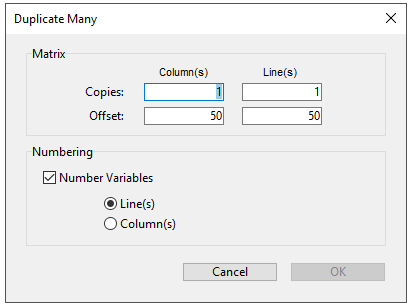

- Na área superior, introduza o número de colunas e linhas (linhas) de objectos que pretende obter. Por exemplo, se quiser três colunas e duas linhas de objectos, introduza 3 na área de Coluna(s) e 2 na área de Linha(s). Na área superior, introduza o número de colunas e linhas (linhas) de objectos que pretende obter.

- Para linhas e colunas, defina o offset que deseja deixar entre cada cópia. O valor deve ser expresso em pontos. It will be applied to each copy, or copies, in relation to the original object. For example, if you want to leave a vertical offset of 20 points between each object and the height of the source object is 50 points, enter 70 in the column’s “Offset” area.

- Se você deseja criar uma matriz de variáveis, selecione a opção **Variáveis de número** e selecione a direção na qual as variáveis estão a ser numeradas, seja por linha(s) ou por coluna(s).
  Esta opção só está activa quando o objecto seleccionado é uma variável. Para obter mais informações sobre essa opção, consulte **Duplicação em uma matriz** no *Design Reference*.

### Mover objetos

You can move any graphic or active object in the form including fields and objects created with a template. Ao mover um objeto, existem as seguintes opções:

- Mova o objeto arrastando-o,
- Mova o objeto um píxel de cada vez utilizando as teclas de seta,
- Mova o objeto em etapas usando as teclas de seta (etapas de 20 píxeis por padrão),

Ao começar a arrastar o objeto selecionado, seus manipuladores desaparecem. 4D displays markers that show the location of the object’s boundaries in the rulers so that you can place the object exactly where you want it. Tenha cuidado para não arrastar uma alça. Dragging a handle resizes the object. Você pode pressionar a tecla **Shift** para executar o movimento com uma restrição.

Quando a [Magnetic Grid] (#using-the-magnetic-grid) está ativada, os objetos são movidos em etapas, indicando locais perceptíveis.

Para mover um objeto um píxel de cada vez:

- Select the object or objects and use the arrow keys on the keyboard to move the object. Each time you press an arrow key, the object moves one pixel in the direction of the arrow.

Para mover um objeto em passos:

- Selecione o objeto ou objetos que deseja mover e mantenha pressionada a tecla **Shift** e use as teclas de seta para mover o objeto por etapas. Por padrão, os passos são de 20 pixéis de cada vez. Pode alterar este valor na página Formulários das Preferências.

### Agrupamento de objectos

4D lets you group objects so that you can select, move, and modify the group as a single object. Objects that are grouped retain their position in relation to each other. You would typically group a field and its label, an invisible button and its icon, and so forth.

When you resize a group, all the objects in the group are resized proportionally (except text areas, which are resized in steps according to their font sizes.

Você pode desagrupar um grupo de objetos a qualquer momento e tratá-los novamente como objetos independentes.

Um objecto activo que tenha sido agrupado deve ser desarticulado antes de se poder aceder às suas propriedades ou método. No entanto, é possível selecionar um objeto pertencente a um grupo sem desagrupar o conjunto: para isso, **Ctrl+clique** (Windows) ou **Command+clique** (macOS) no objeto (o grupo deve ser selecionado antes).

O agrupamento só afeta os objetos no editor de formulários. Quando o formulário é executado, todos os objetos agrupados agem como se não estivessem agrupados.

> Não é possível agrupar objetos pertencentes a diferentes visualizações e somente os objetos pertencentes à visualização atual podem ser agrupados (consulte [Views](#views) ).

Para agrupar objectos:

1. Selecione o objecto agrupado que pretende desagrupar.
2. Elija **Agrupar** en el menú Objetos. OU
   Clique no botão Group (Agrupar<p>)</p> na barra de ferramentas do editor de formulários:<p></p>
   4D marca o limite dos objetos recém-agrupados com alças. No handles mark the boundary of any of the individual objects within the group. Now, when you modify the grouped object, you change all the objects that make up the group.

Para desagrupar objetos:

1. Seleccione o objecto ou objectos que pretende duplicar.
2. Escolha **Ungroup** no menu **Object**<p>.OUClique no</p><p>botão **Ungroup** (variante do botão **Group**) na barra de ferramentas do editor de formulários.</p><p>Se **Ungroup** estiver esmaecido, isso significa que o objeto selecionado já está separado em sua forma mais simples.</p>4D marca os limites dos objetos individuais com alças.

### Alinhamento de objetos

Pode-se alinhar objectos uns com os outros ou utilizar uma grelha invisível no formulário.

- When you align one object to another, you can align it to the top, bottom, side, or horizontal or vertical center of the other object. You can directly align a selection of objects using the alignment tools or apply more advanced alignment settings using the Alignment Assistant. The latter option allows you, for example, to set the object that will be used as the position reference and to preview the alignment in the form before applying it.
- When you use the invisible grid, each object can be aligned manually with others based on “noticeable” positions which are depicted with dotted lines that appear when the object being moved approaches other objects.

#### Usando as ferramentas de alinhamento instantâneo

As ferramentas de alinhamento na barra de ferramentas e no submenu Alinhar do menu Objecto permitem alinhar rapidamente os objectos seleccionados.


When 4D aligns objects, it leaves one selected object in place and aligns the remaining objects to that one. Este objecto é a "âncora." Utiliza o objecto que se encontra mais afastado na direção do alinhamento como âncora e alinha os outros objetos com esse objecto. Por exemplo, se quiser realizar um alinhamento correcto num conjunto de objectos, o objecto mais à direita será utilizado como âncora.
The figure below shows objects with no alignment, "aligned left", "aligned horizontally by centers", and "aligned right":


#### Usando o assistente de alinhamento

The Alignment Assistant allows you to perform any type of alignment and/or distribution of objects.


Para exibir essa caixa de diálogo, selecione os objetos que deseja alinhar e escolha o comando **Alinhamento** no submenu **Alinhar** do menu **Objeto** ou no menu de contexto do editor.

- Nas áreas "Alinhamento Esquerda/Direita" e/ou "Alinhamento Superior/Inferior", clique no ícone que corresponde ao alinhamento que você deseja executar.<p>A área de exemplo exibe os resultados da sua seleção.</p>

- Para executar um alinhamento que use o esquema de âncora padrão, clique em **Preview** ou **Apply**. Nesse caso, 4D usa o objeto que está mais distante na direção do alinhamento como âncora e alinha os outros objetos a esse objeto. Por exemplo, se quiser realizar um alinhamento correcto num conjunto de objectos, o objecto mais à direita será utilizado como âncora. OU:<p>Para alinhar objetos a um objeto específico, selecione a opção **Alinhar em** e selecione o objeto ao qual você deseja que os outros objetos sejam alinhados na lista de objetos. In this case, the position of the reference object will not be altered.</p>

Você pode visualizar os resultados do alinhamento clicando no botão **Preview**. Os objetos são então alinhados no editor de formulários, mas como a caixa de diálogo não desaparece, ainda é possível cancelar ou aplicar o alinhamento.

> Esta caixa de diálogo permite-lhe alinhar e distribuir objetos numa única operação. Para obter mais informações sobre como distribuir objetos, consulte [Distribuir objetos] (#distributing-objects).

#### Utilização da Rede Magnética

O editor de formulários fornece uma grelha magnética virtual que pode ajudá-lo a colocar e alinhar objetos num formulário. O alinhamento magnético dos objetos baseia-se na sua posição em relação uns aos outros. A grelha magnética só pode ser utilizada quando pelo menos dois objetos estão presentes no formulário.

Isso funciona da seguinte maneira: quando se move um objeto no formulário, 4D indica possíveis localizações para este objeto baseado em alinhamentos notáveis com outros objetos do formulário. É estabelecido um alinhamento perceptível cada vez que isso acontece:

- Horizontalmente, os bordos ou centros de dois objetos coincidem,
- Verticalmente, as arestas de dois objectos coincidem.

Quando isso acontece, 4D coloca o objeto no local e mostra uma linha vermelha indicando o alinhamento perceptível considerado:


No que diz respeito à distribuição dos objetos, 4D propõe uma distância baseada em normas de interface. Tal como no caso do alinhamento magnético, as linhas vermelhas indicam as diferenças visíveis quando estas são atingidas.


Esta operação aplica-se a todos os tipos de objetos dos formulários. A Magnetic Grid pode ser ativada ou desativada a qualquer momento usando o comando **Magnetic Grid** no menu **Form** ou no menu de contexto do editor. Também é possível definir a ativação desse recurso por padrão na página **Preferências** > **Formulários** (opção **Ativar alinhamento automático por padrão**). Você pode ativar ou desativar manualmente a grade magnética quando um objeto for selecionado pressionando a tecla **Ctrl** (Windows) ou **Control** (macOS) .

> O magnetismo também leva à observação de etapas ao redimensionar objetos manualmente.

### Distribuição de objectos

You can distribute objects so that they are set out with an equal amount of space between them. To do this, you can distribute objects using either the Distribute tools in the Tools palette or the Alignment Assistant. Este último permite-lhe alinhar e distribuir objetos numa única operação.

> Quando a [Magnetic Grid] (#using-the-magnetic-grid) está ativada, um guia visual também é fornecido para distribuição quando um objeto é movido manualmente.

Para distribuir objetos com igual espaçamento:

1. Selecione três ou mais objetos e clique na ferramenta Distribuir pretendida.

2. Na barra de ferramentas, clique na ferramenta de distribuição que corresponde à distribuição que você deseja aplicar.<p></p> OU<p>Selecione um comando de menu de distribuição no submenu **Alinhar** no menu **Objeto** ou no menu de contexto do editor.</p>4D distribui os objetos apropriadamente. Objects are distributed using the distance to their centers and the largest distance between two consecutive objects is used as a reference.

Para distribuir objetos utilizando a caixa de diálogo Alinhar e distribuir:

1. Seleccione os objectos que pretende distribuir.

2. Seleccione el comando **Alineación** del submenú **Alinear** del menú **Objeto** o del menú contextual del editor. A seguinte caixa de diálogo é exibida:

3. Nas áreas de Alinhamento Esquerdo/Direita e/ou Topo/Bottom Alinhamento, clique no ícone de distribuição padrão:  <p>(ícone padrão de distribuição horizontal)</p>A área de exemplo exibe os resultados da sua seleção.

4. Para executar uma distribuição que use o esquema padrão, clique em **Preview** ou *Apply*.<p>Nesse caso, o 4D executará uma distribuição padrão, de modo que os objetos sejam dispostos com uma quantidade igual de espaço entre eles</p>. OU:<p>Para executar uma distribuição específica, selecione a opção **Distribute** (por exemplo, se quiser distribuir os objetos com base na distância até o lado direito). Esta opção funciona como um interruptor. If the Distribute check box is selected, the icons located below it perform a different function:</p>

- Horizontalmente, os ícones correspondem às seguintes distribuições: igualmente com relação aos lados esquerdos, centros (hor.) e os lados direito dos objetos selecionados.
- Verticalmente, os ícones correspondem às seguintes distribuições: uniformemente em relação às bordas superiores, centros (vert.) e as bordas inferiores dos objetos selecionados.

Você pode visualizar o resultado real de suas configurações clicando no botão **Preview**: a operação é executada no editor de formulários, mas a caixa de diálogo permanece em primeiro plano. Você poderá então **Cancelar** ou **Aplicar** as modificações.

> Esta caixa de diálogo permite-lhe combinar o alinhamento e a distribuição de objetos. Para obter mais informações sobre alinhamento, consulte [Alinhamento de objetos](#alinhamento-de-objetos).

### Gerenciar os planos dos objetos

You will sometimes have to rearrange objects that are obstructing your view of other objects in the form. For example, you may have a graphic that you want to appear behind the fields in a form. You will sometimes have to rearrange objects that are obstructing your view of other objects in the form. These layers also determine the default entry order (see Modifying data entry order). A figura abaixo mostra objetos à frente e atrás de outros objetos:


Para mover um objeto para outro nível, selecione-o e escolha:

- Um dos comandos **Mover para o Voltar**, **Mover para Front**, **Para cima um Nível** e **Para Baixo** do menu Obstáculo,
- Um dos comandos no submenu **Level>** no menu de contexto do editor,
- One of the commands associated with the level management button of the toolbar.

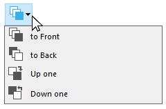

> Quando vários objetos são sobrepostos, o atalho **Ctrl+Shift+click** / **Command+Shift+click** pode ser usado para selecionar cada objeto sucessivamente, descendo uma camada a cada clique.

When ordering different levels, 4D always goes from the background to the foreground. As a result, the previous level moves the selection of objects one level towards the background. The next level moves the selection one level towards the foreground of the form.

### Ordem de introdução de dados

A ordem de entrada de dados é a ordem em que os campos, subformulários e outros objetos ativos são selecionados quando você pressiona a tecla **Tab** ou **Carriage return** em um formulário de entrada. É possível percorrer o formulário na direção oposta (ordem inversa de entrada de dados) pressionando as teclas de retorno **Shift+Tab** ou **Shift+Carriage**.

> Você pode alterar a ordem de entrada em tempo de execução usando os comandos `FORM SET ENTRY ORDER` e `FORM GET ENTRY ORDER`.

Every object that supports the focusable property is included in the data entry order by default.

Definir a ordem de entrada para um formulário JSON é feita com a propriedade [`entryOrder`](properties_JSONref.md).

If you don’t specify a custom entry order, by default 4D uses the layering of the objects to determine the entry order in the direction “background towards foreground.” The standard entry order thus corresponds to the order in which the objects were created in the form.

Em alguns formulários, é necessária uma ordem de entrada de dados personalizada. Below, for example, additional fields related to the address have been added after the creation of the form. The resulting standard entry order thus becomes illogical and forces the user to enter the information in an awkward manner:


In cases such as this, a custom data entry order allows you to enter the information in a more logical order:


#### Visualização e alteração da ordem de introdução de dados

You can view the current entry order either using the “Entry order” shields, or by using the “Entry order” mode. No entanto, você só pode modificar a ordem de entrada usando o modo “Ordem de entrada”.

This paragraph describes viewing and modifying the entry order using the “Entry order” mode. You can view the current entry order either using the “Entry order” shields, or by using the “Entry order” mode.

Para ver ou alterar a ordem de entrada:

1. Selecione **Pedido de entrada** no menu **Formulário** ou clique no botão na barra de ferramentas da janela:<p></p>

   O ponteiro se transforma em um ponteiro de ordem de entrada e 4D desenha uma linha na forma mostrando a ordem em que ele seleciona objetos durante a entrada de dados. A visualização e alteração da ordem de introdução de dados são as únicas acções que pode realizar até clicar em qualquer ferramenta na paleta Ferramentas.

2. Para mudar a ordem de entrada de dados, posicione o ponteiro em um objeto no formulário e, enquanto mantém pressionado o botão do mouse, arraste o ponteiro para o objeto que deseja na ordem de entrada de dados.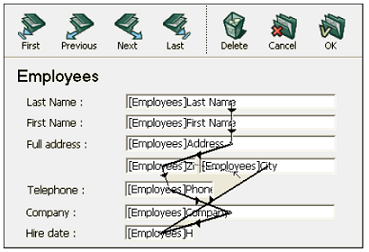4D ajustará a ordem de entrada de acordo.

3. Repita a etapa 2 tantas vezes quantas forem necessárias para definir a ordem de introdução de dados que desejar.

4. Quando estiver satisfeito com a ordem de entrada de dados, clique em qualquer ferramenta não selecionada na barra de ferramentas ou escolha Ordem de entrada a partir do menu Formulário. 4D regressa ao funcionamento normal do editor de formulários.

> Somente a ordem de entrada da página atual do formulário é exibida. Se o formulário contiver objetos inseríveis na página 0 ou provenientes de um formulário herdado, a ordem de entrada padrão será a seguinte: Objetos da página 0 do formulário herdado > Objetos da página 1 do formulário herdado > Objetos da página 0 do formulário aberto > Objetos da página atual do formulário aberto.

#### Utilização de um grupo de introdução de dados

While you are changing the data entry order, you can select a group of objects in a form so that the standard data entry order applies to the objects within the group. This allows you to easily set the data entry order on forms in which fields are separated into groups or columns.

Para criar um grupo de entrada de dados:

1. Selecione **Entry Order** no menu *Formulário* ou clique no botão na barra de ferramentas.
2. Desenhe uma seleção ao redor dos objetos que você deseja agrupar para entrada de dados.

When you release the mouse button, the objects enclosed or touched by the rectangle follow the standard data entry order. A ordem de entrada de dados para os restantes objetos ajustam-se conforme necessário.

#### Excluir um objeto da ordem de entrada

Por defeito, todos os objetos que suportam a propriedade focusable são incluídos na ordem de entrada. Para excluir um objeto da ordem de entrada:

1. Selecionar o modo ordem de entrada e, em seguida

2. **shift-click** no objeto

3. **Clique com o botão direito do mouse** no objeto e selecione a opção **Remover da ordem de entrada** no menu de contexto

## Pré-visualização CSS

The Form editor allows you to view your forms with or without applied CSS values.

Quando as [folhas de estilo] (createStylesheet.md) forem definidas, os formulários (inclusive os formulários herdados e os subformulários) são abertos no modo CSS Preview do seu sistema operacional por padrão.

### Selecção do modo de pré-visualização do CSS

A barra de ferramentas do editor de formulários fornece um botão CSS para a visualização de objectos com estilo:


Seleccione um dos seguintes modos de pré-visualização a partir do menu:

| Ícone barra de ferramentas              | Modo de pré-visualização CSS | Descrição                                                                                                                                                         |
| --------------------------------------- | ---------------------------- | ----------------------------------------------------------------------------------------------------------------------------------------------------------------- |
|   | Nenhum                       | No CSS values are applied in the form and no CSS values or icons displayed in the Property List.                                                  |
|  | Windows                      | Os valores CSS para a plataforma Windows são aplicados no formulário. Valores CSS e ícones apresentados na Lista de Propriedades. |
|  | macOS                        | Os valores CSS para a plataforma macOS são aplicados no formulário. Valores CSS e ícones apresentados na Lista de Propriedades.   |

> If a font size too large for an object is defined in a style sheet or JSON, the object will automatically be rendered to accommodate the font, however the size of the object will not be changed.

O modo de visualização CSS reflete a ordem de prioridade aplicada às folhas de estilo versus atributos JSON, conforme definido na seção [JSON vs. Folha de estilo] (stylesheets.html#json-vs-style-sheet).

Once a CSS preview mode is selected, objects are automatically displayed with the styles defined in a style sheet (if any).

> When copying or duplicating objects, only the CSS references (if any) and the JSON values are copied.

### Suporte CSS na lista de propriedades

In CSS Preview mode, if the value of an attribute has been defined in a style sheet, the attribute's name will appear with a CSS icon displayed next to it in the Property List. Por exemplo, os valores dos atributos definidos nesta folha de estilos:

```4d
.myButton {
font-family: comic sans;
font-size: 14;
stroke: #800080;
}
```

são apresentados com um ícone CSS na Lista de Propriedades:


Um valor de atributo definido em uma folha de estilo pode ser substituído na descrição do formulário JSON (exceto se o CSS incluir a declaração `!important`, veja abaixo). Nesse caso, a Lista de propriedades exibe o valor do formulário JSON em **negrito**. Você pode redefinir o valor para sua definição de folha de estilo com os atalhos **Ctrl + clique** (Windows) ou **Command + clique** (macOs).

> Se um atributo tiver sido definido com a declaração `!important` para um grupo, um objeto em um grupo ou qualquer objeto em uma seleção de vários objetos, esse valor de atributo será bloqueado e não poderá ser alterado na Lista de propriedades.

#### Lista de propriedades Ícones CSS

| Ícone                                         | Descrição                                                                                                                                                          |
| --------------------------------------------- | ------------------------------------------------------------------------------------------------------------------------------------------------------------------ |
|       | Indica que um valor de atributo foi definido em uma folha de estilo                                                                                                |
|  | Indica que un valor de atributo ha sido definido en una hoja de estilo con la declaración `!important`                                                             |
|  | Displayed when an attribute value defined in a style sheet for at least one item in a group or a selection of multiple objects is different from the other objects |

## Criação de list box

Você pode criar novas caixas de listagem de seleção de entidades rapidamente com o **Criador de caixas de listagem**. The new list box can be used immediately or it can be edited via the Form Editor.

The List box builder lets you create and fill entity selection list boxes in a few simple operations.

### Usando o gerador de list box

1. Na barra de ferramentas do Editor de formulários, clique no ícone do construtor de List box:


O gerador do list box é exibido:


2. Selecione uma tabela na lista suspensa **Table**:


3. Selecione os campos para a caixa de listagem na área **Fields**:

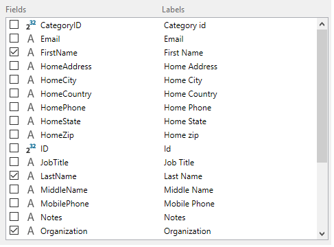

Por padrão, todos os campos são selecionados. Você pode selecionar ou desmarcar campos individualmente ou usar **Ctrl+clique** (Windows) ou **Cmd+clique** (macOS) para selecionar ou desmarcar todos de uma vez.

Você pode alterar a ordem dos campos arrastando-os e soltando-os.

4. The expression to fill the list box's rows from the entity selection is prefilled:


Esta expressão pode ser alterada se necessário.

5. Clicar no botão **Copy** copiará a expressão para carregar todos os registros na memória:


6. Clique no botão **Construir widget** para criar a caixa de lista.


O list box final:


## Inserir campos

O botão **Inserir campos** insere todos os campos (exceto os campos do tipo objeto e bolha) da tabela do formulário no formulário, juntamente com seus rótulos e de acordo com os padrões de interface. Esse assistente é um atalho para projetar formulários básicos de entrada ou formulários lista.

O botão **Inserir campos** só está disponível em formulários de tabela.

O desenho do formulário resultante depende do formulário:

- **Formulário detalhado**: clicar no botão **Inserir campos** gera um formulário com um design de página:


- **Formulário de lista**: clicar no botão **Inserir campos** gera um design de formulário de lista com campos organizados em uma única linha e marcadores de área:

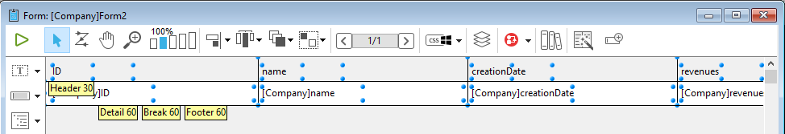

## Escudos

The 4D Form Editor uses shields to make viewing object properties easier. Pode encontrá-los na barra de ferramentas do formulário:

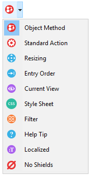

Essa função funciona da seguinte forma: Cada escudo é associado a uma propriedade (por exemplo, **Views**, que significa que o objeto "está na visualização atual"). When you activate a shield, 4D displays a small icon (shield) in the upper left of each object of the form where the property is applied.


### Usando escudos

Para ativar um escudo, clique no ícone *Escudo* na barra de ferramentas até que o escudo desejado seja selecionado. You can also click on the right side of the button and select the type of shield to display directly in the associated menu:

Se você não quer exibir escudos, selecione **Sem Escudos** no menu de seleção.

> You can set which shields to display by default on the Forms Page of the application Preferences.

### Descrição do badge

Segue-se uma descrição de cada tipo de escudo:

| Ícone                                           | Nome                            | É exibido ...                                                                                                                                              |
| ----------------------------------------------- | ------------------------------- | ---------------------------------------------------------------------------------------------------------------------------------------------------------------------------------------------------------- |
|    | Método objecto                  | Para objectos com um método objeto associado                                                                                                                                                               |
|  | Acção padrão                    | Para objectos com uma acção padrão associada                                                                                                                                                               |
|        | Redimensionamento               | Para objectos com pelo menos uma propriedade de redimensionamento, indica a combinação de propriedades actuais                                                                                             |
|      | Ordem de entrada                | Para objectos enterráveis, indica o número da ordem de entrada                                                                                                                                             |
|      | Vista actual                    | Para todos os objectos na vista actual                                                                                                                                                                     |
|       | [Style Sheet](stylesheets.html) | Para objectos com um ou mais valores de atributo anulados por uma folha de estilo.                                                                                                         |
|          | Filtro                          | Para objectos enterráveis com um filtro de entrada associado                                                                                                                                               |
|         | Dica de Ajuda                   | Para objetos com uma mensagem de ajuda associada                                                                                                                                                           |
|       | Localizado                      | Para objetos cuja etiqueta possui uma referência (etiqueta começando com “:”). A referência pode ser do tipo recurso (STR#) ou XLIFF |
|       | Sem Escudos                     | Nenhum escudo aparece                                                                                                                                                                                      |

## Vistas

The 4D Form Editor enables you to build complex forms by distributing form objects among separate views that can then be hidden or shown as needed.

For example, you can distribute objects according to type (fields, variables, static objects, etc.). Any type of form object, including subforms and plug-in areas, can be included in views.

Não há limite para o número de vistas por formulário. Pode criar tantas vistas diferentes quantas as necessárias. Além disso, cada vista pode ser apresentada, ocultada e/ou bloqueada.

A gestão das vistas é efetuada através da paleta de vistas.


### Aceder à paleta de vistas

Existem três formas de aceder à paleta de vistas:

- **Barra de ferramentas**: Clique no ícone Views na barra de ferramentas do Form Editor. (This icon appears gray when at least one object belongs to a view other than the default view.)

|                 Vista por defeito apenas                |                 Com vistas adicionais                 |
| :-----------------------------------------------------: | :---------------------------------------------------: |
|  |  |

- **Menu de contexto** (formulário ou objeto): Clique com o botão direito do mouse em qualquer lugar do Form Editor ou de um objeto e selecione **Current View**


A visualização atual é indicada com uma marca de seleção (\*por exemplo, \*, "Work Address" na imagem acima)

- **Menu do formulário**: clique no menu do **formulário** e selecione **Exibir lista**


### Antes de começar

Aqui estão algumas coisas importantes que você deve saber antes de começar a trabalhar com vistas:

- **Contexto de uso**: As visualizações são uma ferramenta puramente gráfica que só pode ser usada no Editor de Formulário; você não pode acessar as visualizações programaticamente ou no ambiente de Aplicativos.

- **Visualizações e páginas**: Os objetos da mesma visualização podem pertencer a páginas de formulário diferentes; somente os objetos da página atual (e da página 0, se ela estiver visível) podem ser exibidos, independentemente da configuração da visualização.

- **Visualizações e níveis**: As visualizações são independentes dos níveis do objeto; não há hierarquia de exibição entre visualizações diferentes.

- **Visualizações e grupos**: Somente objetos pertencentes à visualização atual podem ser agrupados.

- Visualizações **atuais e padrão**: A visualização padrão é a primeira vista de um formulário e não pode ser excluída; a visualização atual é a visualização que está sendo editada e o nome é exibido em negrito.

### Gestão da vistas

#### Criar vistas

Qualquer objecto criado num formulário é colocado na primeira vista ("Vista 1") do formulário. A primeira visualização é **sempre** a visualização padrão, indicada por (Default) após o nome. O nome da visualização pode ser alterado (consulte [Renomear visualizações](#renomear-visualizações)), mas ela continua sendo a visualização padrão.


Existem duas formas de adicionar vistas adicionais:

- Clique no botão **Adicionar uma nova exibição** na parte inferior da paleta Exibir:


- Clique com o botão direito do mouse em uma visualização existente e selecione **Inserir visualização**:

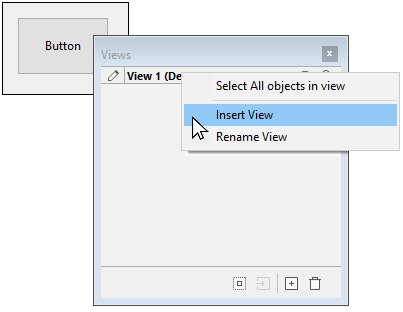

Não há limite para o número de vistas.

#### Renomear vistas

By default views are named as "View" + the view number, however you can change these names to improve readability and better suit your needs.

Para mudar o nome de uma vista, pode utilizar:

- Double-click directly on the view name (the selected view in this case). O nome torna-se então editável:


- Clique com o botão direito do rato no nome da vista. O nome torna-se então editável:


#### Reordenação de visualizações

You can change the display order of views by dragging/dropping them within the View palette.

Note-se que a vista padrão não é alterada:


#### Eliminar vistas

Para mudar o nome de uma vista, pode utilizar:

- Clique no botão **Delete the selected view** (Excluir a exibição selecionada) na parte inferior da paleta View (Exibir):


- Clique com o botão direito do mouse no nome da visualização e selecione **Delete View**:


> Se uma vista for apagada, quaisquer objectos nela contidos são automaticamente movidos para a vista por defeito.

### Usando vistas

Uma vez criadas as vistas, pode utilizar a paleta Vista para:

- Adicionar objecto às vistas,
- Mover objectos de uma vista para outra,
- Selecionar todos os objetos da mesma vista com um único clique,
- Mostrar ou ocultar objectos para cada vista,
- Bloquear os objectos de uma vista.

#### Adicionar objectos a vistas

Um objeto só pode pertencer a uma única vista.

Para criar um objeto em outra visualização, basta selecionar a visualização na paleta Visualizar (antes de criar o objeto) clicando em seu nome (um ícone Editar é exibido para a [Visualização atual] (#antes-de-começar) e o nome aparece em negrito):


#### Mover objectos entre vistas

It's also possible to move one or more objects from one view to another. No formulário, selecionar o(s) objeto(s) cuja vista se pretende alterar. The view list indicates, using a symbol, the view to which the selection belongs:

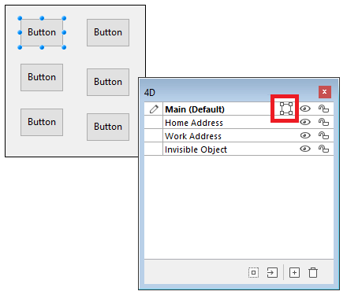

> A seleção pode conter vários objetos pertencentes a diferentes visualizações.

Basta selecionar a visualização de destino, clicar com o botão direito do mouse e selecionar **Move to**:


OU

Selecione a exibição de destino da seleção e clique no botão **Mover para** na parte inferior da paleta Exibir:


A seleção é então colocada na nova vista:


Você também pode mover um objeto para outra visualização por meio do menu de contexto do objeto. Clique com o botão direito do mouse no objeto, selecione **Mover para visualização** e selecione uma visualização na lista de visualizações disponíveis:


> A [Visualização atual] (#antes-de-comecar) é mostrada em negrito.

#### Seleccionar todos os objectos de uma vista

You can select all objects belong to the same view in the current page of the form. This function is useful for applying global changes to a set of objects.

Para fazer isso, clique com o botão direito do mouse no modo de exibição em que você deseja selecionar todos os objetos, clique em **Selecionar todos**:

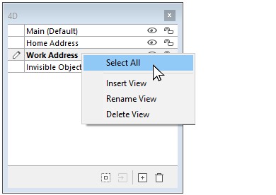

Também pode utilizar o botão na parte inferior da paleta de vistas:


#### Mostrar ou esconder objectos de uma vista

You can show or hide objects belonging to a view at any time in the form's current page. Essa função pode ser usada, por exemplo, para focar em determinados objetos ao modificar o formulário.

Por padrão, todas as exibições são mostradas, conforme indicado pelo ícone *Show/Hide*:


Para ocultar uma exibição, clique no ícone *Mostrar/Ocultar*. Em seguida, é escurecida e os objetos da vista correspondente deixam de ser mostrados no formulário:


> A [Visualização atual] (#before-you-begin) não pode ser ocultada.

Para mostrar uma visualização oculta, simplesmente selecione-a ou clique no ícone *Mostrar/Ocultar* para essa exibição.

#### Bloqueio de objetos de uma vista

É possível bloquear os objectos de uma vista. Isto impede que sejam selecionados, alterados ou eliminados do formulário. Una vez bloqueado, un objeto no puede seleccionarse mediante un clic, un rectángulo o el comando **Seleccionar objetos similares** del menú contextual. Esta função é útil para evitar erros de tratamento.

Por padrão, todas as visualizações estão desbloqueadas, conforme indicado pelo ícone *Lock/Unlock* ao lado de cada visualização:


Para bloquear os objetos de uma visualização, clique no ícone *Lock/Unlock* (Bloquear/Desbloquear). O cadeado está fechado, o que significa que a vista está agora bloqueada:


> La [vista actual](#antes-del-comienzo) no se puede bloquear.

Para desbloquear una vista que está bloqueada, basta con seleccionarla o hacer clic en el icono *Bloquear/Desbloquear* de esa vista.

## Zoom

Pode fazer zoom no formulário atual. Switch to “Zoom” mode by clicking on the magnifying glass icon or clicking directly on the desired percentage bar (50%, 100%, 200%, 400% and 800%):


- Quando se clica na lupa, o cursor transforma-se numa lupa. Pode então clicar no formulário para aumentar a visualização ou manter premida a tecla Shift e clicar para reduzir a percentagem de visualização.
- When you click on a percentage bar, the display is immediately modified.

No modo Zoom, todas as funções do editor de formulários permanecem disponíveis(\*).

(\*) Por motivos técnicos, não é possível selecionar elementos da caixa de listagem (cabeçalhos, colunas, rodapés) quando o editor de formulários está no modo Zoom.
