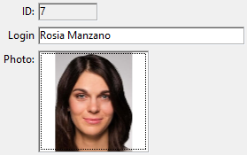

As entradas permitem que você adicione expressões digitáveis ou não digitáveis, como [campos](Concepts/identifiers.md#fields) e [variáveis](Concepts/variables.md) do banco de dados aos seus formulários. As entradas podem manipular dados baseados em caracteres (texto, datas, números...) ou imagens:



As entradas podem conter [expressões atribuíveis ou não atribuíveis](Concepts/quick-tour.md#assignable-vs-non-assignable-expressions).

Além disso, as entradas podem ser [inserível ou não inserível](properties_Entry.md#enterable). Uma entrada digitável aceita dados. Pode definir controles de entrada de dados para o objecto. Uma entrada não centralizável só pode exibir valores mas não pode ser editada pelo utilizador.

Você pode gerenciar os dados com os [métodos](Concepts/methods.md) objeto ou formulário.

### JSON Exemplo

```4d
	"myText": {
		"type": "input", //defina o tipo de objeto
		"spellcheck": true, //ative a verificação ortográfica
		"left": 60, //posição esquerda no formulário  
		"top": 160, //posição superior no formulário 
		"width": 100, //largura do objeto
		"height": 20 //altura do objeto
}
```

## Propriedades compatíveis

<details><summary>História</summary>

| Release | Mudanças                             |
| ------- | ------------------------------------ |
| 18 R6   | Suporte da propriedade Raio de canto |

</details>

[Allow font/color picker](properties_Text.md#allow-font-color-picker) - [Alpha Format](properties_Display.md#alpha-format) - [Auto Spellcheck](properties_Entry.md#auto-spellcheck) - [Background Color](properties_BackgroundAndBorder.md#background-color--fill-color) - [Bold](properties_Text.md#bold) - [Boolean format](properties_Display.md#text-when-falsetext-when-true) - [Border Line Style](properties_BackgroundAndBorder.md#border-line-style) - [Bottom](properties_CoordinatesAndSizing.md#bottom) - [Choice List](properties_DataSource.md#choice-list) - [Class](properties_Object.md#css-class) - [Context Menu](properties_Entry.md#context-menu) - [Corner radius](properties_CoordinatesAndSizing.md#corner-radius) - [Date Format](properties_Display.md#date-format) - [Default value](properties_RangeOfValues.md#default-value) - [Draggable](properties_Action.md#draggable) - [Droppable](properties_Action.md#droppable) - [Enterable](properties_Entry.md#enterable) - [Entry Filter](properties_Entry.md#entry-filter) - [Excluded List](properties_RangeOfValues.md#excluded-list) - [Expression type](properties_Object.md#expression-type) - [Fill Color](properties_BackgroundAndBorder.md#background-color--fill-color) - [Font](properties_Text.md#font) - [Font Color](properties_Text.md#font-color) - [Font Size](properties_Text.md#font-size) - [Height](properties_CoordinatesAndSizing.md#height) - [Hide focus rectangle](properties_Appearance.md#hide-focus-rectangle) - [Horizontal Alignment](properties_Text.md#horizontal-alignment) - [Horizontal Scroll Bar](properties_Appearance.md#horizontal-scroll-bar) - [Horizontal Sizing](properties_ResizingOptions.md#horizontal-sizing) - [Italic](properties_Text.md#italic) - [Left](properties_CoordinatesAndSizing.md#left) - [Multiline](properties_Entry.md#multiline) - [Multi-style](properties_Text.md#multi-style) - [Number Format](properties_Display.md#number-format) - [Object Name](properties_Object.md#object-name) - [Orientation](properties_Text.md#orientation) - [Picture Format](properties_Display.md#picture-format) - [Placeholder](properties_Entry.md#placeholder) - [Print Frame](properties_Print.md#print-frame) - [Required List](properties_RangeOfValues.md#required-list) - [Right](properties_CoordinatesAndSizing.md#right) - [Selection always visible](properties_Entry.md#selection-always-visible) - [Store with default style tags](properties_Text.md#store-with-default-style-tags) - [Text when False/Text when True](properties_Display.md#text-when-falsetext-when-true) - [Time Format](properties_Display.md#time-format) - [Top](properties_CoordinatesAndSizing.md#top) - [Type](properties_Object.md#type) - [Underline](properties_Text.md#underline) - [Variable or Expression](properties_Object.md#variable-or-expression) - [Vertical Scroll Bar](properties_Appearance.md#vertical-scroll-bar) - [Vertical Sizing](properties_ResizingOptions.md#vertical-sizing) - [Visibility](properties_Display.md#visibility) - [Width](properties_CoordinatesAndSizing.md#width) - [Wordwrap](properties_Display.md#wordwrap)

---

## Alternativas

Também pode representar expressões de campo e variáveis nos seus formulários utilizando objectos alternativos, mais particularmente:

- Puede mostrar e introducir datos de los campos de la base directamente en las columnas [de tipo List box](listbox_overview.md).
- Puede representar un campo de lista o una variable directamente en un formulario utilizando los objetos [Menús desplegables/Listas desplegables](dropdownList_Overview.md) y [Combo Box](comboBox_overview.md).
- Puede representar una expresión booleana como una [casilla de selección](checkbox_overview.md) o como un objeto [botón radio](radio_overview.md).
