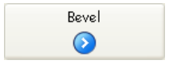

## Rota de acesso ao Fundo

Define o caminho da imagem que será desenhada no fundo do objeto. Si el objeto utiliza un [icono](#picture-pathname) con [diferentes estados](#number-of-states), la imagen de fondo soportará automáticamente el mismo número de estados.

El nombre de la ruta a introducir es similar al de [ la propiedad Ruta de acceso para las imágenes estáticas](properties_Picture.md#pathname).

#### Gramática JSON

| Nome                    | Tipo de dados | Valores possíveis                                                                                                                                     |
| ----------------------- | ------------- | ----------------------------------------------------------------------------------------------------------------------------------------------------- |
| customBackgroundPicture | string        | Caminho relativo na sintaxe POSIX. Deve ser utilizado em conjunto com a opção "Personalizado" da propriedade "Style". |

#### Objectos suportados

[Botón personalizado](button_overview.md#custom) - [Casilla de selección personalizada](checkbox_overview.md#custom) - [Botón radio personalizado](radio_overview.md#custom)

---

## Estilo de botão

Aspeto geral do botão. O estilo do botão também desempenha um papel na disponibilidade de determinadas opções.

#### Gramática JSON

|  Nome | Tipo de dados | Valores possíveis                                                                                                                                                  |
| :---: | :-----------: | ------------------------------------------------------------------------------------------------------------------------------------------------------------------ |
| style |      text     | "regular", "flat", "toolbar", "bevel", "roundedBevel", "gradientBevel", "texturedBevel", "office", "help", "circular", "disclosure", "roundedDisclosure", "custom" |

#### Objectos suportados

[Botón](button_overview.md) - [Botón radio](radio_overview.md) - [Casilla de selección](checkbox_overview.md) - [Botón Radio](radio_overview.md)

---

## Margem horizontal

Esta propriedade permite definir o tamanho (em píxeis) das margens horizontais do botão. Esta margem delimita a área que o ícone e o título do botão não devem ultrapassar.

Este parâmetro é útil, por exemplo, quando a imagem de fundo contém contornos:

| Com / Sem               | Exemplo                                                      |
| ----------------------- | ------------------------------------------------------------ |
| Sem margem              |  |
| Com margem de 13 píxeis |  |

> Esta propiedad funciona junto con la propiedad [Margen vertical](#vertical-margin).

#### Gramática JSON

| Nome          | Tipo de dados | Valores possíveis                                                                     |
| ------------- | ------------- | ------------------------------------------------------------------------------------- |
| customBorderX | number        | Para utilizar com o estilo "personalizado". Mínimo: 0 |

#### Objectos suportados

[Botón personalizado](button_overview.md#custom) - [Casilla de selección personalizada](checkbox_overview.md#custom) - [Botón radio personalizado](radio_overview.md#custom)

---

## Localização do ícone

Designa a colocação de um ícone em relação ao objeto formulário.

#### Gramática JSON

| Nome          | Tipo de dados | Valores possíveis       |
| ------------- | ------------- | ----------------------- |
| iconPlacement | string        | "none", "left", "right" |

#### Objectos suportados

[Cabeçalho do list box](listbox_overview.md#list-box-headers)

---

## Offset do ícone

Define um valor de desvio personalizado em pixeis, que será utilizado quando se clica no botão

O título do botão será deslocado para a direita e para baixo em função do número de pixeis introduzidos. Isto permite aplicar um efeito 3D personalizado quando o botão é clicado.

#### Gramática JSON

| Nome         | Tipo de dados | Valores possíveis         |
| ------------ | ------------- | ------------------------- |
| customOffset | number        | mínimo: 0 |

#### Objectos suportados

[Botón personalizado](button_overview.md#custom) - [Casilla de selección personalizada](checkbox_overview.md#custom) - [Botón radio personalizado](radio_overview.md#custom)

---

## Número de estados

Esta propiedad define el número exacto de estados presentes en la imagen utilizada como icono para un [botón con icono](button_overview.md), una [casilla de selección](checkbox_overview.md) o un [botón radio](radio_overview.md) personalizado.

A imagem pode conter de 2 a 6 estados.

- 2 estados: false, true
- 3 estados: false, true, rollover,
- 4 estados: false, true, rollover, desativado,
- 5 estados (apenas para caixas de verificação e botões rádio): false, true, false rollover, true rollover, desativado
- 6 estados (apenas para caixas de verificação e botões rádio): false, true, false rollover, true rollover, false desativado, true disable.

:::note

- "false" significa que o botão não foi clicado/não foi selecionado ou que a caixa de seleção não foi marcada (valor da variável=0)
- "true" significa botão clicado/selecionado ou caixa de seleção verificada (variável valor=1)

:::

Cada estado é representado por uma imagem diferente. Na imagem de origem, os estados devem ser empilhados verticalmente:

#### Gramática JSON

| Nome       | Tipo de dados | Valores possíveis                                                               |
| ---------- | ------------- | ------------------------------------------------------------------------------- |
| iconFrames | number        | Número de estados na imagem do ícone. Mínimo: 1 |

#### Objectos suportados

[Botón](button_overview.md) (todos los estilos excepto [Ayuda](button_overview.md#help)) - [Casilla de selección](checkbox_overview.md) - [Botón radio](radio_overview.md)

---

## Caminho da imagem

Define o caminho da imagem que será utilizada como ícone para o objeto.

El nombre de la ruta a introducir es similar al de [ la propiedad Ruta de acceso para las imágenes estáticas](properties_Picture.md#pathname).

> Cuando se utiliza como icono de objetos activos, la imagen debe estar diseñada para soportar un [número de estados](#number-of-states) variable.

#### Gramática JSON

| Nome | Tipo de dados | Valores possíveis                                                |
| ---- | ------------- | ---------------------------------------------------------------- |
| icon | picture       | Caminho relativo ou filesystem na sintaxe POSIX. |

#### Objectos suportados

[Botón](button_overview.md) (todos los estilos excepto [Ayuda](button_overview.md#help)) - [Casilla de selección](checkbox_overview.md) - [Encabezado List Box](listbox_overview.md#list-box-headers) - [Botón radio](radio_overview.md)

---

## Posição título/Imagem

Esta propriedade permite modificar a localização relativa do título do botão em relação ao ícone associado. Esta propriedade não tem efeito quando o botão contém apenas um título (sem imagem associada) ou uma imagem (sem título). Por predefinição, quando um botão contém um título e uma imagem, o texto é colocado por baixo da imagem.

Aqui estão os resultados utilizando as várias opções para esta propriedade:

| Opção        | Descrição                                                                                                                                                             | Exemplo                                                           |
| ------------ | --------------------------------------------------------------------------------------------------------------------------------------------------------------------- | ----------------------------------------------------------------- |
| \*\*Esquerda | O texto é colocado à esquerda do ícone. O conteúdo do botão é alinhado à direita.                                                     |   |
| **Superior** | O texto é colocado por cima do ícone. O conteúdo do botão é centrado.                                                                 |       |
| **Direita**  | O texto é colocado à direita do ícone. O conteúdo do botão é alinhado à esquerda.                                                     |     |
| **Fundo**    | O texto é colocado por baixo do ícone. O conteúdo do botão é centrado.                                                                |    |
| **Centrado** | O texto do ícone é centrado vertical e horizontalmente no botão. Este parâmetro é útil, por exemplo, para o texto incluído num ícone. |  |

#### Gramática JSON

| Nome          | Tipo de dados | Valores possíveis                          |
| ------------- | ------------- | ------------------------------------------ |
| textPlacement | string        | "left", "top", "right", "bottom", "center" |

#### Objectos suportados

[Botón](button_overview.md) (todos los estilos excepto [Ayuda](button_overview.md#help)) - [Casilla de selección](checkbox_overview.md) - [Botón radio](radio_overview.md)

---

## Image hugs title

Esta propiedad permite definir si el título y la imagen del botón deben estar visualmente contiguos o separados, según las propiedades [Posición del título/imagen](#titlepicture-position) y [Alineación horizontal](#horizontal-alignment).

Esta propriedade não tem efeito quando o botão contém apenas um título (sem imagem associada) ou uma imagem (sem título).

Por padrão, quando um botão contém um título e uma imagem, os elementos são unidos. El siguiente gráfico muestra el efecto de la propiedad `imageHugsTitle` (true cuando la propiedad está activada) con diferentes alineaciones de los botones:

#### Gramática JSON

| Nome           | Tipo de dados | Valores possíveis                       |
| -------------- | ------------- | --------------------------------------- |
| imageHugsTitle | boolean       | true (padrão), false |

#### Objectos suportados

[Button](button_overview.md) (all styles except Help) - [Check Box](checkbox_overview.md) (all styles except Regular, Flat, Disclosure and Collapse/Expand) - [Radio Button](radio_overview.md) (all styles except Regular, Flat, Disclosure and Collapse/Expand).

---

## Margem vertical

This property allows setting the size (in pixels) of the vertical margins of the button. Esta margem delimita a área que o ícone e o título do botão não devem ultrapassar.

Este parâmetro é útil, por exemplo, quando a imagem de fundo contém contornos.

> Esta propiedad funciona junto con la propiedad [Margen horizontal](#horizontal-margin).

#### Gramática JSON

| Nome          | Tipo de dados | Valores possíveis                                                                     |
| ------------- | ------------- | ------------------------------------------------------------------------------------- |
| customBorderY | number        | Para utilizar com o estilo "personalizado". Mínimo: 0 |

#### Objectos suportados

[Botón personalizado](button_overview.md#custom) - [Casilla de selección personalizada](checkbox_overview.md#custom) - [Botón radio personalizado](radio_overview.md#custom)

---

## Com menu pop-up

This property allows displaying a symbol that appears as a triangle in the button to indicate the presence of an attached pop-up menu:

The appearance and location of this symbol depends on the button style and the current platform.

### Ligados e Separados

To attach a pop-up menu symbol to a button, there are two display options available:

|                          Linked                         |                          Separado                          |
| :-----------------------------------------------------: | :--------------------------------------------------------: |
|  |  |

> The actual availability of a "separated" mode depends on the style of the button and the platform.

Each option specifies the relation between the button and the attached pop-up menu:

- Quando o menu pop-up é **separado**, clicar na parte esquerda do botão executa diretamente a ação atual do botão; essa ação pode ser modificada usando o menu pop-up acessível na parte direita do botão.
- Quando o menu pop-up está **vinculado**, um simples clique no botão exibe apenas o menu pop-up. Only the selection of the action in the pop-up menu causes its execution.

:::info

Refer to the [`On Alternative Click` event description](../Events/onAlternativeClick.md) for more information on the handling of events in this case.

:::

### Gerir o menu pop-up

It is important to note that the "With Pop-up Menu" property only manages the graphic aspect of the button. The display of the pop-up menu and its values must be handled entirely by the developer, more particularly using `form events` and the [`Dynamic pop up menu`](https://doc.4d.com/4dv19R7/help/command/en/page1006.html) and [`Pop up menu`](https://doc.4d.com/4dv19R7/help/command/en/page542.html) commands.

#### Gramática JSON

| Nome           | Tipo de dados | Valores possíveis                                    |
| :------------- | ------------- | ---------------------------------------------------- |
| popupPlacement | string        | <li>"none"</li><li>"linked"</li><li>"separated"</li> |

#### Objectos suportados

[Toolbar Button](button_overview.md#toolbar) - [Bevel Button](button_overview.md#bevel) - [Rounded Bevel Button](button_overview.md#rounded-bevel) - [OS X Gradient Button](button_overview.md#os-x-gradient) - [OS X Textured Button](button_overview.md#os-x-textured) - [Office XP Button](button_overview.md#office-xp) - [Circle Button](button_overview.md#circle) - [Custom](button_overview.md#custom)
