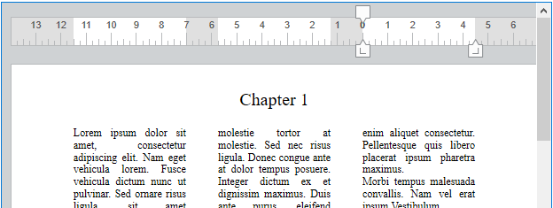

4D Write Pro oferece aos usuários de 4D uma ferramenta avançada de processamento de textos, totalmente integrada ao seu banco de dados 4D. Using 4D Write Pro, you can write pre-formatted emails and/or letters containing images, a scanned signature, formatted text and placeholders for dynamic variables. You can also create invoices or reports dynamically, including formatted text and images.

## Usando as áreas 4D Write Pro

Las áreas 4D Write Pro están documentadas en el manual [4D Write Pro](https://doc.4d.com/4Dv17R6/4D/17-R6/4D-Write-Pro.100-4433851.fe.html).

## Propriedades compatíveis

[Auto Spellcheck](properties_Entry.md#auto-spellcheck) - [Border Line Style](properties_BackgroundAndBorder.md#border-line-style) - [Bottom](properties_CoordinatesAndSizing.md#bottom) - [Class](properties_Object.md#css-class) - [Context Menu](properties_Entry.md#context-menu) - [Draggable](properties_Action.md#draggable) - [Droppable](properties_Action.md#droppable) - [Enterable](properties_Entry.md#enterable) - [Focusable](properties_Entry.md#focusable) - [Height](properties_CoordinatesAndSizing.md#height) - [Hide focus rectangle](properties_Appearance.md#hide-focus-rectangle) - [Horizontal Scroll Bar](properties_Appearance.md#horizontal-scroll-bar) - [Horizontal Sizing](properties_ResizingOptions.md#horizontal-sizing) - [Keyboard Layout](properties_Entry.md#keyboard-layout) - [Left](properties_CoordinatesAndSizing.md#left) - [Method](properties_Action.md#method) - [Object Name](properties_Object.md#object-name) - [Print Variable Frame](properties_Print.md#print-frame) - [Resolution](properties_Appearance.md#resolution) - [Right](properties_CoordinatesAndSizing.md#right) - [Selection always visible](properties_Entry.md#selection-always-visible) - [Show background](properties_Appearance.md#show-background) - [Show footers](properties_Appearance.md#show-footers) - [Show headers](properties_Appearance.md#show-headers) - [Show hidden characters](properties_Appearance.md#show-hidden-characters) - [Show horizontal ruler](properties_Appearance.md#show-horizontal-ruler) - [Show HTML WYSIWYG](properties_Appearance.md#show-html-wysiwyg) - [Show page frame](properties_Appearance.md#show-page-frame) - [Show references](properties_Appearance.md#show-references) - [Show vertical ruler](properties_Appearance.md#show-vertical-ruler) - [Type](properties_Object.md#type) - [Vertical Sizing](properties_ResizingOptions.md#vertical-sizing) - [Vertical Scroll Bar](properties_Appearance.md#vertical-scroll-bar) - [View mode](properties_Appearance.md#view-mode) -  [Visibility](properties_Display.md#visibility) - [Width](properties_CoordinatesAndSizing.md#width) - [Zoom](properties_Appearance.md#zoom)
