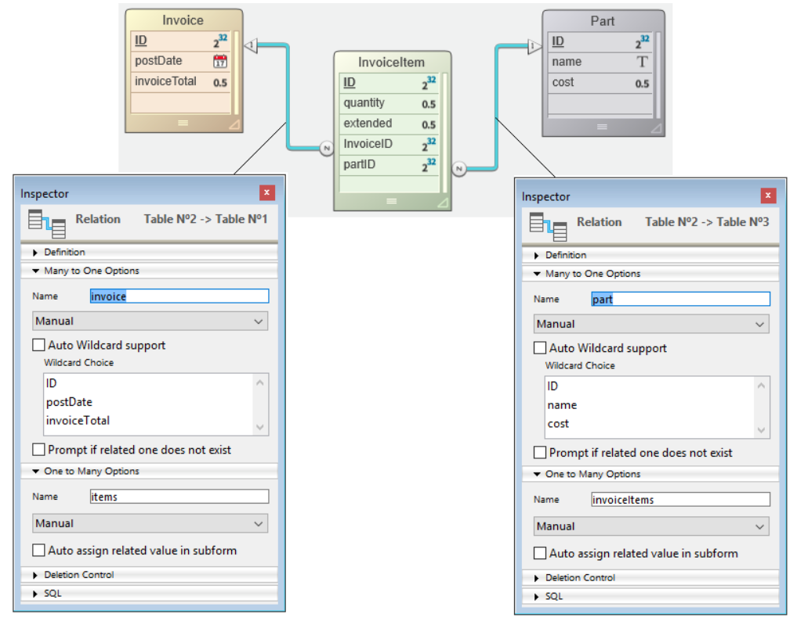
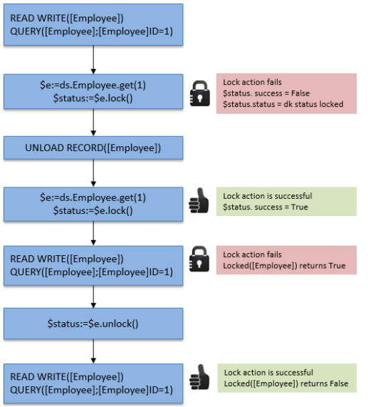

In ORDA, you access data through [entities](dsMapping.md#entity) and [entity selections](dsMapping.md#entity-selection). Estes objectos permitem-lhe criar, atualizar, consultar ou ordenar os dados do datastore.

## Criar uma entidade

Existem duas maneiras de criar uma nova entidade numa dataclass:

- Since entities are references to database records, you can create entities by creating records using the 4D language and then reference them with ORDA functions such as [`entity.next()`](../API/EntityClass.md#next) or [`entitySelection.first()`](../API/EntitySelectionClass.md#first).
- Você também pode criar uma entidade usando a função [`dataClass.new()`](../API/DataClassClass.md#new).

Tenha em atenção que a entidade só é criada na memória. Se quiser adicioná-lo ao datastore, você deve chamar a função [`entity.save()`](../API/EntityClass.md#save).

Os atributos da entidade estão diretamente disponíveis como propriedades do objeto entidade. Para más información, consulte [Uso de los atributos de entidad](#using-entity-attributes).

Por exemplo, se quisermos criar uma nova entidade na classe de dados "Employee" no repositório de dados atual com "John" e "Dupont" atribuídos aos atributos firstname e name:

```4d
var $myEntity : cs. EmployeeEntity
$myEntity:=ds. Employee.new() //Create a new object of the entity type
$myEntity.name:="Dupont" //assign 'Dupont' to the 'name' attribute
$myEntity.firstname:="John" //assign 'John' to the 'firstname' attribute
$myEntity.save() //save the entity
```

> Uma entidade é definida apenas no processo em que foi criada. Não é possível, por exemplo, armazenar uma referência a uma entidade em uma variável interprocessos e usá-la em outro processo.

## Entidades e referências

Uma entidade contém uma referência a um registo 4D. Entidades diferentes podem fazer referência ao mesmo registo 4D. Além disso, como uma entidade pode ser armazenada em uma variável de objeto 4D, diferentes variáveis podem conter uma referência à mesma entidade.

Se executar o seguinte código:

```4d
 var $e1; $e2 : cs.EmployeeEntity
 $e1:=ds.Employee.get(1) //access the employee with ID 1
 $e2:=$e1
 $e1.name:="Hammer"
  //both variables $e1 and $e2 share the reference to the same entity
  //$e2.name contains "Hammer"
 If($e1=$e2) //True
```

Este facto é ilustrado pelo gráfico seguinte:


Agora, se executar:

```4d
 var $e1; $e2 : cs.EmployeeEntity
 $e1:=ds.Employee.get(1)
 $e2:=ds.Employee.get(1)
 $e1.name:="Hammer"
  //variable $e1 contains a reference to an entity
  //variable $e2 contains another reference to another entity
  //$e2.name contains "smith"
 If($e1=$e2) //False
```

Este facto é ilustrado pelo gráfico seguinte:


Note-se, no entanto, que as entidades se referem ao mesmo registo. En todos los casos, si se llama al método `entity.save( )`, el registro se actualizará (excepto en caso de conflicto, ver [Entity locking](#entity-locking)).

De hecho, `$e1` y `$e2` no son la entidad misma, sino referencias a la entidad. Isso significa que você pode passá-los diretamente para qualquer função ou método, e ele funcionará como um ponteiro, e mais rápido do que um ponteiro 4D. Por exemplo:

```4d
 For each($entity;$selection)
    do_Capitalize($entity)
 End for each
```

E o método é:

```4d
 $entity:=$1
 $name:=$entity.lastname
 If(Not($name=Null))
    $name:=Uppercase(Substring($name;1;1))+Lowercase(Substring($name;2))
 End if
 $entity.lastname:=$name
```

Puede manejar las entidades como cualquier otro objeto en 4D y pasar sus referencias directamente como [parámetros](Concepts/parameters.md).

:::info

Com as entidades, não há o conceito de "registro atual" como na linguagem 4D. Pode utilizar tantas entidades quantas as necessárias, em simultâneo. Não há também bloqueio automático em uma entidade (veja [bloqueio de Entity](#entity-locking)). When an entity is loaded, it uses the [lazy loading](glossary.md#lazy-loading) mechanism, which means that only the needed information is loaded. No entanto, no cliente/servidor, a entidade pode ser carregada automaticamente de forma direta, se necessário.

:::

## Utilização de atributos de entidades

Os atributos de entidade armazenam dados e mapeiam os campos correspondentes na tabela correspondente.

- attributes of the **storage** kind can be set or get as simple properties of the entity object,
- attributes of the **relatedEntity** kind will return an entity,
- attributes of the **relatedEntities** kind will return an entity selection,
- attributes of the **computed** and **alias** kind can return any type of data, depending on how they are configured.

:::info

For more information on the attribute kind, please refer to the [Storage and Relation attributes](dsMapping.md#storage-and-relation-attributes) paragraph.

:::

Por exemplo, para obter e definir um valor de atributo de armazenamento do tipo string:

```4d
 $entity:=ds.Employee.get(1) //obter atributo de funcionário com ID 1
 $name:=$entity.lastname //obter o nome do funcionário, por exemplo, "Smith"
 $entity.lastname:="Jones" //definir o nome do funcionário
 $entity.save() //salvar as modificações
```

> Database Blob fields ([scalar blobs](Concepts/dt_blob.md) are automatically converted to and from blob object attributes ([`4D.Blob`](Concepts/dt_blob.md)) when handled through ORDA. Ao salvar um atributo blob objeto, tenha em mente isso, Ao contrário do tamanho do objeto blob limitado apenas pela memória disponível, o tamanho do campo Blob é limitado a 2GB.

O acesso a um atributo relacionado depende do tipo de atributo. Por exemplo, com a seguinte estrutura:


É possível aceder aos dados através do(s) objeto(s) relacionado(s):

```4d
 $entity:=ds. Project.all().first().theClient //get the Company entity associated to the project
 $EntitySel:=ds. Company.all().first().companyProjects //get the selection of projects for the company
```

Observe que tanto *theClient* como *companyProjects* en el ejemplo anterior son atributos de relación primaria y representan una relación directa entre las dos dataclasses. No entanto, os atributos de relação também podem ser criados com base em caminhos através de relações em vários níveis, incluindo referências circulares. Por exemplo, considere a seguinte estrutura:


Cada trabalhador pode ser um gestor e pode ter um gestor. Para obter o gerente do gerente de um funcionário, você pode simplesmente escrever:

```4d
 $myEmp:=ds. Employee.get(50)
 $manLev2:=$myEmp.manager.manager.lastname
```

### Atribuição de arquivos a atributos imagem ou blob

Você pode armazenar imagens em atributos de imagem; da mesma forma, você pode armazenar qualquer dado binário em atributos de blob.

ORDA permite asignar al atributo los datos en sí, es decir, una imagen o un objeto blob, o una **referencia a un archivo** que contenga los datos. Somente o caminho do arquivo é salvo na entidade.

Graças a esse recurso, você pode reutilizar a mesma imagem em várias entidades sem duplicá-la, organizar os arquivos da maneira que desejar ou usá-los fora do 4D. Além disso, você pode controlar o tamanho do arquivo de dados.

A referência do arquivo pode ser:

- um objeto 4D.File
- um caminho no formato POSIX

Exemplo:

```4d
Function createCompany($name : Text; $logo : 4D.File)

	var $company : cs.CompanyEntity
	$company:=ds.Company.new()

	$company.name:=$name
		//assignment using a file object
	$company.logo:=$logo
		//assignment using a path
	$company.datablob:="/RESOURCES/"+$name+"/data.bin"
	$company.save()
```

Independentemente de como o atributo é atribuído (dados em si ou referência a um arquivo), o acesso de leitura ao atributo é transparente do ponto de vista do usuário.

O arquivo não precisa existir no disco no momento da atribuição (nenhum erro é retornado nesse caso). Se o arquivo referenciado não for encontrado quando o atributo for lido, será retornado um valor nulo.

:::tip

4D carrega imagens e dados em um cache local. Se o arquivo referenciado for modificado após ter sido carregado, você deverá reatribuir o arquivo para que a modificação seja levada em conta no aplicativo.

:::

:::note

A atribuição de referência de arquivo só é suportada no modo local (4D Server ou 4D single-user). Será gerado um erro se a atribuição for feita remotamente ou por meio de uma solicitação REST.

:::

### Atribuição de valores a atributos de relação

Na arquitetura ORDA, os atributos de relação contêm diretamente dados relacionados a entidades:

- Un atributo de relación de tipo N->1 (**relatedEntity** kind) contiene una entidad
- Un atributo de relación de tipo 1->N (**relatedEntities** kind) contiene una selección de entidades

Vejamos a seguinte estrutura (simplificada):


Neste exemplo, uma entidade na classe de dados "Employee" contém um objeto do tipo Entity no atributo "employer" (ou um valor nulo). Uma entidade na classe de dados "Company" contém um objeto do tipo EntitySelection no atributo "staff" (ou um valor nulo).

> Na ORDA, a propriedade Automática ou Manual das relações não tem efeito.

Para atribuir um valor diretamente ao atributo "employer", você deve passar uma entidade existente da classe de dados "Company". Por exemplo:

```4d
 $emp:=ds.Employee.new() // crie um funcionário
 $emp.lastname:="Smith" // atribua um valor a um atributo
 $emp. mployer:=ds.Company.query("nome =:1";"4D")[0]  //atribuir uma entidade da empresa
 $emp.save()
```

Você também pode obter diretamente a entidade relacionada através de sua chave primária (Número ou texto). Por exemplo:

```4d
 $emp:=ds.Employee.new()
 $emp.lastname:="Wesson"
 $emp.employer:=ds.Company.get(2)
  //obtém a entidade Company com o valor de chave primária 2
  //atribui ao funcionário
 $emp.save()
```

Isso é particularmente útil quando você está importando grandes quantidades de dados de um banco de dados relacional. Este tipo de importação geralmente contém uma coluna "ID", que faz referência a uma chave primária que você pode atribuir diretamente a um atributo de relação.

Você pode atribuir ou modificar o valor de um "1" atributo da entidade relacionada a partir do dataclass "N" diretamente através do atributo relacionado. Por exemplo, se você deseja modificar o atributo de nome de uma entidade relacionada da Empresa de uma entidade funcional, você pode escrever:

```code4d
 $emp:=ds.Employee.get(2) // load the Employee entity with primary key 2
 $emp.employer.name:="4D, Inc." //modify the name attribute of the related Company
 $emp.employer.save() //save the related attribute
  //the related entity is updated
```

## Criar uma selecção de entidade

Puede crear un objeto de tipo [entity selection](dsMapping.md#entity-selection) de la siguiente manera:

- Lance una búsqueda en las entidades [en una dataclass](API/DataClassClass.md#query) o en una [selección de entidades existente](API/EntitySelectionClass.md#query);
- Usando a função dataclass [`.all()`](API/DataClassClassClass.md#all), para selecionar todas as entidades em um dataclass;
- Using the [`Create entity selection`](../commands/create-entity-selection.md) command or the [`.newSelection()`](API/DataClassClass.md#newselection) dataclass function to create a blank entity selection;
- Usando a [`.copy()`](API/EntitySelectionClass.md#copy) função para duplicar uma seleção de entidade existente;
- Using one of the various functions from the [Entity selection class](API/EntitySelectionClass.md) that returns a new entity selection, such as [`.or()`](API/EntitySelectionClass.md#or);
- Utilizando um atributo de relação do tipo "entidades relacionadas" (ver abaixo).

:::note

Puede filtrar qué entidades deben incluirse en las selecciones de entidades para una clase de datos en función de toda regla de negocio, gracias a la funcionalidad [selección de entidad restringida](#restricting-entity-selections).

:::

Você pode criar e usar simultaneamente tantas seleções de entidades diferentes quanto desejar para uma classe de dados. Lembre-se de que uma seleção de entidade contém apenas referências a entidades. Seleções diferentes de entidades podem conter referências para as mesmas entidades.

:::note

When entities are deleted, their references remain in the entity selection with an *undefined* value. In this case, you can call the [`.clean()`](API/EntitySelectionClass.md#clean) function to get a new entity selection but without the deleted entity references.

:::

### Entity selections partilháveis ou alteráveis

An entity selection can be **shareable** (readable by multiple processes, but not alterable after creation) or **alterable** (supports the [`.add()`](API/EntitySelectionClass.md#add) function, but only usable by the current process).

#### Propriedades

Una entity selection **compartible** tiene las siguientes características:

- ele pode ser armazenado em um objeto compartilhado ou em uma coleção compartilhada e pode ser passado como parâmetro entre vários processos ou trabalhadores;
- it can be stored in several shared objects or collections, or in a shared object or collection which already belongs to a group;
- não permite a adição de novas entidades. A tentativa de adicionar uma entidade a uma seleção de entidade compartilhável acionará um erro (1637 - Esta seleção de entidade não pode ser alterada). To add an entity to a shareable entity selection, you must first transform it into a non-shareable entity selection using the [`.copy()`](API/EntitySelectionClass.md#copy) function, before calling [`.add()`](API/EntitySelectionClass.md#add).

> A maioria das funções de seleção de entidades (como [`.slice()`](API/EntitySelectionClass.md#slice), [`.and()`](API/EntitySelectionClass.md#and)...) support shareable entity selections since they do not need to alter the original entity selection (they return a new one).

Una entity selection **modificable** tiene las siguientes características:

- não pode ser compartilhado entre processos, nem armazenado em um objeto ou coleção compartilhada. A tentativa de armazenar uma seleção de entidade não compartilhável em um objeto ou coleção compartilhada acionará um erro (-10721 - Tipo de valor não suportado em um objeto compartilhado ou coleção compartilhada);
- ele aceita a adição de novas entidades, ou seja, suporta a função [`.add()`](API/EntitySelectionClass.md#add).

#### Como é que são definidos?

La naturaleza **compartible** o **modificable** de una entity selection se define cuando se crea (no puede modificarse posteriormente). Puede conocer la naturaleza de una entity selection utilizando la función [.isAlterable()](API/EntitySelectionClass.md#isalterable) o el comando `OB Is shared`.

Una nueva entity selection es **compartible** en los siguientes casos:

- la nueva entity selection resulta de una función de clase ORDA aplicada a una dataClass: [dataClass.all()](API/DataClassClass.md#all), [dataClass.fromCollection()](API/DataClassClass.md#fromcollection), [dataClass.query()](API/DataClassClass.md#query),
- the new entity selection is based upon a relation [entity.*attributeName*](API/EntityClass.md#attributename) (e.g. "company.employees") when *attributeName* is a one-to-many related attribute but the entity does not belong to an entity selection.
- la nueva entity selection se copia explícitamente como compartible con [entitySelection.copy()](API/EntitySelectionClass.md#copy) o `OB Copy` (es decir, con la opción `ck shared`).

Exemplo:

```4d
var $myComp : cs.CompanyEntity
var $employees : cs.EmployeeSelection
$myComp:=ds.Company.get(2) //$myComp does not belong to an entity selection
$employees:=$myComp.employees //$employees is shareable
```

Una nueva entity selection es **compartible** en los siguientes casos:

- la nueva entity selection creada en un espacio vacío utilizando la función [dataClass.newSelection()](API/DataClassClass.md#newselection) o el comando `Create entity selection`,
- la nueva entity selection se copia explícitamente como modificable con [entitySelection.copy()](API/EntitySelectionClass.md#copy) o `OB Copy` (es decir, sin la opción `ck shared`).

Exemplo:

```4d
var $toModify : cs.CompanySelection
$toModify:=ds.Company.all().copy() //$toModify is alterable
```

Una nueva entity selection **hereda** de la naturaleza de la entity selection original en los siguientes casos:

- la nueva entity selection resulta de una de las varias funciones de clase ORDA aplicadas a una entity selection existente ([.query()](API/EntitySelectionClass.md#query), [.slice()](API/EntitySelectionClass.md#slice), etc.) .
- a nova entity selection é baseada numa relação:
  - [entity.*attributeName*](API/EntityClass.md#attributename) (e.g. "company.employees") when *attributeName* is a one-to-many related attribute and the entity belongs to an entity selection (same nature as [.getSelection()](API/EntityClass.md#getselection) entity selection),
  - [entitySelection.*attributeName*](API/EntitySelectionClass.md#attributename) (e.g. "employees.employer") when *attributeName* is a related attribute (same nature as the entity selection),
  - [.extract()](API/EntitySelectionClass.md#extract) cuando la colección resultante contiene selecciones de entidades (de la misma naturaleza que la entity selection).

Exemplos:

```4d
var $highSal; $lowSal : cs.EmployeeSelection
var $comp; $comp2 : cs.Company

$highSal:=ds.Employee.query("salary >= :1"; 1000000)   

	//$highSal is shareable because of the query on dataClass
$comp:=$highSal.employer //$comp is shareable because $highSal is shareable

$lowSal:=ds.Employee.query("salary <= :1"; 10000).copy()
	//$lowSal is alterable because of the copy()
$comp2:=$lowSal.employer //$comp2 is alterable because $lowSal is alterable
```

:::note Entity selections devolvidas pelo servidor

In client/server architecture, entity selections returned from the server are always shareable on the client, even if [`copy()`](API/EntitySelectionClass.md#copy) was called on the server. Para tornar essa seleção de entidade alterável no cliente, você precisa executar [`copy()`](API/EntitySelectionClass.md#copy) no lado do cliente. Exemplo:

```4d
	//a function is always executed on the server
exposed Function getSome() : cs.MembersSelection
    return This.query("ID >= :1"; 15).orderBy("ID ASC")

	//in a method, executes on the remote side
var $result : cs.MembersSelection
var $alterable : Boolean
$result:=ds.Members.getSome() //$result is shareable
$alterable:=$result.isAlterable() //False

$result:=ds.Members.getSome().copy() // $result is now alterable
$alterable:=$result.isAlterable() // True
```

:::

#### Partilhar uma seleção de entidade entre processos (exemplo)

You work with two entity selections that you want to pass to a worker process so that it can send mails to appropriate persons:

```4d

var $paid; $unpaid : cs.InvoicesSelection
//We get entity selections for paid and unpaid invoices
$paid:=ds.Invoices.query("status=:1"; "Paid")
$unpaid:=ds.Invoices.query("status=:1"; "Unpaid")

//We pass entity selection references as parameters to the worker
CALL WORKER("mailing"; "sendMails"; $paid; $unpaid)

```

El método `sendMails`:

```4d

 #DECLARE ($paid : cs.InvoicesSelection; $unpaid : cs.InvoicesSelection)
 var $invoice : cs.InvoicesEntity

 var $server; $transporter; $email; $status : Object

  //Prepare emails
 $server:=New object()
 $server.host:="exchange.company.com"
 $server.user:="myName@company.com"
 $server.password:="my!!password"
 $transporter:=SMTP New transporter($server)
 $email:=New object()
 $email.from:="myName@company.com"

  //Loops on entity selections
 For each($invoice;$paid)
    $email.to:=$invoice.customer.address // email address of the customer
    $email.subject:="Payment OK for invoice # "+String($invoice.number)

    $status:=$transporter.send($email)
 End for each

 For each($invoice;$unpaid)
    $email.to:=$invoice.customer.address // email address of the customer
    $email.subject:="Please pay invoice # "+String($invoice.number)
    $status:=$transporter.send($email)
 End for each
```

### Selecções de entidades e atributos de armazenamento

All storage attributes (text, number, boolean, date) are available as properties of entity selections as well as entities. When used in conjunction with an entity selection, a scalar attribute returns a collection of scalar values. Por exemplo:

```4d
var $locals : cs.PersonSelection
var $localEmails : Collection
$locals:=ds.Person.query("city = :1";"San Jose") //entity selection of people
$localEmails:=$locals.emailAddress //collection of email addresses (strings)
```

Este código devuelve en *$localEmails* una colección de direcciones de correo electrónico como cadenas.

### Selecções de entidades e atributos de relações

In addition to the variety of ways you can query, you can also use relation attributes as properties of entity selections to return new entity selections. Por exemplo, considere a seguinte estrutura:



```4d
var $myParts : cs.PartSelection
var $myInvoices : cs.InvoiceSelection
$myParts:=ds.Part.query("ID < 100") //Return parts with ID less than 100
$myInvoices:=$myParts.invoiceItems.invoice
  //All invoices with at least one line item related to a part in $myParts
```

La última línea devolverá en *$myInvoices* una selección de entidades de todas las facturas que tengan al menos una partida de factura relacionada con una parte en la selección de entidades myParts. Quando se utiliza um atributo de relação como propriedade de uma seleção de entidades, o resultado é sempre outra seleção de entidades, mesmo que só se devolva uma entidade. Quando se utiliza um atributo de relação como propriedade de uma seleção de entidades, o resultado é sempre outra seleção de entidades, mesmo que só se devolva uma entidade.

## Restrição de seleções de entidades

In ORDA, you can create filters to restrict access to entities of any of your dataclasses. Once implemented, a filter is automatically applied whenever the entities of the dataclass are accessed either by **ORDA class functions** such as [`all()`](../API/DataClassClass.md#all) or [`query()`](../API/EntitySelectionClass.md#query), or by the [**REST API**](../category/api-dataclass) (which involves the [Data Explorer](../Admin/dataExplorer.md) and [remote datastores](remoteDatastores.md)).

A filter creates a restricted view of the data, built upon any business rules such as current session user. For example, in an application used by salespersons to make deals with their customers, you can restrict the read customers to those managed by the authenticated salesperson.

:::info

Los filtros se aplican a las **entidades**. Si desea restringir el acceso a una **clase de datos** o a uno o varios de sus **atributos**, puede utilizar los [privilegios de sesión](privileges.md), que son más apropiados en este caso.

:::

### Como definir um filtro restrito

Você cria um filtro para uma classe de dados definindo uma função `event restrict` na [**classe dataclass**](dsMapping.md#dataclass-class) da dataclass. O filtro é então ativado automaticamente.

### `Function event restrict`

#### Sintaxe

```4d
Function event restrict() -> $result : cs.*DataClassName*Selection
// código
```

Esta função é chamada sempre que uma seleção de entidade ou uma entidade da classe de dados é solicitada. O filtro é executado uma vez, quando a entity selection é criada.

O filtro deve retornar uma seleção de entidade da dataclass. Puede ser una selección de entidades creada a partir de una consulta, almacenada en el [`Storage`], etc.

:::note

Por razones de rendimiento, recomendamos utilizar **atributos indexados** en la definición del filtro.

:::

A função deve retornar uma seleção de entidade válida da classe de dados. No filter is applied (all entities corresponding of the initial request are returned) if:

- la función devuelve **null**,
- la función devuelve **indefinido**,
- a função não retorna uma seleção de entidade válida.

#### Exemplo

When accessed from a web or REST request, we want the Customers dataclass to only expose customers belonging to the identified sales person. Durante la fase de autenticación, el vendedor se almacena en el objeto `Session`. Outros tipos de solicitações também são tratados.

```4d
Class extends DataClass


Function event restrict() : cs.CustomersSelection


    	//We work in a web or REST context
    If (Session#Null)

        Case of
                // Only return the customers of the authenticated sales person stored in the session
            : (Session.storage.salesInfo#Null)
                return This.query("sales.internalId = :1"; Session.storage.salesInfo.internalId)

                //Data explorer - No filter is applied
            : (Session.hasPrivilege("WebAdmin"))
                return Null
            Else
                //No customers can be read
                return This.newSelection()

        End case

    Else // We work in client server
        return This.query("sales.userName = :1"; Current user)
    End if
```

### Detalhes de ativação do filtro

Filters apply to all ORDA or REST requests executed in your 4D projects (standalone and client/server architectures). Un filtro se activa en cuanto se abre el proyecto, es decir, puede activarse en el método de base de datos `On Startup`.

:::info

Los filtros no se aplican a las selecciones heredadas de registros manejadas a través de la interfaz 4D o el lenguaje 4D (por ejemplo cuando se llama a `ALL RECORDS`).

:::

| Funções                                                                                                  | Comentário                                                                                                                                                                                                                                                                                                            |
| -------------------------------------------------------------------------------------------------------- | --------------------------------------------------------------------------------------------------------------------------------------------------------------------------------------------------------------------------------------------------------------------------------------------------------------------- |
| [dataclass.get()](../API/DataClassClass.md#get)                       | Si la entidad no coincide con el filtro, se devuelve `null`                                                                                                                                                                                                                                                           |
| [entity.reload()](../API/EntityClass.md#reload)                       | Somente em datastores cliente/servidor e remotos                                                                                                                                                                                                                                                                      |
| [dataclass.all()](../API/DataClassClass.md#all)                       |                                                                                                                                                                                                                                                                                                                       |
| [dataclass.fromCollection()](../API/DataClassClass.md#fromcollection) | <li>In case of update, only entities matching the filter can be updated. If the collection refers to entities not matching the filter, they are created as new entities (if no duplicate PK error)</li><li>In case of creation, entities not matching the filter are created but will not be read after creation</li> |
| [entitySelection.and()](../API/EntitySelectionClass.md#and)           | Somente as entidades que correspondem ao filtro são retornadas                                                                                                                                                                                                                                                        |
| [entitySelection.or()](../API/EntitySelectionClass.md#or)             | Somente as entidades que correspondem ao filtro são retornadas                                                                                                                                                                                                                                                        |
| [entitySelection.minus()](../API/EntitySelectionClass.md#minus)       | Somente as entidades que correspondem ao filtro são retornadas                                                                                                                                                                                                                                                        |
| [dataclass.query()](../API/DataClassClass.md#query)                   |                                                                                                                                                                                                                                                                                                                       |
| [entitySelection.query()](../API/EntitySelectionClass.md#query)       |                                                                                                                                                                                                                                                                                                                       |
| [entitySelection.attributeName](../API/EntitySelectionClass.md#attributename)            | Filtro aplicado si *attributeName* es una entidad relacionada o entidades relacionadas de una clase de datos filtrada (incluyendo alias o atributo calculado)                                                                                                                                      |
| [entity.attributeName](../API/EntityClass.md#attributename)                              | Filtro aplicado si *attributeName* corresponde a entidades relacionadas de una clase de datos filtrada (incluyendo alias o atributo calculado)                                                                                                                                                     |
| [Create entity selection](../commands/create-entity-selection.md)                                        |                                                                                                                                                                                                                                                                                                                       |

Other ORDA functions accessing data do not directly trigger the filter, but they nevertheless benefit from it. Por exemplo, a função [`entity.next()`](../API/EntityClass.md#next) retornará a próxima entidade na seleção de entidade já filtrada. Por outro lado, se a seleção de entidade não estiver filtrada, [`entity.next()`](../API/EntityClass.md#next) funcionará em entidades não filtradas.

:::note

If there is an error in the filter at runtime, it is thrown as if the error came from the ORDA function itself.

:::

## Bloqueio de entidades

You often need to manage possible conflicts that might arise when several users or processes load and attempt to modify the same entities at the same time. Record locking is a methodology used in relational databases to avoid inconsistent updates to data. The concept is to either lock a record upon read so that no other process can update it, or alternatively, to check when saving a record to verify that some other process hasn’t modified it since it was read. El primero se denomina **bloqueo de registro pesimista** y garantiza que un registro modificado pueda escribirse a expensas de bloquear los registros a otros usuarios. Este último se conoce como **bloqueo de registro optimista** y cambia la garantía de los privilegios de escritura en el registro por la flexibilidad de decidir privilegios de escritura sólo si el registro necesita ser actualizado. In pessimistic record locking, the record is locked even if there is no need to update it. In optimistic record locking, the validity of a record’s modification is decided at update time.

ORDA fornece-lhe dois modos de bloqueio de entidades:

- um modo automático "otimista", adequado à maioria das aplicações,
- um modo "pessimista" que permite bloquear as entidades antes do seu acesso.

### Bloqueio optimista automático

This automatic mechanism is based on the concept of "optimistic locking" which is particularly suited to the issues of web applications. Este conceito é caracterizado pelos seguintes princípios de funcionamento:

- Todas las entidades pueden cargarse siempre en lectura-escritura; no existe el "bloqueo" *a priori* de las entidades.
- Cada entidade tem um carimbo de bloqueio interno incrementado sempre que é guardado.
- Cuando un usuario o proceso intenta guardar una entidad utilizando el método `entity.save( )`, 4D compara el valor del marcador de la entidad a guardar con el de la entidad encontrada en los datos (en el caso de modificación):
  - Quando os valores correspondem, a entidade é salva e o valor do marcador interno é aumentado.

  - When the values do not match, it means that another user has modified this entity in the meantime. A gravação não é efetuada e é devolvido um erro.

O diagrama seguinte ilustra o bloqueio otimista:

1. Dois processos carregam a mesma entidade.<br/><br/>

2. O primeiro processo modifica a entidade e valida a alteração. Se llama al método `entity.save( )`. The 4D engine automatically compares the internal stamp value of the modified entity with that of the entity stored in the data. Since they match, the entity is saved and its stamp value is incremented.<br/><br/>

3. O segundo processo também modifica a entidade carregada e valida as suas alterações. Se llama al método `entity.save( )`. Since the stamp value of the modified entity does not match the one of the entity stored in the data, the save is not performed and an error is returned.<br/><br/>

Isto também pode ser ilustrado pelo seguinte código:

```4d
 $person1:=ds.Person.get(1) //Referência à entidade
 $person2:=ds.Person.get(1) //Outra referência à mesma entidade
 $person1.name:="Bill"
 $result:=$person1.save() //$result.success=true, alteração salva
 $person2.name:="William"
 $result:=$person2.save() //$result.success=false, alteração não salva
```

Neste exemplo, atribuímos a $person1 uma referência à entidade pessoa com uma chave de 1. De seguida, atribuímos outra referência da mesma entidade à variável $person2. Utilizando $person1, alteramos o primeiro nome da pessoa e guardamos a entidade. When we attempt to do the same thing with $person2, 4D checks to make sure the entity on disk is the same as when the reference in $person1 was first assigned. Since it isn't the same, it returns false in the success property and doesn’t save the second modification.

Cuando se produce esta situación, puede, por ejemplo, volver a cargar la entidad desde el disco utilizando el método `entity.reload()` para poder intentar realizar de nuevo la modificación. El método `entity.save()` también propone una opción "automerge" para guardar la entidad en caso de que los procesos modificaran atributos que no fueran los mismos.

> Los mardadores de registro no se utilizan en las de **transacciones** porque en este contexto sólo existe una única copia de un registro. Sea cual sea el número de entidades que hacen referencia a un registro, se modifica la misma copia, por lo que las operaciones `entity.save()` nunca generarán errores de marcador.

### Bloqueio pessimista

É possível bloquear e desbloquear entidades a pedido quando se acede aos dados. When an entity is getting locked by a process, it is loaded in read/write in this process but it is locked for all other processes. A entidade só pode ser carregada no modo somente leitura nesses processos; seus valores não podem ser editados ou salvos.

Esta funcionalidad se basa en dos funciones de la clase `Entity`:

- [`entity.lock()`](../API/EntityClass.md#lock)
- [`entity.unlock()`](../API/EntityClass.md#unlock)

Para mais informações, consulte as descrições destas funções.

> Los bloqueos pesimistas también pueden gestionarse a través de la [REST API](../REST/$lock.md).

### Utilização simultânea de bloqueios clássicos 4D e bloqueios pessimistas ORDA

Using both classic and ORDA commands to lock records is based upon the following principles:

- A lock set with a classic 4D command on a record prevents ORDA to lock the entity matching the record.
- A lock set with ORDA on an entity prevents classic 4D commands to lock the record matching the entity.

Estes princípios são apresentados no diagrama seguinte:



Los **bloqueos de transacciones** también se aplican tanto a los comandos clásicos como a los comandos ORDA. In a multiprocess or a multi-user application, a lock set within a transaction on a record by a classic command will result in preventing any other processes to lock entities related to this record (or conversely), until the transaction is validated or canceled.

- Example with a lock set by a classic command:<br/><br/>
- Example with a lock set by an ORDA function:<br/><br/>
