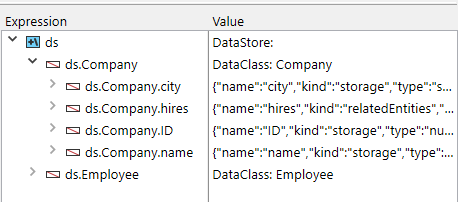

Uma vez que o ORDA é baseado em objectos, a sua utilização requer conhecimentos básicos de programação de objectos.

## Explorar o datastore

El datastore ORDA se basa automáticamente en una estructura de base de datos 4D, siempre que cumpla los [requisitos previos de ORDA](overview.md#orda-prerequisites).

Este exemplo utilizará a seguinte estrutura de banco de dados 4D simple:


To know what is exposed as the datastore, create a new project method, write the following line:

```code4d
TRACE
```

Executar o método: ele chama simplesmente a janela do depurador.
En el área de Expresión, haga doble clic para insertar una expresión e introduzca `ds`. Devolve o objeto do datastore.
Despliegue el objeto, puede ver que las tablas y los campos son expuestos automáticamente por ORDA como propiedades del objeto `ds`:



It means for example that, whenever you need to refer to the city field of the [Company] table, in ORDA you just need to write:

```code4d
ds. Company.city //returns the name of the city
```

> En el mundo ORDA, ds.Company es una **dataclass**. ds.Company.city es un **atributo**.

> ORDA e sensíveis às maiúsculas e minúsculas. `ds.company.city` no hará referencia al atributo ds.Company.city.

También habrá notado la propiedad extra `hires` en la dataclass ds.Company. Não corresponde a um campo. `hires` es en realidad el nombre de la relación _Uno a muchos_ entre Company y Employee:


_Name of the relation as defined in the Inspector_

It means that, whenever you need to access the list of employees working for a company, in ORDA you just need to write:

```code4d
ds. Company.hires //returns the list of employees
```

Mas não vá demasiado depressa. Vejamos agora como registar dados em dataclasses ORDA.

## Adicionar dados

En ORDA, puede añadir un registro a una dataclass utilizando el comando `new()`.

> En el mundo ORDA, un registro es una **entidad** -- una entidad es en sí misma un objeto. Un comando que se adjunta a un objeto específico se denomina **método miembro**.

```code4d
$entity:=ds. Company.new() //create a new entity reference
//in the Company dataclass  
//and assign it to the $entity variable
```

A new entity object contains a "copy" of all attributes of its parent dataclass, thus you can assign values to them:

```code4d
$entity.name:="ACME, inc."  
$entity.city:="London"  
//$entity.ID is automatically filled
```

Atualmente, a entidade só existe na memória. Para almacenarlo en el archivo de datos, es necesario guardarlo utilizando el método miembro `save()`:

```code4d
$status:=$entity.save()
```
