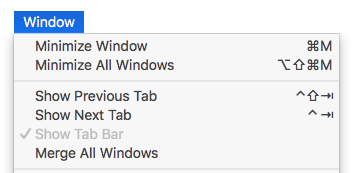

Esta página contém várias opções para configurar o funcionamento geral da sua aplicação 4D.

## Opções

### Na inicialização

Esta opção permite configurar o ecrã 4D por padrão no arranque, quando o usuário inicia apenas a aplicação.

- **No hacer nada**: sólo aparece la ventana de la aplicación, vacía.
- **Diálogo de apertura de proyecto local**: 4D muestra una caja de diálogo estándar de apertura de documentos, permitiéndole seleccionar un proyecto local.
- **Abrir el último proyecto utilizado**: 4D abre directamente el último proyecto utilizado; no aparece ninguna caja de diálogo de apertura.
  > Para forçar a apresentação da caixa de diálogo de abertura quando esta opção é selecionada, mantenha premida a tecla **Alt** (Windows) ou **Opção** (macOS) enquanto inicia o projeto.
- **Diálogo de apertura del proyecto remoto**: 4D muestra el diálogo estándar de inicio de sesión de 4D Server, permitiéndole seleccionar un proyecto publicado en la red.
- **Diálogo del Asistente de Bienvenida** (configuración de fábrica): 4D muestra la caja de diálogo del Asistente de Bienvenida.

> **4D Server**: la aplicación 4D Server ignora esta opción. En este entorno, se utiliza siempre el modo **No hacer nada**.

### Criação de formulários automática

> Essa opção é usada somente em bancos de dados binários; ela é ignorada na arquitetura do projeto. Ver doc.4d.com.

### Janela com guias (somente macOS)

A partir do macOS Sierra, os aplicativos Mac podem se beneficiar do recurso Automatic Window Tabbing, que ajuda a organizar várias janelas: as janelas de documentos são empilhadas em uma única janela principal e podem ser navegadas por meio de guias. Esse recurso é útil em telas pequenas e/ou ao usar um trackpad.

Você pode se beneficiar desse recurso nos seguintes ambientes (somente com versões 4D de 64 bits):

- Method Editor windows
- Janelas do editor de formulários

Todas as janelas destes editores podem ser colocadas no formulário de tabulação:


Un conjunto de comandos en el menú **Ventana** permite gestionar las pestañas:



En la caja de diálogo de Preferencias de 4D, la opción **Ventana con pestañas** le permite controlar este funcionamiento:


Estão disponíveis três opções:

- **Según las Preferencias sistema** (por defecto): las ventanas 4D se comportarán como se definen en las Preferencias Sistema de macOS (En pantalla completa, Siempre o Manualmente).
- **Nunca**: al abrir un nuevo documento en el editor de formularios 4D o en el Editor de Código siempre se crea una nueva ventana (nunca se crean pestañas).
- **Siempre**: al abrir un nuevo documento en el editor de formularios o en los editores de métodos de 4D, siempre se creará una nueva pestaña.

### Aparência (somente macOS)

Este menú permite seleccionar la combinación de colores que se utilizará para el entorno de **desarrollo 4D**. O esquema especificado será aplicado a todos os editores e janelas do modo Design.

> También puede definir la paleta de colores que se utilizará en sus **aplicaciones de escritorio** en la página "Interfaz" de la caja de diálogo de los Parámetros.

Estão disponíveis três opções:

- **Según las preferencias de la paleta de colores del sistema** (por defecto): utiliza la paleta de colores definida en las Preferencias sistema de macOS.
- **Claro**: utilizar el tema claro
- **Sombra**: utilizar el tema Sombra

> Esta preferência só é suportada no macOS. No Windows, é sempre utilizado o esquema "Light".

### Sair do modo Desenho ao passar para o modo Aplicação

Si esta opción está marcada, cuando el usuario cambia al entorno Aplicación utilizando el comando de menú **Probar la aplicación**, se cierran todas las ventanas del entorno Diseño. Se essa opção não estiver marcada (configuração padrão), as janelas do ambiente Design permanecerão visíveis no plano de fundo do ambiente Application.

### Ativar a criação de bases de dados binárias

Si marca esta opción, se añaden dos elementos en el menú **Archivo > Nuevo** y el botón **Nuevo** de la barra de herramientas:

- **Base de dados...**
- **Base de dados a partir da definição da estrutura...**


Estos elementos permiten crear bases de datos binarias (ver la sección [Crear una nueva base](https://doc.4d.com/4Dv18R6/4D/18-R6/Creating-a-new-database.300-5217610.en.html)). Eles não são mais propostos por padrão porque 4D recomenda o uso de arquitetura baseada em projeto para novos desenvolvimentos.

## Ao criar um novo projeto

### Usar arquivo de registo

Quando essa opção está marcada, um arquivo de registro é iniciado automaticamente e usado quando um novo banco de dados é criado. Para más información, consulte [Archivo de historial (.journal)](Backup/log.md).

### Criar pacote

Quando essa opção for marcada, os bancos de dados 4D são criados automaticamente em uma pasta com o sufixo .4dbase.

Graças a esse princípio, no macOS, as pastas do banco de dados aparecem como pacotes com propriedades específicas. No Windows, isto não tem qualquer impacto particular.

### Incluir tokens no arquivo de origem do projeto

Cuando esta opción está marcada, los [archivos fuente de los métodos](../Project/architecture.md#sources) guardados en los nuevos proyectos 4D contendrán los **tokens** para los objetos clásicos del lenguaje y de la base (constantes, comandos, tablas y ca Tokens are additional characters such as `:C10` or `:5` inserted in the source code files, that allow renaming tables and fields and identifying elements whatever the 4D version (see [Using tokens in formulas](https://doc.4d.com/4Dv19R3/4D/19-R3/Using-tokens-in-formulas.300-5583062.en.html)).

Se você pretende usar VCS ou editores de código externos em seus novos projetos, talvez queira desmarcar essa opção para melhorar a legibilidade do código com essas ferramentas.

> Essa opção só pode ser aplicada a projetos (os bancos de dados binários sempre incluem tokens).

> You can always get the code with tokens by calling [`METHOD GET CODE`](https://doc.4d.com/4dv19R/help/command/en/page1190.html) with 1 in the _option_ parameter.

#### Excluir tokens em projetos existentes

You can configure your existing projects to save code **without tokens** by inserting the following key in the [`<applicationName>.4DProject`](../Project/architecture.md#applicationname4dproject-file) file using a text editor:

```
"tokenizedText": false
```

> Este parâmetro só é tida em conta quando os métodos são guardados. Os métodos existentes em seus projetos não são modificados, a menos que você os salve novamente.

### Crear el archivo `.gitignore`

Talvez você precise ou queira que o git ignore alguns arquivos em seus novos projetos.

Puede definir esta preferencia marcando la opción **Crear el archivo .gitignore**.

Cuando se crea un proyecto en 4D y esa casilla está marcada, 4D crea un archivo `.gitignore` al mismo nivel que la carpeta `Project` (ver [Arquitectura de un proyecto](Project/architecture.md#gitignore-file-optional)).

Puede definir el contenido por defecto del archivo `.gitignore` haciendo clic en el icono del lápiz. Isso abrirá o arquivo de configuração .gitignore em seu editor de texto. El contenido de este archivo se utilizará para generar los archivos `.gitignore` en sus nuevos proyectos.

La [documentación oficial de git](https://git-scm.com/docs/gitignore) es un gran recurso para entender cómo funcionan los archivos `.gitignore`.

### Linguagem de comparação de texto

Esse parâmetro configura o idioma padrão usado para o processamento e a comparação de cadeias de caracteres em novos bancos de dados. A escolha do idioma influencia diretamente a classificação e a pesquisa de texto, bem como as letras maiúsculas e minúsculas, mas não afeta a tradução de textos nem os formatos de data, hora ou moeda, que permanecem no idioma do sistema. Por padrão (configuração de fábrica), 4D usa o idioma do usuário atual definido no sistema.

Um banco de dados 4D pode, portanto, operar em uma linguagem diferente da do sistema. Quando um banco de dados é aberto, o motor 4D detecta a linguagem usada pelo arquivo de dados e fornece a linguagem (modo interpretador ou compilado). As comparações de texto, independentemente de serem realizadas pelo mecanismo de banco de dados ou pelo idioma, são feitas no mesmo idioma.

Ao criar um novo arquivo de dados, o 4D usa o idioma previamente definido nesse menu. Ao abrir um arquivo de dados que não está no mesmo idioma que a estrutura, o idioma do arquivo de dados é usado e o código do idioma é copiado para a estrutura.

> Puede modificar este parámetro para la base abierta utilizando la Configuración de la base (ver [Comparación de textos](../settings/database.md#text-comparison)).

## Localização da documentação

Esta área configura o acesso à documentação HTML 4D exibida no seu navegador atual:

- Cuando pulsa la tecla **F1** mientras el cursor está insertado en una función de clase 4D o nombre de comando en el Editor de Código;
- Al hacer doble clic sobre un comando 4D en la **página de los comandos** del Explorador.

### Língua da documentação

Linguaje da documentação HTML a apresentar. É possível selecionar uma documentação em um idioma diferente do idioma do aplicativo.

### Procurar primeiro na pasta local

> Esta opção só é tida em conta para o acesso à documentação de comandos (excluindo as funções de classe).

Define onde 4D irá procurar por páginas de documentação.

- Quando marcado (padrão), 4D primeiro procura a página na pasta local (veja abaixo). Se for encontrado, 4D mostra a página no navegador atual. Caso contrário, o 4D o procura automaticamente no site de documentação on-line. Desta forma, é possível aceder à documentação mesmo quando se está offline.
- Quando não marcada, 4D procura a página desejada diretamente no site de documentação on-line e a exibe no navegador atual. Se não for encontrado, 4D mostra uma mensagem de erro no navegador.

### Pasta local

> Esta opção só é tida em conta para o acesso à documentação de comandos (excluindo as funções de classe).

Indica a localização da documentação HTML estática. Por padrão, esta é a subpasta \Help\Command\language. Pode ver a localização clicando no menu associado à zona. Se esta subpasta não estiver presente, a localização é apresentada a vermelho.

Você pode modificar esse local conforme desejar, por exemplo, se quiser exibir a documentação em um idioma diferente do idioma do aplicativo. A documentação HTML estática pode estar localizada em outro volume, em um servidor da Web, etc. Para designar una ubicación diferente, haga clic en el botón **[...]** junto al área de entrada y elija una carpeta raíz de documentación (carpeta correspondiente al idioma: `fr`, `en`, `es`, `de` o `ja`).
