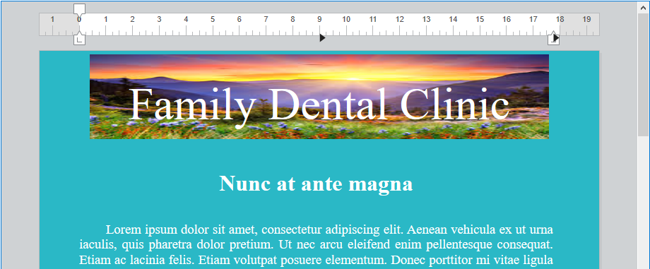
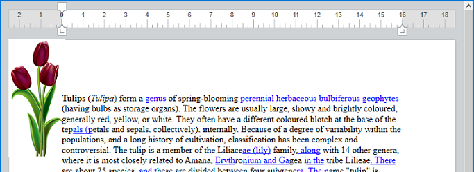

<!--REF #_command_.WP Add picture.Syntax-->**WP Add picture** ( *docWP* {; *imagem*} ) -> Resultado<!-- END REF-->
<!--REF #_command_.WP Add picture.Params-->
| Parâmetro | Tipo |  | Descrição |
| --- | --- | --- | --- |
| docWP | Object | &#8594;  | Documento 4D Write Pro |
| imagem | Picture, Text | &#8594;  | Imagem (campo ou variável) ou rota da Imagem (texto) |
| Resultado | Object | &#8592; | Objeto que referencia a imagem |

<!-- END REF-->

## Descrição 

<!--REF #_command_.WP Add picture.Summary-->O comando **WP Add picture** ancora a *imagem* em um local fixo dentro de *wpDoc* e devolve sua referência.<!-- END REF--> A referência devolvida pode ser passada ao comando [WP SET ATTRIBUTES](wp-set-attributes.md) para mover a *imagem* a qualquer local em *wpDoc* (página, seção, cabeçalho, rodapé, etc.) com uma capa, tamanho, etc. definidos.

Em *wpDoc*, passe o nome de um objeto de documento 4D Write Pro.

Em *imagem*, pode passar:

* uma imagem 4D,
* ou uma string que contenha uma rota a um arquivo de imagem armazenado no disco, expressa usando a sintaxe de sistema.  
Se usar uma string, pode passar uma rota de acesso completa ou uma rota relacionada com o arquivo de estrutura do banco de dados. Também pode passar um nome de arquivo, em cujo caso o arquivo deve estar localizado ao lado do arquivo de estrutura do banco de dados. Se passar um nome de arquivo, deve indicar a extensão do arquivo.

> **Nota**: se puder usar qualquer formato de imagem suportado por 4D (veja *Imagens*). Pode obter a lista de formatos de imagem disponíveis com o comando [PICTURE CODEC LIST](../../commands-legacy/picture-codec-list.md). Se a imagem encapsula vários formatos (codecs), 4D Write Pro só conserva um formato para mostrar e um formato para imprimir (se for diferente) no documento; os "melhores" formatos são selecionados automaticamente.  
>  
> Se a imagem for omitida, obtém-se uma referência de imagem válida e uma imagem vazia será adicionada. Isso permite que chame o comando [WP SET ATTRIBUTES](wp-set-attributes.md) com o seletor wk image expression para usar uma expressão 4D para preencher a imagem. Se a expressão não puder ser avaliada ou não retornar uma imagem 4D válida, uma imagem vazia (o padrão é uma imagem negra) será exibida.  

De forma pré-determinada, a imagen agregada é:

* aninhada atrás do texto,
* mostrada na esquina superior esquerda do quadro do papel,
* mostrada em todas as páginas.

A localização, a capa (inline, na frente/atrás do texto), a visibilidade e as propriedades da *imagem*  podem ser modificadas com o comando [WP SET ATTRIBUTES](wp-set-attributes.md), ou mediante ações padrão (consulte *Usando ações padrão*). 

**Nota: o** comando [WP Selection range](wp-selection-range.md) devolve um objeto *referencia de imagem* se for selecionada uma imagem ancorada e um objeto de faixa se for selecionada uma imagem inline. Pode verificar se um objeto selecionado for um objeto de imagem com o atributo wk type. Se o valor = 2, então é um objeto imagem; do contrário, é um objeto faixa (valor = 0).

## Exemplo 1 

Se quiser agregar uma imagem com a configuração pré-determinada utilizando um arquivo de rota.

```4d
 var $obPict : Object
 $obPict:=WP Add picture(myDoc;"C:\\Users\\John.Doe\\Pictures\\Sunrise.jpg")
```

O resultado é:


## Exemplo 2 

Se quiser agregar uma imagem redimensionada, centrada e ancorada ao cabeçalho:

```4d
 var $obImage : Object
 $obImage:=WP Add picture(myDoc;"C:\\Users\\John.Doe\\Pictures\\Saved Pictures\\Sunrise.jpg")
 WP SET ATTRIBUTES($obImage;wk anchor origin;wk header box)
 WP SET ATTRIBUTES($obImage;wk anchor horizontal align;wk center)
 WP SET ATTRIBUTES($obImage;wk anchor vertical align;wk center)
 WP SET ATTRIBUTES($obImage;wk width;"650px";wk height;"120px")
```

O resultado é:



## Exemplo 3 

Se quiser usar uma expressão de campo para adicionar uma imagem ancorada a um documento que exibe texto do banco de dados:

```4d
 QUERY([Flowers];[Flowers]Common_Name="tulip")
 WP SET TEXT(myDoc;[Flowers]Description;wk append) //insere texto
 var $obImage : Object
 $obImage:=WP Add picture(myDoc)
 WP SET ATTRIBUTES($obImage;wk image formula;Formula([Flowers]Image))
```



## Ver também 

  
*Gerenciar Imagens*  
[WP DELETE PICTURE ](wp-delete-picture.md)  
[WP Picture range](wp-picture-range.md)  