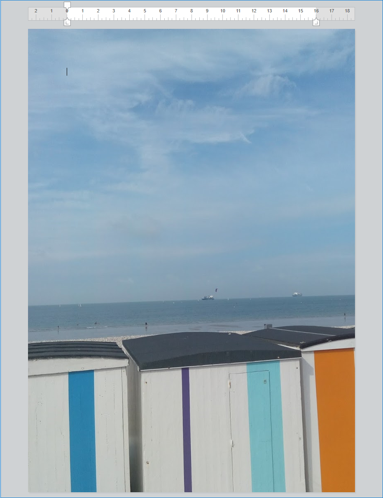

<!--REF #_command_.WP SET ATTRIBUTES.Syntax-->**WP SET ATTRIBUTES** ( *faixaObj* ; *atribNome* ; *atribValor* {; *atribNome2* ; *atribValor2* ; ... ; *atribNomeN* ; *atribValorN*} )<!-- END REF-->
<!--REF #_command_.WP SET ATTRIBUTES.Params-->
| Parâmetro | Tipo |  | Descrição |
| --- | --- | --- | --- |
| faixaObj | Object | &#8594;  | Range ou elemento de 4D Write Pro documento |
| atribNome | Text | &#8594;  | Nome do atributo a estabelecer |
| atribValor | Text, Number, Object, Collection, Picture, Date | &#8594;  | Novo valor do atributo |

<!-- END REF-->

#### Descrição 

<!--REF #_command_.WP SET ATTRIBUTES.Summary-->O novo comando **WP SET ATTRIBUTES** lhe permite estabelecer o valor de qualquer atributo em uma faixa, um elemento ou um documento.<!-- END REF--> Este comando lhe permite acessar a qualquer tipo de atributo interno 4D Write Pro: caractere, parágrafo, documento, tabela ou imagem. 

No primeiro parâmetro, pode passar:

* uma faixa, ou
* um elemento (cabeçalho /rodapé /corpo /tabela /fila /parágrafo /ancorado ou imagem inline/seção-subseção/folha de estilo) ou
* um documento 4D Write Pro

Em *nomAtrib*, passe o nome do atributo a definir para o objetivo e em *valorAtrib*, passe o novo valor a definir. Para obter uma lista completa dos atributos a passar em *nomAtrib*, assim como seus respectivos valores, por favor consulte a seção *Atributos 4D Write Pro*.

Pode passar tantos pares de *nomAtrib*/ *valorAtrib* quantos queira.

**Nota:** se necessitar definir vários atributos para o mesmo objetivo, está otimizado para utilizar uma só chamada a **WP SET ATTRIBUTES** com todos os pares de atributos/valores, ao invés de chamar várias vezes a **WP SET ATTRIBUTES**.

#### Exemplo 1 

Nesta área 4D Write Pro, selecione uma palavra:


Se executar o seguinte código:

```4d
 $range:=WP Get selection(*;"WParea") //obter a faixa selecionada
 
  // definir o deslocamento da sombra em pt para o texto selecionado
 WP SET ATTRIBUTES($range;wk text shadow offset;1)
  //set the paragraph padding
 WP SET ATTRIBUTES($range;wk padding;1)
  //define uma borda para  10 pt
 WP SET ATTRIBUTES($range;wk border style;wk solid)
 WP SET ATTRIBUTES($range;wk border width;10)
  //define as cores das bordas
 WP SET ATTRIBUTES($range;wk border color;"blue";wk border color bottom;"#00FA9A";wk border color right;"#00FA9A")
```

Obtem o seguinte resultado:


#### Exemplo 2 

Este exemplo ilustra o uso das constantes wk inside e wk outside:

```4d
 $wpRange:=WP Get selection(writeProdoc)
 WP SET ATTRIBUTES($wpRange;wk border style+wk inside;wk dotted)
 WP SET ATTRIBUTES($wpRange;wk border style+wk outside;wk solid)
 WP SET ATTRIBUTES($wpRange;wk border color+wk outside;"#00FA9A")
```

Supondo que todo o conteúdo foi selecionado, o resultado é:


#### Exemplo 3 

Se qioser estabelecer uma imagem de fundo para o documento:

```4d
 var WParea : Object
 WParea:=WP New
 
 READ PICTURE FILE("C:\\Pictures\\boats.jpg";$picture)
 
 WP SET ATTRIBUTES(WParea;wk background image;$picture)
```

O resultado é:


Se quiser estabelecer uma imagem de fundo que cubra toda a área de impressão:

```4d
 var WParea : Object
 WParea:=WP New
 
 READ PICTURE FILE("C:\\Pictures\\boats.jpg";$picture)
 
 WP SET ATTRIBUTES(WParea;wk background image;$picture)
 WP SET ATTRIBUTES(WParea;wk background clip;wk paper box)
 WP SET ATTRIBUTES(WParea;wk background origin;wk paper box)
```

O resultado é:



**Nota**: O valor de paper box é aplicável apenas aos documentos e seções.

#### Exemplo 4 

Se quiser estabelecer abas em intervalos variados e criar caracteres diferentes como o caractere inicial

```4d
 $tab1:=New object()
 $tab1[wk type]:=wk left
 $tab1[wk offset]:="3cm"
 $tab1[wk leading]:=""
 
 $tab2:=New object()
 $tab2[wk type]:=wk center
 $tab2[wk offset]:="8cm"
 $tab2[wk leading]:=""
 
 $tab3:=New object()
 $tab3[wk type]:=wk right
 $tab3[wk offset]:="12cm"
 $tab3[wk leading]:="."
 
 $_tabs:=New collection($tab1;$tab2;$tab3)
 WP SET ATTRIBUTES(wpArea;wk tabs;$_tabs)
```

O resultado é:


#### Ver também 

*Atributos 4D Write Pro*  
[WP GET ATTRIBUTES](wp-get-attributes.md)  
[WP RESET ATTRIBUTES](../commands/wp-reset-attributes.md)  