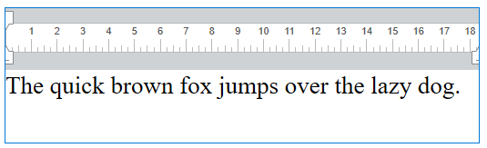

<!--REF #_command_.WP SET TEXT.Syntax-->**WP SET TEXT** ( *wpRange* ; *novoTexto* ; *posiçaoTexto* {; *alcanceRange*} )<!-- END REF-->
<!--REF #_command_.WP SET TEXT.Params-->
| Parâmetro | Tipo |  | Descrição |
| --- | --- | --- | --- |
| wpRange | Object | &#8594;  | Objeto Range |
| novoText | Text | &#8594;  | Texto a inserir |
| posiçaoTexto | Number | &#8594;  | Inserir posição (substituir, antes, depois) |
| alcanceRange | Number | &#8594;  | Inclui ou exclui o conteúdo inserido dentro da range |

<!-- END REF-->

#### Descrição 

<!--REF #_command_.WP SET TEXT.Summary-->O comando **WP SET TEXT** insere o texto passado no parâmetro *novoTexto* como texto sem formato em in the *targetObj* em uma posição específica designada pelos parâmetros *wpRango* e *posiçãoTexto*.<!-- END REF-->

No parâmetro *alvoObj*, passe um objeto para designar a posição onde o texto será inserido. Pode ser uma localização explicita no documento 4D Write Pro ou pode ser baseada em uma seleção de usuário. Pode passar:

* uma range, ou
* um elemento (tabela / linha/ parágrafo / corpo / cabeçalho / rodapé / imagem inline / seção / subseção), ou
* um documento 4D Write Pro.

O parâmetro *novoTexto* contém o texto a inserir dentro de *wpRange*. **WP SET TEXT** insere só texto sem formato, exatamente como está escrito, mas sem etiquetas de estilo.

No parâmetro *posicaoTexto*, o local de texto inserido pode ser especificado passando um dos seletores abaixo:

| Constante  | Comentário                                                                                                           |
| ---------- | -------------------------------------------------------------------------------------------------------------------- |
| wk append  | Insere conteúdos ao final da faixa e atualiza a faixa para conter tanto os conteúdos anteriores quanto os inseridos. |
| wk prepend | Conteúdos inseridos no início da faixa e atualiza a faixa para conter os conteúdos anteriores e os inseridos         |
| wk replace | Substituir e atualizar conteúdos da faixa; a nova faixa contèm os conteúdos inseridos.                               |

* Se *alvoObj* é uma range, pode usar o parâmetro opcional *rangeAtualiz* para passar uma das constantes a seguir para especificar se os conteúdos inseridos são incluidos na range resultante  
    
| Constante             | Comentário                                                                                     |  
| --------------------- | ---------------------------------------------------------------------------------------------- |  
| wk exclude from range | Insere conteùdos ao fim da faixa e atualiza a faixa para menter apenas conteúdos anteriores.   |  
| wk include in range   | Insere conteúdos ao início da faixa e atualiza a faixa para manter apenas conteúdos anteriores |  
    
Se não passar um parâmetro *rangeAtualiz* como padrão o conteúdo inserido é incluido na range resultante.
* se *alvoObj* não for uma range, *rangeAtualiz* é ignorado.

#### Exemplo 

Se quiser agregar texto a este documento:



*Se targetObj* é um documento 4D Write Pro:

```4d
 WP SET TEXT(myDoc;"Hello world";wk append)
  //writes "The quick brown fox jumps over the lazy dog. Hello world!"
```

*Se targetObj* é uma range:

Antes do texto existente:  

```4d
 $range:=WP Create range(myDoc;wk start text;wk end text)
 WP SET TEXT($range;" Hello world!";wk prepend)
  //escreve " Hello world! The quick brown fox jumps over the lazy dog."
```

Depois do texto existente:  

```4d
 $range:=WP Create range(myDoc;wk start text;wk end text)
 WP SET TEXT($range;" Hello world!";wk append)
  //escreve "The quick brown fox jumps over the lazy dog. Hello world!"
```

Substitui o texto existente:  

```4d
 $range:=WP Create range(myDoc;wk start text;wk end text)
 WP SET TEXT($range;" Hello world!";wk replace)
  //escreve " Hello world!"
```

#### Ver também 

[WP Get text](wp-get-text.md)  