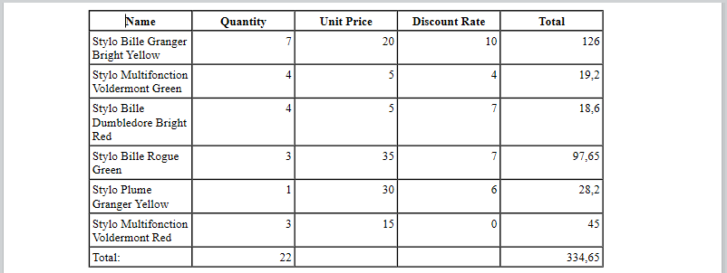

<!--REF #_command_.WP Table append row.Syntax-->**WP Table append row** ( *refTab* ; *valor* {; *valor2* ; ... ; *valorN*} )  -> Resultado<!-- END REF-->
<!--REF #_command_.WP Table append row.Params-->
| Parâmetro | Tipo |  | Descrição |
| --- | --- | --- | --- |
| refTab | Object | &#8594;  | objeto referência Tabela |
| valor | Text, Number, Time, Date, Picture | &#8594;  | Valores a estabelecer na fila |
| Resultado | Object | &#8592; | Objeto faixa Fila |

<!-- END REF-->

## Descrição 

<!--REF #_command_.WP Table append row.Summary-->O comando **WP Table append row** agrega uma fila à tabela *refTabela*, a preenche com *valor*(es) e devolve o objeto de faixa de fila correspondente.<!-- END REF-->

O comando agrega tantas celulas na fila como há valores no parâmetro *valor*. Pode passar qualquer número de valores de diferentes tipos; O alinhamento de celula predeterminada dependerá do tipo de valor:

* texto: alinhado a esquerda
* imágens: centrado
* outro tipo (números, data e hora): alinhado a direita

**Nota:** os valores de tipo de array não são suportados.

O comando devolve a nova fila como um objeto de faixa de fila.

## Exemplo 1 

Se deseja criar uma tabela vazia e agregar várias filas de diferentes tamanhos. Pode escrever:

```4d
 var $wpTable;$wpRange;$wpRow1;$wpRow2;$wpRow3 : Object
 $wpRange:=WP Text range(WParea;wk start text;wk end text)
 $wpTable:=WP Insert table($wpRange;wk append)
 $wpRow1:=WP Table append row($wpTable;"Paul";"Smith";25)
 $wpRow2:=WP Table append row($wpTable;"John";"Richmond";40)
 $wpRow3:=WP Table append row($wpTable;"Mary";"Trenton";18;"New!")
```


## Exemplo 2 

Em uma aplicação de fatura, se quiser criar uma tabela preenchida automaticamente com as lihas de fatura relacionadas:

```4d
 var $wpTable;$wpRange : Object
 
 $wpRange:=WP Text range(4DWPArea;wk start text;wk end text)
 
 $wpTable:=WP Insert table($wpRange;wk append) //cria a tabela
 
  // adicionar a fila de cabeçalho
 $row:=WP Table append row($wpTable;"Name";"Quantity";"Unit Price";"Discount Rate";"Total")
 WP SET ATTRIBUTES($row;wk font bold;wk true;wk text align;wk center)
 
  //simplesmente aplicar à seleção
 APPLY TO SELECTION([INVOICE_LINES];WP Table append row($wpTable;[INVOICE_LINES]ProductName;[INVOICE_LINES]Quantity;[INVOICE_LINES]ProductUnitPrice;[INVOICE_LINES]DiscountRate;[INVOICE_LINES]Total))
 
  //adicionar uma fila de rodapé
 $row:=WP Table append row($wpTable;"Total:";Sum([INVOICE_LINES]Quantity);"";"";Sum([INVOICE_LINES]Total))
 
  //formatar a tabela
 $range:=WP Table get columns($wpTable;1;5)
 WP SET ATTRIBUTES($range;wk width;"80pt")
 WP SET ATTRIBUTES($wpTable;wk font size;10)
```



## Ver também 

[WP Insert table](wp-insert-table.md)  
[WP Table get rows](wp-table-get-rows.md)  