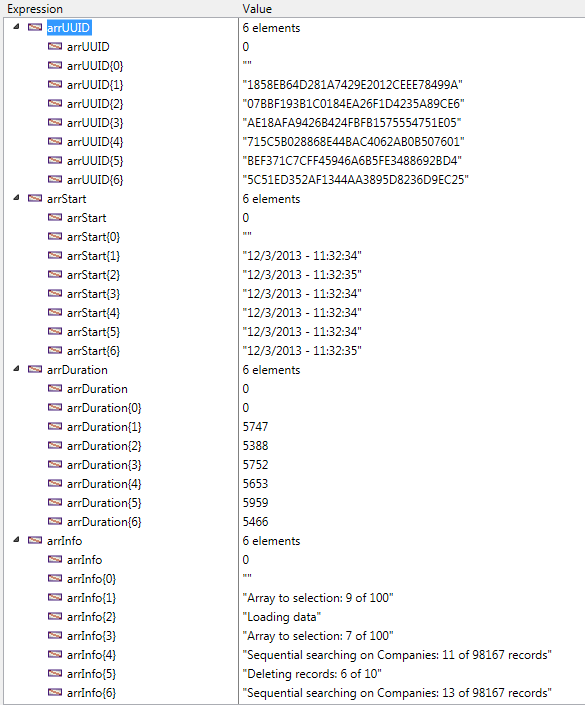

<!--REF #_command_.ACTIVITY SNAPSHOT.Syntax-->**ACTIVITY SNAPSHOT** ( arrActivities | arrUUID ; *arrInicio* ; *arrDuracao* ; *arrInfo* {; *arrDetails*}{; *} )<!-- END REF-->
<!--REF #_command_.ACTIVITY SNAPSHOT.Params-->
| Parâmetro | Tipo |  | Descrição |
| --- | --- | --- | --- |
| arrActivities &#124; arrUUID | Array objeto, Array texto | &#8592; | Descrição completa de operações (object array) ou<br/>UUIDs das operações (text array) |
| arrInicio | Text array | &#8592; | Horas de início das operações |
| arrDuracao | Integer array | &#8592; | Duração das operações em milisegundos |
| arrInfo | Text array | &#8592; | Descrição |
| arrDetails | Object array | &#8592; | Details of context and sub-operations (if any) |
| * | Operador | &#8594;  | Se passar = Trazer atividade do servidor |

<!-- END REF-->

#### Descrição 

<!--REF #_command_.ACTIVITY SNAPSHOT.Summary-->O comando **ACTIVITY SNAPSHOT** retorna um array ou vários que descrevem as operações em progresso sobre os dados 4D.<!-- END REF--> Estas operações usualmente mostram uma janela de progresso.

Este comando se usa para trazer uma imagem das x operações que mais consumem tempo e/ou que passam mais frequentemente, tais como escritura de cachê ou execução de fórmulas.

**Nota:** a informação devolvida pelo comando **ACTIVITY SNAPSHOT** é a mesma mostrada na página "Monitor em tempo real" (RTM) da janela de administração de 4D Server (veja o *Manual de 4D Server*). 

Por padrão, **ACTIVITY SNAPSHOT** processa as operações realizadas a nível local (com 4D autônomo, 4D Server ou 4D em modo remoto). No entanto, com 4D em modo remoto, também pode obter uma instantânea das operações realizadas no servidor: só tem que passar o asterisco (\*) como último parâmetro. Neste caso, o servidor de dados se recupera localmente.  
O parâmetro *\** se ignora quando o comando se executa em 4D Server ou 4D autônomo.  
  
O comando **ACTIVITY SNAPSHOT**  aceita duas sintaxes:

* sintaxe usando somente um array de objetos.
* sintaxe utilizando vários arrays.

##### Primeira sintaxe: ACTIVITY SNAPSHOT ( {\* ;} arrActivities ) 

Com esta sintaxe, todas as operações se devolvem em um formulário estruturado no array de objetos 4D (*arrAtividades*). Cada elemento do array é um objeto construído da seguinte maneira:

```json
[    {        "message":"xxx",        "maxValue":12321,        "currentValue":63212,        "interruptible:0,        "remote":0,        "uuid":"deadbeef",        "taskId":xxx,        "startTime":"2014-03-20 13:37:00:123",        "duration":92132,        "dbContextInfo":{            "task_id": xxx,            "user_name": Jean,            "host_name": HAL,            "task_name": "CreateIndexLocal",            "client_uid": "DE4DB33F33F"            "user4d_id ": 1,            "client_version ": 123456        },        "dbOperationDetails":{            table: "myTable"            field: "Field_1"        },        "subOperations":[            {"message":"xxx",            ...}            ]    },    {...}]
```

Esta é uma descrição de cada propriedade devolvida:

* *message* (texto): etiqueta da operação
* *maxValue* (número): número de interações definidas para a operação (-1 se a operação não é interativa)
* *currentValue* (número): interação atual
* *interruptible* (número): a operação pode ser interrompida pelo usuário (0=true, 1=false)
* *remote* (número): operação por pares entre cliente e servidor (0=true, 1=false)
* *uuid* (texto): identificador UUID da operação
* *taskId* (número): identificador interno do processo na origem da operação
* *startTime* (texto): a hora de início da operação em formato "aaaa:mm:dd hh:mm:ss:mls"
* *duration* (número): duração da operação em milisegundos
* *dbContextInfo* (objeto): informação relativa as operações manipuladas pelo motor da base de dados. Contém as seguintes propriedades:  
   * *host\_name* (cadeia): nome do host que lançou a operação  
   * *user\_name* (cadeia): nome do usuário 4D cuja sessão lançou a operação  
   * *task\_name* (cadeia): nome do processo que lançou a operação  
   * *task\_id* (num): número do ID do processo que lançou a operação  
   * *client\_uid* (cadeia): opcional, uuid do cliente que lançou a operação  
   * *is\_remote\_context* (booleano, 0 o 1): opcional, indica se a operação da base foi lançada por um cliente (valor 1) ou pelo servidor por meio do procedimento armazenado (valor 0)  
   * *user4d\_id* (num): número do ID do usuário 4D atual do lado do cliente  
   * *client\_version* (cadeia): quatro dígitos representam a versão do motor 4D da aplicação, como os devolveu o comando [Application version](application-version.md).  
**Nota:** client\_uid and is\_remote\_context só está disponível em modo cliente/servidor. client\_uid só se devolve se a operação da base de dados se iniciou em uma equipe cliente.
* *dbOperationDetails* (objeto): propriedade devolvida unicamente se a operação chama ao motor de base de dados (este é o caso, por exemplo, para pesquisa e ordenações). Este é um objeto que contém informação específica relacionada com a operação em si. As propriedades disponíveis dependem do tipo da operação de base de dados realizada. Mais especificamente, estas propriedades incluem:  
   * table (cadeia): nome da tabela implicado na operação  
   * field (cadeia): nome do campo implicado na operação  
   * queryPlan (cadeia): plano de pesquisa definido para a operação  
   * ...
* *subOperations* (array): array de objetos que contém sub operações da operação atual (se existe). A estrutura de cada sub elemento é idêntica a do objeto principal. Se a operação atual não tem sub operações, então *subOperations* está vazio.

##### Segunda sintaxe: ACTIVITY SNAPSHOT ( {\* ;} arrUUID ; arrStart ; arrDuration ; arrInfo {;arrSubOp} ) 

Com esta sintaxe, todas as operações se devolvem em vários arrays sincronizados (cada operação provoca que um elemento se adiciona a todos os arrays). Os seguintes arrays se devolvem:

* *arrUUID*: contém os identificadores UUID para cada operação (corresponde a propriedade *uuid* do objeto *arrAtividades* na sintaxe anterior).
* *arrInicio*: contém as horas de início de cada operação (corresponde a propriedade *startTime* do objeto *arrAtividades* ).
* *arrDuracao*: contém as durações de cada operação em milissegundos (corresponde a propriedade *duration* do objeto *arrAtividades* ).
* *arrInfo*: contém as etiquetas que descrevem cada operação (corresponde a propriedade *message* do objeto *arrAtividades* ).
* *arrDetalhes* (opcional): cada elemento deste array é um objeto que contém as seguintes propriedades:  
   * *"dbContextInfo"* (objeto): ver acima  
   * *"dbOperationDetails"* (objeto): ver acima  
   * "subOperacoes". O valor desta propriedade é um array objeto que contém todas as sub operações da operação atual. Se a operação atual não têm sub operações, o valor da propriedade *subOperacoes* é um array vazio. (corresponde a propriedade *subOperacoes* do objeto *arrAtividades*).

#### Exemplo 

Este método, executado em um processo separado em 4D ou 4D Server, oferece uma instantânea das operações que estão em marcha:

```4d
 ARRAY TEXT(arrUUID;0)
 ARRAY TEXT(arrStart;0)
 ARRAY LONGINT(arrDuration;0)
 ARRAY TEXT(arrInfo;0)
 
 Repeat
    ACTIVITY SNAPSHOT(arrUUID;arrStart;arrDuration;arrInfo)
    If(Size of array(arrUUID)>0)
       TRACE // chamada do depurador
    End if
 Until(False) // Bucle infinito
```

Obtém arrays do tipo:




#### Propriedades

|  |  |
| --- | --- |
| Número do comando | 1277 |
| Thread-seguro | &check; |


