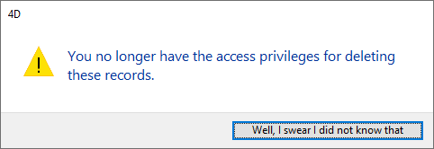

<!--REF #_command_.ALERT.Syntax-->**ALERT** ( *mensagem* {; *okBotaoTitulo*} )<!-- END REF-->
<!--REF #_command_.ALERT.Params-->
| Parâmetro | Tipo |  | Descrição |
| --- | --- | --- | --- |
| mensagem | Text | &#8594;  | Mensagem a exibir na caixa de diálogo de alerta |
| okBotaoTitulo | Text | &#8594;  | Título do botão OK |

<!-- END REF-->

#### Descrição 

<!--REF #_command_.ALERT.Summary-->O comando **ALERT** mostra uma caixa de diálogo de alerta composta de um ícone, de uma mensagem e de um botão OK.<!-- END REF-->

Passe a mensagem a mostrar no parâmetro *mensagem*. 

Normalmente, o título do botão OK é “Aceitar.” Para modificar o título do botão OK, passe o novo título no parâmetro opcional *okBotaoTitulo*. Se for necessário, a largura do botão OK é redimensionada até a esquerda, de acordo com a largura do título personalizado que você passar.

**Dica:** Não chame o comando **ALERT** a partir da seção de um formulário ou de um método objeto que maneje os eventos de formulárioo On Activate ou On Deactivate; isso vai causar um loop sem fim.

#### Exemplo 1 

Esse exemplo exibe um alerta mostrando informações sobre a companhia. Note que a string exibida contém um retorno de carro, o que faz com que a string passe para a próxima linha:

```4d
 ALERT("Company: "+[Companies]Name+Char(13)+"People in company: "+\
 String(Records in selection([People]))+Char(13)+"Number of parts they supply: "+\
 String(Records in selection([Parts])))
```

Essa linha de código exibe a caixa de alerta a seguir (on Windows):


#### Exemplo 2 

A linha:

```4d
 ALERT("Desculpe Dave,eu não posso fazer isso.";"Alas!")
```

exibe a caixa de diálogo de alerta (em Windows) abaixo:


#### Exemplo 3 

A linha:

```4d
 ALERT("Já não possui os privilégios de acesso para eliminar estes registros. ";"eu juro que não sabia disso")
```

Mostra a seguinte caixa de diálogo de alerta (em Windows):



#### Ver também 

[CONFIRM](confirm.md)  
[DISPLAY NOTIFICATION](display-notification.md)  
[Request](request.md)  