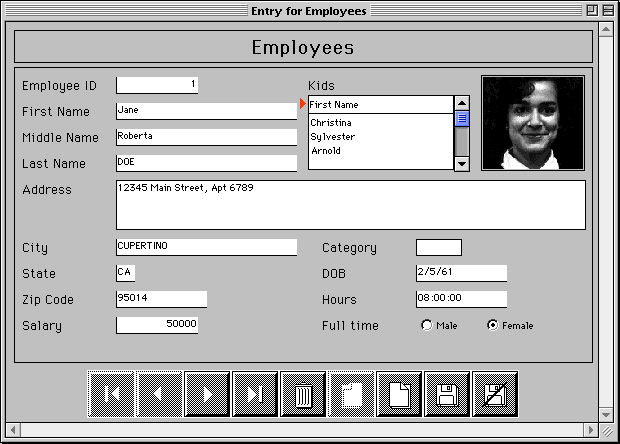
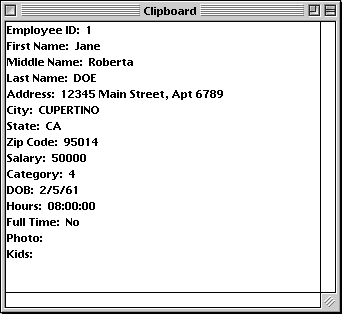

<!--REF #_command_.APPEND DATA TO PASTEBOARD.Syntax-->**APPEND DATA TO PASTEBOARD** ( *tipoDados* ; *dados* )<!-- END REF-->
<!--REF #_command_.APPEND DATA TO PASTEBOARD.Params-->
| Parâmetro | Tipo |  | Descrição |
| --- | --- | --- | --- |
| tipoDados | Text | &#8594;  | Tipo de dados a adiconar |
| dados | Blob | &#8594;  | Dados a anexar na área de transferência |

<!-- END REF-->

#### Descrição 

<!--REF #_command_.APPEND DATA TO PASTEBOARD.Summary-->O comando APPEND DATA TO PASTEBOARD adiciona na área de transferência os dados do tipo especificado em *tipoDados* no BLOB *dados*.<!-- END REF-->

**Nota:** no caso de operações copiar/colar, o contendor de dados corresponde a área de transferência. 

Passe em *tipoDados* um valor definindo o tipo de dados a adicionar. Pode passar uma assinatura 4D, um tipo UTI (Mac OS), um nome/número de formato (Windows), ou um tipo de 4 caracteres (compatibilidade). Para maior informação sobre estes tipos, consulte a seção *Gerenciar área de transferência*

**Nota para os usuários Windows**: quando o comando se utiliza com dados de tipo texto (*tipoDados* *dataType é* "TEXT", com.4d.private.text.native ou com.4d.private.text.utf16), a string contida no parâmetro BLOB *dados* deve terminar com o caractere NULL em Windows.

Se os dados do BLOB se adiciona corretamente a área de transferência, a variável OK toma o valor 1\. Do contrário a variável OK toma o valor 0 e se pode gerar um erro.

Geralmente, se utiliza o comando APPEND DATA TO PASTEBOARD para agregar múltiplas instâncias dos mesmos dados a área de transferência ou para adicionar dados que não são de tipo TEXT ou PICT. Para adicionar novos dados a área de transferência, primeiro deve limpar a área de transferência utilizando o comando [CLEAR PASTEBOARD](clear-pasteboard.md).

Se quer limpar e adiciona:

* texto para a área de transferência, utilize o comando [SET TEXT TO PASTEBOARD](set-text-to-pasteboard.md),
* uma imagem para a área de transferência, utilize o comando [SET PICTURE TO PASTEBOARD](set-picture-to-pasteboard.md),
* um nome do caminho do arquivo arrastar/soltar, utilize o comando [SET FILE TO PASTEBOARD](set-file-to-pasteboard.md).

Entretanto, note que se um BLOB contiver texto ou uma imagem, você pode utilizar o comando APPEND DATA TO PASTEBOARD para adicionar um texto ou uma imagem para a área de transferências.

#### Exemplo 

Utilizando os comandos do tema área de transferências e dos BLOBs, pode construir esquemas sofisticados de Cortar/Copiar/Colar para administrar dados estruturados ao invés de uma só peça de informação. No exemplo a seguir, os dois métodos de projeto SET RECORD TO CLIPBOARD e GET RECORD FROM CLIPBOARD lhe permitem tratar um registro de uma informação a copiar desde a área de transferência.

```4d
  // Método de projeto ENVIAR REGISTRO A AREA DE TRANSFERENCIA
  // ENVIAR REGISTRO A AREA DE TRANSFERENCIA ( Numérico )
  // ENVIAR REGISTRO A AREA DE TRANSFERENCIA ( Número de tabela )
 
 var $1;$vlCampo;$vlTipoCampo : Integer
 var $vpTabela;$vpCampo : Pointer
 C_STRING(255;$vsDocNome)
 var $vtRegistroDados;$vtCampoDados : Text
 var $vxRegistroDados : Blob
 
  // Limpar a área de transferência (estará vazio se não há um registro atual)
 CLEAR PASTEBOARD
  // Obter um ponteiro a tabela cujo número se passa como parâmetro
 $vpTabla:=Table($1)
  // Se houver um registro atual para essa tabela
 If((Record number($vpTabla->)>=0)|(Is new record($vpTabla->)))
  // Inicializar a variável texto que conterá a imagem de texto do registro
    $vtRegistroDados:=""
  // Para cada campo do registro:
    For($vlCampo;1;Count fields($1))
  // Obter o tipo de campo
       GET FIELD PROPERTIES($1;$vlCamp;$vlCampoTipo)
  // Obter um ponteiro até o campo
       $vpCampo:=Field($1;$vlCampo)
  // Dependendo do tipo de campo, copiar (ou não) seus dados de maneira apropriada
       Case of
          :(($vlCampoTipo=Is alpha field)|($vlCampoTipo=Is text))
             $vtCampoDados:=$vpCampo->
          :(($vlCampoTipo=Is real)|($vlCampoTipo=Is integer)|($vlCampoTipo=Is longint)|($vlCampoTipo=Is date)|($vlCampoTipo=Is time))
             $vtCampoDados:=String($vpCampo->)
          :($vlCampoTipo=Is Boolean)
             $vtCampoDados:=String(Num($vpCampo->);"Sím;;Não")
          Else
  // Passar e ignorar os outros tipos de campos
             $vtCampoDados:=""
       End case
  // Acumular os dados do campo em uma variável de texto que armazena a imagem de texto do registro
       $vtRegistroDados:=$vtRegistroDados+Field name($1;$vlCampo)+":"+Char(9)+$vtCampoDados+CR
  // Nota: o método CR devolve Char(13) em Macintosh e Char(13)+Char(10) em Windows
    End for
  // Colocar a imagem de texto do registro na área de transferência
    SET TEXT TO PASTEBOARD($vtRegistroDados)
  // Nome do arquivo scrap na pasta Temporárias
    $vsDocNome:=Temporary folder+"Scrap"+String(1+(Random%99))
  // Apagar o arquivo scrap se existir (é necessário fazer um teste de erro aqui)
    DELETE DOCUMENT($vsDocNome)
  // Criar arquivo scrap
    SET CHANNEL(10;$vsDocNome)
  //Enviar o registro completo ao arquivo scrap
    SEND RECORD($vpTabla->)
  // Fechar o arquivo scrap
    SET CHANNEL(11)
  // Carregar o arquivo scrap em um BLOB
    DOCUMENT TO BLOB($vsDocNome;$vxRegistroDados)
  // Não necessitamos mais o arquivo scrap
    DELETE DOCUMENT($vsDocNome)
  // Adicionar a imagem completa do registro a área de transferência
  // Nota: utilizamos arbitrariamente o tipo de dados "4Drc"
    APPEND DATA TO PASTEBOARD("4Drc";$vxRegistroDados)
  // Nesse ponto, a área de transferência contém:
  // (1) Uma imagem de texto do registro (como se mostra nas cópias de tela a seguir)
  // (2) Uma imagem completa do registro (incluindo imagens, subarquivos e os campos de tipo BLOB)
 End if
```

Ao introduzir o registro a seguir: 



Se aplica o métodoENVIAR REGISTRO A área de transferência a tabela \[Empregados\], a área de transferência conterá o texto do registro e a imagem completa do registro.  


Pode colar esta imagem do registro em outro registro, utilizando o método GET RECORD FROM CLIPBOARD, como se mostra a continuação:

```4d
  // Método OBTER REGISTRO DESDE AREA DE TRANSFERENCIA
  // OBTER REGISTRO DESDE AREA DE TRANSFERENCIA ( Número )
  // OBTER REGISTRO DESDE AREA DE TRANSFERENCIA ( Número de tabela )
 var $1;$vlCampo;$vlCampoTipo;$vlPosCR;$vlPosVirgula : Integer
 var $vpTabela;$vpCampo : Pointer
 C_STRING(255;$vsDocNome)
 var $vxAreaTransferenciaDados : Blob
 var $vtAreaTransferenciaDados;$vtCampoDados : Text
 
  // Obter um ponteiro até a tabela cujo número se passa como parâmetro
 $vpTabela:=Table($1)
  // Se houver um registro atual
 If((Record number($vpTabela->)>=0)|(Is new record($vpTabela->)))
    Case of
  // A área de transferência contém uma imagem completa do registro?
       :(Pasteboard data size("4Drc")>0)
  // Se for assim, extraia o conteúdo da área de transferência
          GET PASTEBOARD DATA("4Drc";$vxAreaTransferenciaDados)
  // Nome para o arquivo scrap na pasta temporária
          $vsDocNome:=Temporary folder+"Scrap"+String(1+(Random%99))
  // Apagar o arquivo scrap se existir (Se deve realizar um teste de erro aqui)
          DELETE DOCUMENT($vsDocNome)
  // Salvar o BLOB no arquivo scrap
          BLOB TO DOCUMENT($vsDocNome;$vxAreaTransferenciaDados)
  // Abrir o arquivo scrap
          SET CHANNEL(10;$vsDocNome)
  // Recibir o registro completo do arquivo scrap
          RECEIVE RECORD($vpTabela->)
  // Fechar o arquivo scrap
          SET CHANNEL(11)
  // Não necessitamos mais o arquivo scrap
          DELETE DOCUMENT($vsDocNome)
  // A área de transferência contém TEXT?
       :(Pasteboard data size("TEXT")>0)
  // Extrair o texto da área de transferência
          $vtAreaTransferenciaDados:=Get text from pasteboard
  // Inicializar o número de campos a incrementar
          $vlCampo:=0
          Repeat
  // Buscar a linha de campo seguinte no texto
             $vlPosCR:=Position(CR;$vtAreaTransferenciaDados)
             If($vlPosCR>0)
  // Extrair a linha de campo
                $vtCampoDados:=Substring($vtAreaTransferenciaDados;1;$vlPosCR-1)
  // Se houver dois pontos ":"
                $vlPosVirgula:=Position(":";$vtCampoDados)
                If($vlPosVirgula>0)
  // Tomar só os dados de campo (eliminar o nome de campo)
                   $vtCampoDados:=Substring($vtCampoDados;$vlPosVirgula+2)
                End if
  // Incrementar o número de campo
                $vlCampo:=$vlCampo+1
  // A area de transferencia pode conter mais informação da que necessitamos...
                If($vlCampo<=Count fields($vpTabela))
  // Obter o tipo de campo
                   GET FIELD PROPERTIES($1;$vlCampo;$vlCampoTipo)
  // Obter um ponteiro ao campo
                   $vpCampo:=Field($1;$vlCampo)
  // Dependendo do tipo de campo, copiar (ou não) o texto de uma maneira apropriada
                   Case of
                      :(($vlCampoTipo=Is alpha field)|($vlCampoTipo=Is text))
                         $vpCampo->:=$vtCampoDados
                      :(($vlCampoTipo=Is real)|($vlCampoTipo=Is integer)|($vlCampoTipo=Is longint))
                         $vpCampo->:=Num($vtCampoDados)
                      :($vlCampoTipo=Is date)
                         $vpCampo->:=Date($vtCampoDados)
                      :($vlCampoTipo=Is time)
                         $vpCampo->:=Time($vtCampoDados)
                      :($vlCampoTipo=Is Boolean)
                         $vpCampo->:=($vtCampoDados="Sim")
                      Else
  // Passar e ignorar os outros tipos de dados de campos
                   End case
                Else
  // Todos os campos foram atribuídos, sair do loop
                   $vtAreaTransferenciaDados:=""
                End if
  // Eliminar o texto que acaba de ser extraído
                $vtAreaTransferenciaDados:=Substring($vtAreaTransferenciaDados;$vlPosCR+Length(CR))
             Else
  // Não se encontrou um delimitador, sair do loop
                $vtAreaTransferenciaDados:=""
             End if
  // Repetir enquanto houver dados
          Until(Length($vtAreaTransferenciaDados)=0)
       Else
          ALERT("A área de transferência não contém dados que possam ser colados como um registro.")
    End case
 End if
```

#### Variáveis e conjuntos do sistema 

Se os dados no BLOB são adicionados corretamente á área de transferência, a variável sistema OK toma o valor 1; do contrário OK toma o valor 0 e se poderia gerar um erro.

#### Ver também 

[CLEAR PASTEBOARD](clear-pasteboard.md)  
[SET PICTURE TO PASTEBOARD](set-picture-to-pasteboard.md)  
[SET TEXT TO PASTEBOARD](set-text-to-pasteboard.md)  

#### Propriedades
|  |  |
| --- | --- |
| Número do comando | 403 |
| Thread-seguro | &check; |
| Modificar variáveis | OK |
| Proibido no servidor ||


