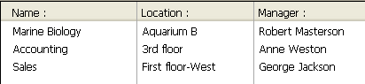

<!--REF #_command_.APPEND TO LIST.Syntax-->**APPEND TO LIST** ( *lista* ; *textoElem* ; *refElem* {; *sublista* ; *expandida*} )<!-- END REF-->
<!--REF #_command_.APPEND TO LIST.Params-->
| Parâmetro | Tipo |  | Descrição |
| --- | --- | --- | --- |
| lista | Integer | &#8594;  | Número de referência da lista |
| textoElem | Text | &#8594;  | Texto do novo elemento de lista (máx. 255 caracteres) |
| refElem | Integer | &#8594;  | Número de referencia único do novo elemento |
| sublista | Integer | &#8594;  | Sub-lista opcional para adicionar ao novo elemento |
| expandida | Boolean | &#8594;  | Indica se as sub-listas opcionais serão expandidas ou contraídas |

<!-- END REF-->

*Esse comando não é seguro para thread e não pode ser usado em código adequado.*


#### Descrição 

<!--REF #_command_.APPEND TO LIST.Summary-->O comando APPEND TO LIST  adiciona um novo elemento à lista hierárquica cujo número de referência se passa em *lista*.<!-- END REF-->

Pode passar o texto do item em itemText. Pode passar uma string ou expressões de texto de até 2 billhões caracteres. A partir de 4D v16 R4, se o item for associado com uma ação padrão pode passar a constante ak standard action title em itemText para automaticamente usar o nome da ação localizada. Para saber mais veja a seção *Ações padrões*.

O número de referência único do elemento (do tipo Inteiro longo) se passa em *refElem*. Ainda que classificamos este número de referência como único, na verdade pode passar o valor que desejar. Consulte a seção *Gerenciar Listas Hierárquicas* para maior informação sobre o parâmetro *refElem.*

Igualmente se deseja que um elemento tenha elementos filhos, passe um número de referência de lista válido no parâmetro *sublista*. Neste caso, também deve passar o parâmetro *expandido*. Passe [True](true.md "True") ou [False](false.md "False") neste parâmetro de maneira que a sub-lista se mostre exibida ou contraída respectivamente.

A referência da lista que passa em *sublista* deve fazer referência a uma lista existente. A lista existente poderia ter apenas um nível ou ter sub-listas. Se não deseja adicionar uma lista filha ao novo elemento, omita o parâmetro ou passe 0\. Mesmo que ambos são opcionais, os parâmetros *sublista* e *desplegada* devem ser passadas de forma conjunta.

**Dicas:**

* Para inserir um novo elemento em uma lista, utilize [INSERT IN LIST](insert-in-list.md). Para mudar o texto de um elemento existente ou modificar sua lista filha ao igual que seu estado expandido, utilize [SET LIST ITEM](set-list-item.md).
* Para mudar a aparência do novo elemento adicionado utilize [SET LIST ITEM PROPERTIES](set-list-item-properties.md).

#### Exemplo 

Esta é uma vista parcial da estrutura de um banco:


As tabelas \[Departamentos\] e \[Empregados\] contém os registros a seguir:




Você deseja mostrar uma lista hierárquica, chamada *hlList*, que mostre os departamentos e para cada departamento, uma lista fixa que mostre os empregados que trabalham nesse departamento. O método de objeto de *hlList* es:

```4d
  // Método de objeto de lista hierárquica hlList
 
 Case of
 
    :(FORM Event=On Load)
       var hlList;$hSubList;$vlDepartament;$vlEmpregado;$v1DepartmentID : Integer
  // Criar uma nova lista hierárquica vazia
       hlList:=New list
  // Selecionar todos os registros da tabela [Departamentos]
       ALL RECORDS([Departamentos])
  // Para cada departamento
       For($vlDepartament;1;Records in selection([Departamentos]))
  // Selecionar os empregados desse departamento
          RELATE MANY([Departamentos]Nome)
  // Quantos há?
          $vlNbEmpregados:=Records in selection([Empregados])
  // Há ao menos um empregado neste departamento?
          If($vlNbEmpleados>0)
  // Criar uma lista filha para o elemento Departamento
             $hSubList:=New list
  // Para cada Empregado
             For($vlEmpregado;1;Records in selection([Empregados]))
  // Adicionar o elemento Empregado à sublista
  // Note que o campo ID do registro [Empregados]
  // se passa como número de referência do elemento
                APPEND TO LIST($hSubList;[Empregados]Sobrenome+", "+[Empregados]Nome;[Empregados]ID))
  // Ir ao seguinte registro [Empregados]
                NEXT RECORD([Empregados])
             End for
          Else
  // No Empregados, não lista filha para o elemento Departamento
             $hSubList:=0
          End if
  // Adicionar o elemento Departamento à lista principal
  // Note que o número do registro [Departamentos]
  // se passa como número de referência do elemento. O bit #31
  // do número de referência do elemento é forçado a um de maneira que possamos
  // distinguir entre os elementos Departamentos e Empregados. Ver nota sobre porque
  // podemos utilizar este bit como informação suplementar sobre o elemento.
          APPEND TO LIST(hlList;[Departamentos]Nome;[Departamentos]ID?+31;$hSublist;$hSubList #0)
  // Atribuir o elemento Departamento em negrito para enfatizar a hierarquia da lista
          SET LIST ITEM PROPERTIES(hlList;0;False;Bold;0)
  // Ir ao seguinte Departamento
          NEXT RECORD([Departamentos])
       End for
  // Ordenar toda a lista em ordem ascendente
       SORT LIST(hlList;>) // Mostrar a lista utilizando o estilo Windows
  // e forçar a altura de linha mínima a 14 Pts
       SET LIST PROPERTIES(hlList;Ala Windows;Windows node;14)
 
    :(FORM Event=On Unload)
  // A lista já não é necessária; Não esqueça de apagá-la!
       CLEAR LIST(hlList;*)
 
    :(FORM Event=On Double Clicked)
  // Há um duplo clique
  // Obter a posição do elemento selecionado
       $vlItemPos:=Selected list items(hlList)
  // Verificar a posição
       If($vlItemPos #0)
  // Obter a informação do elemento da lista
          GET LIST ITEM(hlList;$vlItemPos;$vlItemRef;$vsItemText;$vlItemSubList;$vbItemSubExpanded)
  // Este elemento é elemento de um Departamento?
          If($vlItemRef ?? 31)
  // Se for assim, é um duplo clique em um elemento Departamento
             ALERT("Você fez duplo clique no elemento Departamento "+Char(34)+$vsItemText+Char(34)+".")
          Else
  // Se não, é um duplo clique em um elemento Empregado
  // Utilizando o número de referência do elemento pai encontrar o registro [Departamentos]
             $v1DepartmentID:=List item parent(hlList;$vlItemRef)?-31)
             QUERY([Departamentos];[Departamentos]ID=$vlDepartmentID)
  // Informar onde trabalha o Empregado e a quem lhe reporta
             ALERT("Você fez duplo clique no elemento Empregado "+Char(34)+$vsItemText+Char(34)+" que trabalha no Departamento "+Char(34)+
             [Departamentos]Nome+Char(34)+" cujo gerente é "+Char(34)+[Departamentos]Gerente+Char(34)+".")
          End if
       End if
 
 End case
 
  // Nota: 4D pode armazenar até 1 bilhão de registros por tabela.
  // Em nosso exemplo, utilizamos o bit #31 do byte superior não utilizado para
  // diferenciar os elementos de Empregados e Departamentos.
```

Neste exemplo, só há uma razão para estabelecer uma diferença entre os elementos \[Departamentos\] e \[Empregados\]: 

1) Armazenamos números de registros nos números de referência dos elementos; portanto, provavelmente terminaremos com elementos \[Departamentos\] cujo número de referência de elemento são os mesmos que os dois elementos \[Empregados\].

2) Utilizamos o comando List parent item para recuperar o pai do elemento selecionado. Se clicarmos em um elemento \[Empregados\] cujo número de registro associado é 10, e se existir também um elemento \[Departamentos\] que tem o número 10, o elemento \[Departamentos\] será encontrado primeiro por List parent item quando esta função analize a lista para localizar o elemento com o número de referência do elemento que passamos. O comando devolverá o pai do elemento \[Departamentos\] e não o pai do elemento \[Empregados\].

Portanto, fizemos que os números de referência dos elementos sejam únicos, não porque queiramos número únicos, se não por que necessitamos diferenciar os elementos de \[Departamentos\] e \[Empregados\]. 

Quando o formulário é executado, a lista será vista desta forma:


**Nota:** este exemplo é útil para propósitos de interface de usuário se trabalhar com um número limitado de registros. Lembre que as listas são conservadas em memória, não construa interfaces de usuário com listas hierárquicas que contenham milhões de elementos. 

#### Ver também 

[INSERT IN LIST](insert-in-list.md)  
[SET LIST ITEM](set-list-item.md)  
[SET LIST ITEM PARAMETER](set-list-item-parameter.md)  
[SET LIST ITEM PROPERTIES](set-list-item-properties.md)  