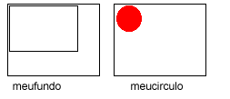
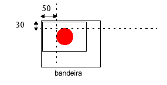

<!--REF #_command_.COMBINE PICTURES.Syntax-->**COMBINE PICTURES** ( *imagemResult* ; *imagem1* ; *operador* ; *imagem2* {; *deslocHor* ; *deslocVert*} )<!-- END REF-->
<!--REF #_command_.COMBINE PICTURES.Params-->
| Parâmetro | Tipo |  | Descrição |
| --- | --- | --- | --- |
| imagemResult | Picture | &#8592; | Imagem resultante da combinação |
| imagem1 | Picture | &#8594;  | Primeira imagem a combinar |
| operador | Integer | &#8594;  | Tipo de combinação a ser feita |
| imagem2 | Picture | &#8594;  | Segunda imagem a combinar |
| deslocHor | Integer | &#8594;  | Deslocamento horizontal para super-imposição |
| deslocVert | Integer | &#8594;  | Deslocamento vertical para super-imposição |

<!-- END REF-->

#### Descrição 

<!--REF #_command_.COMBINE PICTURES.Summary-->O comando COMBINE PICTURES permite combinar as imagens *imagem1* e *imagem2* em modo *operador* para produzir uma terceira, *imagemResult*.<!-- END REF--> A imagem resultante é de tipo composto e conserva todas as características das imagens fonte. 

**Nota:** este comando estende as funcionalidades oferecidas pelos operadores clássicos de transformação de imagens (+/, etc., ver a seção [C\_BOOLEAN](c-boolean.md)). Estes operadores permanecem totalmente utilizáveis em 4D v11.

Em *operador*, passe o tipo de combinação a aplicar. Se propõe três tipos de combinações, acessíveis através das constantes do tema “*Transformação de imagens*”:

* Horizontal concatenation (1): *imagem2* está associada a *imagem1*, a esquina superior esquerda de *imagem2* coincide com a esquina superior direita de *imagem1*.
* Vertical concatenation (2): *imagem2* está associada a *imagem1*, a esquina superior esquerda de *imagem2* coincide com a esquina inferior esquerda de *imagem1*.
* Superimposition (3): *imagem2* está localizada sobre *imagem1*, a esquina superior esquerda de *imagem2* coincide com a esquina superior esquerda de *imagem1*.

Se forem utilizados os parâmetros opcionais *desloHor* e *desloVert*, uma tradução se aplica a *imagem2* antes da superposição. Os valores passados em *desloHor e* *desloVert* devem estar em píxels. Passe valores positivos para um deslocamento a direita ou para baixo e um valor negativo para um deslocamento a esquerda ou para cima.

**Nota:** a superposição efetuada pelo comando COMBINE PICTURES difere da superposição proposta pelos operadores clássicos & e |(superposição exclusiva e superposição inclusive). Enquanto que o comando COMBINE PICTURES conserva as características de cada imagem fonte na imagem resultante, os operadores & e | processam cada píxel e geram uma imagem bitmap em todos os casos. Estes operadores, concebidos originalmente para as imagens monocromáticas, agora são obsoletos.

#### Exemplo 

Dadas as seguintes imagens: 



```4d
 COMBINE PICTURES(bandeira;meufundo;Superimposição;meucirculo;50;30)
```

Resultado:



#### Ver também 

[TRANSFORM PICTURE](transform-picture.md)  

#### Propriedades

|  |  |
| --- | --- |
| Número do comando | 987 |
| Thread-seguro | &check; |


