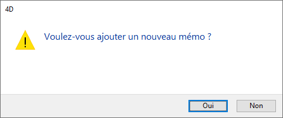

<!--REF #_command_.CONFIRM.Syntax-->**CONFIRM** ( *mensagem* {; *okBotaoTitulo* {; *cancelarBotaoTitulo*}} )<!-- END REF-->
<!--REF #_command_.CONFIRM.Params-->
| Parâmetro | Tipo |  | Descrição |
| --- | --- | --- | --- |
| mensagem | Text | &#8594;  | Mensagem a exibir na caixa de diálogo de confirmação |
| okBotaoTitulo | Text | &#8594;  | Título do botão OK |
| cancelarBotaoTitulo | Text | &#8594;  | Título do botão Cancelar |

<!-- END REF-->

#### Descrição 

<!--REF #_command_.CONFIRM.Summary-->O comando CONFIRM  mostra uma caixa de diálogo de confirmação composta de um ícone, uma mensagem, um botão OK, e um botão Cancelar.<!-- END REF-->

A mensagem a mostrar é passada no parâmetro *mensagem*. 

Automaticamente, o título do botão OK é “Aceitar” e o do botão Cancelar é “Cancelar.” Para modificar os títulos destes botões, passe os novos títulos nos parâmetros opcionais *okBotaoTitulo* e *cancelarBotaoTitulo*. Se for necessário, a largura dos botões é redimensionada até a esquerda, de acordo com a largura dos títulos personalizados que você passar.

O botão OK é o botão automático. Se o usuário clicar no botão OK ou pressiona Enter para aceitar a caixa de diálogo, a variável sistema OK toma o valor 1\. Se o usuário clicar no botão Cancelar para cancelar a caixa de diálogo, a variável sistema OK toma o valor 0.

**Dica:** não chame ao comando CONFIRM  desde um método de formulário ou de objeto que maneje os eventos de formulário On Activate ou On Deactivate;; isto provocará um loop infinito.

#### Exemplo 1 

A linha:

```4d
 CONFIRM("ATENÇÃO: não poderá desfazer esta operação.")
 If(OK=1)
    ALL RECORDS([Old Stuff])
    DELETE SELECTION([Old Stuff])
 Else
    ALERT("Operação cancelada.")
 End if
```

Mostrará a caixa de diálogo de confirmação a seguir (em Windows):


#### Exemplo 2 

A linha:

```4d
 CONFIRM("Realmente quer fechar esta conta?";"Sím";"Não")
```

Mostrará a seguinte caixa de diálogo de confirmação (em Windows):


#### Exemplo 3 

Imagine que você esteja desenvolvendo uma aplicação 4D para o mercado internacional. Escreveu suas strings de interface com as tradução à linguagem objetivo nos arquivos XLIFF. Ao fazer isso, a linha:

```4d
 var $title;$yes;$no : Text
 $title:=Localized string("add_Memo")
 $yes:=Localized string("yes")
 $no:=Localized string("no")
 CONFIRM($title;$yes;$no)
```

Mostrará a seguinte caixa de diálogo de confirmação:



**Nota:** Para saber mais sobre a localização do banco de dados xliff, consulte a seção *Apêndice B: arquitetura XLIFF*.

#### Exemplo 4 

A linha:

```4d
 CONFIRM("WARNING: If your pursue this operation, some records will be "+"irremediably affected."+\
 Char(13)+"What do you want to do?";"Do NOT continue";"Continue")
```

Mostrará a seguinte caixa de diálogo de confirmação (em Macintosh):


#### Ver também 

[ALERT](alert.md)  
[Request](request.md)  