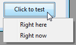

<!--REF #_command_.CONVERT COORDINATES.Syntax-->**CONVERT COORDINATES** ( *xCoord* ; *yCoord* ; *de* ; *para* )<!-- END REF-->
<!--REF #_command_.CONVERT COORDINATES.Params-->
| Parâmetro | Tipo |  | Descrição |
| --- | --- | --- | --- |
| xCoord | Integer | &#8594;  | Coordenada horizontal de um ponto (Inicial) |
| &#8592; | Coordenada horizontal de um ponto (Convertida) |
| yCoord | Integer | &#8594;  | Coordenada vertical de um ponto (inicial) |
| &#8592; | Coordenada vertical de um ponto (convertida) |
| de | Integer | &#8594;  | Sistema de coordenadas que vai ser convertido |
| para | Integer | &#8594;  | Sistema de coordenadas para o qual vai converter |

<!-- END REF-->

#### Descrição 

<!--REF #_command_.CONVERT COORDINATES.Summary-->O comando **CONVERT COORDINATES**converte as coordenadas (x;y) de um ponto de um sistema de coordenadas para outro.<!-- END REF--> Os sistemas de coordenada de entrada e saída compatíveis são formulários e subformulários, janelas e a tela. Por exemplo, pode usar este comando para obter as coordenadas no formulário principal de um objeto que pertence a um subformulário. Isso faz com que seja fácil criar um menu contextual para qualquer posição personalizada. 

Em *xCoord* e *yCoord*, passe como variávies as coordenadas (x;y) do ponto que quiser converter. Após o comando ser executado, estas variáveis conterão os valores convertidos.

No parâmetro *de*, passe o sistema de coordenadas inicial que o ponto de input está usando, e no parâmetro *para*, passe o sistema de coordenadas para o qual vai converter. Ambos parâmetros podem tomar um dos valores de constante abaixos, adicionados ao tema "*Janela*":

| Constante         | Tipo          | Valor | Comentário                                                                                                                                 |
| ----------------- | ------------- | ----- | ------------------------------------------------------------------------------------------------------------------------------------------ |
| XY Current form   | Inteiro longo | 1     | A origen é o canto superior esquerdo do formulário atual<br/>                                                                      |
| XY Current window | Inteiro longo | 2     | A origem é a esquina superior esquerda na janela atual <br/>                                                                       |
| XY Main window    | Inteiro longo | 4     | Em Windows: origem é a esquina superior esquerda da janela principal; em OS X: igual que XY Screen                                         |
| XY Screen         | Inteiro longo | 3     | A origem é o canto superior esquerdo na tela principal (igual que para o comando [SCREEN COORDINATES](screen-coordinates.md))<br/> |

Quando este comando for chamado a partir do método de um subformulário ou de um objeto de subformulário, e se um dos seletores for XY Current form, então as coordenadas são relativas ao próprio subformulário, e não ao seu formulário pai. 

Quando convertendo de/para a posição de uma janela formulário (por exemplo quando convertendo dos resultados de [GET WINDOW RECT](get-window-rect.md), ou para valores passados a [Open form window](open-form-window.md)), XY Main window deve ser usado já que é o sistema de coordenadas usado pelos comandos de janela em Windows. Também pode ser usado para esse propósito em OS X, onde é equivalente a XY Screen.

Quando *de* for XY Current form e o ponto estiver na seção corpo do formulário lista, o resultado depende do contexto de chamada do comando:

* Se o comando for chamado no evento On Display Detail, o ponto resultante estará localizado na exibição do registro sendo desenhado em tela
* Se o comando for chamado fora de um evento On Display Detail mas enquanto um registro estiver sendo editado, o ponto resultante estará localizado na exibição do registro sendo editado
* De outra forma, o ponto resultate estará localizado na exibição do primeiro registro

#### Exemplo 1 

Se quiser abrir um menu pop-up no canto esquerdo inferior do objeto "MyObject".

```4d
  // OBJECT GET COORDINATES trabalha no formulário atual das coordenadas do sistema
  // Menu dinâmico pop up usa as coordenadas de sistema da janela atual
  // Precisa converter os valores
 var $left;$top;$right;$bottom : Integer
 var $menu : Text
 OBJECT GET COORDINATES(*;"MyObject";$left;$top;$right;$bottom)
 CONVERT COORDINATES($left;$bottom;XY Current form;XY Current window)
 $menu:=Create menu
 APPEND MENU ITEM($menu;"Right here")
 APPEND MENU ITEM($menu;"Right now")
 Dynamic pop up menu($menu;"";$left;$bottom)
 RELEASE MENU($menu)
```



#### Exemplo 2 

Se quiser abrir uma janela pop-up na posição do cursor do mouse, em Windows, precisa converter as coordenadas desde [MOUSE POSITION](mouse-position.md) (com o parâmetro \*) retorna valores baseados na posição da janela MDI:

```4d
 var $mouseX;$mouseY;$mouseButtons : Integer
 var $window : Integer
 MOUSE POSITION($mouseX;$mouseY;$mouseButtons)
 CONVERT COORDINATES($mouseX;$mouseY;XY Current window;XY Main window)
 $window:=Open form window("PopupWindowForm";Pop up form window;$mouseX;$mouseY)
 DIALOG("PopupWindowForm")
 CLOSE WINDOW($window)
```

#### Ver também 

[GET WINDOW RECT](get-window-rect.md)  
[OBJECT GET COORDINATES](object-get-coordinates.md)  
[OBJECT SET COORDINATES](object-set-coordinates.md)  
[SET WINDOW RECT](set-window-rect.md)  

#### Propriedades
|  |  |
| --- | --- |
| Número do comando | 1365 |
| Thread-seguro | &check; |
| Proibido no servidor ||


