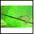

<!--REF #_command_.CREATE THUMBNAIL.Syntax-->**CREATE THUMBNAIL** ( *fonte* ; *dest* {; *largura* {; *altura* {; *modo* {; *profundidade*}}}} )<!-- END REF-->
<!--REF #_command_.CREATE THUMBNAIL.Params-->
| Parâmetro | Tipo |  | Descrição |
| --- | --- | --- | --- |
| fonte | Picture | &#8594;  | Fonte da imagem 4D ou variável a converter para uma miniatura |
| dest | Picture | &#8592; | Miniatura resultante |
| largura | Integer | &#8594;  | Largura da miniatura em pixels. Valor padrão = 48 |
| altura | Integer | &#8594;  | Altura da miniatura em pixels. Valor padrão = 48 |
| modo | Integer | &#8594;  | Módulo de criação de miniaturas; Valor padrão= Proporcional centralizado (6) |
| profundidade | Integer | &#8594;  | Obsoleto, não usar |

<!-- END REF-->

#### Descrição 

<!--REF #_command_.CREATE THUMBNAIL.Summary-->O comando CREATE THUMBNAIL devolve uma miniatura a partir de uma imagem fonte.<!-- END REF--> As miniaturas são utilizadas geralmente para a pré-visualização de imagens em software multimídia ou páginas web.

Passe no parâmetro *fonte* a variável ou o campo imagem 4D que contém a imagem a reduzir em forma de miniatura e no parâmetro *dest* o campo ou variável imagem 4D que deve receber a miniatura resultante.  
  
Os parâmetros opcionais *largura* e *altura* definem o tamanho em píxels da miniatura. Se omite estes parâmetros, o tamanho por padrão da miniatura será de 48 x 48 píxels.

O parâmetro opcional *modo* define o modo de criação da miniatura, ou seja a maneira em que será redimensionada. Há três modos disponíveis. As seguintes constantes pré-definidas são fornecidas por 4D no tema “*Formatos de saída de imagens*”:

| Constante                   | Tipo          | Valor |
| --------------------------- | ------------- | ----- |
| Scaled to fit               | Inteiro longo | 2     |
| Scaled to fit proportional  | Inteiro longo | 5     |
| Scaled to fit prop centered | Inteiro longo | 6     |

**Nota:** Só estas três constantes podem ser utilizadas com CREATE THUMBNAIL. As outras constantes neste tema não podem ser aplicadas a este comando. 

Se não introduz nenhum parâmetro, o modo 6 “Scaled to fit prop centered” se aplica por padrão. A continuação se ilustram os diferentes modos:

Imagem fonte   

  
Miniaturas resultantes (48x48)

* Scaled to fit = 2  

* Scaled to fit proportional = 5  

* Scaled to fit prop centered = 6 (modo padrão)  

**Nota:** Com os modos “Scaled to fit proportional” e “Scaled to fit prop centered”, os espaços vazios aparecerão em branco. Quando estes modos são aplicados a campos ou imagens em formulários 4D, o espaço livre é transparente.

O parâmetro *profundidade* é ignorado e portanto deve ser omitido. O comando sempre utiliza a profundidade de tela atual (número de cores). 

O parâmetro opcional *profundidade* define o número de cores em Mac OS (ou seja, a profundidade de tela) a conservar na miniatura resultante. O parâmetro é um inteiro igual ao número de bits por píxel: 1, 2, 4, 8, 16 ou 32\. Introduza 0 para utilizar a profundidade de tela atual (valor padrão).

**Nota:** Em Windows, se ignora o parâmetro *profundidade*; o comando sempre utiliza a profundidade de tela atual.

#### Propriedades
|  |  |
| --- | --- |
| Número do comando | 679 |
| Thread-seguro | &check; |
| Proibido no servidor ||

