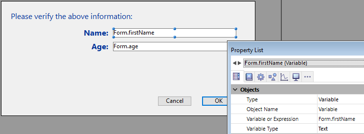

<!--REF #_command_.DIALOG.Syntax-->**DIALOG** ( {*tabela* ;} *formulario* {; *dataForm*}{; *} )<!-- END REF-->
<!--REF #_command_.DIALOG.Params-->
| Parâmetro | Tipo |  | Descrição |
| --- | --- | --- | --- |
| tabela | Table | &#8594;  | Tabela a qual pertence o formulário ou se omitida: tabela por padrão ou uso do formulário de projeto |
| formulario | Text, Object | &#8594;  | Nome de tabela ou formulário de projeto a mostrar como diálogo |
| dataForm | Object | &#8594;  | Dados a associar ao formulário |
| * | Operador | &#8594;  | Utilizar o mesmo processo |

<!-- END REF-->

#### Descrição 

<!--REF #_command_.DIALOG.Summary-->O comandoDIALOG  apresenta o formulário *formulario* ao usuário.<!-- END REF--> Este comando se designa para trabalhar com interfaces de usuário avançadas e personalizadas baseadas em formulários. Pode utilizá-lo para mostrar informação do banco de dados ou de outras localizações, ou para oferecer funcionalidades de entrada de dados. Diferente de [ADD RECORD](add-record.md) o u [MODIFY RECORD](modify-record.md), **DIALOG** lhe dá controle total sobre o formulário, seu conteúdo e os botões de navegação e validação. 

Este comando geralmente se chama junto com [Open form window](open-form-window.md) para mostrar formulários sofisticados, como é mostrado no exemplo abaixo:


Utilize DIALOG ao invés de [ALERT](alert.md), [CONFIRM](confirm.md) ou [Request](request.md) quando a informação que deve ser apresentada ou reunida é mais complexa do que esses comandos podem manejar. 

**Nota:** em bancos de dados convertidos, é possível proibir a entrada de dados em campos ou caixas de diálogo (e limitar a entrada de dados a variáveis unicamente) utilizando uma opção nas Preferências de 4D (página Compatibilidade). Esta restrição corresponde ao funcionamento de versões anteriores de 4D. 

No parâmetro *formulario,* pode passar

 o nome de um formulário;  
 a rota (em sintaxe POSIX) para um arquivo json válido contendo uma descrição doe formulário a usar. Veja *Form file path*;  
 um objeto que contenha a descrição do formulário.  
  
Opcionalmente, pode passar parâmetros ao formulário mediante o objeto formData. Toda propriedade de objeto formData estará disponível desde o contexto de formulário mediante o comando [Form](form.md). Por exemplo, se passar um objeto que contenha {"version","12"} em formData, poderá obter o valor da propriedade "Version" no formulário chamando:  
  
```4d
 $v:=Form.version //"12"
```
  
  
Utilizando uma variável local para formData, esta funcionalidade lhe permite passar parâmetros de maneira segura a seus formulários, qualquer que seja o contexto da chamada. Em particular, se o mesmo formulário se chama desde diferentes lugares no mesmo processo, sempre poderá acessar a seus valores específicos simplesmente chamando a [Form](form.md).myProperty. Além disso, dado que os objetos são passados por referência, se o usuário modificar um valor de propriedade no formulário, este se guardará automaticamente no mesmo objeto.  
Ao combinar o objeto formData e o comando [Form](form.md), pode enviar parâmetros ao formulário ou ler os parâmetros em qualquer momento com código limpo e seguro.  
  
Nota: se não passar nenhum parâmetro formData ou se passar um objeto indefinido, DIALOG cria automaticamente um novo objeto vazio vinculado ao form e disponível através de comando [Form](form.md).

O diálogo é aceito se o usuário clicar no botão Aceitar ou pressionar a tecla Enter (teclado numérico) ou se é executado o comando [ACCEPT](accept.md).  
Lembre que a validação não faz com que os dados modificados sejam guardados. Se o diálogo inclui campos, deve chamar explicitamente ao comando [SAVE RECORD](save-record.md) para guardar os dados que tenham sido modificados.

O diálogo é cancelado se o usuário clicar no botão Cancelar ou pressionar a tecla de anulação Esc ou se são executa o comando [CANCEL](cancel.md). 

Se passar o parâmetro opcional \*, o formulário é carregado e mostra na última janela do processo atual e o comando termina sua execução enquanto deixa o formulário ativo em tela.

Este formulário logo reage "normalmente" as ações do usuário e é fechado quando o código 4D relacionado com o formulário (método de objeto ou método de formulário) chama ao comando [CANCEL](cancel.md) ou [ACCEPT](accept.md) Se o processo atual termina, os formulários criados desta forma são fechados automaticamente da mesma forma que se tivesse chamado o comando CANCEL. Este modo de abertura é particularmente útil para mostrar uma palheta flutuante com um documento, sem necessidade de outro processo.

**Notas:**

* Pode combinar o uso da sintaxe **DIALOG**(form;\*) com o comando [CALL FORM](call-form.md) para estabelecer a comunicação entre os formulários
* deve criar uma janela antes de chamar a instrução **DIALOG**("form";*\**); se não for possível utilizar a janela de diálogo atual no processo nem a janela criada por padrão para cada processo. Do contrário, se gera o erro -9909.
* Quando for utilizado o parâmetro *\**, a janela é fechada automaticamente depois de uma ação padrão ou uma chamada ao comando [CANCEL](cancel.md) ou [ACCEPT](accept.md). Não tem que gerenciar o fechamento da própria janela.

#### Exemplo 1 

O exemplo a seguir pode ser usado para criar uma palheta de ferramentas 

```4d
  //Mostra a palheta de ferramentas
 $palette_window:=Open form window("tools";Palette form window)
 DIALOG("tools";*) //Devolva o controle imediatamente
  //Mostra janela do documento principal
 $document_window:=Open form window("doc";Standard form window)
 DIALOG("doc")
```

#### Exemplo 2 

Em um formulário exibindo o registro de uma pessoa, um botão "Check children" abre um diálogo para verificar/modificar os nomes e idades dos filhos:


**Nota:** O campo objeto "Children" é representado apenas para mostrar sua estrutura para esse exemplo.

No formulário de verificação, se tiver atribuido algumas propriedades de objeto a variáveis [Form](form.md):



Abaixo o código para o botão "Check children":

```4d
 var $win;$n;$i : Integer
 var $save : Boolean
 ARRAY OBJECT($children;0)
 OB GET ARRAY([Person]Children;"children";$children) //obtém a coleção children
 $save:=False //initializa a variável save
 
 $n:=Size of array($children)
 If($n>0)
    $win:=Open form window("Edit_Children";Movable form dialog box)
    SET WINDOW TITLE("Check children for "+[Person]Name)
    For($i;1;$n) //para cada child
       DIALOG("Edit_Children";$children{$i}) //exibe diálogo preenchido com valores
       If(OK=1) //o usuário clica OK
          $save:=True
       End if
    End for
    If($save=True)
       [Person]Children:=[Person]Children //força a atualização do campo objeto
    End if
    CLOSE WINDOW($win)
 Else
    ALERT("No child to check.")
 End if
```

**Nota:** Esse exemplo exige que a notação de objeto esteja ativada no banco de dados (ver *Página Compatibilidade*).

O formulário exibe informação para cada campo:


Se os valores forem editados e o botão OK button for clicaod, o campo é atualizado (o registro pai deve ser salvo depois). 

#### Exemplo 3 

O exemplo abaixo usa a rota a um formulário json para exibir os registros em uma lista de empregados: 

```4d
 Open form window("/RESOURCES/OutputPersonnel.json";Plain form window)
 ALL RECORDS([Personnel])
 DIALOG("/RESOURCES/OutputPersonnel.json";*)
```

o que retorna:


#### Exemplo 4 

O exemplo abaixo utiliza um aquivo .json como um objeto e modifica algumas propriedades:

```4d
 var $form : Object
 $form:=JSON Parse(Document to text(Get 4D folder(Current resources folder)+"OutputPersonnel.json"))
 $form.windowTitle:="The Avengers"
 $form.pages[1].objects.logo.picture:="/RESOURCES/Images/Avengers.png"
 $form.pages[1].objects.myListBox.borderStyle:="double"
 Open form window($form;Plain form window)
 DIALOG($form;*)
```

O formulário modificado é devolvido com o título, o logotipo e a borda modificados:


#### Variáveis e conjuntos do sistema 

Depois de chamar a DIALOG, se o diálogo é aceito, a variável sistema OK toma o valor 1; se for cancelado toma o valor 0.

#### Ver também 

[ACCEPT](accept.md)  
[ADD RECORD](add-record.md)  
[CALL FORM](call-form.md)  
[CANCEL](cancel.md)  
[Form](form.md)  
[Open window](open-window.md)  

#### Propriedades

|  |  |
| --- | --- |
| Número do comando | 40 |
| Thread-seguro | &cross; |
| Modificar variáveis | OK, error |


