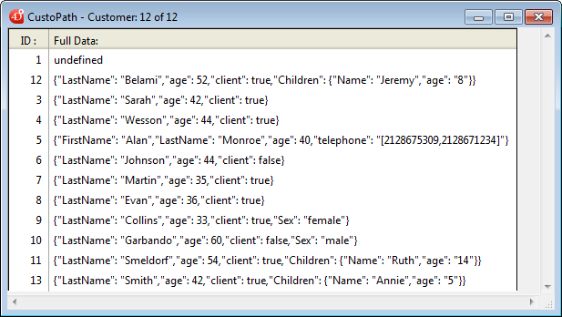
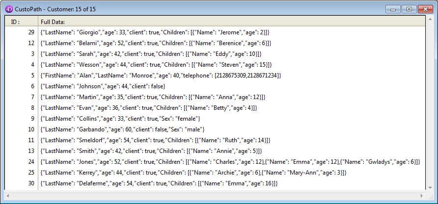

<!--REF #_command_.DISTINCT ATTRIBUTE PATHS.Syntax-->**DISTINCT ATTRIBUTE PATHS** ( *campoObjeto* ; *rotaArray* )<!-- END REF-->
<!--REF #_command_.DISTINCT ATTRIBUTE PATHS.Params-->
| Parâmetro | Tipo |  | Descrição |
| --- | --- | --- | --- |
| campoObjeto | Field | &#8594;  | campo objeto indexado |
| rotaArray | Text array | &#8592; | Array que vai receber a lsita de diferentes rotas |

<!-- END REF-->

#### Descrição 

<!--REF #_command_.DISTINCT ATTRIBUTE PATHS.Summary-->O comando **DISTINCT ATTRIBUTE PATHS** \[#descv\] devolve a lista de rotas diferentes que se encontram no campo objeto indexado passado em *campoObjeto* para a seleção atual da tabela a qual pertence o campo.<!-- END REF--> \[#descv\]

Se *campoObjeto* não for um campo de objeto indexado, um erro é devolvido.

Depois da chamada, o tamanho de *arrayRota* é igual ao número de rotas distintas que se encontram na seleção. As rotas a atributos de objetos aninhados se devolvem utilizando a notação padrão ponto, por exemplo "empresa.endereço.número". Lembre que os nomes de atributo de objeto são sensíveis às maiúsculas e minúsculas. O comando não muda a seleção atual ou o registro atual.

 Em *arrayRota*, a lista de rotas diferentes é retornada em ordem alfabética (diacrítica). 

**Notas:** 

* Registros com um valor indefinido no *campoObj* não foram levadas em consideração.
* Rotas atributos criadas durante uma transação foram levadas em consideração pelo comando. É importante notar que estas rotas são mantidas no índice do campo objeto mesmo se a transação tiver sido cancelada

#### Exemplo 

Se seu banco de dados contiver um campo objeto \[Customer\]full\_Data (indexado) com 15 registros:

 

Este código será executado:

```4d
 ARRAY TEXT(aTPaths;0)
 ALL RECORDS([Customer])
 DISTINCT ATTRIBUTE PATHS([Customer]full_Data;aTPaths)
```

O array *aTPaths* obtém os elementos abaixo:

| Element | Value               |
| ------- | ------------------- |
| 1       | "age"               |
| 2       | "Children"          |
| 3       | "Children\[\]"      |
| 4       | "Children\[\].age"  |
| 5       | "Children\[\].Name" |
| 6       | "Children.length"   |
| 7       | "client"            |
| 8       | "FirstName"         |
| 9       | "LastName"          |
| 10      | "Sex"               |
| 11      | "telephone"         |
| 12      | "telephone\[\]"     |
| 13      | "telephone.length"  |

**Note:** "length"/comprimento é uma *propriedade virtual* que está disponível automaticamente para todos os atributos de tipo array. Oferece o tamanho do array, ou seja, o número de elementos, e pode ser usada em pesquisas. Para saber mais, veja o parágrafo \[#cmd id="1397" anchor="2998555"/\]. 

#### Ver também 

  
[DISTINCT ATTRIBUTE VALUES](distinct-attribute-values.md)  